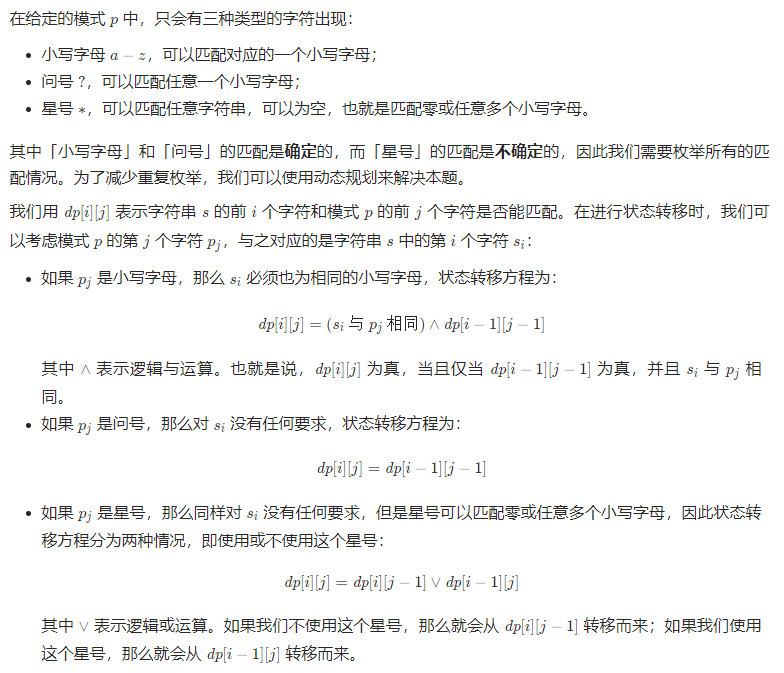
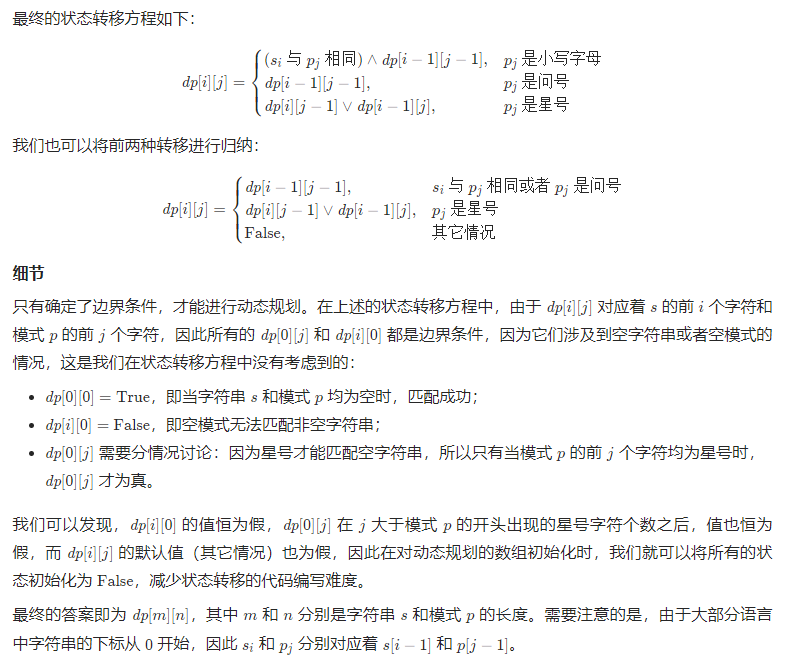
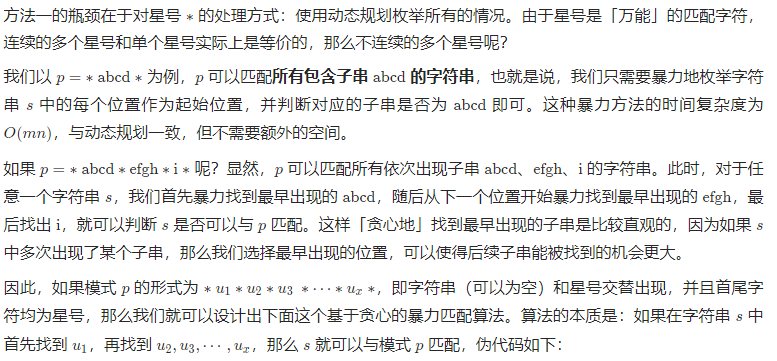
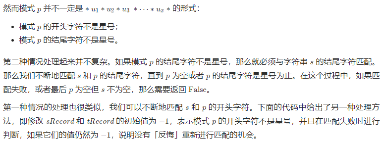

# 难题
## [44. 通配符匹配](https://leetcode-cn.com/problems/wildcard-matching/)
给定一个字符串 (s) 和一个字符模式 (p) ，实现一个支持 '?' 和 '*' 的通配符匹配。

> '?' 可以匹配任何单个字符。
> '*' 可以匹配任意字符串（包括空字符串）。

两个字符串完全匹配才算匹配成功。

说明:
- s 可能为空，且只包含从 a-z 的小写字母。
- p 可能为空，且只包含从 a-z 的小写字母，以及字符 ? 和 *。

> 示例 1: \
> 输入: \
> s = "aa" \
> p = "a" \
> 输出: false \
> 解释: "a" 无法匹配 "aa" 整个字符串。
>
> 示例 2: \
> 输入: \
> s = "aa" \
> p = "*" \
> 输出: true \
> 解释: '*' 可以匹配任意字符串。
>
> 示例 3: \
> 输入： \
> s = "cb" \
> p = "?a" \
> 输出: false \
> 解释: '?' 可以匹配 'c', 但第二个 'a' 无法匹配 'b'。
>
> 示例 4: \
> 输入: \
> s = "adceb" \
> p = "*a*b" \
> 输出: true \
> 解释: 第一个 '*' 可以匹配空字符串, 第二个 '*' 可以匹配字符串 "dce".
>
> 示例 5: \
> 输入: \
> s = "acdcb" \
> p = "a*c?b" \
> 输出: false

思路1：动态规划 \
 \


```go
func isMatch(s string, p string) bool {
    ns, np := len(s), len(p)
    dp := make([][]bool, ns+1) // 0 位保存长度为0的结果， ns位保存尾部匹配结果
    for i := range dp{
        dp[i] = make([]bool, np+1)
    }

    dp[0][0] = true // 长度均为 0 时，返回真
    for j := 1; j <= np; j++{ // 对于 s 为 0的情况，如果p的前j项为*，则j+1均为真
        if p[j-1] == '*'{
            dp[0][j] = true
        } else{
            break
        }
    }

    for i := 1; i <= ns; i++{
        for j := 1; j <= np; j++{
            if p[j-1] == '*'{ // 对于 * ，我们可以用或不用
                dp[i][j] = dp[i-1][j] || dp[i][j-1]
            } else if p[j-1] == '?' || p[j-1] == s[i-1]{
                dp[i][j] = dp[i-1][j-1]
            }
        }
    }
    return dp[ns][np]
}
```

思路2：贪心算法 \

```go
// 我们用 sIndex 和 pIndex 表示当前遍历到 s 和 p 的位置
// 此时我们正在 s 中寻找某个 u_i
// 其在 s 和 p 中的起始位置为 sRecord 和 pRecord

// sIndex 和 sRecord 的初始值为 0
// 即我们从字符串 s 的首位开始匹配
sIndex = sRecord = 0

// pIndex 和 pRecord 的初始值为 1
// 这是因为模式 p 的首位是星号，那么 u_1 的起始位置为 1
pIndex = pRecord = 1

while sIndex < s.length and pIndex < p.length do
    if p[pIndex] == '*' then
        // 如果遇到星号，说明找到了 u_i，开始寻找 u_i+1
        pIndex += 1
        // 记录下起始位置
        sRecord = sIndex
        pRecord = pIndex
    else if match(s[sIndex], p[pIndex]) then
        // 如果两个字符可以匹配，就继续寻找 u_i 的下一个字符
        sIndex += 1
        pIndex += 1
    else if sRecord + 1 < s.length then
        // 如果两个字符不匹配，那么需要重新寻找 u_i
        // 枚举下一个 s 中的起始位置
        sRecord += 1
        sIndex = sRecord
        pIndex = pRecord
    else
        // 如果不匹配并且下一个起始位置不存在，那么匹配失败
        return False
    end if
end while

// 由于 p 的最后一个字符是星号，那么 s 未匹配完，那么没有关系
// 但如果 p 没有匹配完，那么 p 剩余的字符必须都是星号
```

```go
func isMatch(s string, p string) bool {
    ns, np := len(s), len(p)
    for ; ns > 0 && np > 0 && p[np-1] != '*'; ns, np = len(s), len(p){
        if charMatch(s[len(s)-1], p[len(p)-1]){
            s = s[:ns-1]
            p = p[:np-1]
        } else{
            return false
        }
    }
    if np == 0{
        return ns == 0
    }

    si, pi := 0, 0
    sr, pr := -1, -1
    for si < ns && pr < np{
        if p[pi] == '*'{
            pi++
            sr, pr = si, pi
        } else if charMatch(s[si], p[pi]){
            si++
            pi++
        } else if sr != -1 && sr+1 < ns{ // 回到有 * 的起点
            sr++
            si, pi = sr, pr
        } else{
            return false
        }
    }
    return allStars(p, pi, np)
}

func charMatch(s, p byte) bool{
    return s == p || p == '?'
}

func allStars(p string, start, end int) bool{
    for _, v := range p[start:end]{
        if v != '*'{
            return false
        }
    }
    return true
}
```

## [1823. 找出游戏的获胜者](https://leetcode-cn.com/problems/find-the-winner-of-the-circular-game/)
共有 n 名小伙伴一起做游戏。小伙伴们围成一圈，按 顺时针顺序 从 1 到 n 编号。确切地说，从第 i 名小伙伴顺时针移动一位会到达第 (i+1) 名小伙伴的位置，其中 1 <= i < n ，从第 n 名小伙伴顺时针移动一位会回到第 1 名小伙伴的位置。

游戏遵循如下规则：
- 从第 1 名小伙伴所在位置 开始 。
- 沿着顺时针方向数 k 名小伙伴，计数时需要 包含 起始时的那位小伙伴。逐个绕圈进行计数，一些小伙伴可能会被数过不止一次。
- 你数到的最后一名小伙伴需要离开圈子，并视作输掉游戏。
- 如果圈子中仍然有不止一名小伙伴，从刚刚输掉的小伙伴的 顺时针下一位 小伙伴 开始，回到步骤 2 继续执行。
- 否则，圈子中最后一名小伙伴赢得游戏。

给你参与游戏的小伙伴总数 n ，和一个整数 k ，返回游戏的获胜者。

> 示例 1： \
>  \
> 输入：n = 5, k = 2 \
> 输出：3 \
> 解释：游戏运行步骤如下：
> 1) 从小伙伴 1 开始。
> 2) 顺时针数 2 名小伙伴，也就是小伙伴 1 和 2 。
> 3) 小伙伴 2 离开圈子。下一次从小伙伴 3 开始。
> 4) 顺时针数 2 名小伙伴，也就是小伙伴 3 和 4 。
> 5) 小伙伴 4 离开圈子。下一次从小伙伴 5 开始。
> 6) 顺时针数 2 名小伙伴，也就是小伙伴 5 和 1 。
> 7) 小伙伴 1 离开圈子。下一次从小伙伴 3 开始。
> 8) 顺时针数 2 名小伙伴，也就是小伙伴 3 和 5 。
> 9) 小伙伴 5 离开圈子。只剩下小伙伴 3 。所以小伙伴 3 是游戏的获胜者。
>
> 示例 2： \
> 输入：n = 6, k = 5 \
> 输出：1 \
> 解释：小伙伴离开圈子的顺序：5、4、6、2、3 。小伙伴 1 是游戏的获胜者。

思路1：使用队列，暴力模拟
- 注意，当前计数过程中，不要重复从头数，即，要将被删数，**队列左侧**移到尾部
- 关键代码：`nums = append(nums[i+1:], nums[:i]...)`
```go
func findTheWinner(n int, k int) int {
	nums := make([]int, n)
	for i := range nums {
		nums[i] = i + 1
	}
	for ; n > 1; n-- {
		if n == k || k%n == 0 {
			nums = nums[:n-1]
			continue
		}
		i := k%n - 1
		if i == 0 {
			nums = nums[1:]
		} else {
			nums = append(nums[i+1:], nums[:i]...)
		}
	}
	return nums[0]
}
```
思路2：动态规划
- 对于n其淘汰一位后势必变成n-1继续比赛，而n-1继续比赛的结果是x的话，那么这个结果映射回f(n,k)就是x+k即f(n-1,k) + k; 所以我们能够得知，n与n-1的状态转移f(n, k) = f(n-1, k) + k;
- 特别的当一个人参赛时，最终结果就是他自己， 即f(1, k) = 1;

用递归实现
```go
func findTheWinner(n int, k int) int {
    if n == 1{
        return n
    }
    return (findTheWinner(n-1, k) + k -1) % n + 1
}
```
迭代实现
```go
func findTheWinner(n int, k int) int {
	nums := make([]int, n+1)
    nums[1] = 1
    for i := 2; i <= n; i++{
        nums[i] = ((nums[i-1]+k-1)%i) + 1
    }
	return nums[n]
}
```
代码优化
```go
func findTheWinner(n int, k int) int {
    lucky := 1
    for i := 2; i <= n; i++{
        lucky = ((lucky+k-1)%i) + 1
    }
	return lucky
}
```