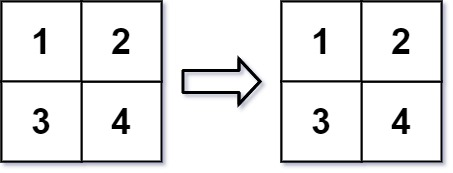
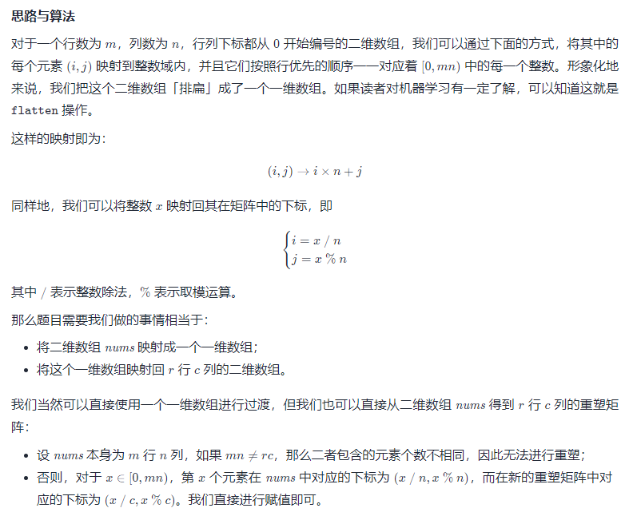
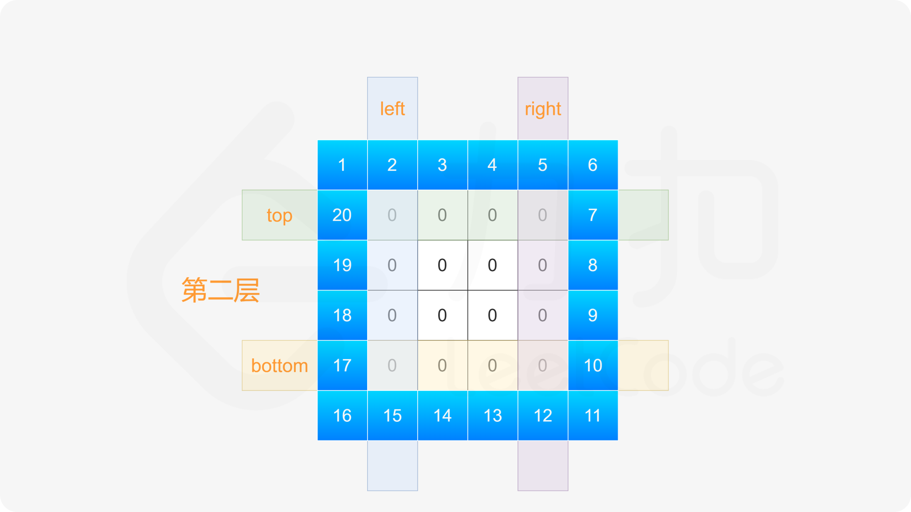

# 数组

## [217. 存在重复元素](https://leetcode-cn.com/problems/contains-duplicate/solution/cun-zai-zhong-fu-yuan-su-by-leetcode-sol-iedd/)
给你一个整数数组 nums 。如果任一值在数组中出现 至少两次 ，返回 true ；如果数组中每个元素互不相同，返回 false 。
>示例1\
>输入：nums = [1,2,3,1]\
>输出：true

思路1：先用sort.Int排序，然后比较相邻元素是否相同\
```if nums[i] == nums[i-1]```\
思路2：hash表，判断hash表中是否存在该值，存在返回真，不存在则添加\
实现：[arr_repeat](../code/array/arr_repeat)

## [136. 只出现一次的数字](https://leetcode-cn.com/problems/single-number/)
给定一个非空整数数组，除了某个元素只出现一次以外，其余每个元素均出现两次。找出那个只出现了一次的元素。 \
说明：
- 你的算法应该具有线性时间复杂度。 你可以不使用额外空间来实现吗？

> 输入: [2,2,1]\
> 输出: 1

思路1：先排序，再两两比对
```go
func singleNumber(nums []int) int {
    sort.Ints(nums)
    for i:=0;i<len(nums);i+=2{
        if i==len(nums)-1 || nums[i] != nums[i+1]{
            return nums[i]
        }
    }
    return 0
}
```
思路2： 使用位运算。对于这道题，可使用异或运算⊕。异或运算有以下三个性质。
- 任何数和0做异或运算，结果仍然是原来的数，即 a⊕0=a。
- 任何数和其自身做异或运算，结果是 0，即a⊕a=0。
- 异或运算满足交换律和结合律，即a⊕b⊕a=b⊕a⊕a=b⊕(a⊕a)=b⊕0=b。
```go
func singleNumber(nums []int) int {
    single := 0
    for _,v:=range nums{
        single ^= v
    }
    return single
}
```

## [169. 多数元素](https://leetcode-cn.com/problems/majority-element/)
给定一个大小为 n 的数组，找到其中的多数元素。多数元素是指在数组中出现次数 大于 n/2 的元素。\
你可以假设数组是非空的，并且给定的数组总是存在多数元素。

思路1：hash表，一旦超过半数则返回
```go
func majorityElement(nums []int) int {
    n := len(nums)
    ht := make(map[int]int)
    for _,v:=range(nums){
        ht[v]++
        if ht[v]>n/2{ // 注意，这里不能等于，如：[2,2,1,1,1,2,2]，等于会返回1，因为7/2=3
            return v
        }
    }
    return 0
}
```

思路2：排序，过半
```go
func majorityElement(nums []int) int {
    sort.Ints(nums)
    return nums[len(nums)/2]
}
```
思路3：投票算法证明：
1. 如果候选人不是maj 则 maj,会和其他非候选人一起反对 会反对候选人,所以候选人一定会下台(maj==0时发生换届选举)
2. 如果候选人是maj , 则maj 会支持自己，其他候选人会反对，同样因为maj 票数超过一半，所以maj 一定会成功当选
```go
func majorityElement(nums []int) int {
    count := 0
    candidate := nums[0]
    for _, v :=range nums{
        if count == 0{
            candidate = v
        }
        if candidate == v{
            count++
        } else{
            count--
        }
    }
    return candidate
}
```

## [238. 除自身以外数组的乘积](https://leetcode-cn.com/problems/product-of-array-except-self/)
给你一个整数数组 nums，返回 数组 answer ，其中 answer[i] 等于 nums 中除 nums[i] 之外其余各元素的乘积 。\
题目数据 保证 数组 nums之中任意元素的全部前缀元素和后缀的乘积都在  32 位 整数范围内。\
请**不要使用除法**，且在 O(n) 时间复杂度内完成此题。
> 其实使用除法还会产生一个问题：数组中存在0值时，先乘后除，需要规避零值

> 示例 1: \
> 输入: nums = [1,2,3,4] \
> 输出: [24,12,8,6]

> 示例 2: \
> 输入: nums = [-1,1,0,-3,3] \
> 输出: [0,0,9,0,0]

思路：双向遍历，左右乘积列表，思路同上一题
- 3次遍历
- 前两次遍历，先后获取当前索引值左侧乘积、右侧乘积
- 最后一次遍历，将当前索引左右乘积相乘，得到目标乘积值
```go
func productExceptSelf(nums []int) []int {
    n := len(nums)
    if n < 2{
        return nums
    }
    leftProd := make([]int, n) // 当前值左侧乘积数组
    rightProd := make([]int, n) // 当前值右侧乘积数组
    leftProd[0] = 1
    rightProd[n-1] = 1
    for i := 1; i < n; i++{
        leftProd[i] = nums[i-1]*leftProd[i-1]
    }
    for i := n-2; i >= 0; i--{
        rightProd[i] = nums[i+1]*rightProd[i+1]
    }

    ans := make([]int, n)
    for i := 0; i < n; i++{
        ans[i] = leftProd[i]*rightProd[i]
    }
    return ans
}
```
优化，在双向遍历中完成左右两侧乘积计算，减少遍历次数和变量
```go
func productExceptSelf(nums []int) []int {
    n := len(nums)
    if n < 2{
        return nums
    }
    ans := make([]int, n)
    ans[0] = 1
    for i := 1; i < n; i++{ // 先获取左侧乘积
        ans[i] = nums[i-1]*ans[i-1]
    }
    r := 1
    for i := n-1; i >= 0; i--{
        ans[i] = ans[i] * r
        r *= nums[i]
    }
    return ans
}
```

## [334. 递增的三元子序列](https://leetcode-cn.com/problems/increasing-triplet-subsequence/)
给你一个整数数组 nums ，判断这个数组中是否存在长度为 3 的递增子序列。\
如果存在这样的三元组下标 (i, j, k) 且满足 i < j < k ，使得 nums[i] < nums[j] < nums[k] ，返回 true ；否则，返回 false 。

> 示例 1：\
> 输入：nums = [2,1,5,0,4,6] \
> 输出：true \
> 解释：三元组 (3, 4, 5) 满足题意，因为 nums[3] == 0 < nums[4] == 4 < nums[5] == 6
>
> 示例 2：\
> 输入：nums = [5,4,3,2,1]\
> 输出：false\
> 解释：不存在满足题意的三元组

思路1：双向遍历
- 作3次遍历
- 前两次遍历分别从左往右、从右往左，双向遍历获取各索引左侧最小、右侧最大值
- 第三次遍历，将当前值与左侧最小、右侧最大值进行对比，符合递增规律的，返回真
```go
func increasingTriplet(nums []int) bool {
    n := len(nums)
    if n < 3{
        return false
    }
    leftMin := make([]int, n) // 记录各个索引值左侧最小值
    rightMax := make([]int, n) // 记录各个索引值右侧最大值
    
    leftMin[0] = nums[0]
    rightMax[n-1] = nums[n-1]

    for i := 1; i < n;i++{
        leftMin[i] = min(leftMin[i-1], nums[i])
    }
    for i := n-2; i >= 0;i--{
        rightMax[i] = max(rightMax[i+1], nums[i])
    }

    for i := 1; i < n-1; i++{
        if nums[i] > leftMin[i] && nums[i] < rightMax[i]{
            return true
        }
    }
    return false
}

func min(a, b int) int{
    if a >= b{
        return b
    }
    return a
}

func max(a, b int) int{
    if a >= b{
        return a
    }
    return b
}
```
思路2：贪心算法\
使用贪心的方法将空间复杂度降到 O(1)。从左到右遍历数组nums，遍历过程中维护两个变量 first 和 second，分别表示递增的三元子序列中的第一个数和第二个数，任何时候都有first<second。\
初始时，first=nums[0]，second=+∞。对于1≤i<n，当遍历到下标 i 时，令 num=nums[i]，进行如下操作：
1. 如果 num>second，则找到了一个递增的三元子序列，返回true；
2. 否则，如果 num>first，则将 second 的值更新为 num；
3. 否则，将 first 的值更新为 num。

如果遍历结束时没有找到递增的三元子序列，返回false。\
上述做法的贪心思想是：为了找到递增的三元子序列，first 和 second 应该尽可能地小，此时找到递增的三元子序列的可能性更大。
```go
func increasingTriplet(nums []int) bool {
    n := len(nums)
    if n < 3{
        return false
    }
    first, second := nums[0], math.MaxInt64
    for i := 1; i < n; i++{
        if nums[i] > second{
            return true
        }
        if nums[i] > first{
            second = nums[i]
        } else{
            first = nums[i]
        }

    }
    return false
}
```

## [456. 132 模式](https://leetcode-cn.com/problems/132-pattern/)
给你一个整数数组 nums ，数组中共有 n 个整数。132 模式的子序列 由三个整数 nums[i]、nums[j] 和 nums[k] 组成，并同时满足：i < j < k 和 nums[i] < nums[k] < nums[j] 。 \
如果 nums 中存在 132 模式的子序列 ，返回 true ；否则，返回 false 。

> 示例 1： \
> 输入：nums = [1,2,3,4] \
> 输出：false \
> 解释：序列中不存在 132 模式的子序列。
>
> 示例 2： \
> 输入：nums = [3,1,4,2] \
> 输出：true \
> 解释：序列中有 1 个 132 模式的子序列： [1, 4, 2] 。
>
> 示例 3： \
> 输入：nums = [-1,3,2,0] \
> 输出：true \
> 解释：序列中有 3 个 132 模式的的子序列：[-1, 3, 2]、[-1, 3, 0] 和 [-1, 2, 0] 。

思路：枚举1
- 题目要求满足132模式，132模式的规律是： nums [i, ..., j..., k] i < k < j
- 如果要达到132模式，至少得满足得存在三个数字 分别为 min， max， mid，而且是min， max， mid这个顺序不能调换
- 我们从右向左遍历，用单调栈，具体来说是单调递增栈，每个元素入栈，在入栈之前只要栈顶元素比当前元素小就出栈，这样保证了栈的单调递增性
- 为什么要用单调栈呢，因为我们要找到132模式中的次大者，单调栈中栈顶元素永远是最大值，这时，如果再遇到一个元素比栈顶元素还大，那栈顶元素是不是就是次大者
- 这时，如果再遇到一个比次大者还小的元素，是不是就满足了132模式。而且我们是按照数组从右到左遍历的顺序
```go
func find132pattern(nums []int) bool {
	stack := make([]int, 0, len(nums))
	ns := 0
	maxK := math.MinInt // 存放132模式中的次大值
	for i := len(nums)-1; i >= 0; i--{
		if nums[i] < maxK{
			return true
		}
		// 如果栈中有值，并且栈顶的值还小于当前元素
		// 此时，有了nums[j](nums[i]值) & nums[k](栈顶值)
		// 只要栈顶比当前元素小就出栈，保证了栈内元素是升序的，栈顶是【栈中】最大值
		for ns > 0 && stack[ns-1] < nums[i] {
			// 保存次大值
			maxK = stack[ns-1]
			stack = stack[:ns-1]
			ns--
		}
		stack = append(stack, nums[i])
		ns++
	}
	return false
}
```

## [1. 两数之和](https://leetcode-cn.com/problems/two-sum/solution/liang-shu-zhi-he-by-leetcode-solution/)
给定一个整数数组 nums和一个整数目标值 target，请你在该数组中找出 和为目标值 target的那两个整数，并返回它们的数组下标。\
你可以假设每种输入只会对应一个答案。但是，数组中同一个元素在答案里不能重复出现。\
你可以按任意顺序返回答案。
>输入：nums = [2,7,11,15], target = 9\
>输出：[0,1]\
>解释：因为 nums[0] + nums[1] == 9 ，返回 [0, 1] 。

思路1：暴力枚举，通过两层迭代求解
```go
func twoSum(nums []int, target int) []int {
    for left:=0;left < len(nums)-1;left++{
        for right :=left+1;right<len(nums);right++{
            if nums[left]+nums[right]==target{
                return []int{left,right}
            }
        }
    }
    return []int{-1,-1}
}
```
思路2 ：hash表法，迭代期间，先求解hash表中是否存在目标值，不存在则将当前值加入hash表

```go
func twoSum(nums []int, target int) []int {
    hashTable := map[int]int{}
    for i, x := range nums {
        if p, ok := hashTable[target-x]; ok {
            return []int{p, i}
        }
        hashTable[x] = i
    }
    return nil
}
```
实现：[two_sum](../code/array/two_sum)

## [170. 两数之和 III - 数据结构设计](https://leetcode-cn.com/problems/two-sum-iii-data-structure-design/)
设计一个接收整数流的数据结构，该数据结构支持检查是否存在两数之和等于特定值。 \
实现 TwoSum 类：
- TwoSum() 使用空数组初始化 TwoSum 对象
- void add(int number) 向数据结构添加一个数 number
- boolean find(int value) 寻找数据结构中是否存在一对整数，使得两数之和与给定的值相等。如果存在，返回 true ；否则，返回 false 。

> 示例： \
> 输入： \
> ["TwoSum", "add", "add", "add", "find", "find"] \
> [[], [1], [3], [5], [4], [7]] \
> 输出： \
> [null, null, null, null, true, false] \
> 解释： \
> TwoSum twoSum = new TwoSum(); \
> twoSum.add(1);   // [] --> [1] \
> twoSum.add(3);   // [1] --> [1,3] \
> twoSum.add(5);   // [1,3] --> [1,3,5] \
> twoSum.find(4);  // 1 + 3 = 4，返回 true \
> twoSum.find(7);  // 没有两个整数加起来等于 7 ，返回 false \

思路1：hash法
```go
type TwoSum struct {
    Val []int
}


func Constructor() TwoSum {
    return TwoSum{}
}


func (this *TwoSum) Add(number int)  {
    this.Val = append(this.Val, number)
}


func (this *TwoSum) Find(value int) bool {
    mp := make(map[int]struct{})
    for _, num := range this.Val{
        if _, ok := mp[value-num]; ok{
            return true
        }
        mp[num] = struct{}{}
    }
    return false
}
```
优化，只存map数据，不存数组
```go
type TwoSum struct {
    Val map[int]int
}


func Constructor() TwoSum {
    return TwoSum{
        make(map[int]int),
    }
}


func (this *TwoSum) Add(number int)  {
    this.Val[number]++
}


func (this *TwoSum) Find(value int) bool {
    for k, v := range this.Val{
        if value-k == k{
            if v > 1{
                return true
            }
            continue
        }
        if _, ok := this.Val[value-k]; ok{
            return true
        }
    }
    return false
}
```

思路2：双指针法
- 双指针法依赖排序，需要是否排序的tag
- 每次add后，需要重新排序
```go
type TwoSum struct {
    Val []int // 值数组
    isSort bool // 排序标识
}


func Constructor() TwoSum {
    return TwoSum{}
}


func (this *TwoSum) Add(number int)  {
    this.Val = append(this.Val, number)
    this.isSort = false
}


func (this *TwoSum) Find(value int) bool {
    if !this.isSort{
        sort.Ints(this.Val)
        this.isSort = true
    }
    for left, right := 0, len(this.Val)-1; left < right; { // 双指针
        sum := this.Val[left] + this.Val[right]
        if sum > value{ // sum更大，则需要右侧指针左移，减小和
            right--
        } else if sum < value{ // sum更小，则需要左侧指针右移，增加和
            left++
        } else{
            return true
        }
    }
    return false
}
```

## [15. 三数之和](https://leetcode-cn.com/problems/3sum/)
给你一个包含 n 个整数的数组 nums，判断 nums 中是否存在三个元素 a，b，c ，使得 a + b + c = 0 ？请你找出所有和为 0 且不重复的三元组。\
注意：答案中不可以包含重复的三元组。
> 示例 1：
> 输入：nums = [-1,0,1,2,-1,-4] \
> 输出：[[-1,-1,2],[-1,0,1]]
>
> 示例 2： \
> 输入：nums = []\
> 输出：[]
>
> 示例 3：\
> 输入：nums = [0]\
> 输出：[]
1. 特判，对于数组长度 n，如果数组为 null 或者数组长度小于 3，返回[]。
2. 对数组进行排序。
3. 遍历排序后数组：
- 若 `nums[i]>0`：因为已经排序好，所以后面不可能有三个数加和等于 0，直接返回结果。
- 对于重复元素：跳过，避免出现重复解
- 令左指针 `L=i+1`，右指针 `R=n-1`，当 `L<R` 时，执行循环：
    - 当 `nums[i]+nums[L]+nums[R]==0`，执行循环，判断左界和右界是否和下一位置重复，去除重复解。并同时将 L,RL,R 移到下一位置，寻找新的解
    - 若和大于 0，说明 `nums[R]` 太大，R 左移
    - 若和小于 0，说明 `nums[L]` 太小，L 右移
```go
func threeSum(nums []int) [][]int {
    ans := make([][]int, 0)
    n := len(nums)
    sort.Ints(nums) // 排序，让可能相同的值聚合在一起
    for firstI := 0; firstI < n; firstI++{
        if firstI > 0 && nums[firstI] == nums[firstI-1]{ // 跳过相同的首位值
            continue
        }
        thirdI := n-1
        target := -1*nums[firstI]
        if target<0{
            break
        }
        for secondI := firstI+1; secondI < n;secondI++{
            if secondI > firstI+1 && nums[secondI] == nums[secondI-1]{ // 跳过相同的第二位
                continue
            }
            for secondI < thirdI && nums[secondI] + nums[thirdI]>target{ // 跳过第三位大值
            // 这里不需要跳过相同第三位，因为，前面已经保证第一二位组合不会重复，那么第三位也不会重复
                thirdI--
            }
            if secondI == thirdI{ // 说明第二三为组合已经迭代完成
                break
            }
            if nums[secondI]+ nums[thirdI] == target{
                ans = append(ans, []int{nums[firstI], nums[secondI], nums[thirdI]})
            }
        }
    }
    return ans
}
```

## [18. 四数之和](https://leetcode-cn.com/problems/4sum/)
给你一个由 n 个整数组成的数组 nums ，和一个目标值 target 。请你找出并返回满足下述全部条件且不重复的四元组 [nums[a], nums[b], nums[c], nums[d]] （若两个四元组元素一一对应，则认为两个四元组重复）：
- 0 <= a, b, c, d < n
- a、b、c 和 d 互不相同
- nums[a] + nums[b] + nums[c] + nums[d] == target

你可以按 **任意顺序** 返回答案 。

> 示例 1： \
> 输入：nums = [1,0,-1,0,-2,2], target = 0 \
> 输出：[[-2,-1,1,2],[-2,0,0,2],[-1,0,0,1]]
>
> 示例 2： \
> 输入：nums = [2,2,2,2,2], target = 8 \
> 输出：[[2,2,2,2]]

思路1：同三数求和
```go
func fourSum(nums []int, target int) [][]int {
    sort.Ints(nums)
    n := len(nums)
    ans := [][]int{}
    for first := 0; first < n; first++{
        if first > 0 && nums[first] == nums[first-1]{
            continue
        }
        for second := first+1; second < n; second++{
            if second > first+1 && nums[second] == nums[second-1]{
                continue
            }
            for third := second+1; third < n; third++{
                if third > second+1 && nums[third] == nums[third-1]{
                    continue
                }
                fVal := target-nums[first]-nums[second]-nums[third]
                fourth := n-1
                for ;fourth > third && nums[fourth] > fVal; fourth--{}
                if fourth == third{
                    break
                }
                if nums[fourth] == fVal{
                    ans = append(ans,[]int{nums[first], nums[second], nums[third], nums[fourth]})
                }
            }
        }
    }
    return ans
}
```
代码优化：排序+左右指针
```go
func fourSum(nums []int, target int) [][]int {
    sort.Ints(nums)
    n := len(nums)
    ans := [][]int{}
    // 增加了过滤条件：当最小和已经大于目标和时，不再循环
    for first := 0; first < n-3 && nums[first]+nums[first+1]+nums[first+2]+nums[first+3]<=target; first++{
        if first > 0 && nums[first] == nums[first-1]{
            continue
        }
        // 增加了过滤条件：当最小和已经大于目标和时，不再循环
        for second := first+1; second < n-2 && nums[first]+nums[second]+nums[second+1]+nums[second+2]<=target; second++{
            if second > first+1 && nums[second] == nums[second-1]{
                continue
            }
            for left, right := second+1, n-1; left < right;{
                if sum := nums[first]+nums[second]+nums[left]+nums[right]; sum == target{
                    ans = append(ans,[]int{nums[first], nums[second], nums[left], nums[right]})
                    // 用for循环剔除相同的值（如果不剔除，则会构成重复的结果
                    for left++; left < right && nums[left] == nums[left-1];left++{}
                    for right--; left < right && nums[right] == nums[right+1];right--{}
                } else if sum < target{
                	// 同样的去重，不再对已排除且无效的值进行循环
                    for left++; left < right && nums[left] == nums[left-1];left++{}
                } else{
                    // 同样的去重，不再对已排除且无效的值进行循环
                    for right--; left < right && nums[right] == nums[right+1];right--{}
                }
            }
        }
    }
    return ans
}
```

## [454. 四数相加 II](https://leetcode-cn.com/problems/4sum-ii/)
给你四个整数数组 nums1、nums2、nums3 和 nums4 ，数组长度都是 n ，请你计算有多少个元组 (i, j, k, l) 能满足：
- 0 <= i, j, k, l < n
- nums1[i] + nums2[j] + nums3[k] + nums4[l] == 0

> 示例 1： \
> 输入：nums1 = [1,2], nums2 = [-2,-1], nums3 = [-1,2], nums4 = [0,2] \
> 输出：2 \
> 解释： \
> 两个元组如下：
> - (0, 0, 0, 1) -> nums1[0] + nums2[0] + nums3[0] + nums4[1] = 1 + (-2) + (-1) + 2 = 0
> - (1, 1, 0, 0) -> nums1[1] + nums2[1] + nums3[0] + nums4[0] = 2 + (-1) + (-1) + 0 = 0 
>
> 示例 2： \
> 输入：nums1 = [0], nums2 = [0], nums3 = [0], nums4 = [0] \
> 输出：1

思路：hash法 \
两两搭配，关键的代码 \
`mp[v1+v2]++` & `count+=mp[-v3-v4] // 这里可以写 count+=mp[0-v3-v4]`
```go
func fourSumCount(nums1 []int, nums2 []int, nums3 []int, nums4 []int) int {
    mp := make(map[int]int)
    for _, v1 := range nums1{
        for _, v2 := range nums2{
            mp[v1+v2]++
        }
    }
    count := 0
    for _,v3 := range nums3{
        for _,v4 := range nums4{
            count+=mp[-v3-v4] // 这里可以写 mp[0-v3-v4]
        }
    }
    return count
}
```

## [53. 最大子数组和](https://leetcode-cn.com/problems/maximum-subarray/)
给你一个整数数组 nums ，请你找出一个具有最大和的连续子数组（子数组最少包含一个元素），返回其最大和。\
子数组 是数组中的一个连续部分。
>示例1\
>输入：nums = [-2,1,-3,4,-1,2,1,-5,4]\
>输出：6\
>解释：连续子数组 [4,-1,2,1] 的和最大，为 6 。

思路：贪心算法，将前值累加，如果大于0则继续累计，同时求最大值
```go
func maxSubArray(nums []int) int {
    max := nums[0]
    for i :=1; i<len(nums);i++{
        if nums[i-1] > 0{
            nums[i] = nums[i] + nums[i-1]
        }
        if nums[i] > max{
            max = nums[i]
        }
    }
    return max
}
```
实现：[max_sub_array](../code/array/max_sub_array)

## [1588. 所有奇数长度子数组的和](https://leetcode-cn.com/problems/sum-of-all-odd-length-subarrays/)
给你一个正整数数组 arr ，请你计算所有可能的奇数长度子数组的和。 \
子数组 定义为原数组中的一个连续子序列。 \
请你返回 arr 中 所有奇数长度子数组的和 。

> 示例 1： \
> 输入：arr = [1,4,2,5,3] \
> 输出：58 \
> 解释：所有奇数长度子数组和它们的和为： \
> [1] = 1 \
> [4] = 4 \
> [2] = 2 \
> [5] = 5 \
> [3] = 3 \
> [1,4,2] = 7 \
> [4,2,5] = 11 \
> [2,5,3] = 10 \
> [1,4,2,5,3] = 15 \
> 我们将所有值求和得到 1 + 4 + 2 + 5 + 3 + 7 + 11 + 10 + 15 = 58
>
> 示例 2： \
> 输入：arr = [1,2] \
> 输出：3 \
> 解释：总共只有 2 个长度为奇数的子数组，[1] 和 [2]。它们的和为 3 。
>
> 示例 3： \
> 输入：arr = [10,11,12] \
> 输出：66

思路：暴力求解
```go
func sumOddLengthSubarrays(arr []int) int {
    sum := 0
    n := len(arr)
    for l:= 1; l <= n; l+=2{
        for i := 0; i+l-1 < n; i++{
            for j := i; j < i+l; j++{
                sum += arr[j]
            }
        }
    }
    return sum
}
```

思路2：前项和（数组记录前项和）
```go
func sumOddLengthSubarrays(arr []int) int {
    n := len(arr)
    prefixSum := make([]int, n+1)
    prefixSum[0] = 0 // 第0位的前项和为0
    for i,v := range arr{
        prefixSum[i+1] = prefixSum[i]+v
    }
    
    sum := 0
    for start := range arr{
        for length := 1; start+length-1 < n; length += 2{
            end := start+length-1
            sum += prefixSum[end+1]-prefixSum[start] // 当前区间的和 = 右侧前项和-左侧前项和
        }
    }
    return sum
}
```

## [325. 和等于 k 的最长子数组长度](https://leetcode-cn.com/problems/maximum-size-subarray-sum-equals-k/)
给定一个数组 nums 和一个目标值 k，找到和等于 k 的最长连续子数组长度。如果不存在任意一个符合要求的子数组，则返回 0。

> 示例 1: \
> 输入: nums = [1,-1,5,-2,3], k = 3 \
> 输出: 4 \
> 解释: 子数组 [1, -1, 5, -2] 和等于 3，且长度最长。
>
> 示例 2: \
> 输入: nums = [-2,-1,2,1], k = 1 \
> 输出: 2 \
> 解释: 子数组 [-1, 2] 和等于 1，且长度最长。

思路：前项和(hash表记录前项和的首个位置)
```go
func maxSubArrayLen(nums []int, k int) int {
    ans := 0
    sum := 0
    n := len(nums)
    sm := make(map[int]int, n) // 记录和的下标
    sm[0] = -1 // 和为0，在左侧
    for i := 0; i < n; i++{
        sum += nums[i]
        if j,ok := sm[sum-k]; ok && i-j > ans{
            ans = i-j
        }
        if _,ok := sm[sum];!ok{ // 这类求的是最大子数组，因此因尽量保持下标在左侧
            sm[sum] = i
        }
    }
    return ans 
}
```

## [209. 长度最小的子数组](https://leetcode-cn.com/problems/minimum-size-subarray-sum/)
给定一个含有 n 个正整数的数组和一个正整数 target 。\
找出该数组中满足其和 ≥ target 的长度最小的 连续子数组 [numsl, numsl+1, ..., numsr-1, numsr] ，并返回其长度。如果不存在符合条件的子数组，返回 0 。

> 示例 1： \
> 输入：target = 7, nums = [2,3,1,2,4,3] \
> 输出：2 \
> 解释：子数组 [4,3] 是该条件下的长度最小的子数组。

> 示例 2： \
> 输入：target = 4, nums = [1,4,4] \
> 输出：1

> 示例 3： \
> 输入：target = 11, nums = [1,1,1,1,1,1,1,1] \
> 输出：0

思路1：暴力穷举
```go
func minSubArrayLen2(target int, nums []int) int {
	n := len(nums)
	result := n+1
	for i, v := range nums{
		if v >= target{
			return 1
		}
		sum := v
		for j := i+1; j < n; j++{
			sum += nums[j]
			if sum >= target{
				if j-i+1 < result{
					result = j-i+1
				}
			}
		}
	}
	if result == n+1{
		return 0
	}
	return result
}
```

思路2：双指针(滑动窗口)
```go
func minSubArrayLen(target int, nums []int) int {
	result := len(nums) + 1
	left := 0
	sum := 0
	for right, v := range nums{ // 不断将 right 指针往右边递增
		sum += v
		for sum >= target{ // 不断将 left 指针往右边压缩
			if right-left+1 < result{
				result = right-left+1
			}
			sum -= nums[left]
			left++
		}
	}
	if result == len(nums)+1{ // 没有匹配项
		return 0
	}
	return result
}
```

## [560. 和为 K 的子数组](https://leetcode-cn.com/problems/subarray-sum-equals-k/)
给你一个整数数组 nums 和一个整数 k ，请你统计并返回该数组中和为 k 的连续子数组的个数。
> 示例 1： \
> 输入：nums = [1,1,1], k = 2 \
> 输出：2
>
> 示例 2： \
> 输入：nums = [1,2,3], k = 3 \
> 输出：2

思路1：暴力枚举
```go
func subarraySum(nums []int, k int) int {
    count := 0
    for i := 0; i < len(nums); i++{
        sum := 0
        for j := i; j >= 0; j--{
            sum += nums[j]
            if sum == k{
                count++
            }
        }
    }
    return count
}
```
思路2：前项和(hash表记录前项和) \

```go
func subarraySum(nums []int, k int) int {
    count := 0
    pre := 0
    mp := map[int]int{} // 记录各个前项和 出现次数
    mp[0] = 1
    for _, v := range nums{
        // 前项和对应公式 mp[pre[j−1]]==mp[pre[i]−k]
        pre += v
        if _, ok := mp[pre-k]; ok{
            count += mp[pre-k]
        }
        mp[pre] += 1
    }
    return count
}
```

## *[862. 和至少为 K 的最短子数组](https://leetcode-cn.com/problems/shortest-subarray-with-sum-at-least-k/)
给你一个整数数组 nums 和一个整数 k ，找出 nums 中和至少为 k 的 最短非空子数组 ，并返回该子数组的长度。如果不存在这样的 子数组 ，返回 -1 。 \
子数组 是数组中 连续 的一部分。

> 示例 1： \
> 输入：nums = [1], k = 1 \
> 输出：1
>
> 示例 2： \
> 输入：nums = [1,2], k = 4 \
> 输出：-1
>
> 示例 3： \
> 输入：nums = [2,-1,2], k = 3 \
> 输出：3

思路：滑动窗口
```go
func shortestSubarray(nums []int, k int) int {
	n := len(nums)
	sums := make([]int, n+1)
	// 获取前n项和，
	for i, v := range nums {
		sums[i+1] = sums[i] + v
	}

	ans := n + 1
	// 滑动窗口
	// 递增元素的下标
	queue := make([]int, 0, n+1)
	nq := 0
	for i, v := range sums {
		// 确保区间内递增
		for nq > 0 && v <= sums[queue[nq-1]] {
			queue = queue[:nq-1]
			nq--
		}
		for nq > 0 && v-sums[queue[0]] >= k {
			if ans > i-queue[0] {
				ans = i - queue[0]
			}
			queue = queue[1:]
			nq--
		}
		queue = append(queue, i)
		nq++
	}
	if ans == n+1 {
		return -1
	}
	return ans
}
```
思路：前n项和——超时
```go
func shortestSubarray(nums []int, k int) int {
    n := len(nums)
    sums := make([]int, n)
    for i, v := range nums{
        if v >= k{
            return 1
        }
        if i == 0 {
            sums[i] = v
            continue
        }
        sums[i] = sums[i-1]+v
    }
    if n < 2{ // 不存在
        return -1
    }
    for i := 2; i <= n; i++{
        for j := 0; j+i-1 < n; j++{
            left := 0
            if j > 0{
                left = sums[j-1]
            }
            if k <= sums[j+i-1]-left{
                return i
            }
        }
    }
    return -1
}
```

## [75. 颜色分类](https://leetcode-cn.com/problems/sort-colors/)
给定一个包含红色、白色和蓝色、共n个元素的数组nums，**原地**对它们进行排序，使得相同颜色的元素相邻，并按照红色、白色、蓝色顺序排列。\
我们使用整数 0、1 和 2 分别表示红色、白色和蓝色。\
必须在**不使用库的sort**函数的情况下解决这个问题。
> 示例 1：\
> 输入：nums = [2,0,2,1,1,0]\
> 输出：[0,0,1,1,2,2]
>
> 示例 2：\
> 输入：nums = [2,0,1]\
> 输出：[0,1,2]

思路1：暴力，通过判断各个值的数目，直接替换
```go
func sortColors(nums []int)  {
    zeroCount := 0
    oneCount := 0
    for _,v := range nums{
        if v == 0{
            zeroCount++
            continue
        }
        if v == 1{
            oneCount++
            continue
        }
    }
    for i,_ := range nums{
        if zeroCount > 0{
            nums[i] = 0
            zeroCount--
            continue
        }
        if oneCount > 0{
            nums[i] = 1
            oneCount--
            continue
        }
        nums[i] = 2
    }
}
```
思路2：单指针 \
我们可以考虑对数组进行两次遍历。
- 在第一次遍历中，我们将数组中所有的 0 交换到数组的头部。
- 在第二次遍历中，我们将数组中所有的 1 交换到头部的 0 之后。
- 此时，所有的 2 都出现在数组的尾部，这样我们就完成了排序。

```go
func sortColors(nums []int)  {
    lastIndex := replace(nums, 0)
    replace(nums[lastIndex:], 1)
}

func replace(nums []int, target int) int{
    lastIndex := 0
    for i, v := range nums{
        if v == target{
            nums[i], nums[lastIndex] = nums[lastIndex], nums[i]
            lastIndex++
        }
    }
    return lastIndex
}
```
思路3：双指针
具体地，我们用指针 p0 来交换 0，p1来交换 1，初始值都为 0。当我们从左向右遍历整个数组时：
- 如果找到了1，那么将其与nums[p1] 进行交换，并将p1向后移动一个位置，这与方法一是相同的；
- 如果找到了0，那么将其与nums[p0]进行交换，并将p0 向后移动一个位置。这样做是正确的吗？
- - 我们可以注意到，因为连续的0之后是连续的1，因此如果我们将0与nums[p0]进行交换，那么我们可能会把一个 1 交换出去。当 p0<p1时，我们已经将一些 11 连续地放在头部，此时一定会把一个 1 交换出去，导致答案错误。
- - 因此，如果 p0<p1 ，那么我们需要再将nums[i] 与 nums[p1] 进行交换，其中 i 是当前遍历到的位置，在进行了第一次交换后，nums[i] 的值为 1，我们需要将这个 1 放到「头部」的末端。在最后，无论是否有p0<p1 ，我们需要将 p0和p1 均向后移动一个位置，而不是仅将p0向后移动一个位置。
```go
func sortColors(nums []int)  {
    zeroI := 0
    oneI := 0
    for i, v := range nums{
        if v == 0{
            nums[i], nums[zeroI] = nums[zeroI], nums[i]
            if zeroI < oneI{
                nums[oneI], nums[i] = nums[i], nums[oneI]
            }
            zeroI++
            oneI++
            continue
        }
        if v == 1{
            nums[i], nums[oneI] = nums[oneI], nums[i]
            oneI++
        }
    }
}
```
思路4：双指针
与思路3类似，我们也可以考虑使用指针 p0 来交换 0，p2来交换2。\
此时，p0 的初始值仍然为0，而 p2 的初始值为 n−1。\
在遍历的过程中，我们需要找出所有的 0 交换至数组的头部，并且找出所有的 2 交换至数组的尾部。\
由于此时其中一个指针 p2 是从右向左移动的，因此当我们在从左向右遍历整个数组时，如果遍历到的位置超过了 p2 ，那么就可以直接停止遍历了。

```go
func sortColors(nums []int)  {
    zeroI := 0
    twoI := len(nums)-1
    for i := 0; i <= twoI; i++{
        for ; i <= twoI && nums[i] == 2;twoI--{
            nums[twoI], nums[i] = nums[i], nums[twoI]
        } 
        if nums[i] == 0{
            nums[zeroI], nums[i] = nums[i], nums[zeroI]
            zeroI++
        }
    }
}
```

## [56. 合并区间](https://leetcode-cn.com/problems/merge-intervals/)
以数组 intervals 表示若干个区间的集合，其中单个区间为 intervals[i] = [starti, endi] 。请你合并所有重叠的区间，并返回 一个不重叠的区间数组，该数组需恰好覆盖输入中的所有区间 。

> 示例 1：\
> 输入：intervals = [[1,3],[2,6],[8,10],[15,18]]\
> 输出：[[1,6],[8,10],[15,18]]\
> 解释：区间 [1,3] 和 [2,6] 重叠, 将它们合并为 [1,6].\
> **注意**，输入可能是[[1,4],[0,0]]
```go
func merge(intervals [][]int) [][]int {
    if len(intervals) < 2{
        return intervals
    }
    // 二维数组排序
    sort.Slice(intervals, func(i, j int) bool {
		return intervals[i][0] < intervals[j][0]//按照每行的第一个元素排序
	})
    ans := [][]int{intervals[0]}
    for _,v := range intervals{
        if ans[len(ans)-1][1] >= v[0]{ // 如果有重叠，则合并
            aLen := len(ans)
            aLast := ans[aLen-1]
            if aLast[1] < v[1]{
                aLast[1] = v[1]
            }
            continue
        }
        ans = append(ans, v) // 没重叠，追加Slice
    }
    return ans
}
```

## [435. 无重叠区间](https://leetcode-cn.com/problems/non-overlapping-intervals/)
给定一个区间的集合，找到需要移除区间的最小数量，使剩余区间互不重叠。\
注意:
- 可以认为区间的终点总是大于它的起点。
- 区间 [1,2] 和 [2,3] 的边界相互“接触”，但没有相互重叠。
> 示例 1: \
> 输入: [ [1,2], [2,3], [3,4], [1,3] ]\
> 输出: 1 \
> 解释: 移除 [1,3] 后，剩下的区间没有重叠。
>
> 示例 2: \
> 输入: [ [1,2], [2,3] ] \
> 输出: 0 \
> 解释: 你不需要移除任何区间，因为它们已经是无重叠的了。

思路：贪心算法，[算法讲解](https://leetcode-cn.com/problems/non-overlapping-intervals/solution/435-wu-zhong-die-qu-jian-tan-xin-jing-di-qze0/) [讲解视频](https://www.bilibili.com/video/BV1WK4y1R71x)
- 按照右边界排序，就要从左向右遍历，因为右边界越小越好，只要右边界越小，留给下一个区间的空间就越大，所以从左向右遍历，优先选右边界小的。 \
  
```go
func eraseOverlapIntervals(intervals [][]int) int {
	if len(intervals) < 2{
		return 0
	}
	// 以右侧端点排序
	sort.Slice(intervals, func(i, j int) bool{
		return intervals[i][1] < intervals[j][1]
	})
	// 从左往右，贪心算法
	num, end := 1, intervals[0][1]
	for _,v := range intervals[1:]{
		if v[0] >= end{
			num++
			end = v[1]
		}
	}
	return len(intervals)-num
}
```
- 按照左边界排序，就要从右向左遍历，因为左边界数值越大越好（越靠右），这样就给前一个区间的空间就越大，所以可以从右向左遍历。
```go
func eraseOverlapIntervals2(intervals [][]int) int {
	if len(intervals) < 2{
		return 0
	}
	// 以左侧侧端点排序
	sort.Slice(intervals, func(i, j int) bool{
		return intervals[i][0] < intervals[j][0]
	})
	n := len(intervals)
	num := 1
	left := intervals[n-1][0]
	for i := n-2; i >= 0; i--{
		if left >= intervals[i][1]{
			num++
			left = intervals[i][0]
		}
	}
	return n - num
}
```

## [452. 用最少数量的箭引爆气球](https://leetcode-cn.com/problems/minimum-number-of-arrows-to-burst-balloons/)
在二维空间中有许多球形的气球。对于每个气球，提供的输入是水平方向上，气球直径的开始和结束坐标。由于它是水平的，所以纵坐标并不重要，因此只要知道开始和结束的横坐标就足够了。开始坐标总是小于结束坐标。 \
一支弓箭可以沿着 x 轴从不同点完全垂直地射出。在坐标 x 处射出一支箭，若有一个气球的直径的开始和结束坐标为 xstart，xend， 且满足  xstart ≤ x ≤ xend，则该气球会被引爆。可以射出的弓箭的数量没有限制。 弓箭一旦被射出之后，可以无限地前进。我们想找到使得所有气球全部被引爆，所需的弓箭的最小数量。 \
给你一个数组 points ，其中 points [i] = [xstart,xend] ，返回引爆所有气球所必须射出的最小弓箭数。

> 示例 1： \
> 输入：points = [[10,16],[2,8],[1,6],[7,12]] \
> 输出：2 \
> 解释：对于该样例，x = 6 可以射爆 [2,8],[1,6] 两个气球，以及 x = 11 射爆另外两个气球
>
> 示例 2： \
> 输入：points = [[1,2],[3,4],[5,6],[7,8]] \
> 输出：4
>
> 示例 3： \
> 输入：points = [[1,2],[2,3],[3,4],[4,5]] \
> 输出：2
>
> 示例 4： \
> 输入：points = [[1,2]] \
> 输出：1
>
> 示例 5： \
> 输入：points = [[2,3],[2,3]] \
> 输出：1

思路：排序+贪心
- 注意，这类仅能合并存在公共交集的区间，所有被合并的区间均存在该交集
    - 如：`[1,5],[2,4],[4,5]`，合并前公共交集为`4`
    - 如：`[1,5],[2,3],[4,5]`，则仅前两项存在公共交集`[2,3]`
```go
func findMinArrowShots(points [][]int) int {
    n := len(points)
    if n < 2{
        return n
    }
    // 排序，按左侧从小到达排序
    sort.Slice(points, func(i,j int)bool{
        return points[i][0] < points[j][0]
    })
    var leftEnd int
    for i, x := range points{
        if i == 0{
            leftEnd =points[0][1]
            continue
        }
        if x[0] <= leftEnd{
            n--
            // 注意，这类并不是要合并所有有重叠的区间
            // 而是，合并的区间，合并前必须存在共同的交集
            // 如：[1,5],[2,4],[4,5]，合并前公共交集为4
            // 如：[1,5],[2,3],[4,5]，则仅前两项存在公共交集[2,3]
            if x[1] < leftEnd{
                leftEnd = x[1]
            }
            continue
        }
        leftEnd = x[1]
    }
    return n
}
```

思路2：排序+贪心
- 按右侧排序，按照右边界排序，就要从左向右遍历，因为右边界越小越好，只要右边界越小，留给下一个区间的空间就越大，所以从左向右遍历，优先选右边界小的。
- 同[435. 无重叠区间](https://leetcode-cn.com/problems/non-overlapping-intervals/solution/435-wu-zhong-die-qu-jian-tan-xin-jing-di-qze0/)
```go
func findMinArrowShots(points [][]int) int {
	if len(points) < 2{
		return len(points)
	}
	// 以右侧端点排序
	sort.Slice(points, func(i, j int) bool{
		return points[i][1] < points[j][1]
	})
	// 从左往右，贪心算法
	num, end := 1, points[0][1]
	for _,v := range points[1:]{
		if v[0] > end{
			num++
			end = v[1]
		}
	}
	return num
}
```

## [253. 会议室 II](https://leetcode-cn.com/problems/meeting-rooms-ii/)
给你一个会议时间安排的数组 intervals ，每个会议时间都会包括开始和结束的时间 intervals[i] = [starti, endi] ，返回 所需会议室的最小数量 。

> 示例 1： \
> 输入：intervals = [[0,30],[5,10],[15,20]] \
> 输出：2
>
> 示例 2： \
> 输入：intervals = [[7,10],[2,4]] \
> 输出：1

思路：组会议室
- 对于有交集的会议，需要错开会议室
- 没有交集的会议，可以合并在同一个会议室
- 一个会议结束时间 == 另一个会议的开始时间，可以在同一个会议室
- 可以合并的会议，对应会议室更新结束时间
- 会议室，按结束时间从小到大排序
```go
func minMeetingRooms(intervals [][]int) int {
    sort.Slice(intervals, func(i,j int)bool{ // 从小到大排序
        return intervals[i][0] < intervals[j][0]
    })
    // 对于有交集的会议，需要错开会议室
    // 没有交集的会议，可以合并在同一个会议室
    // 一个会议结束时间 == 另一个会议的开始时间，可以在同一个会议室
    // 可以合并的会议，对应会议室更新结束时间
    // 会议室，按结束时间从小到大排序
    arranges := make([][]int, 0, len(intervals)) // 会议室数组
    arranges = append(arranges, intervals[0])
    for _, v := range intervals[1:]{
        if arranges[0][1] > v[0]{
            arranges = append(arranges, v)
        } else {
            for _, a := range arranges{
                if a[1] <= v[0]{ // 题目对结束时间 = 会议开始时间，认为可以同一个会议室
                    a[1] = v[1]
                    break
                }
            }
        }
        sort.Slice(arranges, func(i, j int)bool{ // 排序，对已安排的会议，按结束时间从小到大排序
            return arranges[i][1] < arranges[j][1]
        })
    }
    return len(arranges)
}
```

## [88. 合并两个有序数组](https://leetcode-cn.com/problems/merge-sorted-array/)
给你两个按 非递减顺序 排列的整数数组nums1 和 nums2，另有两个整数 m 和 n ，分别表示 nums1 和 nums2 中的元素数目。\
请你 合并 nums2 到 nums1 中，使合并后的数组同样按 非递减顺序 排列。\
注意：最终，合并后数组不应由函数返回，而是存储在数组 nums1 中。为了应对这种情况，nums1 的初始长度为 m + n，其中前 m 个元素表示应合并的元素，后 n 个元素为 0 ，应忽略。nums2 的长度为 n 。
>输入：nums1 = [1,2,3,0,0,0], m = 3, nums2 = [2,5,6], n = 3\
>输出：[1,2,2,3,5,6]\
>解释：需要合并 [1,2,3] 和 [2,5,6] 。\
>合并结果是 [1,2,2,3,5,6] ，其中斜体加粗标注的为 nums1 中的元素。

思路1：暴力排序，合并两个数组后，调用系统排序方法\
思路2：双指针法，题干的数组是有序数组（无序数组可以在排序后使用该方法，但效率可能不如第一个思路），直接用双指针进行排序
```go
func merge(nums1 []int, m int, nums2 []int, n int)  {
	sorted := make([]int, 0, m+n)
	i1, i2 := 0,0 // 双指针
	for{
		if i1 == m{ // num1 数组已遍历完
			sorted = append(sorted, nums2[i2:]...)
			break
		}
		if i2 == n{ // num2 数组已遍历完
			sorted = append(sorted, nums1[i1:]...)
			break
		}
		if nums1[i1] < nums2[i2]{
			sorted = append(sorted, nums1[i1])
			i1++
		} else{
			sorted = append(sorted, nums2[i2])
			i2++
		}
	}
	copy(nums1,sorted)
}
```
思路3：逆向双指针法
```go
for p1, p2, tail := m-1, n-1, m+n-1; p1 >= 0 || p2 >= 0; tail-- {
        var cur int
        if p1 == -1 {
            cur = nums2[p2]
            p2--
        } else if p2 == -1 {
            cur = nums1[p1]
            p1--
        } else if nums1[p1] > nums2[p2] {
            cur = nums1[p1]
            p1--
        } else {
            cur = nums2[p2]
            p2--
        }
        nums1[tail] = cur
    }
```
实现：[merge_increase_array](../code/array/merge_increase_array)

##  [350. 两个数组的交集 II](https://leetcode-cn.com/problems/intersection-of-two-arrays-ii/)
给你两个整数数组nums1 和 nums2 ，请你以数组形式返回两数组的交集。返回结果中每个元素出现的次数，应与元素在两个数组中都出现的次数一致（如果出现次数不一致，则考虑取较小值）。可以不考虑输出结果的顺序。
>输入：nums1 = [1,2,2,1], nums2 = [2,2]\
>输出：[2,2]

思路1：hash法，短hash表，长数组校验，各循环一次
```go
func intersectHash(nums1 []int, nums2 []int) []int {
	if len(nums1) > len(nums2) { // 用更短的数组作nums1，实现对更短数组记录hash表
		return intersectHash(nums2, nums1)
	}
	m := make(map[int]int) // m := map[int]int{}
	for _, num := range nums1 {
		m[num]++
	}
	intersection := []int{}
	for _, num := range nums2 {
		if m[num] > 0 {
			intersection = append(intersection, num)
			m[num]--
		}
	}
	return intersection
}
```
思路2：先排序，再加以双指针法
```go
func intersectDoubleIndex(nums1 []int, nums2 []int) []int {
	sort.Ints(nums1)
	sort.Ints(nums2)
	len1, len2 := len(nums1), len(nums2)
	index1, index2 := 0, 0
	intersetion := []int{}
	for index1 < len1 && index2 < len2 {
		if nums1[index1] < nums2[index2] {
			index1++
		} else if nums1[index1] > nums2[index2] {
			index2++
		} else { // 只有相等的值才会push到目标数组中
			intersetion = append(intersetion, nums1[index1])
			index1++
			index2++
		}
	}
	return intersetion
}
```
实现：[two_array_intersect](../code/array/two_array_intersect)

## [121. 买卖股票的最佳时机](https://leetcode-cn.com/problems/best-time-to-buy-and-sell-stock/)
给定一个数组 prices ，它的第i 个元素prices[i]表示一支给定股票第 i 天的价格。\
你只能选择 某一天 买入这只股票，并选择在 未来的某一个不同的日子 卖出该股票。设计一个算法来计算你所能获取的最大利润。\
返回你可以从这笔交易中获取的最大利润。如果你不能获取任何利润，返回 0 。
>输入：[7,1,5,3,6,4]\
>输出：5\
>解释：在第 2 天（股票价格 = 1）的时候买入，在第 5 天（股票价格 = 6）的时候卖出，最大利润 = 6-1 = 5 。\
>注意利润不能是 7-1 = 6, 因为卖出价格需要大于买入价格；同时，你不能在买入前卖出股票。

思路1：暴力法，两次迭代（数组长度大时，耗时）\
思路2：历史最低值，历史最大差值
```go
func maxProfit(prices []int) int {
	minPrice := prices[0] + 1
	maxProfit :=0
	for _, v := range prices{
		if v<minPrice{
			minPrice = v
		} else if maxProfit < v-minPrice{
			maxProfit = v-minPrice
		}
	}
	return maxProfit
}
```
实现：[stock_max_profit](../code/array/stock_max_profit)

## [566. 重塑矩阵](https://leetcode-cn.com/problems/reshape-the-matrix/)
在 MATLAB 中，有一个非常有用的函数 reshape ，它可以将一个m x n 矩阵重塑为另一个大小不同（r x c）的新矩阵，但保留其原始数据。\
给你一个由二维数组 mat 表示的m x n 矩阵，以及两个正整数 r 和 c ，分别表示想要的重构的矩阵的行数和列数。\
重构后的矩阵需要将原始矩阵的所有元素以相同的 行迭代顺序 填充。\
如果具有给定参数的 reshape 操作是可行且合理的，则输出新的重塑矩阵；否则，输出原始矩阵。

> 
>输入：mat = [[1,2],[3,4]], r = 1, c = 4\
>输出：[[1,2,3,4]]
>
> \
> 输入：mat = [[1,2],[3,4]], r = 2, c = 4\
>输出：[[1,2],[3,4]]

思路：二维数组的一维表示 \

```go
func matrixReshape(mat [][]int, r int, c int) [][]int {
	m, n := len(mat), len(mat[0])
	if m*n != r*c {
		return mat
	}
	newMat := make([][]int, r)
	for i := range newMat {
		newMat[i] = make([]int, c)
	}
	for i := 0; i < m*n; i++ {
		newMat[i/c][i%c] = mat[i/n][i%n]
	}
	return newMat
}
```
思路2：暴力解法
```go
func matrixReshape2(mat [][]int, r int, c int) [][]int {
	m, n := len(mat), len(mat[0])
	if m*n/r != c {
		return mat
	}
	var nums []int
	for _, v := range mat {
		nums = append(nums, v...)
	}
	newMat := make([][]int, r)
	for i, j := 0, 0; i < m*n; i = i + c {
		newMat[j] = nums[i : i+c]
		j++
	}
	return newMat
}
```
实现：[matrix_reshape](../code/array/matrix_reshape)

## [73. 矩阵置零](https://leetcode-cn.com/problems/set-matrix-zeroes/)
给定一个 m x n 的矩阵，如果一个元素为 0 ，则将其所在行和列的所有元素都设为 0 。请使用 [原地](https://baike.baidu.com/item/%E5%8E%9F%E5%9C%B0%E7%AE%97%E6%B3%95) 算法。\

> 示例1\
> 输入：matrix = [[1,1,1],[1,0,1],[1,1,1]]\
> 输出：[[1,0,1],[0,0,0],[1,0,1]]\
> 
>
> 示例2\
> 输入：matrix = [[0,1,2,0],[3,4,5,2],[1,3,1,5]]\
> 输出：[[0,0,0,0],[0,4,5,0],[0,3,1,0]]\
> 

> 函数输入```func setZeroes(matrix [][]int) ```

思路1：hash法，记录需要变更的行列索引数据 \
```row, col := map[int]bool{}, map[int]bool{}```
> 两次迭代，第一次获取索引数据，第二次变更
```go
func setZeroes(matrix [][]int) {
	row, col := map[int]bool{}, map[int]bool{}
	for i, r := range matrix {
		for j, v := range r {
			if v == 0 {
				row[i] = true
				col[j] = true
			}
		}
	}
	for i, r := range matrix {
		for j, _ := range r {
			if row[i] || col[j] {
				matrix[i][j] = 0
			}
		}
	}
}
```

思路2：用矩阵的第一行和第一列代替方法一中的两个标记数组，以达到 O(1) 的额外空间。但这样会导致原数组的第一行和第一列被修改，无法记录它们是否原本包含 0。因此我们需要额外使用两个标记变量分别记录第一行和第一列是否原本包含 0。
```go
    n, m := len(matrix), len(matrix[0])
    row0, col0 := false, false
    for _, v := range matrix[0] {
        if v == 0 {
            row0 = true
            break
        }
    }
    for _, r := range matrix {
        if r[0] == 0 {
            col0 = true
            break
        }
    }
    for i := 1; i < n; i++ {
        for j := 1; j < m; j++ {
            if matrix[i][j] == 0 {
                matrix[i][0] = 0
                matrix[0][j] = 0
            }
        }
    }
    for i := 1; i < n; i++ {
        for j := 1; j < m; j++ {
            if matrix[i][0] == 0 || matrix[0][j] == 0 {
                matrix[i][j] = 0
            }
        }
    }
    if row0 {
        for j := 0; j < m; j++ {
            matrix[0][j] = 0
        }
    }
    if col0 {
        for _, r := range matrix {
            r[0] = 0
        }
    }
```
实现：[matrix_set_zeros](../code/array/matrix_set_zeros)

## [48. 旋转图像](https://leetcode-cn.com/problems/rotate-image/)
给定一个 n × n 的二维矩阵 matrix 表示一个图像。请你将图像顺时针旋转 90 度。\
你必须在 原地 旋转图像，这意味着你需要直接修改输入的二维矩阵。请不要 使用另一个矩阵来旋转图像。
> 示例 1：\
>  \
> 输入：matrix = [[1,2,3],[4,5,6],[7,8,9]] \
> 输出：[[7,4,1],[8,5,2],[9,6,3]]
>
> 示例 2：\
>  \
> 输入：matrix = [[5,1,9,11],[2,4,8,10],[13,3,6,7],[15,14,12,16]] \
> 输出：[[15,13,2,5],[14,3,4,1],[12,6,8,9],[16,7,10,11]]

思路1：借助辅助数组

```go
func rotate(matrix [][]int)  {
    n := len(matrix)
    ans := make([][]int, n)
    for i := range ans{
        ans[i] = make([]int, n)
    }
    for i, row := range matrix{
        for j, v := range row{
            ans[j][n-i-1] = v
        }
    }
    copy(matrix, ans)
}
```
思路2：思路1的公式嵌套推理


```go
func rotate(matrix [][]int)  {
    n := len(matrix)
    for i := 0; i < n/2; i++ {
        for j := 0; j < (n+1)/2; j++ {
            matrix[i][j], matrix[n-j-1][i], matrix[n-i-1][n-j-1], matrix[j][n-i-1] =
                matrix[n-j-1][i], matrix[n-i-1][n-j-1], matrix[j][n-i-1], matrix[i][j]
        }
    }
}
```
思路3：翻转替代 \
 \
 \
如果先对角翻转，再水平翻转，则逆时针旋转90°
```go
func rotate(matrix [][]int)  {
    n := len(matrix)
    // 水平翻转
    for i := 0; i < n / 2; i++{
        matrix[i], matrix[n-i-1] = matrix[n-i-1], matrix[i]
    }
    // 对角翻转
    for i := range matrix{
        for j := 0; j < i; j++{
            matrix[i][j], matrix[j][i] = matrix[j][i], matrix[i][j]
        }
    }
}
```
## [59. 螺旋矩阵 II](https://leetcode-cn.com/problems/spiral-matrix-ii/)
给你一个正整数 n ，生成一个包含 1 到 n2 所有元素，且元素按顺时针顺序螺旋排列的 n x n 正方形矩阵 matrix 。
> 示例 1：\
>  \
> 输入：n = 3 \
> 输出：[[1,2,3],[8,9,4],[7,6,5]]

思路1：按层模拟 \
 \
 \
 \


```go
func generateMatrix(n int) [][]int {
    matrix := make([][]int, n)
    for i := range matrix{
        matrix[i] = make([]int, n)
    }
    num := 1
    top, right, bottom, left := 0, n-1, n-1, 0
    for top <= bottom && left <= right{
        for col := left; col <= right; col++{
            matrix[top][col] = num
            num++
        }
        for row := top+1; row <= bottom; row++{
            matrix[row][right] = num
            num++
        }
        if top < bottom && left < right{
            for col:= right-1; col >= left; col--{
                matrix[bottom][col] = num
                num++
            }
            for row := bottom-1; row > top; row--{
                matrix[row][left] = num
                num++
            }
        }
        top++
        right--
        bottom--
        left++
    }
    return matrix
}
```

## [240. 搜索二维矩阵 II](https://leetcode-cn.com/problems/search-a-2d-matrix-ii/)
编写一个高效的算法来搜索 m x n 矩阵 matrix 中的一个目标值 target 。该矩阵具有以下特性：
- 每行的元素从左到右升序排列。
- 每列的元素从上到下升序排列。

> 示例 1：\
>  \
> 输入：matrix = [[1,4,7,11,15],[2,5,8,12,19],[3,6,9,16,22],[10,13,14,17,24],[18,21,23,26,30]], target = 5 \
> 输出：true
>
> 示例 2：\
>  \
> 输入：matrix = [[1,4,7,11,15],[2,5,8,12,19],[3,6,9,16,22],[10,13,14,17,24],[18,21,23,26,30]], target = 20 \
> 输出：false

思路1：倒序
- 凡是行左侧大于target值的均跳过
- 遇到行右侧小于target值的则说明其余行无法匹配
- target在行区间的，用二分法匹配当前行是否有匹配项
```go
func searchMatrix(matrix [][]int, target int) bool {
    if len(matrix) == 0 || len(matrix[0]) == 0{
        return false
    }
    n := len(matrix[0])
    for i := len(matrix)-1; i >=0; i--{
        row := matrix[i]
        if target < row[0]{
            continue
        }
        if target > row[n-1]{
            return false
        }
        if row[0] == target || row[n-1] == target{
            return true
        }
        left, right := 0, n-1
        mid := right/2
        for left <= right{
            if target < row[mid]{
                right = mid-1
                mid = (left+right)/2
                continue
            }
            if target > row[mid]{
                left = mid+1
                mid = (left+right)/2
                continue
            }
            return true
        }
    }
    return false    
}
```
代码优化：使用`sort.SearchInts`方法代替二分法查找值
```go
func searchMatrix(matrix [][]int, target int) bool {
    if len(matrix) == 0 || len(matrix[0]) == 0{
        return false
    }
    n := len(matrix[0])
    for i := len(matrix)-1; i >=0; i--{
        row := matrix[i]
        if target < row[0]{
            continue
        }
        if target > row[n-1]{
            return false
        }
        j := sort.SearchInts(row, target)
        if j < len(row) && row[j] == target{
            return true
        }
    }
    return false    
}
```

## [36. 有效的数独](https://leetcode-cn.com/problems/valid-sudoku/)

请你判断一个9 x 9 的数独是否有效。只需要 根据以下规则 ，验证已经填入的数字是否有效即可。\
数字1-9在每一行只能出现一次。\
数字1-9在每一列只能出现一次。\
数字1-9在每一个以粗实线分隔的3x3宫内只能出现一次。（请参考示例图）\
\

**注意：**\
一个有效的数独（部分已被填充）**不一定是可解**的。\
只需要根据以上规则，验证已经填入的数字是否有效即可。\
**空白格** 用 **'.'** 表示。
>输入：board =
>[["5","3",".",".","7",".",".",".","."]
>,["6",".",".","1","9","5",".",".","."]
>,[".","9","8",".",".",".",".","6","."]
>,["8",".",".",".","6",".",".",".","3"]
>,["4",".",".","8",".","3",".",".","1"]
>,["7",".",".",".","2",".",".",".","6"]
>,[".","6",".",".",".",".","2","8","."]
>,[".",".",".","4","1","9",".",".","5"]
>,[".",".",".",".","8",".",".","7","9"]]
>输出：true

思路1：将二维数组展开为一维数组，再用hash表查重，写完代码发现其实复杂度更高了。
实现见[code](../code/array/sudoku_is_valid/test.go)

思路2：直接二维展开，通过3个hash表分别查重\
巧妙 `index := v - '1'`，取相对值，1-9的所有值相对1的位值作索引
```go
func isValidSudoku(board [][]byte) bool {
	var rows, cols [9][9]int
	var ceils [3][3][9]int // 小方块的查重
	for i, r := range board {
		for j, v := range r {
			if v == '.' {
				continue
			}
			index := v - '1'
			rows[i][index]++ // 查行
			cols[j][index]++ // 查列
			ceils[i/3][j/3][index]++ // 查小方块
			if rows[i][index] > 1 || cols[j][index] > 1 || ceils[i/3][j/3][index] > 1 {
				return false
			}
		}
	}
	return true
}
```
实现：[sudoku_is_valid](../code/array/sudoku_is_valid)

## [118. 杨辉三角](https://leetcode-cn.com/problems/pascals-triangle/)
给定一个非负整数 numRows，生成「杨辉三角」的前 numRows 行。\
在「杨辉三角」中，每个数是它左上方和右上方的数的和。 \

>输入: numRows = 5\
>输出: [[1],[1,1],[1,2,1],[1,3,3,1],[1,4,6,4,1]]
>
>输入: numRows = 1\
>输出: [[1]]

思路：数学，利用对称性\
特征：第n行有n个数，头尾数值为1，中间数值为前一行按序两两相加，且对称

```go
func generate2(numRows int) [][]int {
	ans := make([][]int, numRows)
	for i := range ans {
		ans[i] = make([]int, i+1)
		ans[i][0], ans[i][i] = 1, 1
		for j := 1; j < i; j++ {
			ans[i][j] = ans[i-1][j-1] + ans[i-1][j]
		}
	}
	return ans
}
```
最终思路
```go
// 合并循环，利用对称性
func generate3(numRows int) [][]int {
	ans := make([][]int, numRows)
	for i := range ans {
		ans[i] = make([]int, i+1)
		ans[i][0], ans[i][i] = 1, 1
		// 利用对称性，对半缩减循环
		for j := 1; j < i/2+1; j++ {
			ans[i][j] = ans[i-1][j-1] + ans[i-1][j]
			ans[i][i-j] = ans[i-1][j-1] + ans[i-1][j]
		}
	}
	return ans
}
```
实现：[yang_hui_triangle](../code/yang_hui_triangle)

## [119. 杨辉三角 II](https://leetcode-cn.com/problems/pascals-triangle-ii/)
给定一个非负索引 rowIndex，返回「杨辉三角」的第 rowIndex 行。\
在「杨辉三角」中，每个数是它左上方和右上方的数的和。

> 示例 1:\
> 输入: rowIndex = 3\
> 输出: [1,3,3,1]
>
> 示例 2:\
> 输入: rowIndex = 0\
> 输出: [1]

思路1：先生成相应杨辉三角值，再输出对应行
```go
func getRow(rowIndex int) []int {
	ans := make([][]int, rowIndex+1)
	for i := range ans {
		ans[i] = make([]int, i+1)
		ans[i][0], ans[i][i] = 1, 1
		// 利用对称性，对半缩减循环
		for j := 1; j < i/2+1; j++ {
			ans[i][j] = ans[i-1][j-1] + ans[i-1][j]
			ans[i][i-j] = ans[i-1][j-1] + ans[i-1][j]
		}
	}
	return ans[rowIndex]
}
```
思路1优化：注意到对第 i+1 行的计算仅用到了第 i 行的数据，因此可以使用滚动数组的思想优化空间复杂度。
```go
func getRow(rowIndex int) []int {
    var pre, cur []int
    for i := 0; i <= rowIndex; i++ {
        cur = make([]int, i+1)
        cur[0], cur[i] = 1, 1
        for j := 1; j < i; j++ {
            cur[j] = pre[j-1] + pre[j]
        }
        pre = cur
    }
    return pre
}
```
思路2：杨辉三角公式 \

```go
func getRow(rowIndex int) []int {
    row := make([]int, rowIndex+1)
    row[0] = 1
    for i := 1; i <= rowIndex; i++ {
        row[i] = row[i-1] * (rowIndex - i + 1) / i
    }
    return row
}
```

## [997. 找到小镇的法官](https://leetcode-cn.com/problems/find-the-town-judge/)
小镇里有 n 个人，按从 1 到 n 的顺序编号。传言称，这些人中有一个暗地里是小镇法官。 \
如果小镇法官真的存在，那么：
- 小镇法官不会信任任何人。
- 每个人（除了小镇法官）都信任这位小镇法官。
- 只有一个人同时满足属性 1 和属性 2 。
- trust 中的所有trust[i] = [ai, bi] 互不相同

给你一个数组 trust ，其中 trust[i] = [ai, bi] 表示编号为 ai 的人信任编号为 bi 的人。 \
如果小镇法官存在并且可以确定他的身份，请返回该法官的编号；否则，返回 -1 。

> 示例 1： \
> 输入：n = 2, trust = [[1,2]] \
> 输出：2
>
> 示例 2： \
> 输入：n = 3, trust = [[1,3],[2,3]] \
> 输出：3
>
> 示例 3： \
> 输入：n = 3, trust = [[1,3],[2,3],[3,1]] \
> 输出：-1

思路1：计算出度、入度
```go
func findJudge(n int, trust [][]int) int {
    inDe := make([]int, n+1)
    outDe := make([]int, n+1)
    for _, t := range trust{
        inDe[t[1]]++
        outDe[t[0]]++
    }
    for i := 1; i <= n; i++{
        if inDe[i] == n-1 && outDe[i] == 0{
            return i
        }
    }
    return -1
}
```

思路2：hash法
```go
func findJudge(n int, trust [][]int) int {
    beTrust := make(map[int]int, n)
    for i := 1; i <= n; i++{
        beTrust[i] = 0
    }
    for _, t := range trust{
        // 如果有信任其他人（包括自己），则直接降级到-1
    	// 使得投过票的人无法成为法官
        beTrust[t[0]] = -1 
        beTrust[t[1]]++
    }
    for k, v := range beTrust{
        if v == n-1{ // 所有人都信任自己，且自己不信任自己
            return k
        }
    }
    return -1
}
```

## [1557. 可以到达所有点的最少点数目](https://leetcode-cn.com/problems/minimum-number-of-vertices-to-reach-all-nodes/)
给你一个 有向无环图 ， n 个节点编号为 0 到 n-1 ，以及一个边数组 edges ，其中 edges[i] = [fromi, toi] 表示一条从点  fromi 到点 toi 的有向边。 \
找到最小的点集使得从这些点出发能到达图中所有点。题目保证解存在且唯一。 \
你可以以任意顺序返回这些节点编号。 \
所有点对 (fromi, toi) 互不相同。

> 示例 1： \
>  \
> 输入：n = 6, edges = [[0,1],[0,2],[2,5],[3,4],[4,2]] \
> 输出：[0,3] \
> 解释：从单个节点出发无法到达所有节点。从 0 出发我们可以到达 [0,1,2,5] 。从 3 出发我们可以到达 [3,4,2,5] 。所以我们输出 [0,3] 。
>
> 示例 2： \
>  \
> 输入：n = 5, edges = [[0,1],[2,1],[3,1],[1,4],[2,4]] \
> 输出：[0,2,3] \
> 解释：注意到节点 0，3 和 2 无法从其他节点到达，所以我们必须将它们包含在结果点集中，这些点都能到达节点 1 和 4 。

思路1：获取所有to节点
```go
func findSmallestSetOfVertices(n int, edges [][]int) []int {
    heads := make([]int, n)
    for _, e := range edges{
        if heads[e[1]] == 0{
            heads[e[1]] = -1 // to节点标记
        }
    }
    ans := []int{}
    for i, h := range heads{
        if h == 0{ // 收集所有不能到达的节点
            ans = append(ans, i)
        }
    }
    return ans
}
```

## [841. 钥匙和房间](https://leetcode-cn.com/problems/keys-and-rooms/)
有 n 个房间，房间按从 0 到 n - 1 编号。最初，除 0 号房间外的其余所有房间都被锁住。你的目标是进入所有的房间。然而，你不能在没有获得钥匙的时候进入锁住的房间。\
当你进入一个房间，你可能会在里面找到一套不同的钥匙，每把钥匙上都有对应的房间号，即表示钥匙可以打开的房间。你可以拿上所有钥匙去解锁其他房间。\
给你一个数组 rooms 其中 rooms[i] 是你进入 i 号房间可以获得的钥匙集合。如果能进入 所有 房间返回 true，否则返回 false。

> 示例 1： \
> 输入：rooms = [[1],[2],[3],[]] \
> 输出：true \
> 解释：
> - 我们从 0 号房间开始，拿到钥匙 1。
> - 之后我们去 1 号房间，拿到钥匙 2。
> - 然后我们去 2 号房间，拿到钥匙 3。
> - 最后我们去了 3 号房间。
> - 由于我们能够进入每个房间，我们返回 true。
>
> 示例 2： \
> 输入：rooms = [[1,3],[3,0,1],[2],[0]] \
> 输出：false \
> 解释：我们不能进入 2 号房间。

```go
func canVisitAllRooms(rooms [][]int) bool {
    keys := rooms[0]
    opened := make([]int, len(rooms))
    opened[0] = 1
    for len(keys) > 0{
        key := keys[0]
        keys = keys[1:]
        if opened[key] == 1{
            continue
        }
        opened[key] = 1
        keys = append(keys, rooms[key]...)
    }
    for _, o := range opened{
        if o == 0{
            return false
        }
    }
    return true
}
```

## [973. 最接近原点的 K 个点](https://leetcode-cn.com/problems/k-closest-points-to-origin/)
给定一个数组 points ，其中 points[i] = [xi, yi] 表示 X-Y 平面上的一个点，并且是一个整数 k ，返回离原点 (0,0) 最近的 k 个点。\
这里，平面上两点之间的距离是 欧几里德距离（ √(x1 - x2)2 + (y1 - y2)2 ）。 \
你可以按 任何顺序 返回答案。除了点坐标的顺序之外，答案 确保 是 唯一 的。

> 示例 1： \
>  \
> 输入：points = [[1,3],[-2,2]], k = 1 \
> 输出：[[-2,2]] \
> 解释： \
> (1, 3) 和原点之间的距离为 sqrt(10)， \
> (-2, 2) 和原点之间的距离为 sqrt(8)， \
> 由于 sqrt(8) < sqrt(10)，(-2, 2) 离原点更近。 \
> 我们只需要距离原点最近的 K = 1 个点，所以答案就是 [[-2,2]]。
>
> 示例 2： \
> 输入：points = [[3,3],[5,-1],[-2,4]], k = 2 \
> 输出：[[3,3],[-2,4]] \
> （答案 [[-2,4],[3,3]] 也会被接受。）

思路：hash法
```go
func kClosest(points [][]int, k int) [][]int {
    n := len(points)
    ip := make([][2]int, 0, n) // 数组0位记录下标，1位记录平方和
    for i,v := range points{
        ip = append(ip, [2]int{i, v[0]*v[0]+v[1]*v[1]})
    }
    sort.Slice(ip, func(i,j int)bool{
        return ip[i][1] < ip[j][1] 
    })
    ans := [][]int{}
    ans = append(ans, points[ip[k-1][0]])
    path := ip[k-1][1]
    for l, r := k-2,k; l >= 0 || r < n; l, r = l-1, r+1{
        if l >= 0{ // 获取k之前的所有记录
            ans = append(ans, points[ip[l][0]])
        }
        if r < n && ip[r][1] == path{ // 考虑可能存在相等距离
            ans = append(ans, points[ip[r][0]])
        }
    }
    return ans
}
```

思路2：原位排序
```go
func kClosest(points [][]int, k int) [][]int {
    sort.Slice(points, func(i,j int)bool{
        pi, pj := points[i], points[j]
        return pi[0]*pi[0]+pi[1]*pi[1] <pj[0]*pj[0]+pj[1]*pj[1]
    })
    return points[:k]
}
```

## [1151. 最少交换次数来组合所有的 1](https://leetcode-cn.com/problems/minimum-swaps-to-group-all-1s-together/)
给出一个二进制数组 data，你需要通过交换位置，将数组中 任何位置 上的 1 组合到一起，并返回所有可能中所需 最少的交换次数。

> 示例 1: \
> 输入: data = [1,0,1,0,1] \
> 输出: 1 \
> 解释: \
> 有三种可能的方法可以把所有的 1 组合在一起：
> - [1,1,1,0,0]，交换 1 次；
> - [0,1,1,1,0]，交换 2 次；
> - [0,0,1,1,1]，交换 1 次。
> - 所以最少的交换次数为 1。
>
> 示例  2: \
> 输入：data = [0,0,0,1,0] \
> 输出：0 \
> 解释： \
> 由于数组中只有一个 1，所以不需要交换。
>
> 示例 3: \
> 输入：data = [1,0,1,0,1,0,0,1,1,0,1] \
> 输出：3 \
> 解释： \
> 交换 3 次，一种可行的只用 3 次交换的解决方案是 [0,0,0,0,0,1,1,1,1,1,1]。
>
> 示例 4: \
> 输入: data = [1,0,1,0,1,0,1,1,1,0,1,0,0,1,1,1,0,0,1,1,1,0,1,0,1,1,0,0,0,1,1,1,1,0,0,1] \
> 输出: 8

思路：滑动窗口
```go
func minSwaps(data []int) int {
   c := 0; // 1的总数
   n := len(data)
   for i := 0; i < n; i++{
       c += data[i]
   }
   if c <= 1{
       return 0
   }
   ans := c-1 // 最少移动的次数（这个是最大值，最多移动次数）
   cw := 0 // 窗口，以 c 为长度的窗口
   for i := 0; i < c; i++{ // 0-c 窗口中，1的个数
       cw += data[i]
   }
   if c-cw < ans{ // 取移动次数的最小值
       ans = c-cw
   }
   for i := 1; i+c-1 < n; i++{
       cw += data[i+c-1]-data[i-1] // 窗口移动，则窗口中1的次数变更
       if c-cw < ans{
           ans = c-cw
       }
   }
   return ans
}
```
## [128. 最长连续序列](https://leetcode-cn.com/problems/longest-consecutive-sequence/)

给定一个未排序的整数数组 nums ，找出数字连续的最长序列（不要求序列元素在原数组中连续）的长度。 \
请你设计并实现时间复杂度为 O(n) 的算法解决此问题。

> 示例 1： \
> 输入：nums = [100,4,200,1,3,2] \
> 输出：4 \
> 解释：最长数字连续序列是 [1, 2, 3, 4]。它的长度为 4。
>
> 示例 2： \
> 输入：nums = [0,3,7,2,5,8,4,6,0,1] \
> 输出：9

思路：排序(nlogn)+计数（取最大值）
```go
func longestConsecutive(nums []int) int {
    n := len(nums)
    if n < 1{
        return 0
    }
    sort.Ints(nums)
    ans := 1
    s := 0
    
    for i := 1; i < n; i++{
        if nums[i] == nums[i-1]{ // 删除重复项，避免累计错误
            if i == 1{
                nums = nums[1:]
            } else if i == n-1{
                nums = nums[:i]
            } else{
                nums = append(nums[:i], nums[i+1:]...)
            }
            i--
            n--
            continue
        }
        if nums[i] == nums[i-1]+1{
            s++
            if s+1 > ans{
                ans = s+1
            }
        } else{
            s = 0
        }
    }
    return ans
}
```

思路2：hash法，对每个头部数据进行递增匹配，找最大长度
```go
func longestConsecutive(nums []int) int {
    numMap := make(map[int]bool)
    for _,v := range nums{
        numMap[v] = true
    }
    ans := 0
    for k := range numMap{
        if ans > len(nums)/2{ // 如果过半数，则不可能产生更大的连续序列了
            break
        }
        // 保证只从最小值开始寻找，一直找到最大值，来保障最大长度
        // 同时避免重复遍历子集
        if _, okP := numMap[k-1]; !okP{ // 避免重复
            next := k+1
            for numMap[next]{ // 通过迭代找最大
                next++
            }
            if next-k > ans{
                ans = next-k
            }
        }
    }
    return ans
}
```

## [448. 找到所有数组中消失的数字](https://leetcode-cn.com/problems/find-all-numbers-disappeared-in-an-array/)
给你一个含 n 个整数的数组 nums ，其中 nums[i] 在区间 [1, n] 内。请你找出所有在 [1, n] 范围内但没有出现在 nums 中的数字，并以数组的形式返回结果。

> 示例 1： \
> 输入：nums = [4,3,2,7,8,2,3,1] \
> 输出：[5,6]
>
> 示例 2： \
> 输入：nums = [1,1] \
> 输出：[2]

思路：通过数组记录出现次数
- 在可以产生连续的排列时，数组下标可以作为特殊的key值
- 比如连续的大写字母、小写字母、数值（注意，大小写字母直接有空隙，需要排除）
```go
func findDisappearedNumbers(nums []int) []int {
    nm := make([]int, len(nums)+1)
    for _,v := range nums{
        nm[v]++
    }
    ans := []int{}
    for i,v := range nm{
        if i == 0 {
            continue
        }
        if v == 0{
            ans = append(ans, i)
        }
    }
    return ans
}
```

思路2：原位操作
- 数组中的值是乱序
- 数组中的值在 1-n之间，可以构成下标（需要v-1）
- 值指向的下标，对应值需要+n，来区别没有值对应的下标值
- +n是便于取模定位
```go
func findDisappearedNumbers(nums []int) []int {
    n := len(nums)
    // 注意，nums是乱序
    for _,v := range nums{
        // 需要将值对应到长度为 n 的数组，那么 v 作为下标，需要-1
        v = (v-1)%n // 获取 v值 的前一项（此次 v 被看着下标，取n的余数，是因为v可能大于n
        nums[v] += n // 此次操作，使得 v 可能大于 n
    }
    ans := []int{}
    for i,v := range nums{
        if v <= n{ // v
            ans = append(ans, i+1)
        }
    }
    return ans
}
```

## [281. 锯齿迭代器](https://leetcode-cn.com/problems/zigzag-iterator/)
给出两个一维的向量，请你实现一个迭代器，交替返回它们中间的元素。

> 示例: \
> 输入: \
> v1 = [1,2] \
> v2 = [3,4,5,6] \
> 输出: [1,3,2,4,5,6] \
> 解析: 通过连续调用 next 函数直到 hasNext 函数返回 false，next 函数返回值的次序应依次为: [1,3,2,4,5,6]。

```go
type ZigzagIterator struct {
    Nums []int
}

func Constructor(v1, v2 []int) *ZigzagIterator {
    ns := []int{}
    i := 0
    for len(v1) > 0 && len(v2) > 0{
        if i%2 == 0{
            ns = append(ns, v1[0])
            v1 = v1[1:]
        } else{
            ns = append(ns, v2[0])
            v2 = v2[1:]
        }
        i++
    }
    if len(v1) > 0{
        ns = append(ns, v1...)
    } else{
        ns = append(ns, v2...)
    }
    return &ZigzagIterator{Nums: ns}    
}

func (this *ZigzagIterator) next() int {
    ans := this.Nums[0]
    this.Nums = this.Nums[1:]
    return ans
}

func (this *ZigzagIterator) hasNext() bool {
	return len(this.Nums) > 0
}
```

## [739. 每日温度](https://leetcode-cn.com/problems/daily-temperatures/)
给定一个整数数组 temperatures ，表示每天的温度，返回一个数组 answer ，其中 answer[i] 是指在第 i 天之后，才会有更高的温度。如果气温在这之后都不会升高，请在该位置用 0 来代替。
> 30 <= temperatures[i] <= 100

> 示例 1: \
> 输入: temperatures = [73,74,75,71,69,72,76,73] \
> 输出: [1,1,4,2,1,1,0,0]
>
> 示例 2: \
> 输入: temperatures = [30,40,50,60] \
> 输出: [1,1,1,0]
>
> 示例 3: \
> 输入: temperatures = [30,60,90] \
> 输出: [1,1,0]

思路：用数组做温度的hash表
```go
func dailyTemperatures(temperatures []int) []int {
    temIn := make([]int, 101) // 温度hash表
    n := len(temperatures)
    ans := make([]int, n)
    for i := n-1; i >= 0; i--{ // 从尾部迭代
        temIn[temperatures[i]] = i
        if i == n-1{
            continue
        }
        ans[i] = getHighRight(temperatures[i], temIn, i)
    }
    return ans
}

func getHighRight(temp int, temIn []int, i int) int{
    ans := 1000000
    for _, v := range temIn[temp+1:]{ // 温度hash表迭代
        if v != 0 && v-i < ans{
            ans = v-i
            if ans == 1{
                return ans
            }
        }
    }
    if ans == 1000000{
        return 0
    }
    return ans
}
```

## [42. 接雨水](https://leetcode-cn.com/problems/trapping-rain-water/)
给定 n 个非负整数表示每个宽度为 1 的柱子的高度图，计算按此排列的柱子，下雨之后能接多少雨水。

> 示例 1： \
>  \
> 输入：height = [0,1,0,2,1,0,1,3,2,1,2,1] \
> 输出：6 \
> 解释：上面是由数组 [0,1,0,2,1,0,1,3,2,1,2,1] 表示的高度图，在这种情况下，可以接 6 个单位的雨水（蓝色部分表示雨水）。
>
> 示例 2： \
> 输入：height = [4,2,0,3,2,5] \
> 输出：9

思路：动态规划法 \

```go
func trap(height []int) int {
    n := len(height)
    if n < 3{
        return 0
    }

    rightMax := make([]int, n)
    rightMax[n-1] = height[n-1]
    for i := n-2; i >= 0; i--{
        rightMax[i] = max(height[i], rightMax[i+1])
    }

    leftMax := make([]int, n)
    leftMax[0] = height[0]
    for i := 1; i < n; i++{
        leftMax[i] = max(height[i], leftMax[i-1])
    }

    ans := 0
    for i, h := range height{
        ans += min(leftMax[i], rightMax[i])-h
    }
    return ans
}

func max(a, b int)int{
    if a < b{
        return b
    }
    return a
}
func min(a, b int)int{
    if a < b{
        return a
    }
    return b
}
```
思路2：栈 \

```go
func trap(height []int) int {
    n := len(height)
    if n < 3{
        return 0
    }
    ans := 0
    stack := []int{}
    ns := 0 // 栈长度
    for i, h := range height{
        for ns > 0 && h > height[stack[ns-1]]{
            top := stack[ns-1]
            stack = stack[:ns-1]
            ns--
            if ns == 0{
                break
            }
            left := stack[ns-1]
            curHeight := min(h, height[left]) - height[top]
            curWidth := i-left-1
            ans += curHeight*curWidth
        }
        stack = append(stack, i)
        ns++
    }
    return ans
}

func min(a, b int)int{
    if a < b{
        return a
    }
    return b
}
```

## [84. 柱状图中最大的矩形](https://leetcode-cn.com/problems/largest-rectangle-in-histogram/)
给定 n 个非负整数，用来表示柱状图中各个柱子的高度。每个柱子彼此相邻，且宽度为 1 。 \
求在该柱状图中，能够勾勒出来的矩形的最大面积。

> 示例 1: \
>  \
> 输入：heights = [2,1,5,6,2,3] \
> 输出：10 \
> 解释：最大的矩形为图中红色区域，面积为 10
>
> 示例 2： \
>  \
> 输入： heights = [2,4] \
> 输出： 4

思路：暴力迭代：超时
```go
func largestRectangleArea(heights []int) int {
    ans := 0
    n := len(heights)
    for i, l := range heights{
        if l > ans{
            ans = l
        }
        min := l
        for j := i+1; j < n; j++{
            if heights[j] < min{
                min = heights[j]
            }
            if (j-i+1)*min > ans{
                ans = (j-i+1)*min
            }
            if (n-i)*min <= ans{
                break
            }
        }
    }
    return ans
}
```
思路：单调栈
- 类似回文，分别向左、向右拓展
- 此处将向左右侧拓展拆分，因为左右两侧没有关联性，仅需不小于当前值即可
- 获取左侧下标
  - [2,6,1,6,2,8,4,7,9]
  - i = 0时，stack = []，表示 i = 0时，可取值左侧下标(不包含)为-1
  - i = 1时，循环后stack = [0]，表示 i = 1时，可取值左侧下标(不包含)为0
  - i = 2时，循环后stack = []，表示 i = 2时，可取值左侧下标(不包含)为-1
  - i = 3时，循环后stack = [2]，表示 i = 3时，可取值左侧下标(不包含)为2
- 获取右侧下标
  - [2,6,1,6,2,8,4,7,9]
  - i = 8时，stack = []，表示 i = 8时，可取值右侧下标(不包含)为9
  - i = 7时，循环后stack = []，表示 i = 7时，可取值右侧下标(不包含)为9
  - i = 6时，循环后stack = []，表示 i = 6时，可取值右侧下标(不包含)为9
  - i = 5时，循环后stack = [6]，表示 i = 6时，可取值右侧下标(不包含)为9
```go
func largestRectangleArea(heights []int) int {
	n := len(heights)
	left, right := make([]int, n), make([]int, n)
	stack := make([]int, 0, n) // 栈，记录可取值左侧下标
	ns := 0 // 栈长度
	for i := 0; i < n; i++{
		// [2,6,1,6,2,8,4,7,9]
		// i = 0时，stack = []，表示 i = 0时，可取值左侧下标(不包含)为-1
		// i = 1时，循环后stack = [0]，表示 i = 1时，可取值左侧下标(不包含)为0
        // i = 2时，循环后stack = []，表示 i = 2时，可取值左侧下标(不包含)为-1
        // i = 3时，循环后stack = [2]，表示 i = 3时，可取值左侧下标(不包含)为2
		// 只保留小于自身的下标
		for ns > 0 && heights[stack[ns-1]] >= heights[i]{
			stack = stack[:ns-1]
			ns--
		}
		if ns == 0{
			left[i] = -1
		} else {
			left[i] = stack[ns-1]
		}
		stack = append(stack, i)
		ns++
	}

	stack = make([]int, 0, n)
	ns = 0
	// [2,6,1,6,2,8,4,7,9]
	// i = 8时，stack = []，表示 i = 8时，可取值右侧下标(不包含)为9
	// i = 7时，循环后stack = []，表示 i = 7时，可取值右侧下标(不包含)为9
	// i = 6时，循环后stack = []，表示 i = 6时，可取值右侧下标(不包含)为9
	// i = 5时，循环后stack = [6]，表示 i = 6时，可取值右侧下标(不包含)为9
	for i := n-1; i >= 0; i-- {
		for ns > 0 && heights[stack[ns-1]] >= heights[i]{
			stack = stack[:ns-1]
			ns--
		}
		if ns == 0{
			right[i] = n
		} else {
			right[i] = stack[ns-1]
		}
		stack = append(stack, i)
		ns++
	}

	ans := 0
	for i := 0; i < n; i++{
		ans = max(ans, (right[i]-left[i]-1)*heights[i])
	}
	return ans
}

func max(a, b int)  int{
	if a > b {
		return a
	}
	return b
}
```
优化：减少一次循环的判断
```go
func largestRectangleArea(heights []int) int {n := len(heights)
	left, right := make([]int, n), make([]int, n)
	for i := range right{
		right[i] = n
	}

	stack := make([]int, 0, n) // 栈，记录可取值左侧下标
	ns := 0 // 栈长度
	for i := 0; i < n; i++{
		// [2,6,1,6,2,8,4,7,9]
		// i = 0时，stack = []，表示 i = 0时，可取值左侧下标(不包含)为-1
		// i = 1时，循环后stack = [0]，表示 i = 1时，可取值左侧下标(不包含)为0
		// i = 2时，循环后stack = []，表示 i = 2时，可取值左侧下标(不包含)为-1
		// 只保留小于自身的下标
		for ns > 0 && heights[stack[ns-1]] >= heights[i]{
			right[stack[ns-1]] = i
			stack = stack[:ns-1]
			ns--
		}
		if ns == 0{
			left[i] = -1
		} else {
			left[i] = stack[ns-1]
		}
		stack = append(stack, i)
		ns++
	}

	ans := 0
	for i := 0; i < n; i++{
		ans = max(ans, (right[i]-left[i]-1)*heights[i])
	}
	return ans
}

func max(a, b int)  int{
	if a > b {
		return a
	}
	return b
}
```

