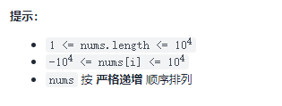
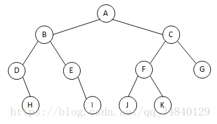
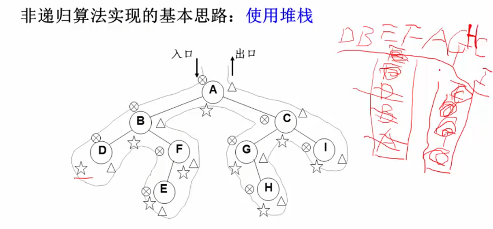
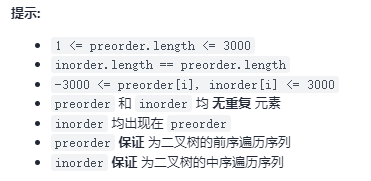

# 二叉树
二叉搜索树

## [173. 二叉搜索树迭代器](https://leetcode-cn.com/problems/binary-search-tree-iterator/)
实现一个二叉搜索树迭代器类BSTIterator ，表示一个按中序遍历二叉搜索树（BST）的迭代器：
- BSTIterator(TreeNode root) 初始化 BSTIterator 类的一个对象。BST 的根节点 root 会作为构造函数的一部分给出。指针应初始化为一个不存在于 BST 中的数字，且该数字小于 BST 中的任何元素。
- boolean hasNext() 如果向指针右侧遍历存在数字，则返回 true ；否则返回 false 。
- int next()将指针向右移动，然后返回指针处的数字。

注意，指针初始化为一个不存在于 BST 中的数字，所以对 next() 的首次调用将返回 BST 中的最小元素。 \
你可以假设 next() 调用总是有效的，也就是说，当调用 next() 时，BST 的中序遍历中至少存在一个下一个数字。

> 示例： \
>  \
> 输入 \
> ["BSTIterator", "next", "next", "hasNext", "next", "hasNext", "next", "hasNext", "next", "hasNext"] \
> [[[7, 3, 15, null, null, 9, 20]], [], [], [], [], [], [], [], [], []] \
> 输出 \
> [null, 3, 7, true, 9, true, 15, true, 20, false] \
> 解释 \
> BSTIterator bSTIterator = new BSTIterator([7, 3, 15, null, null, 9, 20]); \
> bSTIterator.next();    // 返回 3 \
> bSTIterator.next();    // 返回 7 \
> bSTIterator.hasNext(); // 返回 True \
> bSTIterator.next();    // 返回 9 \
> bSTIterator.hasNext(); // 返回 True \
> bSTIterator.next();    // 返回 15 \
> bSTIterator.hasNext(); // 返回 True \
> bSTIterator.next();    // 返回 20 \
> bSTIterator.hasNext(); // 返回 False

```go
type BSTIterator struct {
    root *TreeNode
    vals []int
    pos int
    length int
}


func Constructor(root *TreeNode) BSTIterator {
    vals := inorderTraversal(root)
    return BSTIterator{root: root, vals: vals, pos: -1, length: len(vals)}
}
func inorderTraversal(root *TreeNode) []int {
    vals :=[]int{}
    stack := []*TreeNode{}
    node := root
    for node != nil || len(stack)>0{
        for node != nil{
            stack = append(stack, node)
            node = node.Left
        }
        node = stack[len(stack)-1]
        stack = stack[:len(stack)-1]
        vals = append(vals, node.Val)
        node = node.Right
    }

    return vals
}


func (this *BSTIterator) Next() int {
    this.pos++
    return this.vals[this.pos]
}


func (this *BSTIterator) HasNext() bool {
    return this.pos < this.length-1
}
```

## [108. 将有序数组转换为二叉搜索树](https://leetcode-cn.com/problems/convert-sorted-array-to-binary-search-tree/)
给你一个整数数组 nums ，其中元素已经按 升序 排列，请你将其转换为一棵 高度平衡 二叉搜索树。\
高度平衡 二叉树是一棵满足「每个节点的左右两个子树的高度差的绝对值不超过 1 」的二叉树。



> 示例 1： \
>  \
> 输入：nums = [-10,-3,0,5,9] \
> 输出：[0,-3,9,-10,null,5] \
> 解释：[0,-10,5,null,-3,null,9] 也将被视为正确答案：\
> 
>
> 示例 2： \
>  \
> 输入：nums = [1,3] \
> 输出：[3,1] \
> 解释：[1,3] 和 [3,1] 都是高度平衡二叉搜索树。

// 思路1：中分，中位为根节点，左右分别产生左右节点
简单粗暴
```go
func sortedArrayToBST(nums []int) *TreeNode {
    return getMidNode(nums, 0, len(nums)-1)
}

func getMidNode(nums []int, left, right int) *TreeNode{
    if left > right{
        return nil
    }
    mid := (left+right+1) / 2
    root := &TreeNode{Val: nums[mid]}
    root.Left = getMidNode(nums, left, mid-1)
    root.Right = getMidNode(nums, mid+1, right)
    return root
}
```
思路2：传统添加
```go
func sortedArrayToBST(nums []int) *TreeNode {
	var node *TreeNode
	for _,v:=range nums{
		node = add(node, v)
	}
	return node
}

// 计算层高
func  getHeight(node *TreeNode) int {
	if node == nil {
		return 0
	}
	return max(getHeight(node.Right), getHeight(node.Left)) + 1 // 每层选最大的长度+1
}
func max(a, b int) int {
	if a > b {
		return a
	}
	return b
}

// 计算平衡因子
func  getBalanceFactor(node *TreeNode) int {
	if node == nil {
		return 0
	}
	return getHeight(node.Left) - getHeight(node.Right)
}

///////////////////////////////////////////////////
// LL T1<Z<T2< X <T3<Y<T4                        //
//        y                             x       //
//       / \                           /   \     //
//      x   T4 向右旋转 (y)      z     y    //
//     / \      - - - - - - - ->    / \    / \   //
//    z   T3                    T1 T2 T3 T4  //
//   / \                                         //
// T1   T2                                       //
///////////////////////////////////////////////////
// 右旋
func  rightRotate(y *TreeNode) *TreeNode {
	x := y.Left
	T3 := x.Right

	x.Right = y
	y.Left = T3
	return x
}

////////////////////////////////////////////////
// RR T1<Y<T2< X <T3<Z<T4                     //
//    y                             x         //
//  /  \                          /   \       //
// T1 x 向左旋转 (y)       y     z      //
//     / \  - - - - - - - ->  / \    / \     //
//   T2  z                T1 T2 T3 T4    //
//       / \                                  //
//      T3 T4                                 //
////////////////////////////////////////////////
// 左旋
func  leftRotate(y *TreeNode) *TreeNode {
	x := y.Right
	T2 := x.Left

	x.Left = y
	y.Right = T2
	return x
}

// 添加
func  add(node *TreeNode, value int) *TreeNode {
	if node == nil {
		return &TreeNode{Val: value}
	}
	if value < node.Val {
		node.Left = add(node.Left, value)
	} else if value > node.Val {
		node.Right = add(node.Right, value)
	}

	balanceFactor := getBalanceFactor(node)
	if balanceFactor > 1 && getBalanceFactor(node.Left) >= 0 {
		return rightRotate(node)
	}
	if balanceFactor > 1 && getBalanceFactor(node.Left) < 0 {
		node.Left = leftRotate(node.Left)
		return rightRotate(node)
	}
	if balanceFactor < -1 && getBalanceFactor(node.Right) <= 0{
		return leftRotate(node)
	}
	if balanceFactor < -1 && getBalanceFactor(node.Right) >0{
		node.Right = rightRotate(node.Right)
		return leftRotate(node)
	}
	return node
}
```

## [144. 二叉树的前序遍历](https://leetcode-cn.com/problems/binary-tree-preorder-traversal/)

> 二叉树结构
>
> 
>
> 先序遍历：先(根)序遍历（根左右）\
> 中序遍历：中(根)序遍历（左根右）\
> 后序遍历：后(根)序遍历（左右根）
>

给你二叉树的根节点 root，返回它节点值的 前序 遍历。

实现1：
```go
func preorderTraversal(root *TreeNode) []int {
    vals :=[]int{}
    stack := []*TreeNode{}
    node := root
    for node != nil || len(stack)>0{
        for node != nil{
            vals = append(vals, node.Val)
            stack = append(stack, node.Right)
            node = node.Left
        }
        node = stack[len(stack)-1]
        stack = stack[:len(stack)-1]
    }

    return vals
}
```

实现2：是实现一的递归
```go
func preorderTraversal(root *TreeNode) []int {
    vals := []int{}
    var preorder func(*TreeNode)
    preorder =func (node *TreeNode){
        if node == nil{
            return
        }
        vals = append(vals, node.Val)
        preorder(node.Left)
        preorder(node.Right)
    }
    preorder(root)
    return vals
}
```

## [94. 二叉树的中序遍历](https://leetcode-cn.com/problems/binary-tree-inorder-traversal/)
中序遍历，参考上题
> 中序遍历：中(根)序遍历（左根右）


```go
func inorderTraversal(root *TreeNode) []int {
    vals :=[]int{}
    stack := []*TreeNode{}
    node := root
    for node != nil || len(stack)>0{
        for node != nil{
            stack = append(stack, node)
            node = node.Left
        }
        node = stack[len(stack)-1]
        stack = stack[:len(stack)-1]
        vals = append(vals, node.Val)
        node = node.Right
    }

    return vals
}
```
实现2：
```go
func inorderTraversal(root *TreeNode) []int {
    vals := []int{}
    var preorder func(*TreeNode)
    preorder =func (node *TreeNode){
        if node == nil{
            return
        }
        preorder(node.Left)
        vals = append(vals, node.Val)
        preorder(node.Right)
    }
    preorder(root)
    return vals
}
```

## [145. 二叉树的后序遍历](https://leetcode-cn.com/problems/binary-tree-postorder-traversal/)
同144题
> 后序遍历：后(根)序遍历（左右根）
>
实现1：
```go
func postorderTraversal(root *TreeNode) []int {
    vals := []int{}
    var preorder func(*TreeNode)
    preorder =func (node *TreeNode){
        if node == nil{
            return
        }
        preorder(node.Left)
        preorder(node.Right)
        vals = append(vals, node.Val)
    }
    preorder(root)
    return vals
}
```
实现2：\

1. 先迭代所有左侧的节点，填入节点栈
2. 将最深处的左侧节点值填入结果栈
3. 对最深处节点右侧节点填入节点栈
4. 迭代 2
```go
func postorderTraversal(root *TreeNode) []int {
    vals :=[]int{}
    stack := []*TreeNode{}
    var prev *TreeNode
    for root != nil || len(stack) > 0{
        for root != nil{
            stack = append(stack, root)
            root = root.Left
        }
        root = stack[len(stack)-1]
        stack = stack[:len(stack)-1]
        if root.Right == nil || root.Right == prev{
            vals = append(vals, root.Val)
            prev = root
            root = nil
        } else{
            stack = append(stack, root)
            root = root.Right
        }
    }

    return vals
}
```

## [102. 二叉树的层序遍历](https://leetcode-cn.com/problems/binary-tree-level-order-traversal/)
给你二叉树的根节点 root ，返回其节点值的 层序遍历 。 （即逐层地，从左到右访问所有节点）。

> 
> 输入：root = [3,9,20,null,null,15,7] \
> 输出：[[3],[9,20],[15,7]]

思路1：迭代读取逐层节点，并逐层填入结果栈
```go
func levelOrder(root *TreeNode) [][]int {
    vals := [][]int{}
    var levels []*TreeNode
    for root != nil || len(levels) > 0{
        tempVals := []int{}
        if root != nil{
            tempVals = append(tempVals, root.Val)
            vals = append(vals, tempVals)
            levels = []*TreeNode{}
            levels = pushNode(root.Left, levels)
            levels = pushNode(root.Right, levels)
            root = nil
            continue
        }
        tempNodes := []*TreeNode{}
        for _, node := range levels{
            tempVals = append(tempVals, node.Val)
            tempNodes = pushNode(node.Left, tempNodes)
            tempNodes = pushNode(node.Right, tempNodes)
        }
        vals = append(vals, tempVals)
        levels = tempNodes
    }
    return vals
}

// 填入非空节点
func pushNode(node *TreeNode, ns []*TreeNode) []*TreeNode{
    if node != nil{
        ns = append(ns, node)
    }
    return ns
}
```
简易实现
```go
func levelOrder(root *TreeNode) [][]int {
    ret := [][]int{}
    if root == nil {
        return ret
    }
    q := []*TreeNode{root}
    for i := 0; len(q) > 0; i++ {
        ret = append(ret, []int{})
        p := []*TreeNode{}
        for j := 0; j < len(q); j++ {
            node := q[j]
            ret[i] = append(ret[i], node.Val)
            if node.Left != nil {
                p = append(p, node.Left)
            }
            if node.Right != nil {
                p = append(p, node.Right)
            }
        }
        q = p
    }
    return ret
}
```

## [104. 二叉树的最大深度](https://leetcode-cn.com/problems/maximum-depth-of-binary-tree/)

给定一个二叉树，找出其最大深度。\
二叉树的深度为根节点到最远叶子节点的最长路径上的节点数。\
说明: 叶子节点是指没有子节点的节点。
如下，返回3
```tree
    3
   / \
  9  20
    /  \
   15   7
```
思路：层序遍历 类似102
```go
func maxDepth(root *TreeNode) int {
    if root == nil {
        return 0
    }
    level := 0
    q := []*TreeNode{root}
    for i := 0; len(q) > 0; i++ {
        p := []*TreeNode{}
        for _, node := range(q){
            if node.Left != nil {
                p = append(p, node.Left)
            }
            if node.Right != nil {
                p = append(p, node.Right)
            }
        }
        q = p
        level++
    }
    return level
}
```
思路2，利用递归
```go
func maxDepth(root *TreeNode) int {
    if root == nil{
        return 0
    }
    return max(maxDepth(root.Right), maxDepth(root.Left)) + 1 // 每层选最大的长度+1
}

func max(a,b int) int{
    if a > b{
        return a
    }
    return b
}
```

## [105. 从前序与中序遍历序列构造二叉树](https://leetcode-cn.com/problems/construct-binary-tree-from-preorder-and-inorder-traversal/)
给定两个整数数组 preorder 和 inorder ，其中 preorder 是二叉树的先序遍历， inorder 是同一棵树的中序遍历，请构造二叉树并返回其根节点。\


> 示例 1: \
>  \
> 输入: preorder = [3,9,20,15,7], inorder = [9,3,15,20,7] \
> 输出: [3,9,20,null,null,15,7]
>
> 示例 2: \
> 输入: preorder = [-1], inorder = [-1] \
> 输出: [-1]

思路：找根，分左右，递归
```go
func buildTree(preorder []int, inorder []int) *TreeNode {
    n := len(preorder)
    if n == 0{
        return nil
    }
    if n == 1{
        return &TreeNode{Val: preorder[0]}
    }
    root := &TreeNode{Val: preorder[0]}
    inorderRoot := getIndex(inorder, preorder[0])
    if inorderRoot > 0{
        root.Left = buildTree(preorder[1:1+inorderRoot], inorder[:inorderRoot])
    }
    if n-1 > inorderRoot{
        root.Right = buildTree(preorder[1+inorderRoot:], inorder[inorderRoot+1:])
    }
    return root
}

func getIndex(inorder []int, rootNum int) int{
    for i, v := range inorder{
        if v == rootNum{
            return i
        }
    }
    return -1
}
```

## [103. 二叉树的锯齿形层序遍历](https://leetcode-cn.com/problems/binary-tree-zigzag-level-order-traversal/)
给你二叉树的根节点 root ，返回其节点值的 锯齿形层序遍历 。（即先从左往右，再从右往左进行下一层遍历，以此类推，层与层之间交替进行）。

> 示例 1： \
>  \
> 输入：root = [3,9,20,null,null,15,7] \
> 输出：[[3],[20,9],[15,7]]
>
> 示例 2： \
> 输入：root = [1] \
> 输出：[[1]]
>
> 示例 3： \
> 输入：root = [] \
> 输出：[]

思路：层序遍历+左右取值标签
```go
func zigzagLevelOrder(root *TreeNode) [][]int {
    ans := [][]int{}
    if root == nil{
        return ans
    }
    tag := true // 真为左往右
    stack := []*TreeNode{root}
    for i := 0; len(stack) > 0; i++{
        n := len(stack)
        temp := []*TreeNode{}
        ans = append(ans, []int{})
        for j := 0; j < n; j++{
            node := stack[j]
            if tag{
                ans[i] = append(ans[i], node.Val)
            } else{
                ans[i] = append(ans[i], stack[n-1-j].Val)
            }
            if node.Left != nil{
                temp = append(temp, node.Left)
            }
            if node.Right != nil{
                temp = append(temp, node.Right)
            }
        }
        stack = temp
        tag = !tag
    }
    return ans
}
```

## [199. 二叉树的右视图](https://leetcode-cn.com/problems/binary-tree-right-side-view/)
给定一个二叉树的 根节点 root，想象自己站在它的右侧，按照从顶部到底部的顺序，返回从右侧所能看到的节点值。\

>这里的右侧，是指所有元素中最右侧的节点，并不单纯的指节点的右侧

> 示例 1: \
> 输入: [1,2,3,null,5,null,4] \
> 输出: [1,3,4]
>
> 示例 2: \
> 输入: [1,null,3] \
> 输出: [1,3]
>
> 示例 3: \
> 输入: [] \
> 输出: []

思路：广度优先的搜索
```go
func rightSideView(root *TreeNode) []int {
    ans := []int{}
    if root == nil{
        return ans
    }
    nodes := []*TreeNode{root}
    n := len(nodes)
    for i := 0; n > 0; i++{
        tem := []*TreeNode{}
        for j := 0; j < n; j++{
            node := nodes[j]
            if node.Left != nil{
                tem = append(tem, node.Left)
            }
            if node.Right != nil{
                tem = append(tem, node.Right)
            }
        }
        ans = append(ans, nodes[n-1].Val)
        nodes = tem
        n = len(nodes)
    }
    return ans
}
```

思路1：广度优先
> 注意，这里有个切片相关的[知识点](slice_note.md)
> - go的slice切片，append会在原地址操作
> - 如果 tRight 直接 = append(path, node.Right.Val, ps+node.Right.Val)
> - 则 上方的 tLeft 值会被 tRight 值覆盖
> - 因为 tLeft 值与 tRight 值都是在path切片原地址上进行的操作，
```go
func pathSum(root *TreeNode, targetSum int) [][]int {
	ans := [][]int{}
	if root == nil {
		return ans
	}
	nodes := []*TreeNode{root}
	valSum := [][]int{} // 记录每个节点路径，最后一位是当前路径和
	valSum = append(valSum, []int{root.Val, root.Val})
	n := len(nodes) // 当前层节点数目
	level := 1      // 当前节点为第几层，root为第1层
	for n > 0 {
		temN := []*TreeNode{}
		temV := make([][]int, 0)
		for j := 0; j < n; j++ {
			node := nodes[j]
			ps := valSum[j][level]    // 路径和
			path := valSum[j][:level] // 路径
			if node.Left == nil && node.Right == nil && ps == targetSum {
				ans = append(ans, path)
			}
			if node.Left != nil {
				temN = append(temN, node.Left)
				tLeft := append(path, node.Left.Val, ps+node.Left.Val)
				temV = append(temV, tLeft)
			}
			if node.Right != nil {
				temN = append(temN, node.Right)
				// 注意，go的slice切片，会在原地址操作
				// 如果 tRight 直接 = append(path, node.Right.Val, ps+node.Right.Val)
				// 则 上方的 tLeft 值会被 tRight 值覆盖
				// 因为 tLeft 值与 tRight 值都是在path切片原地址上进行的操作，
				tRight := make([]int, level)
				copy(tRight, path)
				tRight = append(tRight, node.Right.Val, ps+node.Right.Val)
				temV = append(temV, tRight)
			}
		}
		level++
		nodes = temN
		valSum = temV
		n = len(nodes)
	}
	return ans
}
```
深度优先
```go
func pathSum(root *TreeNode, targetSum int) (ans [][]int) {
    path := []int{}
    var dfs func(*TreeNode, int)
    dfs = func(node *TreeNode, left int) {
        if node == nil {
            return
        }
        left -= node.Val
        path = append(path, node.Val)
        defer func() { path = path[:len(path)-1] }()
        if node.Left == nil && node.Right == nil && left == 0 {
            ans = append(ans, append([]int(nil), path...))
            return
        }
        dfs(node.Left, left)
        dfs(node.Right, left)
    }
    dfs(root, targetSum)
    return
}
```

## [450. 删除二叉搜索树中的节点](https://leetcode-cn.com/problems/delete-node-in-a-bst/)
给定一个二叉搜索树的根节点 root 和一个值 key，删除二叉搜索树中的 key 对应的节点，并保证二叉搜索树的性质不变。返回二叉搜索树（有可能被更新）的根节点的引用。\
一般来说，删除节点可分为两个步骤：
- 首先找到需要删除的节点；
- 如果找到了，删除它。

> 示例 1: \
>  \
> 输入：root = [5,3,6,2,4,null,7], key = 3 \
> 输出：[5,4,6,2,null,null,7] \
> 解释：给定需要删除的节点值是 3，所以我们首先找到 3 这个节点，然后删除它。 \
> 一个正确的答案是 [5,4,6,2,null,null,7], 如下图所示。 \
>  \
> 另一个正确答案是 [5,2,6,null,4,null,7]。
>
> 示例 2: \
> 输入: root = [5,3,6,2,4,null,7], key = 0 \
> 输出: [5,3,6,2,4,null,7] \
> 解释: 二叉树不包含值为 0 的节点
>
> 示例 3: \
> 输入: root = [], key = 0 \
> 输出: []

思路：二叉搜索树+右侧最小值
- 左右均不为空
- 找右侧最小值（第一个左侧为nil的节点）
```go
func deleteNode(root *TreeNode, key int) *TreeNode {
    if root == nil{
        return root
    }
    if root.Val > key{
        root.Left = deleteNode(root.Left, key)
        return root
    }
    if root.Val < key{
        root.Right = deleteNode(root.Right, key)
        return root
    }
    // 值相等，删除当前节点
    if root.Left == nil{
        return root.Right
    }
    if root.Right == nil{
        return root.Left
    }

    // 左右均不为空
    // 找右侧最小值
    minR := root.Right
    for minR.Left != nil{
        minR = minR.Left
    }
    minR.Right = deleteNode(root.Right, minR.Val)
    minR.Left = root.Left
    return minR
}
```

## [230. 二叉搜索树中第K小的元素](https://leetcode-cn.com/problems/kth-smallest-element-in-a-bst/)
给定一个二叉搜索树的根节点 root ，和一个整数 k ，请你设计一个算法查找其中第 k 个最小元素（从 1 开始计数）。

> 示例 1： \
>  \
> 输入：root = [3,1,4,null,2], k = 1 \
> 输出：1
>
> 示例 2： \
>  \
> 输入：root = [5,3,6,2,4,null,null,1], k = 3 \
> 输出：3

思路：中序遍历，再取值
```go
func kthSmallest(root *TreeNode, k int) int {
    vals := []int{}
    nodes := []*TreeNode{}
    node := root
    for node != nil || len(nodes) > 0{
        for node != nil{
            nodes = append(nodes, node)
            node = node.Left
        }
        node = nodes[len(nodes)-1]
        nodes = nodes[:len(nodes)-1]
        vals = append(vals, node.Val)
        node = node.Right
    }
    return vals[k-1]
}
```

## [101. 对称二叉树](https://leetcode-cn.com/problems/symmetric-tree/)
下列思路存在问题：如果元素为空，那么不会纳入到节点栈，那么就可以会进入到错位对比，会出错：\
`[1,2,2,null,3,null,3]`\
在第三层，`null,3,null,3` -》变为`3,3`
```go
func isSymmetric(root *TreeNode) bool {
    if root == nil{
        return true
    }
    nodes := []*TreeNode{root}
    for i := 0; len(nodes) > 0; i++ {
        if i > 0 && len(nodes) % 2 != 0{
            return false
        }
        temps := []*TreeNode{}
        for j, node := range(nodes){
            if i > 0 && j < len(nodes) / 2 && node.Val != nodes[len(nodes)-j-1].Val{
                return false
            }
            if node.Left == nil {
                temps = append(temps, node.Left)
            } else
            if node.Right != nil {
                temps = append(temps, node.Right)
            }
        }
        nodes = temps
    }
    return true
}
```
思路1：利用递归
```go
func isSymmetric(root *TreeNode) bool {
    return check(root, root)
}

func check(left, right *TreeNode) bool{
    if left == nil && right == nil{
        return true
    }
    if left == nil || right == nil{
        return false
    }
    return left.Val == right.Val && check(left.Left, right.Right) && check(left.Right, right.Left)
}
```
思路2：迭代：将需要对比的两个节点，两两前后填入节点栈，每次对比两个
```go
func isSymmetric(root *TreeNode) bool {
    var left, right *TreeNode
    que :=[]*TreeNode{root, root}
    for len(que)>0 {
        left, right = que[0], que[1]
        que = que[2:]
        if left == nil && right == nil{
            continue
        }
        if left == nil || right == nil{
            return false
        }
        if left.Val != right.Val{
            return false
        }

        que = append(que, left.Left)
        que = append(que, right.Right)
        
        que = append(que, left.Right)
        que = append(que, right.Left)
    }
    return true
}
```

## [226. 翻转二叉树](https://leetcode-cn.com/problems/invert-binary-tree/)
给你一棵二叉树的根节点 root ，翻转这棵二叉树，并返回其根节点。

>  \
> 输入：root = [4,2,7,1,3,6,9]\
> 输出：[4,7,2,9,6,3,1]

思路1：递归
```go
func invertTree(root *TreeNode) *TreeNode {
    if root == nil{
        return root
    }
    root.Left, root.Right = invertTree(root.Right), invertTree(root.Left)
    return root
}
```
思路2：迭代、遍历
```go
func invertTree(root *TreeNode) *TreeNode {
    if root == nil{
        return root
    }
    nodes := []*TreeNode{root}
    for len(nodes) > 0{
        node := nodes[0]
        nodes = nodes[1:]
        node.Left, node.Right = node.Right, node.Left
        if node.Left != nil{
            nodes = append(nodes, node.Left)
        }
        if node.Right != nil{
            nodes = append(nodes, node.Right)
        }
    }
    return root
}
```

## [112. 路径总和](https://leetcode-cn.com/problems/path-sum/)
给你二叉树的根节点root 和一个表示目标和的整数targetSum 。判断该树中是否存在 根节点到叶子节点 的路径，这条路径上所有节点值相加等于目标和 targetSum 。如果存在，返回 true ；否则，返回 false 。\
叶子节点 是指没有子节点的节点。

> 
> 输入：root = [5,4,8,11,null,13,4,7,2,null,null,null,1], targetSum = 22\
> 输出：true \
> 解释：等于目标和的根节点到叶节点路径如上图所示。

思路1：迭代
```go
func hasPathSum(root *TreeNode, targetSum int) bool {
    if root == nil{
        return false
    }
    nodes := []*TreeNode{root}
    for len(nodes)>0{
        node := nodes[0]
        nodes = nodes[1:]
        if node.Right == nil && node.Left == nil{
            if node.Val == targetSum{
                return true
            }
            continue
        }
        if node.Left != nil{
            node.Left.Val += node.Val
            nodes = append(nodes, node.Left)
        }
        if node.Right != nil{
            node.Right.Val += node.Val
            nodes = append(nodes, node.Right)
        }
    }
    return false
}
```
思路2：递归
```go
func hasPathSum(root *TreeNode, targetSum int) bool {
    if root == nil{
        return false
    }
    if root.Left == nil && root.Right == nil{
        return root.Val == targetSum
    }
    if root.Left != nil{
        root.Left.Val += root.Val
    }
    if root.Right != nil{
        root.Right.Val += root.Val
    }
    return hasPathSum(root.Left, targetSum) || hasPathSum(root.Right, targetSum)
}
```
优化思路2：
```go
func hasPathSum(root *TreeNode, targetSum int) bool {
    if root == nil{
        return false
    }
    if root.Left == nil && root.Right == nil{
        return root.Val == targetSum
    }
    return hasPathSum(root.Left, targetSum - root.Val) || hasPathSum(root.Right, targetSum - root.Val)
}
```

## [700. 二叉搜索树中的搜索](https://leetcode-cn.com/problems/search-in-a-binary-search-tree/)
给定二叉搜索树（BST）的根节点root和一个整数值val。\
你需要在 BST 中找到节点值等于val的节点。 返回以该节点为根的子树。 如果节点不存在，则返回 null 。

> 二叉搜索树满足如下性质：
> - 左子树所有节点的元素值均小于根的元素值；
> - 右子树所有节点的元素值均大于根的元素值。

>  \
> 输入：root = [4,2,7,1,3], val = 2 \
> 输出：[2,1,3]
>
>  \
> 输入：root = [4,2,7,1,3], val = 5 \
> 输出：[]

思路1：迭代
```go
func searchBST(root *TreeNode, val int) *TreeNode {
    if root == nil{
        return root
    }
    nodes := []*TreeNode{root}
    for len(nodes) > 0{
        node := nodes[0]
        if node.Val == val{
            return node
        }
        nodes = nodes[1:]
        if node.Left != nil{
            nodes = append(nodes, node.Left)
        }
        if node.Right != nil{
            nodes = append(nodes, node.Right)
        }
    }
    return nil
}
```
优化
```go
func searchBST(root *TreeNode, val int) *TreeNode {
    if root == nil{
        return root
    }
    for root != nil{
        if root.Val == val{
            return root
        }
        if val < root.Val{
            root = root.Left
        } else {
            root = root.Right
        }
    }
    return root
}
```
思路2：递归
```go
func searchBST(root *TreeNode, val int) *TreeNode {
    if root == nil{
        return root
    }
    if root.Val == val{
        return root
    }
    if val < root.Val{
        return searchBST(root.Left, val)
    }
    return searchBST(root.Right, val)
}
```

## [701. 二叉搜索树中的插入操作](https://leetcode-cn.com/problems/insert-into-a-binary-search-tree/)
给定二叉搜索树（BST）的根节点root和要插入树中的值value，将值插入二叉搜索树。 返回插入后二叉搜索树的根节点。 输入数据 保证 ，新值和原始二叉搜索树中的任意节点值都不同。\
注意，可能**存在多种有效**的插入方式，只要树在插入后仍保持为二叉搜索树即可。 你**可以返回任意有效**的结果 。

>  \
> 输入：root = [4,2,7,1,3], val = 5 \
> 输出：[4,2,7,1,3,5] \
> 解释：另一个满足题目要求可以通过的树是： \
> 

思路1：迭代
```go
func insertIntoBST(root *TreeNode, val int) *TreeNode {
    node := new(TreeNode)
    node.Val = val
    if root == nil{
        return node
    }
    prev := root
    for true{
        if val < prev.Val{
            if prev.Left == nil{
                prev.Left = node
                return root
            }
            prev = prev.Left
            continue
        }
        if prev.Right == nil{
            prev.Right = node
            return root
        }
        prev = prev.Right
    }
    return root
}
```
优化：新节点作为一个结果并**在需要的时候初始化**，减少变量`&TreeNode{Val: val}`
```go
func insertIntoBST(root *TreeNode, val int) *TreeNode {
    if root == nil{
        return &TreeNode{Val: val}
    }
    prev := root
    for true{
        if val < prev.Val{
            if prev.Left == nil{
                prev.Left = &TreeNode{Val: val}
                return root
            }
            prev = prev.Left
            continue
        }
        if prev.Right == nil{
            prev.Right = &TreeNode{Val: val}
            return root
        }
        prev = prev.Right
    }
    return root
}
```
思路2：递归
```go
func insertIntoBST(root *TreeNode, val int) *TreeNode {
    if root == nil{
        return &TreeNode{Val: val}
    }
    if val < root.Val{
        root.Left = insertIntoBST(root.Left, val)
    } else{
        root.Right = insertIntoBST(root.Right, val)
    }
    return root
}
```
## [98. 验证二叉搜索树](https://leetcode-cn.com/problems/validate-binary-search-tree/)
给你一个二叉树的根节点 root ，判断其是否是一个有效的二叉搜索树。\
> 有效 二叉搜索树定义如下：
> - 节点的左子树只包含 小于 当前节点的数。
> - 节点的右子树只包含 大于 当前节点的数。
> - 所有左子树和右子树自身必须也是二叉搜索树。\
    > 大白话讲就是右边的**都比顶点大**

思路1：递归
```go
func isValidBST(root *TreeNode) bool {
    return checkBST(root, math.MinInt64, math.MaxInt64)
}
func checkBST(node *TreeNode, min, max int) bool{
    if node == nil{
        return true
    }
    if node.Val <= min || node.Val >= max{
        return false
    }
    return checkBST(node.Left, min, node.Val) && checkBST(node.Right, node.Val, max)
}
```
思路2：中序遍历，作比较
- 中序遍历：中(根)序遍历（左根右）
- 二叉搜索树，左侧<根<右侧节点值
```go
func isValidBST(root *TreeNode) bool {
    min := math.MinInt64
    que :=[]*TreeNode{}
    for root != nil || len(que) > 0{
        for root != nil{
            que = append(que,root)
            root = root.Left
        }
        root = que[len(que)-1]
        que = que[:len(que)-1]
        if min >= root.Val{
            return false
        }
        min = root.Val
        root = root.Right
    }
    return true
}
```

## [653. 两数之和 IV - 输入 BST](https://leetcode-cn.com/problems/two-sum-iv-input-is-a-bst/)
给定一个二叉搜索树 root 和一个目标结果 k，如果 BST 中存在两个元素且它们的和等于给定的目标结果，则返回 true。
>  \
> 输入: root = [5,3,6,2,4,null,7], k = 9\
> 输出: true
>
>  \
> 输入: root = [5,3,6,2,4,null,7], k = 28 \
> 输出: false

思路：迭代+hash法
```go
func findTarget(root *TreeNode, k int) bool {
    if root == nil{
        return false
    }
    ans := make(map[int]bool)
    nodes := []*TreeNode{root}
    for len(nodes)>0{
        node := nodes[0]
        if _,ok := ans[k-node.Val];ok{
            return true
        }
        ans[node.Val] = true
        nodes = nodes[1:]
        if node.Left != nil{
            nodes = append(nodes, node.Left)
        }
        if node.Right != nil{
            nodes = append(nodes, node.Right)
        }
    }
    return false
}
```

## [235. 二叉搜索树的最近公共祖先](https://leetcode-cn.com/problems/lowest-common-ancestor-of-a-binary-search-tree/)
给定一个二叉搜索树, 找到该树中两个指定节点的最近公共祖先。\
最近公共祖先的**定义**为：“对于有根树 T 的两个结点 p、q，最近公共祖先表示为一个结点 x，满足 x 是 p、q 的祖先且 x 的深度尽可能大（一个节点也可以是它自己的祖先）。”\
例如，给定如下二叉搜索树: root =[6,2,8,0,4,7,9,null,null,3,5]\
\
> 输入: root = [6,2,8,0,4,7,9,null,null,3,5], p = 2, q = 8\
> 输出: 6\
> 解释: 节点 2 和节点 8 的最近公共祖先是 6。
>
> 输入: root = [6,2,8,0,4,7,9,null,null,3,5], p = 2, q = 4\
> 输出: 2\
> 解释: 节点 2 和节点 4 的最近公共祖先是 2, 因为根据定义最近公共祖先节点可以为节点本身。

思路：迭代，利用二叉搜索树定义，比较两个节点与当前节点大小关系
```go
func lowestCommonAncestor(root, p, q *TreeNode) *TreeNode {
	for root != nil{
        if (root.Val < p.Val && root.Val > q.Val) || (root.Val > p.Val && root.Val < q.Val){ // 在两边
            return root
        }
        if root.Val == p.Val || root.Val == q.Val{ // 已经定位到其中一个节点
            return root
        }
        if root.Val < p.Val && root.Val < q.Val{
            root = root.Right
        }
        if root.Val > p.Val && root.Val > q.Val{
            root = root.Left
        }
    }
    return root
}
```