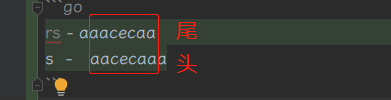
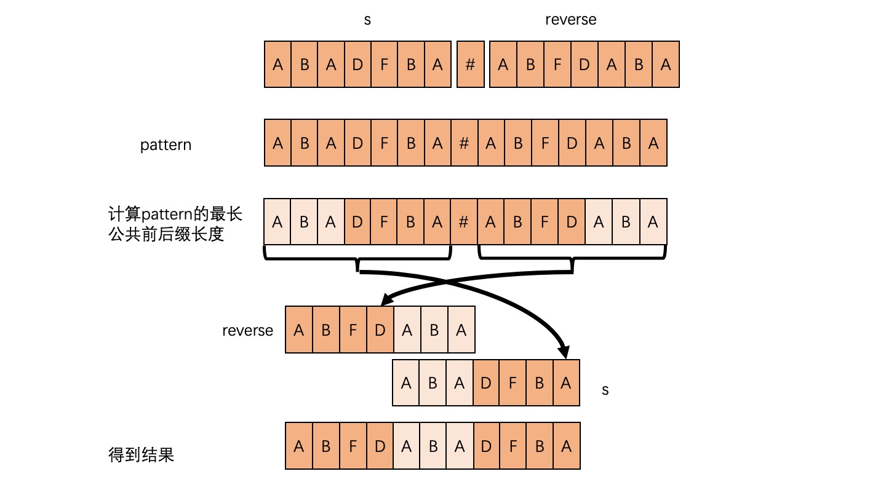

## [28. 实现 strStr()](https://leetcode-cn.com/problems/implement-strstr/)
实现 strStr() 函数。

给你两个字符串 haystack 和 needle ，请你在 haystack 字符串中找出 needle 字符串出现的第一个位置（下标从 0 开始）。如果不存在，则返回  -1 。

说明：
- 当 needle 是空字符串时，我们应当返回什么值呢？这是一个在面试中很好的问题。
- 对于本题而言，当 needle 是空字符串时我们应当返回 0 。这与 C 语言的 strstr() 以及 Java 的 indexOf() 定义相符。

> 示例 1： \
> 输入：haystack = "hello", needle = "ll" \
> 输出：2
>
> 示例 2： \
> 输入：haystack = "aaaaa", needle = "bba" \
> 输出：-1
>
> 示例 3： \
> 输入：haystack = "", needle = "" \
> 输出：0

思路1：遍历比较
```go
func strStr(haystack string, needle string) int {
    n1, n2 := len(haystack), len(needle)
    if n2 == 0{
        return 0
    }
    if n1 == 0 || n1<n2 || (n1 == n2 && haystack != needle){
        return -1
    }
    for i := 0; i <= n1-n2; i++{
        if haystack[i:i+n2] == needle{
            return i
        }
    }
    return -1
}
```
思路2：KMP算法 \
核心内容：前缀表 \

- 获取前缀表，然后根据前缀表匹配值
```go
func strStr(haystack string, needle string) int {
	n := len(needle)
	if n == 0{
		return 0
	}
	next := make([]int, n)
	getNext(needle, next)
	j := 0;
	for i := 0; i < len(haystack); i++{
		for j > 0 && haystack[i] != needle[j]{ // 遇到不匹配的，则不断回溯，直到遇到匹配的前缀值
			j = next[j-1] // 根据next回退
		}
		if haystack[i] == needle[j]{ // 扩大匹配前缀长度
			j++
		}
		if j == n{ // 说明已经完全匹配
			return i-n+1
		}
	}
	return -1
}

func getNext(s string, next []int){
	j := 0;
	next[0] = j
	for i := 1; i < len(s); i++{
		for j > 0 && s[i] != s[j]{ // 凡是遇到不匹配的，则需要从头开始寻找前缀值
			j = next[j-1]
		}
		if s[i]==s[j]{ // 前缀右侧端点右移：增加匹配的前缀长度
			j++
		}
		next[i] = j // 记录当前索引字符能够匹配的 前缀右侧端点索引
	}
}
```

## [459. 重复的子字符串](https://leetcode-cn.com/problems/repeated-substring-pattern/)
给定一个非空的字符串 s ，检查是否可以通过由它的一个子串重复多次构成。

> 示例 1: \
> 输入: s = "abab" \
> 输出: true \
> 解释: 可由子串 "ab" 重复两次构成。
>
> 示例 2: \
> 输入: s = "aba" \
> 输出: false
>
> 示例 3: \
> 输入: s = "abcabcabcabc" \
> 输出: true \
> 解释: 可由子串 "abc" 重复四次构成。 (或子串 "abcabc" 重复两次构成。)

思路1：暴力解法
```go
func repeatedSubstringPattern(s string) bool {
	n := len(s)
	for i := 1; i < n;i++{
		if n%i == 0{
			match := true
			for j := i; j<n;j++{
				if s[j] != s[j-i]{
					match = false
					break
				}
			}
			if match{
				return true
			}
		}
	}
	return false
}
```
思路2：kmp算法
- 如果是由小段字符串重复组成，那么s2掐头去尾后，仍包含 s
```go
func repeatedSubstringPattern2(s string) bool {
	s2 := s+s // 如果是由小段字符串重复组成，那么s2掐头去尾后，仍包含 s
	return kmp(s2[1:len(s2)-1], s) // 有重复，则，由2个该字符串组成的新字符串掐头去尾之后，仍包含原字符串
}

func kmp(haystack string, needle string) bool {
	n := len(needle)
	//if n == 0{ // needle > 0
	//	return 0
	//}
	next := make([]int, n)
	getNext(needle, next)
	j := 0;
	for i := 0; i < len(haystack); i++{
		for j > 0 && haystack[i] != needle[j]{
			j = next[j-1] // 根据next回退
		}
		if haystack[i] == needle[j]{
			j++
		}
		if j == n{
			return true
		}
	}
	return false
}
func getNext(s string, next []int)  {
	j := 0
	next[0] = j
	for i := 1; i < len(s); i++{
		for j > 0 && s[i] != s[j]{
			j = next[j-1]
		}
		if s[i] == s[j]{
			j++
		}
		next[i] = j
	}
}
```

## [214. 最短回文串](https://leetcode-cn.com/problems/shortest-palindrome/)
给定一个字符串 s，你可以通过在字符串前面添加字符将其转换为回文串。找到并返回可以用这种方式转换的最短回文串。

> 示例 1： \
> 输入：s = "aacecaaa" \
> 输出："aaacecaaa"
>
> 示例 2： \
> 输入：s = "abcd" \
> 输出："dcbabcd"

思路：从中间往左侧寻找回文字段
- 要求回文左侧要在字符串头
- 字符串可能是奇数或偶数，那么中间字段取值不同
- 回文长度也存在奇偶性
```go
func shortestPalindrome(s string) string {
    n := len(s)
    if n < 2{
        return s
    }
    mid := n/2 + n%2
    end := 0
    for i := mid-1; i >= 0; i--{
        start1, end1 := expandPali(s, i, i, n) // 回文数目为奇数
		start2, end2 := expandPali(s, i, i+1, n) // 回文数目为偶数
        if start1 == 0 && start2 == 0{
            if end1 > end2{
                end = end1
            } else{
                end = end2
            }
            break
        } else if start1 == 0{
            end = end1
            break
        } else if start2 == 0{
            end = end2
            break
        }
    }
    
    if end == n-1{
        return s
    }
    ans := strings.Split(s[end+1:], "") // 字符串转换为数组
    for left, right := 0, len(ans)-1; left < right; left, right = left+1, right-1{
        ans[left], ans[right] = ans[right],ans[left]
    }
    return strings.Join(ans, "") + s // 数组转换为字符串
}

func expandPali(s string,start, end, n int) (int, int){
	for ; start >= 0 && end < n && s[start] == s[end]; start, end = start-1, end+1{}
	return start+1, end-1
}
```
同思路
```go
func shortestPalindrome(s string) string {
	n := len(s)
    if n < 2{
        return s
    }
	right := 1
	for j := 0+2; j <= n; j++{  // 每次只对比 大于目前最大回文长度 的字符串
		if isPali(s[0:j]){
			right = j
		}
	}
    if right == n{
        return s
    }
    b := strings.Split(s[right:], "")
    for l, r := 0, n-right-1; l < r; l, r = l+1, r-1{
        b[l], b[r] = b[r], b[l]
    }
	return strings.Join(b,"") + s
}


func isPali(s string) bool{
	for i := 0; i < len(s)/2; i++{
		if s[i] != s[len(s)-1-i]{
			return false
		}
	}
	return true
}
```

思路2：字符串哈希
- 如何以O(n)的复杂度求出从头开始的最长回文串?
- 从左往右遍历，计算当前这个子串 s[1, i]s[1,i] 的正向 p 进制的哈希值 forward 和反向 p 进制表示哈希值 backward，如果两者相同，说明当前子串是个回文串。
```go
func shortestPalindrome(s string) string {
    var q, forward, backward uint64
    const P uint64 = 131
    q = 1
    right := 0
    forward = 0
    backward = 0
    n := len(s)
    if n < 2{
        return s
    }
    for i := 0; i < n; i++{
        v := uint64(s[i]-'a')
        forward = forward*P + v   // p进制，高位在前
        backward = backward + v*q // p进制，高位在后
        q = q*P
        if forward == backward{ // 说明当前是一个从头开始的回文串
            right = i
        }
    }
    if right == n-1{
        return s
    }
    ans := strings.Split(s[right+1:], "") // 字符串转换为数组
    for left, right := 0, len(ans)-1; left < right; left, right = left+1, right-1{
        ans[left], ans[right] = ans[right],ans[left]
    }
    return strings.Join(ans, "") + s // 数组转换为字符串
}
```
思路3：前缀和 kmp算法
- 关键代码：反转后的尾部 同 反转前的头部，最大的重叠区间
- 那么，不相同的反转头部，为最小字符串
- 转换为`kmp`算法，则 `s + "#" + rs`，求 next
- 则最后一个字母的前缀和，对应与 s 的头部重叠区间
```go
	for ; i < l; i++ {
		if rs[i:] == s[:l-i] {
			break
		}
	}
```
s 为`aacecaaa`，rs 为 `aaacecaa`
```go
rs - aaacecaa
s  -  aacecaaa
```
 \


```go
func shortestPalindrome(s string) string {
	n := len(s)
	pattern := s+ "#" + reverserStr(s)
	n = n*2+1
	next := make([]int, n)
	getNext(pattern, next)
	return pattern[len(s)+1:n-next[n-1]] + s
}

func getNext(s string, next []int) {
	j := 0
	next[0] = j
	n := len(s)
	for i := 1; i < n; i++{
		for j > 0 && s[i] != s[j]{
			j = next[j-1]
		}
		if s[i] == s[j]{
			j++
		}
		next[i] = j
	}
}
func reverserStr(x string) string {
	res := strings.Builder{}
	for i := len(x) - 1; i >= 0; i-- {
		res.WriteByte(x[i])
	}
	return res.String()
}
```