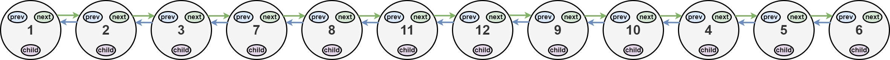
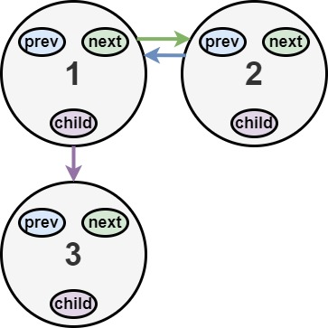
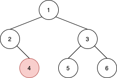

# 链表
## [707. 设计链表](https://leetcode-cn.com/problems/design-linked-list/)

```go
type MyLinkedList struct {
	Val int
	Next *MyLinkedList
}

func Constructor() MyLinkedList {
	return MyLinkedList{Val: math.MinInt64, Next: nil}
}

func (this *MyLinkedList) Get(index int) int {
	nodes := this.GetSlice()
	if index < 0 || index >= len(nodes){
		return -1
	}
	return nodes[index].Val
}


func (this *MyLinkedList) AddAtHead(val int)  {
	if this.Val == math.MinInt64{
		this.Val = val
		return
	}
	this.Next = &MyLinkedList{Val: this.Val, Next: this.Next}
	this.Val = val
}


func (this *MyLinkedList) AddAtTail(val int)  {
	nodes := this.GetSlice()
	n := len(nodes)
	if n == 0{
		this.Val = val
		return
	}
	nodes[len(nodes)-1].Next = &MyLinkedList{Val: val}
}


func (this *MyLinkedList) AddAtIndex(index int, val int)  {
	if index <= 0{
		this.AddAtHead(val)
		return
	}
	nodes := this.GetSlice()
	n := len(nodes)
	if index > n{
		return
	}
	if index == n{
		this.AddAtTail(val)
		return
	}
	node := nodes[index-1]
	node.Next = &MyLinkedList{Val: val, Next: node.Next}
}


func (this *MyLinkedList) DeleteAtIndex(index int)  {
	nodes := this.GetSlice()
	n := len(nodes)
	if index == 0{
		if n > 1{
			this.Val = this.Next.Val
			this.Next = this.Next.Next
		} else if n == 1{
			this.Val = math.MinInt64
		}
		return
	}
	if index < n && index > 0{
		node := nodes[index-1]
		node.Next = node.Next.Next
	}
}

func (this *MyLinkedList) GetSlice() (ans []*MyLinkedList ){
	prev := this
	for prev != nil{
		if prev.Val == math.MinInt64{
			break
		}
		ans = append(ans, prev)
		prev = prev.Next
	}
	return
}
```

## [141. 环形链表](https://leetcode-cn.com/problems/linked-list-cycle/)
给你一个链表的头节点 head ，判断链表中是否有环。\
如果链表中有某个节点，可以通过连续跟踪 next 指针再次到达，则链表中存在环。 为了表示给定链表中的环，评测系统内部使用整数 pos 来表示链表尾连接到链表中的位置（索引从 0 开始）。注意：pos 不作为参数进行传递。仅仅是为了标识链表的实际情况。\
如果链表中存在环，则返回 true 。 否则，返回 false 。

>  \
> 输入：head = [3,2,0,-4], pos = 1\
> 输出：true\
> 解释：链表中有一个环，其尾部连接到第二个节点。
>
>  \
> 输入：head = [1,2], pos = 0\
> 输出：true\
> 解释：链表中有一个环，其尾部连接到第一个节点。
>
>  \
> 输入：head = [1], pos = -1\
> 输出：false\
> 解释：链表中没有环。

思路1：快慢指针，如果快指针先到达nil值，则没有循环，如果快指针和慢指针相等则说明有循环
```go
func hasCycle(head *ListNode) bool {
    fast, slow:= head, head
    for{
        if fast == nil || fast.Next == nil{
            return false
        }
        fast = fast.Next.Next
        slow = slow.Next
        if fast == slow{
            break
        }
    }
    return true
}
```
思路2：hash表法
```go
func hasCycle(head *ListNode) bool {
    seen := map[*ListNode]bool{}
    for head != nil {
        if seen[head] {
            return true
        }
        seen[head] = true
        head = head.Next
    }
    return false
}
```

## [21. 合并两个有序链表](https://leetcode-cn.com/problems/merge-two-sorted-lists/)
将两个升序链表合并为一个新的 升序 链表并返回。新链表是通过拼接给定的两个链表的所有节点组成的。

 \
> 输入：l1 = [1,2,4], l2 = [1,3,4]\
> 输出：[1,1,2,3,4,4]

思路1：递归调用
```go
func mergeTwoLists(list1 *ListNode, list2 *ListNode) *ListNode {
    if list1 == nil{
        return list2
    }
    if list2 == nil{
        return list1
    }
    if list1.Val < list2.Val{
        list1.Next = mergeTwoLists(list1.Next, list2)
        return list1
    }
    list2.Next = mergeTwoLists(list2.Next, list1)
    return list2
}
```
[思路2](https://leetcode-cn.com/problems/merge-two-sorted-lists/solution/he-bing-liang-ge-you-xu-lian-biao-by-leetcode-solu/) ：双指针、哨兵 & 游标法

```go
func mergeTwoLists(list1 *ListNode, list2 *ListNode) *ListNode {
    var ls *ListNode = new (ListNode)
    var p = ls // ls作为哨兵，p作为游标，游标不断Next前进，直到最后迭代完
    for list1 != nil && list2 != nil{
        if list1.Val < list2.Val{
            p.Next = list1
            list1 = list1.Next
        } else{
            p.Next = list2
            list2 = list2.Next
        }
        p = p.Next

    }
    if list1 == nil{
        p.Next = list2
    } else{
        p.Next = list1
    }
    return ls.Next
}
```

## [203. 移除链表元素](https://leetcode-cn.com/problems/remove-linked-list-elements/)
给你一个链表的头节点 head 和一个整数 val ，请你删除链表中所有满足 Node.val == val 的节点，并返回 新的头节点 。

>  \
> 输入：head = [1,2,6,3,4,5,6], val = 6\
> 输出：[1,2,3,4,5]

思路1：迭代法，通过配置游标的方式
code1：
```go
func removeElements(head *ListNode, val int) *ListNode {
    for head != nil && head.Val == val{ // 去除头部可能相同值的节点
        head = head.Next
    }
    if head == nil{
        return head
    }
    prev := head // 配置游标
    for prev.Next != nil{
        if prev.Next.Val == val{
            prev.Next = prev.Next.Next // 删除相同值节点
        } else{
            prev = prev.Next // 游往下一个节点
        }
    }
    return head
}
```
code2：
```go
func removeElements(head *ListNode, val int) *ListNode {
    var preHead *ListNode = &ListNode{Next: head}
    for temp := preHead; temp.Next != nil;{ // 游标
        if temp.Next.Val == val{
            temp.Next = temp.Next.Next
        } else{
            temp = temp.Next
        }
    }
    return preHead.Next
}
```

思路2：递归
```go
func removeElements(head *ListNode, val int) *ListNode {
    if head == nil{
        return head
    }
    head.Next = removeElements(head.Next, val)
    if head.Val == val{
        return head.Next
    }
    return head
}
```

## [206. 反转链表](https://leetcode-cn.com/problems/reverse-linked-list/)
给你单链表的头节点 head ，请你反转链表，并返回反转后的链表。

>  \
> 输入：head = [1,2,3,4,5]\
> 输出：[5,4,3,2,1]
>
> 输入：head = []
> 输出：[]

思路1：迭代，通过栈辅助
```go
func reverseList(head *ListNode) *ListNode {
	if head == nil{
		return head
	}
	nodeList := []*ListNode{}
	for head != nil{
		nodeList = append(nodeList, head)
		head = head.Next
	}
	preHead := new(ListNode)
	prev := preHead
	for i:=len(nodeList)-1;i>=0;i--{
		prev.Next = nodeList[i]
		prev = prev.Next
	}
	prev.Next = nil
	return preHead.Next
}
```

思路2：迭代，倒叙迭代 \

```go
func reverseList(head *ListNode) *ListNode {
	var nilHead *ListNode
	node1 := head
	for node1 != nil {
		node2 := node1.Next
		node1.Next = nilHead // 倒叙排列
		nilHead = node1
		node1 = node2
	}
	return nilHead
}
```

思路3：[递归](https://leetcode-cn.com/problems/reverse-linked-list/solution/dong-hua-yan-shi-206-fan-zhuan-lian-biao-by-user74/)
```go
func reverseList3(head *ListNode) *ListNode {
	if head == nil || head.Next == nil{
		return head
	}
	cur := reverseList3(head.Next) //  一直递归到head.Next = 5，cur为5
	head.Next.Next = head // head为游标，将cur为5的next指向当前head（4）
	head.Next = nil
	return cur
}
```
实现：[reverse.go](../code/list_node/reverse/reverse.go)

## [25. K 个一组翻转链表](https://leetcode-cn.com/problems/reverse-nodes-in-k-group/)
给你一个链表，每 k 个节点一组进行翻转，请你返回翻转后的链表。\
k 是一个正整数，它的值小于或等于链表的长度。 \
如果节点总数不是 k 的整数倍，那么请将最后剩余的节点保持原有顺序。 \
进阶：
- 你可以设计一个**只使用常数额外空间**的算法来解决此问题吗？
- 你不能只是单纯的改变节点内部的值，而是需要实际进行节点交换。

> 示例 1： \
>  \
> 输入：head = [1,2,3,4,5], k = 2 \
> 输出：[2,1,4,3,5]
>
> 示例 2： \
>  \
> 输入：head = [1,2,3,4,5], k = 3 \
> 输出：[3,2,1,4,5]
>
> 示例 3： \
> 输入：head = [1,2,3,4,5], k = 1 \
> 输出：[1,2,3,4,5]
>
> 示例 4： \
> 输入：head = [1], k = 1 \
> 输出：[1]

思路1：借助数组进行翻转
```go
func reverseKGroup(head *ListNode, k int) *ListNode {
	nodes := []*ListNode{}
	prev := head
	for prev != nil{
		nodes = append(nodes, prev)
		prev = prev.Next
	}
	n := len(nodes)
	if n < k || n == 1 || k == 1{
		return head
	}
	node := &ListNode{}
	prev = node
	i := 0
	for ;i < n && i < (n/k)*k;i+=k{
		next, tail := slice2Node(nodes[i:i+k])
		prev.Next = next
		prev = tail
	}
	for ; i < n; i++{
		prev.Next = nodes[i]
		prev = prev.Next
	}
	prev.Next = nil
	return node.Next
}

func slice2Node(nodes []*ListNode) (*ListNode, *ListNode){
	node := &ListNode{Next:nil}
	prev := node
	n := len(nodes)
	for n > 0{
		prev.Next = nodes[n-1]
		prev = prev.Next
		nodes = nodes[:n-1]
		n = len(nodes)
	}
	return node.Next, prev
}
```
思路2：动态规划
- 以k个节点为一组，分头尾，取余后，尾下标为0，头下标为k-1，上一组的尾接下一组的头
```go
func reverseKGroup2(head *ListNode, k int) *ListNode {
	prev := head
	n := 0
	for prev != nil{
		prev = prev.Next
		n++
	}
	if n < k || n == 1 || k == 1{
		return head
	}

	var leftTail, rightTail, firstHead, nilHead, node1, node2 *ListNode
	node1 = head
	i := 0
	// 整体思路是：以k个节点为一组，分头尾，取余后，尾下标为0，头下标为k-1，上一组的尾接下一组的头
	for ;i < n && i < (n/k)*k;i++ {
		if i%k == 0{
			nilHead = nil
		}
		node2 = node1.Next
		node1.Next = nilHead
		nilHead = node1
		node1 = node2
		if i % k == 0{
			rightTail = nilHead // 获取当前组的尾
			continue
		}
		if i%k != k-1{ // 如果当前节点不是新的头节点，则进入下一个循环
			continue
		}
		if i == k-1{
			firstHead = nilHead
		} else {
			leftTail.Next = nilHead
		}
		leftTail = rightTail // 记录当前组的尾，因为下一个组的尾会覆盖rightTail值
	}

	if i < n{
		leftTail.Next = node1
	}
	return firstHead
}
```

## [143. 重排链表](https://leetcode-cn.com/problems/reorder-list/)
给定一个单链表 L 的头节点 head ，单链表 L 表示为：
- L0 → L1 → … → Ln - 1 → Ln

请将其重新排列后变为：
- L0 → Ln → L1 → Ln - 1 → L2 → Ln - 2 → …

不能只是单纯的改变节点内部的值，而是需要实际的进行节点交换。

> 示例 1： \
>  \
> 输入：head = [1,2,3,4] \
> 输出：[1,4,2,3]
>
> 示例 2： \
>  \
> 输入：head = [1,2,3,4,5] \
> 输出：[1,5,2,4,3]

思路1：队列
- 先将所有节点填入队列，然后逐个填入head节点
```go
func reorderList(head *ListNode)  {
    nodes := []*ListNode{}
    prev := head.Next
    for prev != nil{
        nodes = append(nodes, prev)
        prev = prev.Next
    }
    n := len(nodes)
    if n == 1{
        return 
    }
    prev = head
    for n > 0{
        prev.Next = nodes[n-1]
        prev = prev.Next
        nodes = nodes[:n-1]
        n--
        if n > 0{
            prev.Next = nodes[0]
            prev = prev.Next
            if n > 1{
                nodes = nodes[1:]
            }
            n--
        }
    }
    prev.Next = nil
}
```
优化，直接在队列中调整节点前后顺序
```go
func reorderList(head *ListNode)  {
    if head == nil{
        return
    }
    nodes := []*ListNode{}
    
    for head != nil{
        nodes = append(nodes, head)
        head = head.Next
    }
    i, j := 0, len(nodes)-1
    for i<j{
        nodes[i].Next = nodes[j]
        i++
        if i==j{
            break
        }
        nodes[j].Next = nodes[i]
        j--
    }
    nodes[i].Next = nil
}
```
思路2：寻找链表中点 + 链表逆序 + 合并链表
- 类似双指针思路
```go
func reorderList(head *ListNode) {
    if head == nil {
        return
    }
    mid := getMid(head)
    l1 := head
    l2 := mid.Next // 获取后半段（可能会比前半段少1个）
    mid.Next = nil // 让head即l1只保留前半段
    l2 = reverseList(l2) // 反转后半段 
    mergeList(l1,l2) // 类似双指针法
}

func getMid(head *ListNode) *ListNode{
    fast, slow := head, head
    for fast.Next != nil && fast.Next.Next != nil{
        fast = fast.Next.Next
        slow = slow.Next
    }
    return slow
}
func reverseList(head *ListNode) *ListNode {
	var nilHead *ListNode
	node1 := head
	for node1 != nil {
		node2 := node1.Next
		node1.Next = nilHead // 倒叙排列
		nilHead = node1
		node1 = node2
	}
	return nilHead
}
func mergeList(l1, l2 *ListNode){
    for l1 != nil && l2 != nil{
        t1 := l1.Next
        t2 := l2.Next

        l1.Next = l2
        l1 = t1

        l2.Next = l1
        l2 = t2
    }
}
```

## [148. 排序链表](https://leetcode-cn.com/problems/sort-list/)
给你链表的头结点 head ，请将其按 升序 排列并返回 排序后的链表 。

> 示例 1： \
>  \
> 输入：head = [4,2,1,3] \
> 输出：[1,2,3,4]
>
> 示例 2： \
>  \
> 输入：head = [-1,5,3,4,0] \
> 输出：[-1,0,3,4,5]
>
> 示例 3： \
> 输入：head = [] \
> 输出：[]

思路1：冒泡排序，时间复杂度如下 \
 \
在本题中超时
```go
func sortList(head *ListNode) *ListNode {
    ans := &ListNode{Next: head}
    prev := ans
    for {
        isChanged := false
        for prev.Next != nil && prev.Next.Next != nil{
            if prev.Next.Next.Val < prev.Next.Val{
                // 链表交换节点，多用变量，不要用多项赋值
                // 如：prev.Next, prev.Next.Next = prev.Next.Next, prev.Next
                tail := prev.Next.Next.Next
                nextOne := prev.Next
                nextTwo := prev.Next.Next
                prev.Next = nextTwo
                prev.Next.Next = nextOne
                prev.Next.Next.Next = tail
                isChanged = true
            }
            prev = prev.Next
        }
        if !isChanged{
            break
        }
        prev = ans
    }
    return ans.Next
}
```

思路2：队列
```go
func sortList(head *ListNode) *ListNode {
    nodes := []int{}
    for head != nil{
        nodes = append(nodes, head.Val)
        head = head.Next
    }
    if len(nodes) == 0{
        return head
    }
    sort.Ints(nodes)
    ans := &ListNode{Val: nodes[0]}
    nodes = nodes[1:]
    prev := ans
    for len(nodes) > 0{
        prev.Next = &ListNode{Val: nodes[0]}
        prev = prev.Next
        nodes = nodes[1:]
    }
    return ans
}
```

思路3：最小堆
- 排序用冒泡的方式
```go
func sortList(head *ListNode) *ListNode {
    h := &hp{}
    for head != nil{
        heap.Push(h, head.Val)
        head = head.Next
    }
    if h.Len() == 0{
        return head
    }
    ans := &ListNode{Val: heap.Pop(h).(int)}
    prev := ans
    for h.Len() > 0{
        prev.Next = &ListNode{Val: heap.Pop(h).(int)}
        prev = prev.Next
    }
    return ans
}

type hp []int
func (h hp)Len() int{return len(h)}
func (h hp)Less(i, j int) bool {return h[i] < h[j]}
func (h hp)Swap(i,j int){h[i], h[j] = h[j], h[i]}
func (h *hp) Push(v interface{}){*h = append(*h, v.(int))}
func (h *hp) Pop() (v interface{}) { a := *h; *h, v = a[:len(a)-1], a[len(a)-1]; return }
```

##[82. 删除排序链表中的重复元素 II](https://leetcode-cn.com/problems/remove-duplicates-from-sorted-list-ii/)
给定一个已排序的链表的头 head ， 删除原始链表中所有重复数字的节点，只留下不同的数字 。返回 已排序的链表 。

> 示例 1： \
>  \
> 输入：head = [1,2,3,3,4,4,5] \
> 输出：[1,2,5]

> 示例 2： \
>  \
> 输入：head = [1,1,1,2,3] \
> 输出：[2,3]

思路1：逐个对比，且对每一个都比到不再重复为止
```go
func deleteDuplicates(head *ListNode) *ListNode {
    result := &ListNode{Val: math.MinInt64, Next: head} // 为了能够排除头部的重复，所以需要再加一个头，值为最小值
    prev := result
    for prev != nil && prev.Next != nil{
        next := prev.Next
        nextNext := next.Next
        for nextNext != nil && nextNext.Val == next.Val{
            nextNext = nextNext.Next
        }
        if nextNext == next.Next{
            prev = next
        } else{
            prev.Next = nextNext
        }
    }
    return result.Next
}
```
思路2：hash法
```go
func deleteDuplicates(head *ListNode) *ListNode {
    result := &ListNode{Val: math.MinInt64, Next: head}
    prev := result
    mp := make(map[int]int)
    for prev != nil{
        mp[prev.Val]++
        prev = prev.Next
    }
    prev = result
    for prev != nil{
        for prev.Next != nil && mp[prev.Next.Val] > 1{
            prev.Next = prev.Next.Next
        }
        prev = prev.Next
    }
    return result.Next
}
```

## [83. 删除排序链表中的重复元素](https://leetcode-cn.com/problems/remove-duplicates-from-sorted-list/)
给定一个已排序的链表的头 head ， 删除所有重复的元素，使每个元素只出现一次 。返回 已排序的链表 。

>  \
> 输入：head = [1,1,2]\
> 输出：[1,2]

思路：迭代
```go
func deleteDuplicates2(head *ListNode) *ListNode {
	if head == nil {
		return nil
	}
	prev := head
	for prev.Next != nil {
		if prev.Val == prev.Next.Val {
			prev.Next = prev.Next.Next
		} else {
			prev = prev.Next
		}
	}
	return head
}
```
实现：[delete.go](../code/list_node/duplicates/delete.go)

## [2. 两数相加](https://leetcode-cn.com/problems/add-two-numbers/)
给你两个 非空 的链表，表示两个非负的整数。它们每位数字都是按照 逆序 的方式存储的，并且每个节点只能存储 一位 数字。
请你将两个数相加，并以相同形式返回一个表示和的链表。
你可以假设除了数字 0 之外，这两个数都不会以 0 开头。

> 示例 1： \
>  \
> 输入：l1 = [2,4,3], l2 = [5,6,4] \
> 输出：[7,0,8] \
> 解释：342 + 465 = 807.
>
> 示例 2： \
> 输入：l1 = [0], l2 = [0] \
> 输出：[0]
>
> 示例 3： \
> 输入：l1 = [9,9,9,9,9,9,9], l2 = [9,9,9,9] \
> 输出：[8,9,9,9,0,0,0,1]

思路：加法进位
```go
func addTwoNumbers(l1 *ListNode, l2 *ListNode) *ListNode {
    result := new(ListNode)
    prev := result
    coin := 0 // 低进位
    for l1 != nil && l2 != nil{
        prev.Next = new(ListNode)
        prev = prev.Next
        sum := coin+l1.Val+l2.Val
        prev.Val, coin = sum%10, sum/10
        l1, l2 = l1.Next, l2.Next
    }
    if l2 == nil{
        l2 = l1
    }
    for l2 != nil{
        prev.Next = new(ListNode)
        prev = prev.Next
        sum := coin+l2.Val
        prev.Val, coin = sum%10, sum/10
        l2 = l2.Next
    }
    if coin > 0{
        prev.Next = new(ListNode)
        prev = prev.Next
        prev.Val = coin
    } 
    return result.Next
}
```
思路更加清晰的写法，但是判断的次数更多了
```go
func addTwoNumbers(l1 *ListNode, l2 *ListNode) *ListNode {
    result := new(ListNode)
    prev := result
    carry := 0 // 低进位
    for l1 != nil || l2 != nil{
        a, b := 0, 0
        if l1 != nil{
            a = l1.Val
        }
        if l2 != nil{
            b = l2.Val
        }
        a += b+carry
        prev.Next = new(ListNode)
        prev = prev.Next
        prev.Val, carry = a%10, a/10

        if l1 != nil{
            l1 = l1.Next
        }
        if l2 != nil{
            l2 = l2.Next
        }
    }

    if carry > 0{
        prev.Next = new(ListNode)
        prev = prev.Next
        prev.Val = carry
    }
    return result.Next
}
```

## [235. 二叉搜索树的最近公共祖先](https://leetcode-cn.com/problems/lowest-common-ancestor-of-a-binary-search-tree/)

给定一个二叉搜索树, 找到该树中两个指定节点的最近公共祖先。\
最近公共祖先的**定义**为：“对于有根树 T 的两个结点 p、q，最近公共祖先表示为一个结点 x，满足 x 是 p、q 的祖先且 x 的深度尽可能大（一个节点也可以是它自己的祖先）。”\
例如，给定如下二叉搜索树: root =[6,2,8,0,4,7,9,null,null,3,5]\
\
> 输入: root = [6,2,8,0,4,7,9,null,null,3,5], p = 2, q = 8\
> 输出: 6\
> 解释: 节点 2 和节点 8 的最近公共祖先是 6。
>
> 输入: root = [6,2,8,0,4,7,9,null,null,3,5], p = 2, q = 4\
> 输出: 2\
> 解释: 节点 2 和节点 4 的最近公共祖先是 2, 因为根据定义最近公共祖先节点可以为节点本身。

思路：迭代，利用二叉搜索树定义，比较两个节点与当前节点大小关系
```go
func lowestCommonAncestor(root, p, q *TreeNode) *TreeNode {
	for root != nil{
        if (root.Val < p.Val && root.Val > q.Val) || (root.Val > p.Val && root.Val < q.Val){ // 在两边
            return root
        }
        if root.Val == p.Val || root.Val == q.Val{ // 已经定位到其中一个节点
            return root
        }
        if root.Val < p.Val && root.Val < q.Val{
            root = root.Right
        }
        if root.Val > p.Val && root.Val > q.Val{
            root = root.Left
        }
    }
    return root
}
```

## [236. 二叉树的最近公共祖先](https://leetcode-cn.com/problems/lowest-common-ancestor-of-a-binary-tree/)
给定一个二叉树, 找到该树中两个指定节点的最近公共祖先。 \
百度百科中最近公共祖先的定义为：“对于有根树 T 的两个节点 p、q，最近公共祖先表示为一个节点 x，满足 x 是 p、q 的祖先且 x 的深度尽可能大（一个节点也可以是它自己的祖先）。”

> 示例 1： \
>  \
> 输入：root = [3,5,1,6,2,0,8,null,null,7,4], p = 5, q = 1 \
> 输出：3 \
> 解释：节点 5 和节点 1 的最近公共祖先是节点 3 。
>
> 示例 2： \
>  \
> 输入：root = [3,5,1,6,2,0,8,null,null,7,4], p = 5, q = 4 \
> 输出：5 \
> 解释：节点 5 和节点 4 的最近公共祖先是节点 5 。因为根据定义最近公共祖先节点可以为节点本身。
>
> 示例 3： \
> 输入：root = [1,2], p = 1, q = 2 \
> 输出：1

思路：递归
```go
func lowestCommonAncestor(root, p, q *TreeNode) *TreeNode {
  if root == p || root == q{
      return root
  }
  isLeftP := isContain(root.Left, p)
  isLeftQ := isContain(root.Left, q)
  if isLeftP && isLeftQ{
      return lowestCommonAncestor(root.Left, p, q)
  }
  if (isLeftP && !isLeftQ) || (!isLeftP && isLeftQ){
      return root
  }
  return lowestCommonAncestor(root.Right, p, q)
}

func isContain(root, p *TreeNode)bool{
    stack := []*TreeNode{root}
    node := stack[len(stack)-1]
    for len(stack) > 0{
        for node != nil{
            if node == p{
                return true
            }
            stack = append(stack, node.Right)
            node = node.Left
        }
        node = stack[len(stack)-1]
        stack = stack[:len(stack)-1]
    }
    return false
}
```
优化，通过递归自身返回的值来判断p、q存在的情况
- 深读优先
```go
 func lowestCommonAncestor(root, p, q *TreeNode) *TreeNode {
  if root == nil{
      return root
  }
  if root == p || root == q{ // 这里，只要碰到其中之一就返回当前节点，作为节点存在的判断依据，不为nil
      return root
  }
  left := lowestCommonAncestor(root.Left, p, q)
  right := lowestCommonAncestor(root.Right, p, q)
  if left != nil && right != nil{ // 两边都不为空，说明存在于两侧
      return root
  }
  if right == nil{
      return left
  }
  return right
}
```

思路2：hash法，获取所有节点的父节点
- 叶子节点，通过父节点往上推，首个共同父节点即最深共同节点
```go
 func lowestCommonAncestor(root, p, q *TreeNode) *TreeNode {
     // 通过父节点路径，从底层往上不断寻找父节点，最先被找到的，共同访问的父节点即最底层的
     parents := map[int]*TreeNode{} // 所有 Node.val 互不相同
     isVisited := map[int]bool{}

     var deepFindP func(*TreeNode)
     // 递归获取所有节点的父节点
     deepFindP = func(node *TreeNode){
         if node == nil{
             return
         }
         if node.Right != nil{
             parents[node.Right.Val] = node
             deepFindP(node.Right)
         }
         if node.Left != nil{
             parents[node.Left.Val] = node
             deepFindP(node.Left)
         }
     }
     deepFindP(root)
     for p != nil{
         isVisited[p.Val] = true
         p = parents[p.Val]
     }
     for q != nil{
         if isVisited[q.Val]{ // 首个共同父节点
             return q
         }
         q = parents[q.Val]
     }
     return nil
}
```

## [297. 二叉树的序列化与反序列化](https://leetcode-cn.com/problems/serialize-and-deserialize-binary-tree/)
序列化是将一个数据结构或者对象转换为连续的比特位的操作，进而可以将转换后的数据存储在一个文件或者内存中，同时也可以通过网络传输到另一个计算机环境，采取相反方式重构得到原数据。\
请设计一个算法来实现二叉树的序列化与反序列化。这里不限定你的序列 / 反序列化算法执行逻辑，你只需要保证一个二叉树可以被序列化为一个字符串并且将这个字符串反序列化为原始的树结构。\
提示: 输入输出格式与 LeetCode 目前使用的方式一致，详情请参阅 LeetCode 序列化二叉树的格式。你并非必须采取这种方式，你也可以采用其他的方法解决这个问题。

> 示例 1： \
> 
> 输入：root = [1,2,3,null,null,4,5] \
> 输出：[1,2,3,null,null,4,5]
>
> 示例 2： \
> 输入：root = [] \
> 输出：[]
>
> 示例 3： \
> 输入：root = [1] \
> 输出：[1]
>
> 示例 4： \
> 输入：root = [1,2] \
> 输出：[1,2]

思路1：转换为前序 & 中序遍历数组，再转换为字符串，反序列时根据前中序数组形成二叉搜索树
- 存在重复元素，会出错，如树[3,2,4,3]

思路2：按前序遍历编码
- 如[1,2,3,4,5]，序列化为：1,2,3,nil,nil,4,nil,nil,5,nil,nil, \
  
```go
type Codec struct {
    
}

func Constructor() (_ Codec) {
    return
}

// Serializes a tree to a single string.
func (this *Codec) serialize(root *TreeNode) string {
    sBuild := &strings.Builder{}
    var deepFind func(*TreeNode)
    deepFind = func(node *TreeNode){
        if node == nil{
            sBuild.WriteString("nil,")
            return
        }
        sBuild.WriteString(strconv.Itoa(node.Val))
        sBuild.WriteByte(',')
        deepFind(node.Left)
        deepFind(node.Right)
    }
    deepFind(root)
    return sBuild.String()
}

// Deserializes your encoded data to tree.
func (this *Codec) deserialize(data string) *TreeNode {
    sSpilt := strings.Split(data, ",")
    var build func()*TreeNode
    build = func()*TreeNode {
        if sSpilt[0] == "nil"{
            sSpilt = sSpilt[1:]
            return nil
        }
        val,_ := strconv.Atoi(sSpilt[0])
        sSpilt = sSpilt[1:]
        return &TreeNode{Val: val, Left: build(), Right: build()}
    }
    return build()
}
```

思路3：括号表示编码 + 递归下降解码
```go
type Codec struct {
    
}

func Constructor() (_ Codec) {
    return
}

// Serializes a tree to a single string.
func (this *Codec) serialize(root *TreeNode) string {
    if root == nil{
        return "N"
    }
    left := "(" + this.serialize(root.Left) + ")"
    right := "(" + this.serialize(root.Right) + ")"
    return left + strconv.Itoa(root.Val) + right
}

// Deserializes your encoded data to tree.
func (this *Codec) deserialize(data string) *TreeNode {
    var parse func()*TreeNode
    parse = func()*TreeNode{
        if data[0] == 'N'{
            data = data[1:]
            return nil
        }
        node := &TreeNode{}
        data = data[1:] // 跳过左括号
        node.Left = parse() // 获取左侧节点
        data = data[1:] // 跳过右括号
        i := 0
        // 序列化保证了 节点不为空时，数值右侧还有字符
        for ; data[i] == '-' || ('0'<=data[i] && data[i]<='9'); i++{}
        node.Val,_ = strconv.Atoi(data[:i])
        data = data[i:]
        data = data[1:] // 跳过左括号
        node.Right = parse() // 获取左侧节点
        data = data[1:] // 跳过右括号
        return node
    }
    return parse()
}
```

## [138. 复制带随机指针的链表](https://leetcode-cn.com/problems/copy-list-with-random-pointer/)
给你一个长度为 n 的链表，每个节点包含一个额外增加的随机指针 random ，该指针可以指向链表中的任何节点或空节点。

构造这个链表的 深拷贝。 深拷贝应该正好由 n 个 全新 节点组成，其中每个新节点的值都设为其对应的原节点的值。新节点的 next 指针和 random 指针也都应指向复制链表中的新节点，并使原链表和复制链表中的这些指针能够表示相同的链表状态。复制链表中的指针都不应指向原链表中的节点 。

例如，如果原链表中有 X 和 Y 两个节点，其中 X.random --> Y 。那么在复制链表中对应的两个节点 x 和 y ，同样有 x.random --> y 。

返回复制链表的头节点。

用一个由 n 个节点组成的链表来表示输入/输出中的链表。每个节点用一个 [val, random_index] 表示：
- val：一个表示 Node.val 的整数。
- random_index：随机指针指向的节点索引（范围从 0 到 n-1）；如果不指向任何节点，则为  null 。

你的代码 只 接受原链表的头节点 head 作为传入参数。

> 示例 1： \
>  \
> 输入：head = [[7,null],[13,0],[11,4],[10,2],[1,0]] \
> 输出：[[7,null],[13,0],[11,4],[10,2],[1,0]]
>
> 示例 2： \
>  \
> 输入：head = [[1,1],[2,1]] \
> 输出：[[1,1],[2,1]]
>
> 示例 3： \
>  \
> 输入：head = [[3,null],[3,0],[3,null]] \
> 输出：[[3,null],[3,0],[3,null]]

思路：通过队列+hash表存储random信息
```go
func copyRandomList(head *Node) *Node {
    if head == nil{
        return head
    }
    ans := &Node{Val: head.Val}
    prevH := head.Next
    prev := ans
    mp := make(map[*Node]int)
    i := 0
    mp[head] = i
    rans := []*Node{ans}
    for prevH != nil{
        prev.Next = &Node{Val: prevH.Val}
        i++
        mp[prevH] = i
        prevH = prevH.Next
        prev = prev.Next
        rans = append(rans, prev)
    }
    prev = ans
    for head != nil{
        if head.Random == nil{
            prev.Random = nil
        } else{
            prev.Random = rans[mp[head.Random]]
        }
        head = head.Next
        prev = prev.Next
    }
    return ans
}
```

## [430. 扁平化多级双向链表](https://leetcode-cn.com/problems/flatten-a-multilevel-doubly-linked-list/)
你会得到一个双链表，其中包含的节点有一个下一个指针、一个前一个指针和一个额外的 子指针 。这个子指针可能指向一个单独的双向链表，也包含这些特殊的节点。这些子列表可以有一个或多个自己的子列表，以此类推，以生成如下面的示例所示的 多层数据结构 。 \
给定链表的头节点 head ，将链表 扁平化 ，以便所有节点都出现在单层双链表中。让 curr 是一个带有子列表的节点。子列表中的节点应该出现在扁平化列表中的 curr 之后 和 curr.next 之前 。 \
返回 扁平列表的 head 。列表中的节点必须将其 所有 子指针设置为 null 。

数据结构
```go
/**
 * Definition for a Node.
 * type Node struct {
 *     Val int
 *     Prev *Node
 *     Next *Node
 *     Child *Node
 * }
 */
```
> 示例 1： \
>  \
> 输入：head = [1,2,3,4,5,6,null,null,null,7,8,9,10,null,null,11,12] \
> 输出：[1,2,3,7,8,11,12,9,10,4,5,6] \
> 解释：输入的多级列表如上图所示。 \
> 扁平化后的链表如下图： \
> 
>
> 示例 2： \
>  \
> 输入：head = [1,2,null,3] \
> 输出：[1,3,2] \
> 解释：输入的多级列表如上图所示。 \
> 扁平化后的链表如下图： \
> 
>
> 示例 3： \
> 输入：head = [] \
> 输出：[] \
> 说明：输入中可能存在空列表。

思路1：队列辅助
```go
func flatten(root *Node) *Node {
    if root == nil{
        return root
    }
    ns := []*Node{}
    getNodes(root, &ns)
    var ans, cur *Node
    for i := 0; i < len(ns); i++{ // 不断展开 子节点
        if ns[i].Child != nil{
            tem := []*Node{}
            root = ns[i].Child
            ns[i].Child = nil
            getNodes(root, &tem)
            tem = append(tem, ns[i+1:]...)
            ns = append(ns[:i+1], tem...)
        }
        if i == 0{
            ans = ns[0]
            cur = ans
            continue
        }
        cur.Next = ns[i]
        cur = cur.Next
    }
    cur = ans
    for cur != nil && cur.Next != nil{
        cur.Next.Prev = cur
        cur = cur.Next
    }
    return ans
}
// 数组指针的传递 & 使用
func getNodes(root *Node, ns *[]*Node){
    for root!= nil{
        *ns = append(*ns, root)
        root = root.Next
    }
}
```
思路2：递归
```go
func flatten(root *Node) *Node {
    if root == nil {
        return root
    }
    ans := root
    for root != nil{
        if root.Child != nil{
            tail := root.Next
            root.Next = flatten(root.Child)
            root.Next.Prev = root
            root.Child = nil
            for root.Next != nil{
                root = root.Next
            }
            if tail != nil{
                tail.Prev = root
                root.Next = tail
            }
        }
        root = root.Next
    }
    return ans
}
```

## [1602. 找到二叉树中最近的右侧节点](https://leetcode-cn.com/problems/find-nearest-right-node-in-binary-tree/)
给定一棵二叉树的根节点 root 和树中的一个节点 u ，返回与 u 所在层中距离最近的右侧节点，当 u 是所在层中最右侧的节点，返回 null 。

> 示例 1： \
>  \
> 输入：root = [1,2,3,null,4,5,6], u = 4 \
> 输出：5 \
> 解释：节点 4 所在层中，最近的右侧节点是节点 5。
>
> 示例 2： \
>  \
> 输入：root = [3,null,4,2], u = 2 \
> 输出：null \
> 解释：2 的右侧没有节点。
>
> 示例 3： \
> 输入：root = [1], u = 1 \
> 输出：null
>
> 示例 4： \
> 输入：root = [3,4,2,null,null,null,1], u = 4 \
> 输出：2

思路：层序遍历
```go
func findNearestRightNode(root *TreeNode, u *TreeNode) *TreeNode {
    if root == u{
        return nil
    }
    queue := []*TreeNode{root}
    isNext := false
    for len(queue) > 0{
        tem := make([]*TreeNode, 0, 2*len(queue))
        for len(queue) > 0{
            t := queue[0]
            queue = queue[1:]
            if t.Left != nil{
                if isNext{
                    return t.Left
                }
                if t.Left == u{
                    isNext = true
                }
                tem = append(tem, t.Left)
            }
            if t.Right != nil{
                if isNext{
                    return t.Right
                }
                if t.Right == u{
                    isNext = true
                }
                tem = append(tem, t.Right)
            }
        }
        if isNext{
            return nil
        }
        queue = tem
    }
    return nil
}
```

## [1469. 寻找所有的独生节点](https://leetcode-cn.com/problems/find-all-the-lonely-nodes/)
二叉树中，如果一个节点是其父节点的唯一子节点，则称这样的节点为 “独生节点” 。二叉树的根节点不会是独生节点，因为它没有父节点。 \
给定一棵二叉树的根节点 root ，返回树中 所有的独生节点的值所构成的数组 。数组的顺序 不限 。

> 示例 1： \
>  \
> 输入：root = [1,2,3,null,4] \
> 输出：[4] \
> 解释：浅蓝色的节点是唯一的独生节点。 \
> 节点 1 是根节点，不是独生的。 \
> 节点 2 和 3 有共同的父节点，所以它们都不是独生的。
>
> 示例 2 \
>  \
> 输入：root = [7,1,4,6,null,5,3,null,null,null,null,null,2] \
> 输出：[6,2] \
> 输出：浅蓝色的节点是独生节点。 \
> 请谨记，顺序是不限的。 [2,6] 也是一种可接受的答案。
>
> 示例 3： \
>  \
> 输入：root = [11,99,88,77,null,null,66,55,null,null,44,33,null,null,22] \
> 输出：[77,55,33,66,44,22] \
> 解释：节点 99 和 88 有共同的父节点，节点 11 是根节点。 \
> 其他所有节点都是独生节点。
>
> 示例 4： \
> 输入：root = [197] \
> 输出：[]
>
> 示例 5： \
> 输入：root = [31,null,78,null,28] \
> 输出：[78,28]

思路：层序遍历
```go
func getLonelyNodes(root *TreeNode) []int {
    queue := []*TreeNode{root}
    ans := []int{}
    for len(queue) > 0{
        tem := make([]*TreeNode, 0, 2*len(queue))
        for len(queue) > 0{
            t := queue[0]
            queue = queue[1:]
            hasNil := false
            if t.Left == nil || t.Right == nil{
                hasNil = true
            }
            if t.Left != nil{
                if hasNil{
                    ans = append(ans, t.Left.Val)
                }
                tem = append(tem, t.Left)
            }
            if t.Right != nil{
                if hasNil{
                    ans = append(ans, t.Right.Val)
                }
                tem = append(tem, t.Right)
            }
        }
        queue = tem
    }
    return ans
}
```


## [1522. N 叉树的直径](https://leetcode-cn.com/problems/diameter-of-n-ary-tree/)
给定一棵 N 叉树的根节点 root ，计算这棵树的直径长度。 \
N 叉树的直径指的是树中任意两个节点间路径中 最长 路径的长度。这条路径可能经过根节点，也可能不经过根节点。 \
（N 叉树的输入序列以层序遍历的形式给出，每组子节点用 null 分隔）

> 示例 1： \
>  \
> 输入：root = [1,null,3,2,4,null,5,6] \
> 输出：3 \
> 解释：直径如图中红线所示。
>
> 示例 2： \
>  \
> 输入：root = [1,null,2,null,3,4,null,5,null,6] \
> 输出：4
>
> 示例 3： \
>  \
> 输入: root = [1,null,2,3,4,5,null,null,6,7,null,8,null,9,10,null,null,11,null,12,null,13,null,null,14] \
> 输出: 7

思路：深度优先，队列保存
- 用长度为2的队列保存当前节点最长的直径（大到小排序）
- 当前节点最长更新到全局最长
```go
func diameter(root *Node) int {
    if root == nil{
        return 0
    }
    dis := make([]int, 2) // 保存两个最大路径，大到小排序
    var find func(node *Node) int
    find = func(node *Node) int{ // 递归调用
        if len(node.Children) == 0{
            return 1
        }
        temDis := make([]int, 2)
        for _, n := range node.Children{
            d := find(n)
            if d > temDis[1]{
                temDis[1] = d
                swap(temDis) // 确保数组由大到小排序
                if dis[0]+dis[1] < temDis[0]+temDis[1]{ // 如果当前线路比已保存的路径大，则更新
                    dis[0], dis[1] = temDis[0], temDis[1]
                }
            }
        }
        return temDis[0]+1
    }
    find(root)
    return dis[0]+dis[1]
}

//交换数组，确保数组逆序排序
func swap(nums []int){ 
    if nums[0] < nums[1]{
        nums[0], nums[1] = nums[1], nums[0]
    }
}
```

## [337. 打家劫舍 III](https://leetcode-cn.com/problems/house-robber-iii/)
小偷又发现了一个新的可行窃的地区。这个地区只有一个入口，我们称之为 root 。 \
除了 root 之外，每栋房子有且只有一个“父“房子与之相连。一番侦察之后，聪明的小偷意识到“这个地方的所有房屋的排列类似于一棵二叉树”。 如果 两个直接相连的房子在同一天晚上被打劫 ，房屋将自动报警。 \
给定二叉树的 root 。返回 在不触动警报的情况下 ，小偷能够盗取的最高金额 。

> 示例 1: \
>  \
> 输入: root = [3,2,3,null,3,null,1] \
> 输出: 7 \
> 解释: 小偷一晚能够盗取的最高金额 3 + 3 + 1 = 7
>
> 示例 2: \
>  \
> 输入: root = [3,4,5,1,3,null,1] \
> 输出: 9 \
> 解释: 小偷一晚能够盗取的最高金额 4 + 5 = 9

思路：动态规划 \

```go
func rob(root *TreeNode) int {
    vals := dfs(root)
    return max(vals[0], vals[1])
}

func dfs(node *TreeNode)[]int{
    if node == nil{
        return []int{0,0}
    }
    l, r := dfs(node.Left), dfs(node.Right)
    selected := node.Val+l[1]+r[1]
    noSelected := max(l[0],l[1])+max(r[0],r[1])
    return []int{selected, noSelected}
}

func max(a, b int)int{
    if a > b{
        return a
    }
    return b
}
```
不能用层序遍历，隔行累加，因为在第一行、第四行出现两个大值的情况，是会出问题的 \
[4,1,null,2,null,3]
```go
func rob(root *TreeNode) int {
    if root == nil{
        return 0
    }
    sumOdd, sumEven := 0, 0
    queue := []*TreeNode{root}
    isOdd := true // root层，第一层
    for len(queue) > 0{
        temQ := []*TreeNode{}
        temS := 0
        for len(queue) > 0{
            node := queue[0]
            queue = queue[1:]
            temS += node.Val
            if node.Left != nil{
                temQ = append(temQ, node.Left)
            }
            if node.Right != nil{
                temQ = append(temQ, node.Right)
            }
        }
        queue = temQ
        if isOdd{
            isOdd = false
            sumOdd += temS
        } else{
            isOdd = true
            sumEven += temS
        }
    }
    if sumEven > sumOdd{
        return sumEven
    }
    return sumOdd
}
```