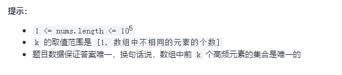
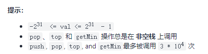
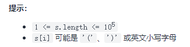

# 栈与队列
## [347. 前 K 个高频元素](https://leetcode-cn.com/problems/top-k-frequent-elements/)
给你一个整数数组 nums 和一个整数 k ，请你返回其中出现频率前 k 高的元素。你可以按 任意顺序 返回答案。

> 示例 1: \
> 输入: nums = [1,1,1,2,2,3], k = 2 \
> 输出: [1,2]
>
> 示例 2: \
> 输入: nums = [1], k = 1 \
> 输出: [1]



思路：统计次数，排序，获取目标数组
```go
func topKFrequent(nums []int, k int) []int {
    n := len(nums)
    if n == 1{
        return nums
    }
    counts := make(map[int]int, n)
    for _,v := range nums{
        counts[v]++
    }
    nns := [][]int{}
    for k,v := range counts{
        nns = append(nns, []int{k,v})
    }
    sort.Slice(nns, func(i,j int)bool{
        return nns[i][1] > nns[j][1] // 按出现次数从大到小排列
    })
    ans := make([]int, k)
    for i := 0; i < k; i++{
        ans[i] = nns[i][0]
    }
    return ans
}
```

优化，用堆排序
```go
func topKFrequent(nums []int, k int) []int {
	occurrences := map[int]int{}
	for _, num := range nums {
		occurrences[num]++
	}
	h := &IHeap{}
	heap.Init(h)
	for key, value := range occurrences {
		heap.Push(h, [2]int{key, value}) // 每次push都会进行排序（按 IHeap 中实现的Less方法）
		if h.Len() > k {
			heap.Pop(h) // 出栈的总是最小值
		}
	}
	ret := make([]int, k)
	for i := 0; i < k; i++ {
		ret[k - i - 1] = heap.Pop(h).([2]int)[0]
	}
	return ret
}

type IHeap [][2]int

func (h IHeap) Len() int           { return len(h) }
func (h IHeap) Less(i, j int) bool { return h[i][1] < h[j][1] } // 当前是从小到大排序，如果要从大到小，则 h[i][1] > h[j][1]
func (h IHeap) Swap(i, j int)      { h[i], h[j] = h[j], h[i] }

func (h *IHeap) Push(x interface{}) {
	*h = append(*h, x.([2]int))
}

func (h *IHeap) Pop() interface{} {
	old := *h
	n := len(old)
	x := old[n-1]
	*h = old[0 : n-1]
	return x
}
```

## [451. 根据字符出现频率排序](https://leetcode-cn.com/problems/sort-characters-by-frequency/)
给定一个字符串，请将字符串里的字符按照出现的频率降序排列。

> 示例 1:
> 输入:"tree"
> 输出:"eert"
> 解释:
> 'e'出现两次，'r'和't'都只出现一次。
> 因此'e'必须出现在'r'和't'之前。此外，"eetr"也是一个有效的答案。
>
> 示例 2:
> 输入:"cccaaa"
> 输出:"cccaaa"
> 解释:
> 'c'和'a'都出现三次。此外，"aaaccc"也是有效的答案。
> 注意"cacaca"是不正确的，因为相同的字母必须放在一起。
>
> 示例 3:
> 输入:"Aabb"
> 输出:"bbAa"
> 解释:
> 此外，"bbaA"也是一个有效的答案，但"Aabb"是不正确的。
> 注意'A'和'a'被认为是两种不同的字符。

思路1：最小堆
```go
func frequencySort(s string) string {
	n := len(s)
	ac := make(map[int32]int, n)
	for _,v := range s{
		ac[v]++
	}

	ah := &alphaH{}
	heap.Init(ah) // 初始化堆
	for k,v := range ac{
		heap.Push(ah, alphaC{k,v})
	}

	ans := ""
	for ah.Len() > 0{
		tem := heap.Pop(ah).(alphaC) // 使用堆时注意转换 pop 出来的格式
		for i := 0; i < tem.c;i++{
			ans += string(tem.i)
		}
	}

	return ans
}

type alphaC struct {
	i int32 // 字符串 int32 码
	c int  // 字符串出现次数
}

type alphaH []alphaC

func (a alphaH) Len() int { return len(a) }
func (a alphaH) Less(i, j int) bool { return a[i].c > a[j].c } // 当前是从小到大排序，如果要从大到小，则 a[i].c < a[j].c
func (a alphaH) Swap(i, j int)      { a[i], a[j] = a[j], a[i] }
func (a *alphaH) Push(x interface{}) {
	*a = append(*a, x.(alphaC))
}

func (a *alphaH) Pop() interface{} {
	old := *a
	n := len(old)
	x := old[n-1]
	*a = old[0 : n-1]
	return x
}
```
> 注意，字符串也包含数字···

思路2：hash法+排序 \
`ans = append(ans,bytes.Repeat([]byte{v.b}, v.c)...) // 关键代码`
```go
func frequencySort(s string) string {
	cnt := make(map[byte]int)
	for i := range s{
		cnt[s[i]]++
	}

	type ac struct {
		b byte // 字符 byte
		c int // 出现次数
	}
	cts := []ac{}
	for k,v := range cnt{
		cts = append(cts, ac{k,v})
	}

	sort.Slice(cts, func(i, j int) bool {
		return cts[i].c > cts[j].c
	})
	ans := make([]byte, 0, len(s))
	for _,v := range cts{
		ans = append(ans,bytes.Repeat([]byte{v.b}, v.c)...) // 关键代码
	}
	return string(ans)
}
```

思路3：桶排序 \
由于每个字符在字符串中出现的频率存在上限，因此可以使用桶排序的思想，根据出现次数生成排序后的字符串。具体做法如下：
- 遍历字符串，统计每个字符出现的频率，同时记录最高频率 maxFreq；
- 创建桶，存储从 1 到 maxFreq 的每个出现频率的字符；
- 按照出现频率从大到小的顺序遍历桶，对于每个出现频率，获得对应的字符，然后将每个字符按照出现频率拼接到排序后的字符串。

```go
func frequencySort(s string) string {
	cnt := make(map[byte]int)
	maxFre := 0 // 最高出现频率
	for i := range s{
		cnt[s[i]]++
		if cnt[s[i]] > maxFre{
			maxFre = cnt[s[i]]
		}
	}

	buckets := make([][]byte, maxFre+1) // 记录各个频率出现的字母byte值
	for k,v := range cnt{
		buckets[v] = append(buckets[v], k)
	}

	ans := make([]byte, 0, len(s))
	for i := maxFre; i > 0; i--{
		for n := 0; n < len(buckets[i]); n++{
			ans = append(ans,bytes.Repeat([]byte{buckets[i][n]}, i)...)
		}
	}
	return string(ans)
}
```

## [155. 最小栈](https://leetcode-cn.com/problems/min-stack/)
设计一个支持 push ，pop ，top 操作，并能在常数时间内检索到最小元素的栈。 \
实现 MinStack 类:
- MinStack() 初始化堆栈对象。
- void push(int val) 将元素val推入堆栈。
- void pop() 删除堆栈顶部的元素。
- int top() 获取堆栈顶部的元素。
- int getMin() 获取堆栈中的最小元素。


> 示例 1: \
> 输入：
> - ["MinStack","push","push","push","getMin","pop","top","getMin"]
> - [[],[-2],[0],[-3],[],[],[],[]]
>
> 输出：[null,null,null,null,-3,null,0,-2] \
> 解释：
> - MinStack minStack = new MinStack();
> - minStack.push(-2);
> - minStack.push(0);
> - minStack.push(-3);
> - minStack.getMin();   --> 返回 -3.
> - minStack.pop();
> - minStack.top();      --> 返回 0.
> - minStack.getMin();   --> 返回 -2.


思路：通过值记录常用值
```go
type MinStack struct {
	stack []int
	len int
	min int
}

func Constructor() MinStack {
	return MinStack{min: math.MaxInt64}
}


func (this *MinStack) Push(val int)  {
	this.stack = append(this.stack, val)
	this.len++
	if this.min > val{
		this.min = val
	}
}


func (this *MinStack) Pop()  {
	if this.len > 0{
		oldTop := this.stack[this.len-1]
		this.stack = this.stack[:this.len-1]
		this.len--
		if this.min == oldTop{
			this.resetMin()
		}
	}
}


func (this *MinStack) Top() int {
	return this.stack[this.len-1]
}


func (this *MinStack) GetMin() int {
	return this.min
}


func (this *MinStack) resetMin() {
	this.min = math.MaxInt64
	for i := 0; i < this.len; i++{
		if this.min > this.stack[i]{
			this.min = this.stack[i]
		}
	}
}
```

## [20. 有效的括号](https://leetcode-cn.com/problems/valid-parentheses/)
给定一个只包括 '('，')'，'{'，'}'，'['，']'的字符串 s ，判断字符串是否有效。\
有效字符串需满足：
1. 左括号必须用相同类型的右括号闭合。
2. 左括号必须以正确的顺序闭合。

>示例 1：\
> 输入：s = "()"\
> 输出：true
>
> 示例2：\
> 输入：s = "()[]{}"\
> 输出：true

> 示例3：\
> 输入：s = "(]"\
> 输出：false

> 示例4：\
> 输入：s = "([)]"\
> 输出：false

> 示例5：\
> 输入：s = "{[]}"\
> 输出：true

思路：栈
实现1：
```go
func isValid(s string) bool {
	if len(s)%2 != 0 {
		return false
	}
	ss := strings.Split(s, "")
	isStart := map[string]bool{
		"{": true,
		"[": true,
		"(": true,
	}
	rightEnd := map[string]string{
		"{": "}",
		"[": "]",
		"(": ")",
	}
	starts := []string{}
	for _,v:=range ss{
		if isStart[v]{
			starts = append(starts,v)
			continue
		}
		if len(starts) == 0 || rightEnd[starts[len(starts) - 1]] != v{
			return false
		}
		starts = starts[0:len(starts)-1]
	}
	if len(starts) > 0{
		return false
	}
	return true
}
```
实现2：
```go
func isValid2(s string) bool {
	if len(s)%2 != 0 {
		return false
	}
	rl := map[byte]byte{
		'[':']',
		'{':'}',
		'(':')',
	}
	stack := []byte{}
	for i := range s{
		if rl[s[i]]>0{
			stack = append(stack, s[i])
			continue
		}
		if len(stack) == 0 || rl[stack[len(stack)-1]] != s[i]{
			return false
		}
		stack = stack[:len(stack)-1]
	}
	return len(stack) == 0
}
```
实现：[is_valid.go](../code/string/brackets/is_valid.go)

## [1249. 移除无效的括号](https://leetcode-cn.com/problems/minimum-remove-to-make-valid-parentheses/)
给你一个由 '('、')' 和小写字母组成的字符串 s。\
你需要从字符串中删除最少数目的 '(' 或者 ')' （可以删除任意位置的括号)，使得剩下的「括号字符串」有效。 \
请返回任意一个合法字符串。

有效「括号字符串」应当符合以下 任意一条 要求：
- 空字符串或只包含小写字母的字符串
- 可以被写作 AB（A 连接 B）的字符串，其中 A 和 B 都是有效「括号字符串」
- 可以被写作 (A) 的字符串，其中 A 是一个有效的「括号字符串」


> 示例 1： \
> 输入：s = "lee(t(c)o)de)" \
> 输出："lee(t(c)o)de" \
> 解释："lee(t(co)de)" , "lee(t(c)ode)" 也是一个可行答案。
>
> 示例 2： \
> 输入：s = "a)b(c)d" \
> 输出："ab(c)d"
>
> 示例 3： \
> 输入：s = "))((" \
> 输出："" \
> 解释：空字符串也是有效的



思路1：栈，用栈存放 "(" 位置，判断遇到的 ")"是否合法
- leftBs 存放 "(" 位置
- 遇到 ")"，如果leftBs为空，则非法，需移除，如果非空则Pop"("栈
```go
func minRemoveToMakeValid(s string) string {
	leftBs := []int{}
	ln := 0
	sn := len(s)
	for i := 0; i < sn; i++{
		if s[i] == '('{
			leftBs = append(leftBs, i)
			ln++
		}
		if s[i] == ')'{
			if ln == 0{
				s = removeIndex(s, sn, i)
				sn = len(s)
				i--
				continue
			}
			leftBs = leftBs[:ln-1]
			ln--
		}
	}
	for i := ln-1; i >= 0; i--{
		s = removeIndex(s, sn, leftBs[i])
		sn = len(s)
	}
	return s
}

func removeIndex (s string, n, index int) string{
	if index == n-1{
		return s[:n-1]
	}
	return s[:index]+s[index+1:]
}
```

## [232. 用栈实现队列](https://leetcode-cn.com/problems/implement-queue-using-stacks/)
请你仅使用两个栈实现先入先出队列。队列应当支持一般队列支持的所有操作（push、pop、peek、empty）：

实现 MyQueue 类：
1. void push(int x) 将元素 x 推到队列的末尾
2. int pop() 从队列的开头移除并返回元素
3. int peek() 返回队列开头的元素
4. boolean empty() 如果队列为空，返回 true ；否则，返回 false

说明：
1. 你只能使用标准的栈操作 —— 也就是只有 push to top, peek/pop from top, size, 和 is empty 操作是合法的。
2. 你所使用的语言也许不支持栈。你可以使用 list 或者 deque（双端队列）来模拟一个栈，只要是标准的栈操作即可。
```go
type MyQueue struct {
    inStack, outStack []int
}

func Constructor() MyQueue {
    return MyQueue{}
}

func (q *MyQueue) Push(x int) {
    q.inStack = append(q.inStack, x)
}

func (q *MyQueue) in2out() {
    for len(q.inStack) > 0 {
        q.outStack = append(q.outStack, q.inStack[len(q.inStack)-1])
        q.inStack = q.inStack[:len(q.inStack)-1]
    }
}

func (q *MyQueue) Pop() int {
    if len(q.outStack) == 0 {
        q.in2out()
    }
    x := q.outStack[len(q.outStack)-1]
    q.outStack = q.outStack[:len(q.outStack)-1]
    return x
}

func (q *MyQueue) Peek() int {
    if len(q.outStack) == 0 {
        q.in2out()
    }
    return q.outStack[len(q.outStack)-1]
}

func (q *MyQueue) Empty() bool {
    return len(q.inStack) == 0 && len(q.outStack) == 0
}
```