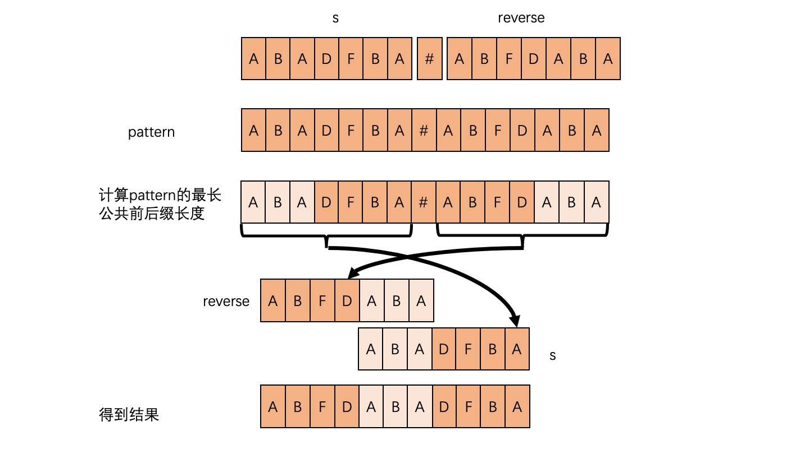

# 字符串

## [387. 字符串中的第一个唯一字符](https://leetcode-cn.com/problems/first-unique-character-in-a-string/)
给定一个字符串，找到它的第一个不重复的字符，并返回它的索引。如果不存在，则返回 -1。

> 输入：s = "leetcode"\
> 输出：返回 0
>
> 输入：s = "loveleetcode"\
> 输出：返回 2

**提示**：你可以假定该字符串只包含小写字母。

思路1：hash表记录出现次数，两次迭代获取首个出现一次的索引\
注意，range字符串返回的是int32的值
```go
func firstUniqChar2(s string)int  {
	a := make(map[int32]int) // 因题目限定小写字母，所以可以用 [26]int代替hash表
	for _, v:=range s{
		a[v]++
	}
	for i,v:=range s{
		if a[v] == 1{
			return i
		}
	}
	return -1
}
```
思路2：hash表法，利用先进先出的数组，嵌套迭代\
关键思路，对首个非唯一的字符串进行排除
```go
	for len(que) > 0 && hashTable[que[0].ch] >1{
		que = que[1:] // 先进先出
	}
```
先进先出关键代码```que = que[1:]```
代码：
```go
type loc struct {
    ch  int32 // 字符串被range之后的值
    pos int
}

func firstUniqChar5(s string) int {
	var que []loc
	hashTable := make(map[int32]int)
	for i,v:=range s{
		hashTable[v]++
		if hashTable[v] == 1{
			que = append(que, loc{v, i})
		}
	}
	for len(que) > 0 && hashTable[que[0].ch] >1{
		que = que[1:] // 先进先出
	}
	if len(que)>0{
		return que[0].pos
	}
	return -1
}
```
实现：[char_first_unique](../code/string/char_first_unique)\
**_注意_**：力扣官方解法，仅限定小写字母，所以可以声明```[26]int{}```

## [3. 无重复字符的最长子串](https://leetcode-cn.com/problems/longest-substring-without-repeating-characters/)
给定一个字符串 s ，请你找出其中不含有重复字符的 最长子串 的长度。

> 示例 1: \
> 输入: s = "abcabcbb" \
> 输出: 3 \
> 解释: 因为无重复字符的最长子串是 "abc"，所以其长度为 3。
>
> 示例 2: \
> 输入: s = "bbbbb" \
> 输出: 1 \
> 解释: 因为无重复字符的最长子串是 "b"，所以其长度为 1。
>
> 示例 3: \
> 输入: s = "pwwkew" \
> 输出: 3 \
> 解释: 因为无重复字符的最长子串是 "wke"，所以其长度为 3。 \
> 请注意，你的答案必须是 子串 的长度，"pwke" 是一个子序列，不是子串

思路：hash法
```go
func lengthOfLongestSubstring(s string) int {
    mp := make(map[byte]int) // 记录字符最后出现的位置
    n := len(s)
    maxL := 0
    for l, r := 0, 0; r < n && l < n; r++{
        if v, ok := mp[s[r]]; ok && v >= l{ // 也要保证 hash表中的值在窗口内，窗口外的不作数
            l = mp[s[r]]+1
            if n-l <= maxL{
                break
            }
        } else{
            if r-l+1 > maxL{
                maxL = r-l+1
            }
        }
        mp[s[r]] = r
    }
    return maxL
}
```

## [383. 赎金信](https://leetcode-cn.com/problems/ransom-note/)
给你两个字符串：ransomNote 和 magazine ，判断 ransomNote 能不能由 magazine 里面的字符构成。\
如果可以，返回 true ；否则返回 false 。\
magazine 中的每个字符只能在 ransomNote 中使用一次。

> 示例 1：\
> 输入：ransomNote = "a", magazine = "b"\
> 输出：false
>
> 示例 2：\
> 输入：ransomNote = "aa", magazine = "ab"\
> 输出：false
>
> 示例 3：\
> 输入：ransomNote = **"aa"**, magazine = **"aba"**\
> 输出：true

关键点，```ransomNote```中同一字符出现的次数要小于等于```magazine```中字符

思路：hash表法，先统计```magazine```中字符出现次数，迭代```ransomNote```，如果```ransomNote```出现其他字符或者字符多于```magazine```则返回false
```go
func canConstruc2(ransomNote string, magazine string) bool{
	mHash:=make(map[int32]int)
	for _,v:=range magazine{
		mHash[v]++
	}
	for _,v:=range ransomNote{
		mHash[v]--
		if mHash[v] < 0{
			return false
		}
	}
	return true
}
```
实现：[char_can_construct](../code/string/char_can_construct)

## [242. 有效的字母异位词](https://leetcode-cn.com/problems/valid-anagram/)
给定两个字符串 s 和 t ，编写一个函数来判断 t 是否是 s 的字母异位词。\
**注意**：若s 和 t中每个字符出现的次数都相同，则称s 和 t互为字母异位词。
> 示例1:\
> 输入: s = "anagram", t = "nagaram"\
> 输出: true
>
> 示例 2:\
> 输入: s = "rat", t = "car"\
> 输出: false

思路1：hash表法，同383. 赎金信
```go
func isAnagram2(s string, t string) bool {
	if len(s) != len(t){
		return false
	}
	sHash := make(map[rune]int)
	for _,v:=range s{
		sHash[v]++
	}
	for _,v:=range t{
		sHash[v]--
		if sHash[v] < 0{
			return false
		}
	}
	return true
}
```
思路2：对两个字符串进行排序后比较
```go
func isAnagram3(s string, t string) bool {
	ls1,ls2 := []byte(s),[]byte(t)
	sort.Slice(ls1, func(i, j int) bool {
		return ls1[i]<ls1[j]
	})
	sort.Slice(ls2, func(i, j int) bool {
		return ls2[i]<ls2[j]
	})
	return string(ls1) == string(ls2)
}
```
实现：[char_is_anagram](../code/string/char_is_anagram)

## [2. 两数相加](https://leetcode-cn.com/problems/add-two-numbers/)
给你两个 非空 的链表，表示两个非负的整数。它们每位数字都是按照 逆序 的方式存储的，并且每个节点只能存储 一位 数字。
请你将两个数相加，并以相同形式返回一个表示和的链表。
你可以假设除了数字 0 之外，这两个数都不会以 0 开头。

> 示例 1： \
>  \
> 输入：l1 = [2,4,3], l2 = [5,6,4] \
> 输出：[7,0,8] \
> 解释：342 + 465 = 807.
>
> 示例 2： \
> 输入：l1 = [0], l2 = [0] \
> 输出：[0]
>
> 示例 3： \
> 输入：l1 = [9,9,9,9,9,9,9], l2 = [9,9,9,9] \
> 输出：[8,9,9,9,0,0,0,1]

思路：加法进位
```go
func addTwoNumbers(l1 *ListNode, l2 *ListNode) *ListNode {
    result := new(ListNode)
    prev := result
    coin := 0 // 低进位
    for l1 != nil && l2 != nil{
        prev.Next = new(ListNode)
        prev = prev.Next
        sum := coin+l1.Val+l2.Val
        prev.Val, coin = sum%10, sum/10
        l1, l2 = l1.Next, l2.Next
    }
    if l2 == nil{
        l2 = l1
    }
    for l2 != nil{
        prev.Next = new(ListNode)
        prev = prev.Next
        sum := coin+l2.Val
        prev.Val, coin = sum%10, sum/10
        l2 = l2.Next
    }
    if coin > 0{
        prev.Next = new(ListNode)
        prev = prev.Next
        prev.Val = coin
    } 
    return result.Next
}
```
思路更加清晰的写法，但是判断的次数更多了
```go
func addTwoNumbers(l1 *ListNode, l2 *ListNode) *ListNode {
    result := new(ListNode)
    prev := result
    carry := 0 // 低进位
    for l1 != nil || l2 != nil{
        a, b := 0, 0
        if l1 != nil{
            a = l1.Val
        }
        if l2 != nil{
            b = l2.Val
        }
        a += b+carry
        prev.Next = new(ListNode)
        prev = prev.Next
        prev.Val, carry = a%10, a/10

        if l1 != nil{
            l1 = l1.Next
        }
        if l2 != nil{
            l2 = l2.Next
        }
    }

    if carry > 0{
        prev.Next = new(ListNode)
        prev = prev.Next
        prev.Val = carry
    }
    return result.Next
}
```

## [369. 给单链表加一](https://leetcode-cn.com/problems/plus-one-linked-list/)
给定一个用链表表示的非负整数， 然后将这个整数 再加上 1 。 \
这些数字的存储是这样的：最高位有效的数字位于链表的首位 head 。

> 示例 1: \
> 输入: head = [1,2,3] \
> 输出: [1,2,4]
>
> 示例 2: \
> 输入: head = [0] \
> 输出: [1]

思路：利用数组进位
```go
func plusOne(head *ListNode) *ListNode {
    prev := head
    nums := []int{}
    for prev != nil{ // 将链表展开为数组，便于进位计算
        nums = append(nums, prev.Val)
        prev = prev.Next
    }
    carry := 0 // 进位
    for i := len(nums)-1; i >= 0; i--{
        if nums[i] == 9{
            nums[i] = 0
            carry = 1
        } else{
            nums[i] += 1
            carry = 0
        }
        if carry == 0{
            break
        }
    }
    if carry == 1{
        head = &ListNode{Val:1}
        prev = head
    } else{
        head = &ListNode{Val: nums[0]}
        prev= head
        nums = nums[1:]
    }
    for len(nums) > 0{
        prev.Next = &ListNode{Val: nums[0]}
        prev = prev.Next
        nums = nums[1:]
    }
    return head
}
```
思路：哨兵头节点 \
 \
 \

- 初始化哨兵节点 ListNode(0)，同时将它设为新的头节点：sentinel.next = head。
- 找到最靠右的数值不为 9 的节点。
- 将该节点的数值加 1。
- 将该节点之后所有节点数值改为 0。
- 如果哨兵节点的数值为 1，直接返回哨兵节点，否则返回原始头节点 sentinel.next。

```go
func plusOne(head *ListNode) *ListNode {
    ans := &ListNode{Val: 0,Next: head}
    notNine := ans // 初始值为 0 的新节点
    for head != nil{ // 找到最右侧值不为 9 的节点
        if head.Val != 9{
            notNine = head
        }
        head = head.Next
    }
    notNine.Val++ // 最右侧不为9的节点值 +1
    notNine = notNine.Next
    for notNine != nil{ // 将该值右侧所有节点值置为 0
        notNine.Val = 0
        notNine = notNine.Next
    }
    if ans.Val == 0{
        return ans.Next
    }
    return ans
}
```

## [415. 字符串相加](https://leetcode-cn.com/problems/add-strings/)
给定两个字符串形式的非负整数 num1 和num2 ，计算它们的和并同样以字符串形式返回。\
你不能使用任何內建的用于处理大整数的库（比如 BigInteger）， 也不能直接将输入的字符串转换为整数形式。

> 示例 1： \
> 输入：num1 = "11", num2 = "123" \
> 输出："134"
>
> 示例 2： \
> 输入：num1 = "456", num2 = "77" \
> 输出："533"
>
> 示例 3： \
> 输入：num1 = "0", num2 = "0" \
> 输出："0"

思路1：通过数组值 & 索引 进行加法运算，代码实现：[stringsAdd](../code/string/add/test.go) \
优化
- 字符串通过 `len` 获取长度，也可以通过 `下标 i ` 获取对应字符的`byte`值
- 通过字符转换进行加法运算（替代原方法的索引加减运算）
```go
func addStrings2(num1 string, num2 string) string {
	ans := ""
	n1 := len(num1)
	n2 := len(num2)
	if n1 > n2 {
		num2 = fillZero2(n1-n2) + num2
	} else if n1 < n2 {
		num1 = fillZero2(n2-n1) + num1
	}
	n1 = len(num1)
	carry := 0
	for i := n1 - 1; i >= 0; i-- {
		res := carry + int(num1[i]-'0') + int(num2[i]-'0')
		ans = strconv.Itoa(res%10) + ans
		carry = res / 10
	}
	if carry > 0 {
		ans = strconv.Itoa(carry) + ans
	}
	return ans
}

func fillZero2(n int) string {
	zeroStr := ""
	for i := 0; i < n; i++ {
		zeroStr += "0"
	}
	return zeroStr
}
```
终极优化：直接转换为数值进行运算，不补位
```go
func addStrings(num1 string, num2 string) string {
    add := 0
    ans := ""
    for i, j := len(num1)-1, len(num2)-1; i >=0 || j >= 0 || add > 0; i, j = i-1, j-1{
        x, y := 0, 0
        if i >= 0{
            x = int(num1[i]-'0')
        }
        if j >= 0{
            y = int(num2[j]-'0')
        }
        res := add + x + y
        ans = strconv.Itoa(res % 10) + ans
        add = res / 10
    }
    return ans
}
```

##[43. 字符串相乘](https://leetcode-cn.com/problems/multiply-strings/)
给定两个以字符串形式表示的非负整数 num1 和 num2，返回 num1 和 num2 的乘积，它们的乘积也表示为字符串形式。

注意：不能使用任何内置的 BigInteger 库或直接将输入转换为整数。
> 示例 1: \
> 输入: num1 = "2", num2 = "3" \
> 输出: "6"
>
> 示例 2: **大数** \
> 输入: num1 = "498828660196", num2 = "840477629533" \
> 输出: "6"

思路：通过数组，记录乘积的每个位值

```go
func multiply(num1 string, num2 string) string {
    if num1 == "0" || num2 == "0"{
        return "0"
    }
    n, m := len(num1), len(num2)
    multiArr := make([]int,m+n)
    for i := n-1; i >= 0; i--{
        x := int(num1[i]-'0')
        for j := m-1; j >= 0; j--{
            y := int(num2[j]-'0')
            multiArr[i+j+1] += x*y
        }
    }
    for i := n+m-1; i>0; i--{
        multiArr[i-1] += multiArr[i]/10
        multiArr[i] %= 10
    }
    ind := 0
    str := ""
    if multiArr[0] == 0{
        ind = 1
    }
    for ; ind < n+m; ind++{
        str += strconv.Itoa(multiArr[ind])
    }
    return str
}
```

## [402. 移掉 K 位数字](https://leetcode-cn.com/problems/remove-k-digits/)
给你一个以字符串表示的非负整数 num 和一个整数 k ，移除这个数中的 k 位数字，使得剩下的数字最小。请你以字符串形式返回这个最小的数字。

> 示例 1 ：
> 输入：num = "1432219", k = 3
> 输出："1219"
> 解释：移除掉三个数字 4, 3, 和 2 形成一个新的最小的数字 1219 。
>
> 示例 2 ：
> 输入：num = "10200", k = 1
> 输出："200"
> 解释：移掉首位的 1 剩下的数字为 200. 注意输出不能有任何前导零。
>
> 示例 3 ：
> 输入：num = "10", k = 2
> 输出："0"
> 解释：从原数字移除所有的数字，剩余为空就是 0 。
>
> 示例 4 ：
> 输入：num = "115", k = 1
> 输出："11"

思路：贪心+栈
- 每次填充前，先将所有大于自身的前值删去
- 注意甄别：可能存在一次遍历后，删减位数不够的情况，需要将k删减完
- 注意，保留的值，长度可能为0
```go
func removeKdigits(num string, k int) string {
    stack := make([]byte, 0, len(num))
    n := 0 // stack 长度
    for i,_ := range num{ 
        for n > 0 && num[i] < stack[n-1] && k > 0{ // 形成了小到大的排序
            stack = stack[:n-1]
            n--
            k--
        }
        stack = append(stack, num[i])
        n++
    }
    for k > 0 && n > 0{
        stack = stack[:n-1]
        n--
        k--
    }
    for n > 0 && stack[0] == '0'{
        stack = stack[1:]
        n--
    }
    if n == 0{
        return "0"
    }
    return string(stack)
}
```

## [187. 重复的DNA序列](https://leetcode-cn.com/problems/repeated-dna-sequences/)
DNA序列 由一系列核苷酸组成，缩写为 'A', 'C', 'G' 和 'T'.。
- 例如，"ACGAATTCCG" 是一个 DNA序列 。

在研究 DNA 时，识别 DNA 中的重复序列非常有用。 \
给定一个表示 DNA序列 的字符串 s ，返回所有在 DNA 分子中出现不止一次的 长度为 10 的序列(子字符串)。你可以按 任意顺序 返回答案。

> 示例 1： \
> 输入：s = "AAAAACCCCCAAAAACCCCCCAAAAAGGGTTT" \
> 输出：["AAAAACCCCC","CCCCCAAAAA"]
>
> 示例 2： \
> 输入：s = "AAAAAAAAAAAAA" \
> 输出：["AAAAAAAAAA"]

思路：hash法
```go
func findRepeatedDnaSequences(s string) []string {
	ans := []string{}
	ansMap := make(map[string]int)
	for i:=0; i < len(s)-9; i++{
		rep := s[i:i+10]
		ansMap[rep]++
		if ansMap[rep] == 2{
			ans = append(ans, rep)
		}
	}
	return ans
}
```

## [409. 最长回文串](https://leetcode-cn.com/problems/longest-palindrome/)
给定一个包含大写字母和小写字母的字符串 s ，返回 通过这些字母构造成的 最长的回文串 。\
在构造过程中，请注意 区分大小写 。比如 "Aa" 不能当做一个回文字符串。

> 示例 1: \
> 输入:s = "abccccdd" \
> 输出:7 \
> 解释: 我们可以构造的最长的回文串是"dccaccd", 它的长度是 7。
>
> 示例 2: \
> 输入:s = "a" \
> 输入:1
>
> 示例 3: \
> 输入:s = "bb" \
> 输入: 2

思路1：hash表法
```go
func longestPalindrome(s string) int {
	strMap := make(map[int32]int, 26*2)
	for _, v := range s {
		strMap[v]++
	}
	couldOdd := true
	count := 0
	for _, v := range strMap {
		if couldOdd && v%2 == 1 {
			couldOdd = false
			count++
		}
		if v > 1 {
			count += v / 2 * 2
		}
	}
	return count
}
```
优化：减少奇数变量
```go
func longestPalindrome(s string) int {
	strMap := make(map[int32]int, 26*2)
	for _, v := range s {
		strMap[v]++
	}
	count := 0
	for _, v := range strMap {
		if count%2 == 0 && v%2 == 1 {
			count++
		}
		if v > 1 {
			count += v / 2 * 2
		}
	}
	return count
}
```

## [5. 最长回文子串](https://leetcode-cn.com/problems/longest-palindromic-substring/)
给你一个字符串 s，找到 s 中最长的回文子串。

> 示例 1： \
> 输入：s = "babad" \
> 输出："bab" \
> 解释："aba" 同样是符合题意的答案。
>
> 示例 2： \
> 输入：s = "cbbd" \
> 输出："bb"

思路1：动态规划
```go
func longestPalindrome(s string) string {
	n := len(s)
	str := s[0:1]
	for i := 0; i < n;i++{
		ns := len(str)
		for j := i+ns+1; j <= n; j++{  // 每次只对比 大于目前最大回文长度 的字符串
			if isPali(s[i:j]){
				str = s[i:j]
			}
		}
	}
	return str
}

func isPali(s string) bool{
	for i := 0; i < len(s)/2; i++{
		if s[i] != s[len(s)-1-i]{
			return false
		}
	}
	return true
}
```
思路2：中心拓展
- 回文可能是奇数、偶数的数目
- 拓展需要比较是否符合回文性质
```go
func longestPalindrome2(s string) string {
	if s == ""{
		return ""
	}
	start, end := 0,0
	for i := 0; i < len(s); i++{
		// 中心拓展
		start1, end1 := expandPali(s, i, i) // 回文数目为奇数
		start2, end2 := expandPali(s, i, i+1) // 回文数目为偶数
		if end1-start1 > end-start{
			start, end = start1, end1
		}
		if end2-start2 > end-start{
			start, end = start2, end2
		}
	}
	return s[start:end+1]
}
func expandPali(s string,start, end int) (int, int){
	// 由中心往两边同步拓展
	// 左侧-1，右侧+1，拓展后左右两侧相等构成回文则继续拓展
	// 否则返回缩窄左右两侧指针
	for ; start >= 0 && end < len(s) && s[start] == s[end]; start, end = start-1, end+1{}
	return start+1, end-1
}
```

## [214. 最短回文串](https://leetcode-cn.com/problems/shortest-palindrome/)
给定一个字符串 s，你可以通过在字符串前面添加字符将其转换为回文串。找到并返回可以用这种方式转换的最短回文串。

> 示例 1： \
> 输入：s = "aacecaaa" \
> 输出："aaacecaaa"
>
> 示例 2： \
> 输入：s = "abcd" \
> 输出："dcbabcd"

思路：从中间往左侧寻找回文字段
- 要求回文左侧要在字符串头
- 字符串可能是奇数或偶数，那么中间字段取值不同
- 回文长度也存在奇偶性
```go
func shortestPalindrome(s string) string {
    n := len(s)
    if n < 2{
        return s
    }
    mid := n/2 + n%2
    end := 0
    for i := mid-1; i >= 0; i--{
        start1, end1 := expandPali(s, i, i, n) // 回文数目为奇数
		start2, end2 := expandPali(s, i, i+1, n) // 回文数目为偶数
        if start1 == 0 && start2 == 0{
            if end1 > end2{
                end = end1
            } else{
                end = end2
            }
            break
        } else if start1 == 0{
            end = end1
            break
        } else if start2 == 0{
            end = end2
            break
        }
    }
    
    if end == n-1{
        return s
    }
    ans := strings.Split(s[end+1:], "") // 字符串转换为数组
    for left, right := 0, len(ans)-1; left < right; left, right = left+1, right-1{
        ans[left], ans[right] = ans[right],ans[left]
    }
    return strings.Join(ans, "") + s // 数组转换为字符串
}

func expandPali(s string,start, end, n int) (int, int){
	for ; start >= 0 && end < n && s[start] == s[end]; start, end = start-1, end+1{}
	return start+1, end-1
}
```
同思路
```go
func shortestPalindrome(s string) string {
	n := len(s)
    if n < 2{
        return s
    }
	right := 1
	for j := 0+2; j <= n; j++{  // 每次只对比 大于目前最大回文长度 的字符串
		if isPali(s[0:j]){
			right = j
		}
	}
    if right == n{
        return s
    }
    b := strings.Split(s[right:], "")
    for l, r := 0, n-right-1; l < r; l, r = l+1, r-1{
        b[l], b[r] = b[r], b[l]
    }
	return strings.Join(b,"") + s
}


func isPali(s string) bool{
	for i := 0; i < len(s)/2; i++{
		if s[i] != s[len(s)-1-i]{
			return false
		}
	}
	return true
}
```

思路2：字符串哈希
- 如何以O(n)的复杂度求出从头开始的最长回文串?
- 从左往右遍历，计算当前这个子串 s[1, i]s[1,i] 的正向 p 进制的哈希值 forward 和反向 p 进制表示哈希值 backward，如果两者相同，说明当前子串是个回文串。
```go
func shortestPalindrome(s string) string {
    var q, forward, backward uint64
    const P uint64 = 131
    q = 1
    right := 0
    forward = 0
    backward = 0
    n := len(s)
    if n < 2{
        return s
    }
    for i := 0; i < n; i++{
        v := uint64(s[i]-'a')
        forward = forward*P + v   // p进制，高位在前
        backward = backward + v*q // p进制，高位在后
        q = q*P
        if forward == backward{ // 说明当前是一个从头开始的回文串
            right = i
        }
    }
    if right == n-1{
        return s
    }
    ans := strings.Split(s[right+1:], "") // 字符串转换为数组
    for left, right := 0, len(ans)-1; left < right; left, right = left+1, right-1{
        ans[left], ans[right] = ans[right],ans[left]
    }
    return strings.Join(ans, "") + s // 数组转换为字符串
}
```
思路3：前缀和 kmp算法
- 关键代码：反转后的尾部 同 反转前的头部，最大的重叠区间
- 那么，不相同的反转头部，为最小字符串
- 转换为`kmp`算法，则 `s + "#" + rs`，求 next
- 则最后一个字母的前缀和，对应与 s 的头部重叠区间
```go
	for ; i < l; i++ {
		if rs[i:] == s[:l-i] {
			break
		}
	}
```
s 为`aacecaaa`，rs 为 `aaacecaa`
```go
rs - aaacecaa
s  -  aacecaaa
```
 \


```go
func shortestPalindrome(s string) string {
	n := len(s)
	pattern := s+ "#" + reverserStr(s)
	n = n*2+1
	next := make([]int, n)
	getNext(pattern, next)
	return pattern[len(s)+1:n-next[n-1]] + s
}

func getNext(s string, next []int) {
	j := 0
	next[0] = j
	n := len(s)
	for i := 1; i < n; i++{
		for j > 0 && s[i] != s[j]{
			j = next[j-1]
		}
		if s[i] == s[j]{
			j++
		}
		next[i] = j
	}
}
func reverserStr(x string) string {
	res := strings.Builder{}
	for i := len(x) - 1; i >= 0; i-- {
		res.WriteByte(x[i])
	}
	return res.String()
}
```

## [290. 单词规律](https://leetcode-cn.com/problems/word-pattern/)
给定一种规律 pattern 和一个字符串 str ，判断 str 是否遵循相同的规律。\
这里的 遵循 指完全匹配，例如， pattern 里的每个字母和字符串 str 中的每个非空单词之间存在着双向连接的对应规律。
> 示例1: \
> 输入: pattern = "abba", str = "dog cat cat dog" \
> 输出: true
>
> 示例 2: \
> 输入:pattern = "abba", str = "dog cat cat fish" \
> 输出: false
>
> 示例 3: \
> 输入: pattern = "aaaa", str = "dog cat cat dog" \
> 输出: false
>
> 示例 4: \
> 输入: pattern = "abba", str = "dog dog dog dog" \
> 输出: false
>
> **示例 5:** \
> 输入: pattern = "aba", str = "dog cat cat" \
> 输出: false

思路：hash法
```go
func wordPattern2(pattern string, s string) bool {
	ps, ss := strings.Split(pattern, ""), strings.Split(s, " ")
	np, ns := len(ps), len(ss)
	if np != ns{
		return false
	}
	p2s, s2p := make(map[string]string, np), make(map[string]string, np)
	for i := 0; i < np; i++{
		if _, ok := s2p[ss[i]]; ok && s2p[ss[i]] != ps[i]{
			return false
		}
		if _, ok := p2s[ps[i]]; ok && p2s[ps[i]] != ss[i]{
			return false
		}
		if _, ok := s2p[ss[i]]; !ok{
			s2p[ss[i]] = ps[i]
			p2s[ps[i]] = ss[i]
		}
	}
	return true
}
```
进一步优化，减少变量：不将pattern转换为string数组，直接通过下标取byte值
```go
func wordPattern3(pattern string, s string) bool {
	n := len(pattern)
	words := strings.Split(s, " ") // 生成word值
	pByte2word := make(map[byte]string, n) // pattern单个字节的byte值对应的word值
	word2pByte := make(map[string]byte, n) // s单词string值对应pattern的byte值
	if len(words) != n{
		return false
	}
	for i, v := range words{
		if word2pByte[v] > 0 && word2pByte[v] != pattern[i] || pByte2word[pattern[i]] != "" && pByte2word[pattern[i]] != v{
			return false
		}
		if word2pByte[v] == 0{
			word2pByte[v] = pattern[i]
			pByte2word[pattern[i]] = v
		}
	}
	return true
}
```

## [763. 划分字母区间](https://leetcode-cn.com/problems/partition-labels/)
字符串 S 由小写字母组成。我们要把这个字符串划分为尽可能多的片段，同一字母最多出现在一个片段中。返回一个表示每个字符串片段的长度的列表。

> 示例： \
> 输入：`S = "ababcbacadefegdehijhklij"` \
> 输出：[9,7,8] \
> 解释：
> - 划分结果为 `"ababcbaca", "defegde", "hijhklij"`。
> - 每个字母最多出现在一个片段中。
> - 像 `"ababcbacadefegde", "hijhklij"` 的划分是错误的，因为划分的片段数较少。

思路1：获取每个字符的区间，然后合并重叠区间
```go
func partitionLabels(s string) []int {
	n := len(s)
	s2ares := make(map[byte][]int, n)
	for i := 0; i < n; i++{
		if _, ok := s2ares[s[i]]; ok{
			s2ares[s[i]][1] = i
 		} else {
 			s2ares[s[i]] = []int{i,i}
		}
	}
	ares := [][]int{}
	for _, v := range s2ares{
		ares = append(ares, v)
	}
	if len(ares) > 1{
		ares = merge(ares)
	}

	ans := []int{}
	for _, v := range ares{
		ans = append(ans, v[1]-v[0]+1)
	}
	return ans
}

func merge(intervals [][]int) [][]int {
	// 参考 56. 合并区间
}
```
思路2：贪心算法 \

```go
func partitionLabels(s string) []int {
    lastPos := [26]int{} // 记录各个字母（题目限制小写字母）最后出现的位置
    for i, alp := range s{
        lastPos[alp-'a'] = i
    }
    start, end := 0, 0 // 记录当前区间起始、结束位置
    ans := []int{}
    for i, v := range s{
        // 不断调整当前区间的结束位置：
        // 1. 根据区间首个字母的结束位置判断，如果首个字母只出现1次，则end为当前下标；否则
        // 2. 在被当前字母其实和结束位置区间内，可能会被其他字母区间叠加而扩大范围
        if lastPos[v-'a'] > end{ 
            end = lastPos[v-'a']
        }
        // 表示2种情况：1. 1个字母片段；2.区间结束
        if i == end{
            ans = append(ans, end-start+1)
            start = end+1
        }
    }
    return ans
}
```

## [49. 字母异位词分组](https://leetcode-cn.com/problems/group-anagrams/)
给你一个字符串数组，请你将 字母异位词 组合在一起。可以按任意顺序返回结果列表。 \
字母异位词 是由重新排列源单词的字母得到的一个新单词，所有源单词中的字母通常恰好只用一次。

> 示例 1: \
> 输入: strs = ["eat", "tea", "tan", "ate", "nat", "bat"] \
> 输出: [["bat"],["nat","tan"],["ate","eat","tea"]]

> `strs[i]` 仅包含小写字母

思路：hash法
- 将每个单词字母进行排序，获得有序字母key，并更新对应结果索引
```go
func groupAnagrams(strs []string) [][]string {
	ans := [][]string{}
	mp := make(map[string]int, len(strs)) // 记录排序后字符串出现在结果集的下标
	for _, v := range strs{
		a := []byte(v)
		sort.Slice(a, func(i, j int) bool {
			return a[i] < a[j]
		})
		sv := string(a)
		if i, ok := mp[sv]; ok{
			ans[i] = append(ans[i], v)
		} else {
			mp[sv] = len(ans)
			ans = append(ans, []string{v})
		}
	}
	return ans
}
```
优化：将字母表(小写)数组作为key值，用空间换取时间
```go
func groupAnagrams(strs []string) [][]string {
	ans := [][]string{}
	mp := map[[26]int]int{}
	for _, v := range strs{
		cn := [26]int{}
		for _, a := range v{
			cn[a-'a']++
		}
		if i, ok := mp[cn]; ok{
			ans[i] = append(ans[i], v)
		} else {
			mp[cn] = len(ans)
			ans = append(ans, []string{v})
		}
	}
	return ans
}
```

## [1427. 字符串的左右移](https://leetcode-cn.com/problems/perform-string-shifts/)
给定一个包含小写英文字母的字符串 s 以及一个矩阵 shift，其中 shift[i] = [direction, amount]：
- direction 可以为 0 （表示左移）或 1 （表示右移）。
- amount 表示 s 左右移的位数。
- 左移 1 位表示移除 s 的第一个字符，并将该字符插入到 s 的结尾。
- 类似地，右移 1 位表示移除 s 的最后一个字符，并将该字符插入到 s 的开头。

对这个字符串进行所有操作后，返回最终结果。

> 示例 1： \
> 输入：s = "abc", shift = [[0,1],[1,2]] \
> 输出："cab" \
> 解释： \
> [0,1] 表示左移 1 位。 "abc" -> "bca" \
> [1,2] 表示右移 2 位。 "bca" -> "cab"
>
> 示例 2： \
> 输入：s = "abcdefg", shift = [[1,1],[1,1],[0,2],[1,3]] \
> 输出："efgabcd" \
> 解释： \
> [1,1] 表示右移 1 位。 "abcdefg" -> "gabcdef" \
> [1,1] 表示右移 1 位。 "gabcdef" -> "fgabcde" \
> [0,2] 表示左移 2 位。 "fgabcde" -> "abcdefg" \
> [1,3] 表示右移 3 位。 "abcdefg" -> "efgabcd"

思路：先获取最终左右移动的情况
```go
func stringShift(s string, shift [][]int) string {
    amount := 0
    for _, v := range shift{
        if v[0] == 0{
            amount += v[1]
        } else{ // 右移转换为负值
            amount -= v[1]
        }
    }
    amount = amount % len(s) // 可能会存在移动次数超过字符串长度的情况
    if amount == 0{
        return s
    } else if amount > 0{
        return s[amount:] + s[:amount]
    }
    return s[len(s)+amount:] + s[:len(s)+amount]
}
```

