# 进阶

## [325. 和等于 k 的最长子数组长度](https://leetcode-cn.com/problems/maximum-size-subarray-sum-equals-k/)
给定一个数组 nums 和一个目标值 k，找到和等于 k 的最长连续子数组长度。如果不存在任意一个符合要求的子数组，则返回 0。

> 示例 1: \
> 输入: nums = [1,-1,5,-2,3], k = 3 \
> 输出: 4 \
> 解释: 子数组 [1, -1, 5, -2] 和等于 3，且长度最长。
>
> 示例 2: \
> 输入: nums = [-2,-1,2,1], k = 1 \
> 输出: 2 \
> 解释: 子数组 [-1, 2] 和等于 1，且长度最长。

思路：前缀和
```go
func maxSubArrayLen(nums []int, k int) int {
    ans := 0
    sum := 0
    n := len(nums)
    sm := make(map[int]int, n) // 记录和的下标
    sm[0] = -1 // 和为0，在左侧
    for i := 0; i < n; i++{
        sum += nums[i]
        if j,ok := sm[sum-k]; ok && i-j > ans{
            ans = i-j
        }
        if _,ok := sm[sum];!ok{ // 这类求的是最大子数组，因此因尽量保持下标在左侧
            sm[sum] = i
        }
    }
    return ans 
}
```

## [1151. 最少交换次数来组合所有的 1](https://leetcode-cn.com/problems/minimum-swaps-to-group-all-1s-together/)
给出一个二进制数组 data，你需要通过交换位置，将数组中 任何位置 上的 1 组合到一起，并返回所有可能中所需 最少的交换次数。

> 示例 1: \
> 输入: data = [1,0,1,0,1] \
> 输出: 1 \
> 解释: \
> 有三种可能的方法可以把所有的 1 组合在一起：
> - [1,1,1,0,0]，交换 1 次；
> - [0,1,1,1,0]，交换 2 次；
> - [0,0,1,1,1]，交换 1 次。
> - 所以最少的交换次数为 1。
>
> 示例  2: \
> 输入：data = [0,0,0,1,0] \
> 输出：0 \
> 解释： \
> 由于数组中只有一个 1，所以不需要交换。
>
> 示例 3: \
> 输入：data = [1,0,1,0,1,0,0,1,1,0,1] \
> 输出：3 \
> 解释： \
> 交换 3 次，一种可行的只用 3 次交换的解决方案是 [0,0,0,0,0,1,1,1,1,1,1]。
>
> 示例 4: \
> 输入: data = [1,0,1,0,1,0,1,1,1,0,1,0,0,1,1,1,0,0,1,1,1,0,1,0,1,1,0,0,0,1,1,1,1,0,0,1] \
> 输出: 8

思路：滑动窗口
```go
func minSwaps(data []int) int {
   c := 0; // 1的总数
   n := len(data)
   for i := 0; i < n; i++{
       c += data[i]
   }
   if c <= 1{
       return 0
   }
   ans := c-1 // 最少移动的次数（这个是最大值，最多移动次数）
   cw := 0 // 窗口，以 c 为长度的窗口
   for i := 0; i < c; i++{ // 0-c 窗口中，1的个数
       cw += data[i]
   }
   if c-cw < ans{ // 取移动次数的最小值
       ans = c-cw
   }
   for i := 1; i+c-1 < n; i++{
       cw += data[i+c-1]-data[i-1] // 窗口移动，则窗口中1的次数变更
       if c-cw < ans{
           ans = c-cw
       }
   }
   return ans
}
```

## [1588. 所有奇数长度子数组的和](https://leetcode-cn.com/problems/sum-of-all-odd-length-subarrays/)
给你一个正整数数组 arr ，请你计算所有可能的奇数长度子数组的和。 \ 
子数组 定义为原数组中的一个连续子序列。 \
请你返回 arr 中 所有奇数长度子数组的和 。

> 示例 1： \
> 输入：arr = [1,4,2,5,3] \
> 输出：58 \
> 解释：所有奇数长度子数组和它们的和为： \
> [1] = 1 \
> [4] = 4 \
> [2] = 2 \
> [5] = 5 \
> [3] = 3 \
> [1,4,2] = 7 \
> [4,2,5] = 11 \
> [2,5,3] = 10 \
> [1,4,2,5,3] = 15 \
> 我们将所有值求和得到 1 + 4 + 2 + 5 + 3 + 7 + 11 + 10 + 15 = 58
>
> 示例 2： \
> 输入：arr = [1,2] \
> 输出：3 \
> 解释：总共只有 2 个长度为奇数的子数组，[1] 和 [2]。它们的和为 3 。
>
> 示例 3： \
> 输入：arr = [10,11,12] \
> 输出：66

思路：暴力求解
```go
func sumOddLengthSubarrays(arr []int) int {
    sum := 0
    n := len(arr)
    for l:= 1; l <= n; l+=2{
        for i := 0; i+l-1 < n; i++{
            for j := i; j < i+l; j++{
                sum += arr[j]
            }
        }
    }
    return sum
}
```

思路2：前缀和
```go
func sumOddLengthSubarrays(arr []int) int {
    n := len(arr)
    prefixSum := make([]int, n+1)
    prefixSum[0] = 0 // 第0位的前缀和为0
    for i,v := range arr{
        prefixSum[i+1] = prefixSum[i]+v
    }
    
    sum := 0
    for start := range arr{
        for length := 1; start+length-1 < n; length += 2{
            end := start+length-1
            sum += prefixSum[end+1]-prefixSum[start] // 当前区间的和 = 右侧前缀和-左侧前缀和
        }
    }
    return sum
}
```

## [452. 用最少数量的箭引爆气球](https://leetcode-cn.com/problems/minimum-number-of-arrows-to-burst-balloons/)
在二维空间中有许多球形的气球。对于每个气球，提供的输入是水平方向上，气球直径的开始和结束坐标。由于它是水平的，所以纵坐标并不重要，因此只要知道开始和结束的横坐标就足够了。开始坐标总是小于结束坐标。 \
一支弓箭可以沿着 x 轴从不同点完全垂直地射出。在坐标 x 处射出一支箭，若有一个气球的直径的开始和结束坐标为 xstart，xend， 且满足  xstart ≤ x ≤ xend，则该气球会被引爆。可以射出的弓箭的数量没有限制。 弓箭一旦被射出之后，可以无限地前进。我们想找到使得所有气球全部被引爆，所需的弓箭的最小数量。 \
给你一个数组 points ，其中 points [i] = [xstart,xend] ，返回引爆所有气球所必须射出的最小弓箭数。

> 示例 1： \
> 输入：points = [[10,16],[2,8],[1,6],[7,12]] \
> 输出：2 \
> 解释：对于该样例，x = 6 可以射爆 [2,8],[1,6] 两个气球，以及 x = 11 射爆另外两个气球
>
> 示例 2： \
> 输入：points = [[1,2],[3,4],[5,6],[7,8]] \
> 输出：4
>
> 示例 3： \
> 输入：points = [[1,2],[2,3],[3,4],[4,5]] \
> 输出：2
>
> 示例 4： \
> 输入：points = [[1,2]] \
> 输出：1
>
> 示例 5： \
> 输入：points = [[2,3],[2,3]] \
> 输出：1

思路：排序+贪心
- 注意，这类仅能合并存在公共交集的区间，所有被合并的区间均存在该交集
  - 如：`[1,5],[2,4],[4,5]`，合并前公共交集为`4`
  - 如：`[1,5],[2,3],[4,5]`，则仅前两项存在公共交集`[2,3]`
```go
func findMinArrowShots(points [][]int) int {
    n := len(points)
    if n < 2{
        return n
    }
    // 排序，按左侧从小到达排序
    sort.Slice(points, func(i,j int)bool{
        return points[i][0] < points[j][0]
    })
    var leftEnd int
    for i, x := range points{
        if i == 0{
            leftEnd =points[0][1]
            continue
        }
        if x[0] <= leftEnd{
            n--
            // 注意，这类并不是要合并所有有重叠的区间
            // 而是，合并的区间，合并前必须存在共同的交集
            // 如：[1,5],[2,4],[4,5]，合并前公共交集为4
            // 如：[1,5],[2,3],[4,5]，则仅前两项存在公共交集[2,3]
            if x[1] < leftEnd{
                leftEnd = x[1]
            }
            continue
        }
        leftEnd = x[1]
    }
    return n
}
```

思路2：排序+贪心
- 按右侧排序，按照右边界排序，就要从左向右遍历，因为右边界越小越好，只要右边界越小，留给下一个区间的空间就越大，所以从左向右遍历，优先选右边界小的。
- 同 [435. 无重叠区间](https://leetcode-cn.com/problems/non-overlapping-intervals/solution/435-wu-zhong-die-qu-jian-tan-xin-jing-di-qze0/)
```go
func findMinArrowShots(points [][]int) int {
	if len(points) < 2{
		return len(points)
	}
	// 以右侧端点排序
	sort.Slice(points, func(i, j int) bool{
		return points[i][1] < points[j][1]
	})
	// 从左往右，贪心算法
	num, end := 1, points[0][1]
	for _,v := range points[1:]{
		if v[0] > end{
			num++
			end = v[1]
		}
	}
	return num
}
```

## [128. 最长连续序列](https://leetcode-cn.com/problems/longest-consecutive-sequence/)

给定一个未排序的整数数组 nums ，找出数字连续的最长序列（不要求序列元素在原数组中连续）的长度。 \
请你设计并实现时间复杂度为 O(n) 的算法解决此问题。

> 示例 1： \
> 输入：nums = [100,4,200,1,3,2] \
> 输出：4 \
> 解释：最长数字连续序列是 [1, 2, 3, 4]。它的长度为 4。
>
> 示例 2： \
> 输入：nums = [0,3,7,2,5,8,4,6,0,1] \
> 输出：9

思路：排序(nlogn)+计数（取最大值）
```go
func longestConsecutive(nums []int) int {
    n := len(nums)
    if n < 1{
        return 0
    }
    sort.Ints(nums)
    ans := 1
    s := 0
    
    for i := 1; i < n; i++{
        if nums[i] == nums[i-1]{ // 删除重复项，避免累计错误
            if i == 1{
                nums = nums[1:]
            } else if i == n-1{
                nums = nums[:i]
            } else{
                nums = append(nums[:i], nums[i+1:]...)
            }
            i--
            n--
            continue
        }
        if nums[i] == nums[i-1]+1{
            s++
            if s+1 > ans{
                ans = s+1
            }
        } else{
            s = 0
        }
    }
    return ans
}
```

思路2：hash法，对每个头部数据进行递增匹配，找最大长度
```go
func longestConsecutive(nums []int) int {
    numMap := make(map[int]bool)
    for _,v := range nums{
        numMap[v] = true
    }
    ans := 0
    for k := range numMap{
        if ans > len(nums)/2{ // 如果过半数，则不可能产生更大的连续序列了
            break
        }
        // 保证只从最小值开始寻找，一直找到最大值，来保障最大长度
        // 同时避免重复遍历子集
        if _, okP := numMap[k-1]; !okP{ 
            next := k+1
            for numMap[next]{ // 通过迭代找最大
                next++
            }
            if next-k > ans{
                ans = next-k
            }
        }
    }
    return ans
}
```

## [454. 四数相加 II](https://leetcode-cn.com/problems/4sum-ii/)
给你四个整数数组 nums1、nums2、nums3 和 nums4 ，数组长度都是 n ，请你计算有多少个元组 (i, j, k, l) 能满足：
- 0 <= i, j, k, l < n
- nums1[i] + nums2[j] + nums3[k] + nums4[l] == 0

> 示例 1： \
> 输入：nums1 = [1,2], nums2 = [-2,-1], nums3 = [-1,2], nums4 = [0,2] \
> 输出：2 \
> 解释： \
> 两个元组如下：
> 1. (0, 0, 0, 1) -> nums1[0] + nums2[0] + nums3[0] + nums4[1] = 1 + (-2) + (-1) + 2 = 0
> 2. (1, 1, 0, 0) -> nums1[1] + nums2[1] + nums3[0] + nums4[0] = 2 + (-1) + (-1) + 0 = 0
>
> 示例 2： \
> 输入：nums1 = [0], nums2 = [0], nums3 = [0], nums4 = [0] \
> 输出：1

思路：hash法，记住前2项和、后2项和，然后分别比较两项和是否构成和为0，符合条件则累计次数
```go
func fourSumCount(nums1 []int, nums2 []int, nums3 []int, nums4 []int) int {
    n := len(nums1)
    sumOT := make(map[int]int)
    for i := 0; i < n; i++{ // 前两项和
        for j := 0; j < n; j++{
            sumOT[nums1[i]+nums2[j]]++
        }
    }

    sumTF := make(map[int]int)
    for i := 0; i < n; i++{ // 后两项和
        for j := 0; j < n; j++{
            sumTF[nums3[i]+nums4[j]]++
        }
    }

    ans := 0
    for kOT, vOT := range sumOT{ // 匹配
        if vTF, ok := sumTF[-kOT]; ok{
            ans += vOT*vTF
        }
    }
    return ans
}
```
优化，减少迭代次数：在获取后两项和时，直接匹配前两项和
```go
func fourSumCount(nums1 []int, nums2 []int, nums3 []int, nums4 []int) int {
    n := len(nums1)
    sumOT := make(map[int]int)
    for i := 0; i < n; i++{
        for j := 0; j < n; j++{
            sumOT[nums1[i]+nums2[j]]++
        }
    }

    ans := 0
    for i := 0; i < n; i++{
        for j := 0; j < n; j++{
            if v,ok := sumOT[-nums3[i]-nums4[j]]; ok{ // 直接匹配后两项与前两项和
                ans += v
            }
        }
    }
    
    return ans
}
```

## [448. 找到所有数组中消失的数字](https://leetcode-cn.com/problems/find-all-numbers-disappeared-in-an-array/)
给你一个含 n 个整数的数组 nums ，其中 nums[i] 在区间 [1, n] 内。请你找出所有在 [1, n] 范围内但没有出现在 nums 中的数字，并以数组的形式返回结果。

> 示例 1： \
> 输入：nums = [4,3,2,7,8,2,3,1] \
> 输出：[5,6]
>
> 示例 2： \
> 输入：nums = [1,1] \
> 输出：[2]

思路：通过数组记录出现次数
- 在可以产生连续的排列时，数组下标可以作为特殊的key值
- 比如连续的大写字母、小写字母、数值（注意，大小写字母直接有空隙，需要排除）
```go
func findDisappearedNumbers(nums []int) []int {
    nm := make([]int, len(nums)+1)
    for _,v := range nums{
        nm[v]++
    }
    ans := []int{}
    for i,v := range nm{
        if i == 0 {
            continue
        }
        if v == 0{
            ans = append(ans, i)
        }
    }
    return ans
}
```

思路2：原位操作
- 数组中的值是乱序
- 数组中的值在 1-n之间，可以构成下标（需要v-1）
- 值指向的下标，对应值需要+n，来区别没有值对应的下标值
- +n是便于取模定位
```go
func findDisappearedNumbers(nums []int) []int {
    n := len(nums)
    // 注意，nums是乱序
    for _,v := range nums{
        // 需要将值对应到长度为 n 的数组，那么 v 作为下标，需要-1
        v = (v-1)%n // 获取 v值 的前一项（此次 v 被看着下标，取n的余数，是因为v可能大于n
        nums[v] += n // 此次操作，使得 v 可能大于 n
    }
    ans := []int{}
    for i,v := range nums{
        if v <= n{ // v
            ans = append(ans, i+1)
        }
    }
    return ans
}
```

## [1427. 字符串的左右移](https://leetcode-cn.com/problems/perform-string-shifts/)
给定一个包含小写英文字母的字符串 s 以及一个矩阵 shift，其中 shift[i] = [direction, amount]：
- direction 可以为 0 （表示左移）或 1 （表示右移）。
- amount 表示 s 左右移的位数。
- 左移 1 位表示移除 s 的第一个字符，并将该字符插入到 s 的结尾。
- 类似地，右移 1 位表示移除 s 的最后一个字符，并将该字符插入到 s 的开头。

对这个字符串进行所有操作后，返回最终结果。

> 示例 1： \
> 输入：s = "abc", shift = [[0,1],[1,2]] \
> 输出："cab" \
> 解释： \
> [0,1] 表示左移 1 位。 "abc" -> "bca" \
> [1,2] 表示右移 2 位。 "bca" -> "cab"
>
> 示例 2： \
> 输入：s = "abcdefg", shift = [[1,1],[1,1],[0,2],[1,3]] \
> 输出："efgabcd" \
> 解释： \
> [1,1] 表示右移 1 位。 "abcdefg" -> "gabcdef" \
> [1,1] 表示右移 1 位。 "gabcdef" -> "fgabcde" \
> [0,2] 表示左移 2 位。 "fgabcde" -> "abcdefg" \
> [1,3] 表示右移 3 位。 "abcdefg" -> "efgabcd"

思路：先获取最终左右移动的情况
```go
func stringShift(s string, shift [][]int) string {
    amount := 0
    for _, v := range shift{
        if v[0] == 0{
            amount += v[1]
        } else{ // 右移转换为负值
            amount -= v[1]
        }
    }
    amount = amount % len(s) // 可能会存在移动次数超过字符串长度的情况
    if amount == 0{
        return s
    } else if amount > 0{
        return s[amount:] + s[:amount]
    }
    return s[len(s)+amount:] + s[:len(s)+amount]
}
```

## [44. 通配符匹配](https://leetcode-cn.com/problems/wildcard-matching/)
给定一个字符串 (s) 和一个字符模式 (p) ，实现一个支持 '?' 和 '*' 的通配符匹配。

> '?' 可以匹配任何单个字符。
> '*' 可以匹配任意字符串（包括空字符串）。

两个字符串完全匹配才算匹配成功。

说明:
- s 可能为空，且只包含从 a-z 的小写字母。
- p 可能为空，且只包含从 a-z 的小写字母，以及字符 ? 和 *。

> 示例 1: \
> 输入: \
> s = "aa" \
> p = "a" \
> 输出: false \
> 解释: "a" 无法匹配 "aa" 整个字符串。
>
> 示例 2: \
> 输入: \
> s = "aa" \
> p = "*" \
> 输出: true \
> 解释: '*' 可以匹配任意字符串。
>
> 示例 3: \
> 输入： \
> s = "cb" \
> p = "?a" \
> 输出: false \
> 解释: '?' 可以匹配 'c', 但第二个 'a' 无法匹配 'b'。
>
> 示例 4: \
> 输入: \
> s = "adceb" \
> p = "*a*b" \
> 输出: true \
> 解释: 第一个 '*' 可以匹配空字符串, 第二个 '*' 可以匹配字符串 "dce".
>
> 示例 5: \
> 输入: \
> s = "acdcb" \
> p = "a*c?b" \
> 输出: false

思路1：动态规划 \
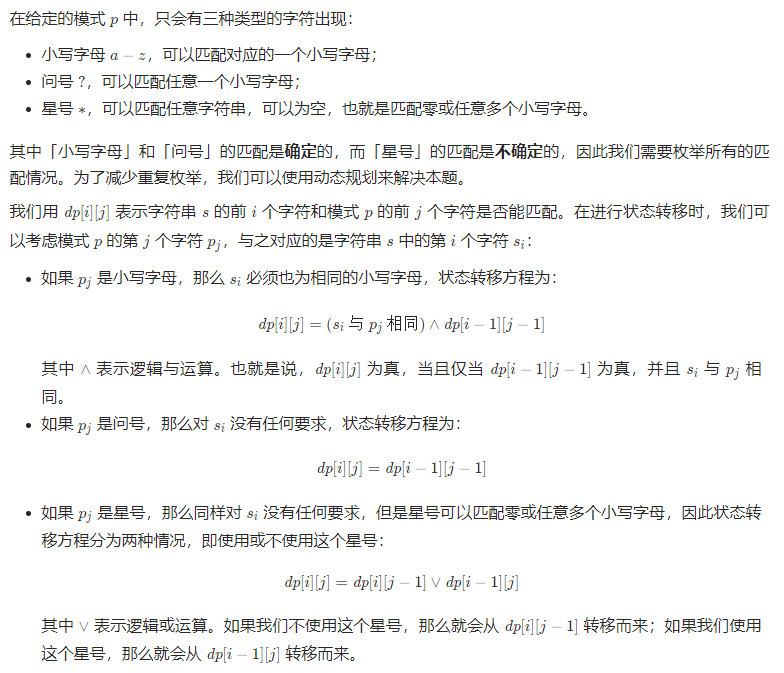 \
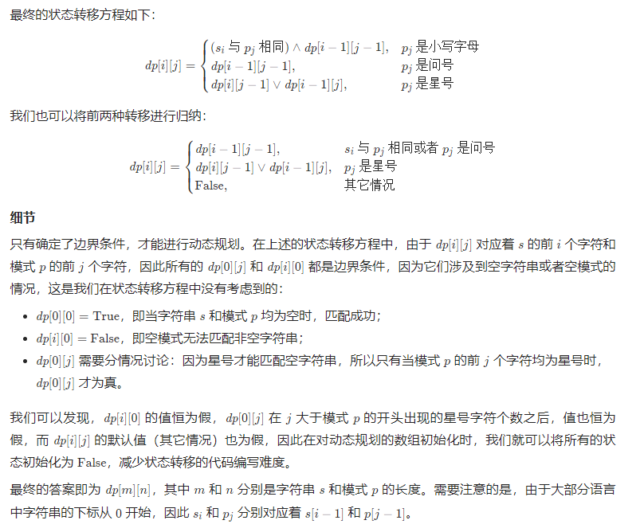

```go
func isMatch(s string, p string) bool {
    ns, np := len(s), len(p)
    dp := make([][]bool, ns+1) // 0 位保存长度为0的结果， ns位保存尾部匹配结果
    for i := range dp{
        dp[i] = make([]bool, np+1)
    }

    dp[0][0] = true // 长度均为 0 时，返回真
    for j := 1; j <= np; j++{ // 对于 s 为 0的情况，如果p的前j项为*，则j+1均为真
        if p[j-1] == '*'{
            dp[0][j] = true
        } else{
            break
        }
    }

    for i := 1; i <= ns; i++{
        for j := 1; j <= np; j++{
            if p[j-1] == '*'{ // 对于 * ，我们可以用或不用
                dp[i][j] = dp[i-1][j] || dp[i][j-1]
            } else if p[j-1] == '?' || p[j-1] == s[i-1]{
                dp[i][j] = dp[i-1][j-1]
            }
        }
    }
    return dp[ns][np]
}
```

思路2：贪心算法 \
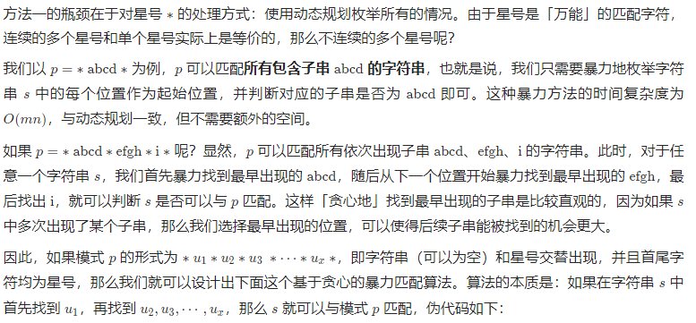
```go
// 我们用 sIndex 和 pIndex 表示当前遍历到 s 和 p 的位置
// 此时我们正在 s 中寻找某个 u_i
// 其在 s 和 p 中的起始位置为 sRecord 和 pRecord

// sIndex 和 sRecord 的初始值为 0
// 即我们从字符串 s 的首位开始匹配
sIndex = sRecord = 0

// pIndex 和 pRecord 的初始值为 1
// 这是因为模式 p 的首位是星号，那么 u_1 的起始位置为 1
pIndex = pRecord = 1

while sIndex < s.length and pIndex < p.length do
    if p[pIndex] == '*' then
        // 如果遇到星号，说明找到了 u_i，开始寻找 u_i+1
        pIndex += 1
        // 记录下起始位置
        sRecord = sIndex
        pRecord = pIndex
    else if match(s[sIndex], p[pIndex]) then
        // 如果两个字符可以匹配，就继续寻找 u_i 的下一个字符
        sIndex += 1
        pIndex += 1
    else if sRecord + 1 < s.length then
        // 如果两个字符不匹配，那么需要重新寻找 u_i
        // 枚举下一个 s 中的起始位置
        sRecord += 1
        sIndex = sRecord
        pIndex = pRecord
    else
        // 如果不匹配并且下一个起始位置不存在，那么匹配失败
        return False
    end if
end while

// 由于 p 的最后一个字符是星号，那么 s 未匹配完，那么没有关系
// 但如果 p 没有匹配完，那么 p 剩余的字符必须都是星号
```
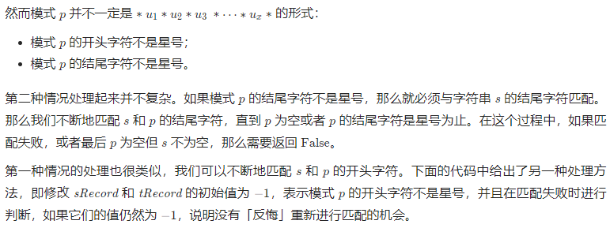
```go
func isMatch(s string, p string) bool {
    ns, np := len(s), len(p)
    for ; ns > 0 && np > 0 && p[np-1] != '*'; ns, np = len(s), len(p){
        if charMatch(s[len(s)-1], p[len(p)-1]){
            s = s[:ns-1]
            p = p[:np-1]
        } else{
            return false
        }
    }
    if np == 0{
        return ns == 0
    }

    si, pi := 0, 0
    sr, pr := -1, -1
    for si < ns && pr < np{
        if p[pi] == '*'{
            pi++
            sr, pr = si, pi
        } else if charMatch(s[si], p[pi]){
            si++
            pi++
        } else if sr != -1 && sr+1 < ns{ // 回到有 * 的起点
            sr++
            si, pi = sr, pr
        } else{
            return false
        }
    }
    return allStars(p, pi, np)
}

func charMatch(s, p byte) bool{
    return s == p || p == '?'
}

func allStars(p string, start, end int) bool{
    for _, v := range p[start:end]{
        if v != '*'{
            return false
        }
    }
    return true
}
```
## [214. 最短回文串](https://leetcode-cn.com/problems/shortest-palindrome/)
给定一个字符串 s，你可以通过在字符串前面添加字符将其转换为回文串。找到并返回可以用这种方式转换的最短回文串。

> 示例 1： \
> 输入：s = "aacecaaa" \
> 输出："aaacecaaa"
>
> 示例 2： \
> 输入：s = "abcd" \
> 输出："dcbabcd"

思路：从中间往左侧寻找回文字段
- 要求回文左侧要在字符串头
- 字符串可能是奇数或偶数，那么中间字段取值不同
- 回文长度也存在奇偶性
```go
func shortestPalindrome(s string) string {
    n := len(s)
    if n < 2{
        return s
    }
    mid := n/2 + n%2
    end := 0
    for i := mid-1; i >= 0; i--{
        start1, end1 := expandPali(s, i, i, n) // 回文数目为奇数
		start2, end2 := expandPali(s, i, i+1, n) // 回文数目为偶数
        if start1 == 0 && start2 == 0{
            if end1 > end2{
                end = end1
            } else{
                end = end2
            }
            break
        } else if start1 == 0{
            end = end1
            break
        } else if start2 == 0{
            end = end2
            break
        }
    }
    
    if end == n-1{
        return s
    }
    ans := strings.Split(s[end+1:], "") // 字符串转换为数组
    for left, right := 0, len(ans)-1; left < right; left, right = left+1, right-1{
        ans[left], ans[right] = ans[right],ans[left]
    }
    return strings.Join(ans, "") + s // 数组转换为字符串
}

func expandPali(s string,start, end, n int) (int, int){
	for ; start >= 0 && end < n && s[start] == s[end]; start, end = start-1, end+1{}
	return start+1, end-1
}
```
同思路
```go
func shortestPalindrome(s string) string {
	n := len(s)
    if n < 2{
        return s
    }
	right := 1
	for j := 0+2; j <= n; j++{  // 每次只对比 大于目前最大回文长度 的字符串
		if isPali(s[0:j]){
			right = j
		}
	}
    if right == n{
        return s
    }
    b := strings.Split(s[right:], "")
    for l, r := 0, n-right-1; l < r; l, r = l+1, r-1{
        b[l], b[r] = b[r], b[l]
    }
	return strings.Join(b,"") + s
}


func isPali(s string) bool{
	for i := 0; i < len(s)/2; i++{
		if s[i] != s[len(s)-1-i]{
			return false
		}
	}
	return true
}
```

思路2：字符串哈希
- 如何以O(n)的复杂度求出从头开始的最长回文串?
- 从左往右遍历，计算当前这个子串 s[1, i]s[1,i] 的正向 p 进制的哈希值 forward 和反向 p 进制表示哈希值 backward，如果两者相同，说明当前子串是个回文串。
```go
func shortestPalindrome(s string) string {
    var q, forward, backward uint64
    const P uint64 = 131
    q = 1
    right := 0
    forward = 0
    backward = 0
    n := len(s)
    if n < 2{
        return s
    }
    for i := 0; i < n; i++{
        v := uint64(s[i]-'a')
        forward = forward*P + v   // p进制，高位在前
        backward = backward + v*q // p进制，高位在后
        q = q*P
        if forward == backward{ // 说明当前是一个从头开始的回文串
            right = i
        }
    }
    if right == n-1{
        return s
    }
    ans := strings.Split(s[right+1:], "") // 字符串转换为数组
    for left, right := 0, len(ans)-1; left < right; left, right = left+1, right-1{
        ans[left], ans[right] = ans[right],ans[left]
    }
    return strings.Join(ans, "") + s // 数组转换为字符串
}
```
思路3：前缀和 kmp算法
- 关键代码：反转后的尾部 同 反转前的头部，最大的重叠区间
- 那么，不相同的反转头部，为最小字符串
- 转换为`kmp`算法，则 `s + "#" + rs`，求 next
- 则最后一个字母的前缀和，对应与 s 的头部重叠区间
```go
	for ; i < l; i++ {
		if rs[i:] == s[:l-i] {
			break
		}
	}
```
s 为`aacecaaa`，rs 为 `aaacecaa`
```go
rs - aaacecaa
s  -  aacecaaa
```
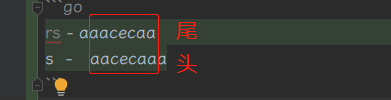 \
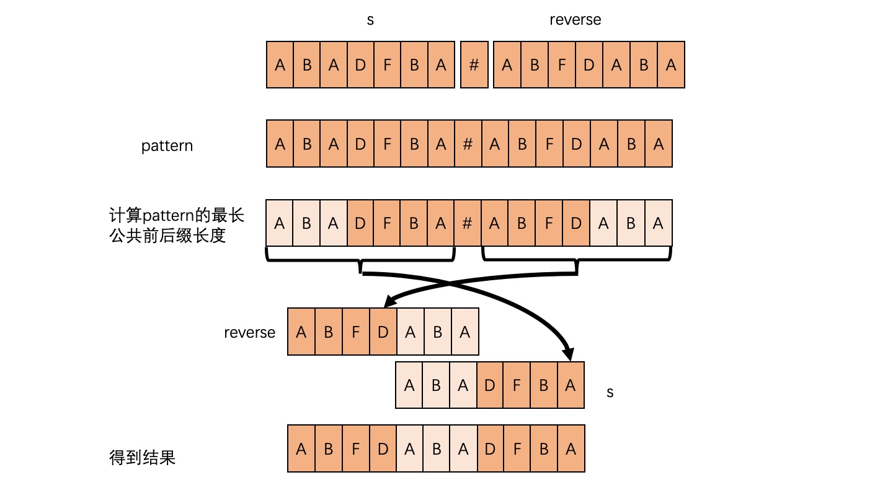

```go
func shortestPalindrome(s string) string {
	n := len(s)
	pattern := s+ "#" + reverserStr(s)
	n = n*2+1
	next := make([]int, n)
	getNext(pattern, next)
	return pattern[len(s)+1:n-next[n-1]] + s
}

func getNext(s string, next []int) {
	j := 0
	next[0] = j
	n := len(s)
	for i := 1; i < n; i++{
		for j > 0 && s[i] != s[j]{
			j = next[j-1]
		}
		if s[i] == s[j]{
			j++
		}
		next[i] = j
	}
}
func reverserStr(x string) string {
	res := strings.Builder{}
	for i := len(x) - 1; i >= 0; i-- {
		res.WriteByte(x[i])
	}
	return res.String()
}
```
## [369. 给单链表加一](https://leetcode-cn.com/problems/plus-one-linked-list/)
给定一个用链表表示的非负整数， 然后将这个整数 再加上 1 。 \
这些数字的存储是这样的：最高位有效的数字位于链表的首位 head 。

> 示例 1: \
> 输入: head = [1,2,3] \
> 输出: [1,2,4]
>
> 示例 2: \
> 输入: head = [0] \
> 输出: [1]

思路：利用数组进位
```go
func plusOne(head *ListNode) *ListNode {
    prev := head
    nums := []int{}
    for prev != nil{ // 将链表展开为数组，便于进位计算
        nums = append(nums, prev.Val)
        prev = prev.Next
    }
    carry := 0 // 进位
    for i := len(nums)-1; i >= 0; i--{
        if nums[i] == 9{
            nums[i] = 0
            carry = 1
        } else{
            nums[i] += 1
            carry = 0
        }
        if carry == 0{
            break
        }
    }
    if carry == 1{
        head = &ListNode{Val:1}
        prev = head
    } else{
        head = &ListNode{Val: nums[0]}
        prev= head
        nums = nums[1:]
    }
    for len(nums) > 0{
        prev.Next = &ListNode{Val: nums[0]}
        prev = prev.Next
        nums = nums[1:]
    }
    return head
}
```
思路：哨兵头节点 \
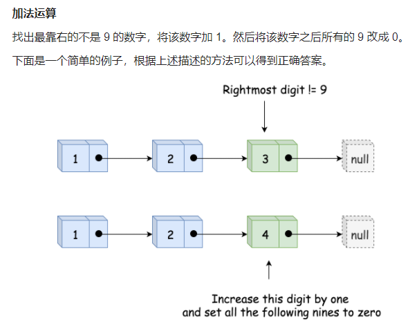 \
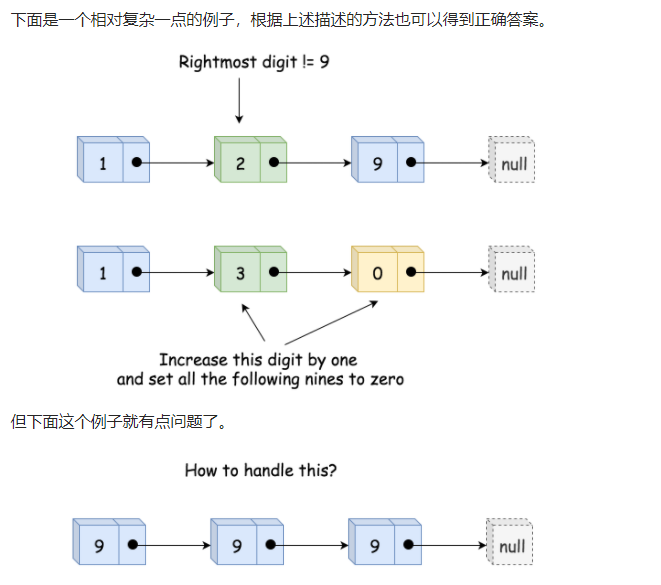 \
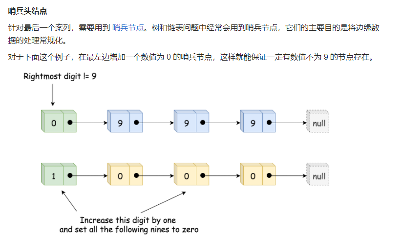 
- 初始化哨兵节点 ListNode(0)，同时将它设为新的头节点：sentinel.next = head。
- 找到最靠右的数值不为 9 的节点。
- 将该节点的数值加 1。
- 将该节点之后所有节点数值改为 0。
- 如果哨兵节点的数值为 1，直接返回哨兵节点，否则返回原始头节点 sentinel.next。

```go
func plusOne(head *ListNode) *ListNode {
    ans := &ListNode{Val: 0,Next: head}
    notNine := ans // 初始值为 0 的新节点
    for head != nil{ // 找到最右侧值不为 9 的节点
        if head.Val != 9{
            notNine = head
        }
        head = head.Next
    }
    notNine.Val++ // 最右侧不为9的节点值 +1
    notNine = notNine.Next
    for notNine != nil{ // 将该值右侧所有节点值置为 0
        notNine.Val = 0
        notNine = notNine.Next
    }
    if ans.Val == 0{
        return ans.Next
    }
    return ans
}
```
## [148. 排序链表](https://leetcode-cn.com/problems/sort-list/)
给你链表的头结点 head ，请将其按 升序 排列并返回 排序后的链表 。

> 示例 1： \
>  \
> 输入：head = [4,2,1,3] \
> 输出：[1,2,3,4]
>
> 示例 2： \
>  \
> 输入：head = [-1,5,3,4,0] \
> 输出：[-1,0,3,4,5]
>
> 示例 3： \
> 输入：head = [] \
> 输出：[]

思路1：冒泡排序，时间复杂度如下 \
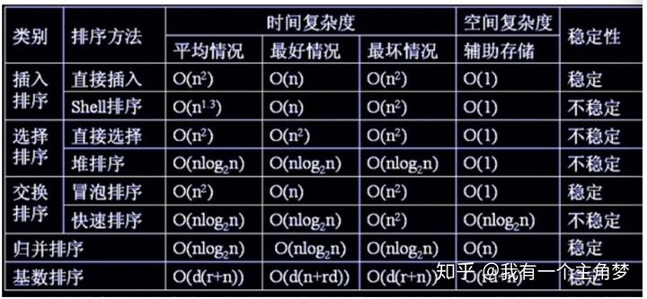 \
在本题中超时
```go
func sortList(head *ListNode) *ListNode {
    ans := &ListNode{Next: head}
    prev := ans
    for {
        isChanged := false
        for prev.Next != nil && prev.Next.Next != nil{
            if prev.Next.Next.Val < prev.Next.Val{
                // 链表交换节点，多用变量，不要用多项赋值
                // 如：prev.Next, prev.Next.Next = prev.Next.Next, prev.Next
                tail := prev.Next.Next.Next
                nextOne := prev.Next
                nextTwo := prev.Next.Next
                prev.Next = nextTwo
                prev.Next.Next = nextOne
                prev.Next.Next.Next = tail
                isChanged = true
            }
            prev = prev.Next
        }
        if !isChanged{
            break
        }
        prev = ans
    }
    return ans.Next
}
```

思路2：队列
```go
func sortList(head *ListNode) *ListNode {
    nodes := []int{}
    for head != nil{
        nodes = append(nodes, head.Val)
        head = head.Next
    }
    if len(nodes) == 0{
        return head
    }
    sort.Ints(nodes)
    ans := &ListNode{Val: nodes[0]}
    nodes = nodes[1:]
    prev := ans
    for len(nodes) > 0{
        prev.Next = &ListNode{Val: nodes[0]}
        prev = prev.Next
        nodes = nodes[1:]
    }
    return ans
}
```

思路3：最小堆
- 排序用冒泡的方式
```go
func sortList(head *ListNode) *ListNode {
    h := &hp{}
    for head != nil{
        heap.Push(h, head.Val)
        head = head.Next
    }
    if h.Len() == 0{
        return head
    }
    ans := &ListNode{Val: heap.Pop(h).(int)}
    prev := ans
    for h.Len() > 0{
        prev.Next = &ListNode{Val: heap.Pop(h).(int)}
        prev = prev.Next
    }
    return ans
}

type hp []int
func (h hp)Len() int{return len(h)}
func (h hp)Less(i, j int) bool {return h[i] < h[j]}
func (h hp)Swap(i,j int){h[i], h[j] = h[j], h[i]}
func (h *hp) Push(v interface{}){*h = append(*h, v.(int))}
func (h *hp) Pop() (v interface{}) { a := *h; *h, v = a[:len(a)-1], a[len(a)-1]; return }
```

## [138. 复制带随机指针的链表](https://leetcode-cn.com/problems/copy-list-with-random-pointer/)
给你一个长度为 n 的链表，每个节点包含一个额外增加的随机指针 random ，该指针可以指向链表中的任何节点或空节点。

构造这个链表的 深拷贝。 深拷贝应该正好由 n 个 全新 节点组成，其中每个新节点的值都设为其对应的原节点的值。新节点的 next 指针和 random 指针也都应指向复制链表中的新节点，并使原链表和复制链表中的这些指针能够表示相同的链表状态。复制链表中的指针都不应指向原链表中的节点 。

例如，如果原链表中有 X 和 Y 两个节点，其中 X.random --> Y 。那么在复制链表中对应的两个节点 x 和 y ，同样有 x.random --> y 。

返回复制链表的头节点。

用一个由 n 个节点组成的链表来表示输入/输出中的链表。每个节点用一个 [val, random_index] 表示：
- val：一个表示 Node.val 的整数。
- random_index：随机指针指向的节点索引（范围从 0 到 n-1）；如果不指向任何节点，则为  null 。

你的代码 只 接受原链表的头节点 head 作为传入参数。

> 示例 1： \
>  \
> 输入：head = [[7,null],[13,0],[11,4],[10,2],[1,0]] \
> 输出：[[7,null],[13,0],[11,4],[10,2],[1,0]]
>
> 示例 2： \
>  \
> 输入：head = [[1,1],[2,1]] \
> 输出：[[1,1],[2,1]]
>
> 示例 3： \
>  \
> 输入：head = [[3,null],[3,0],[3,null]] \
> 输出：[[3,null],[3,0],[3,null]]

思路：通过队列+hash表存储random信息
```go
func copyRandomList(head *Node) *Node {
    if head == nil{
        return head
    }
    ans := &Node{Val: head.Val}
    prevH := head.Next
    prev := ans
    mp := make(map[*Node]int)
    i := 0
    mp[head] = i
    rans := []*Node{ans}
    for prevH != nil{
        prev.Next = &Node{Val: prevH.Val}
        i++
        mp[prevH] = i
        prevH = prevH.Next
        prev = prev.Next
        rans = append(rans, prev)
    }
    prev = ans
    for head != nil{
        if head.Random == nil{
            prev.Random = nil
        } else{
            prev.Random = rans[mp[head.Random]]
        }
        head = head.Next
        prev = prev.Next
    }
    return ans
}
```

## [430. 扁平化多级双向链表](https://leetcode-cn.com/problems/flatten-a-multilevel-doubly-linked-list/)
你会得到一个双链表，其中包含的节点有一个下一个指针、一个前一个指针和一个额外的 子指针 。这个子指针可能指向一个单独的双向链表，也包含这些特殊的节点。这些子列表可以有一个或多个自己的子列表，以此类推，以生成如下面的示例所示的 多层数据结构 。 \
给定链表的头节点 head ，将链表 扁平化 ，以便所有节点都出现在单层双链表中。让 curr 是一个带有子列表的节点。子列表中的节点应该出现在扁平化列表中的 curr 之后 和 curr.next 之前 。 \
返回 扁平列表的 head 。列表中的节点必须将其 所有 子指针设置为 null 。

数据结构
```go
/**
 * Definition for a Node.
 * type Node struct {
 *     Val int
 *     Prev *Node
 *     Next *Node
 *     Child *Node
 * }
 */
```
> 示例 1： \
>  \
> 输入：head = [1,2,3,4,5,6,null,null,null,7,8,9,10,null,null,11,12] \
> 输出：[1,2,3,7,8,11,12,9,10,4,5,6] \
> 解释：输入的多级列表如上图所示。 \
> 扁平化后的链表如下图： \
>  
>
> 示例 2： \
> 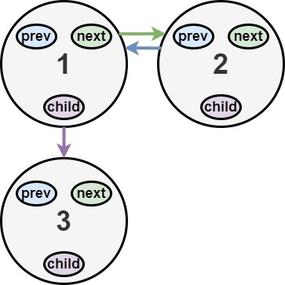 \
> 输入：head = [1,2,null,3] \
> 输出：[1,3,2] \
> 解释：输入的多级列表如上图所示。 \
> 扁平化后的链表如下图： \
>  
>
> 示例 3： \
> 输入：head = [] \
> 输出：[] \
> 说明：输入中可能存在空列表。

思路1：队列辅助
```go
func flatten(root *Node) *Node {
    if root == nil{
        return root
    }
    ns := []*Node{}
    getNodes(root, &ns)
    var ans, cur *Node
    for i := 0; i < len(ns); i++{ // 不断展开 子节点
        if ns[i].Child != nil{
            tem := []*Node{}
            root = ns[i].Child
            ns[i].Child = nil
            getNodes(root, &tem)
            tem = append(tem, ns[i+1:]...)
            ns = append(ns[:i+1], tem...)
        }
        if i == 0{
            ans = ns[0]
            cur = ans
            continue
        }
        cur.Next = ns[i]
        cur = cur.Next
    }
    cur = ans
    for cur != nil && cur.Next != nil{
        cur.Next.Prev = cur
        cur = cur.Next
    }
    return ans
}
// 数组指针的传递 & 使用
func getNodes(root *Node, ns *[]*Node){
    for root!= nil{
        *ns = append(*ns, root)
        root = root.Next
    }
}
```
思路2：递归
```go
func flatten(root *Node) *Node {
    if root == nil {
        return root
    }
    ans := root
    for root != nil{
        if root.Child != nil{
            tail := root.Next
            root.Next = flatten(root.Child)
            root.Next.Prev = root
            root.Child = nil
            for root.Next != nil{
                root = root.Next
            }
            if tail != nil{
                tail.Prev = root
                root.Next = tail
            }
        }
        root = root.Next
    }
    return ans
}
```

## [281. 锯齿迭代器](https://leetcode-cn.com/problems/zigzag-iterator/)
给出两个一维的向量，请你实现一个迭代器，交替返回它们中间的元素。

> 示例: \
> 输入: \
> v1 = [1,2] \
> v2 = [3,4,5,6] \
> 输出: [1,3,2,4,5,6] \
> 解析: 通过连续调用 next 函数直到 hasNext 函数返回 false，next 函数返回值的次序应依次为: [1,3,2,4,5,6]。

```go
type ZigzagIterator struct {
    Nums []int
}

func Constructor(v1, v2 []int) *ZigzagIterator {
    ns := []int{}
    i := 0
    for len(v1) > 0 && len(v2) > 0{
        if i%2 == 0{
            ns = append(ns, v1[0])
            v1 = v1[1:]
        } else{
            ns = append(ns, v2[0])
            v2 = v2[1:]
        }
        i++
    }
    if len(v1) > 0{
        ns = append(ns, v1...)
    } else{
        ns = append(ns, v2...)
    }
    return &ZigzagIterator{Nums: ns}    
}

func (this *ZigzagIterator) next() int {
    ans := this.Nums[0]
    this.Nums = this.Nums[1:]
    return ans
}

func (this *ZigzagIterator) hasNext() bool {
	return len(this.Nums) > 0
}
```

## [3. 无重复字符的最长子串](https://leetcode-cn.com/problems/longest-substring-without-repeating-characters/)
给定一个字符串 s ，请你找出其中不含有重复字符的 最长子串 的长度。

> 示例 1: \
> 输入: s = "abcabcbb" \
> 输出: 3 \
> 解释: 因为无重复字符的最长子串是 "abc"，所以其长度为 3。
>
> 示例 2: \
> 输入: s = "bbbbb" \
> 输出: 1 \
> 解释: 因为无重复字符的最长子串是 "b"，所以其长度为 1。
>
> 示例 3: \
> 输入: s = "pwwkew" \
> 输出: 3 \
> 解释: 因为无重复字符的最长子串是 "wke"，所以其长度为 3。 \
> 请注意，你的答案必须是 子串 的长度，"pwke" 是一个子序列，不是子串

思路：hash法
```go
func lengthOfLongestSubstring(s string) int {
    mp := make(map[byte]int) // 记录字符最后出现的位置
    n := len(s)
    maxL := 0
    for l, r := 0, 0; r < n && l < n; r++{
        if v, ok := mp[s[r]]; ok && v >= l{ // 也要保证 hash表中的值在窗口内，窗口外的不作数
            l = mp[s[r]]+1
            if n-l <= maxL{
                break
            }
        } else{
            if r-l+1 > maxL{
                maxL = r-l+1
            }
        }
        mp[s[r]] = r
    }
    return maxL
}
```

## [739. 每日温度](https://leetcode-cn.com/problems/daily-temperatures/)
给定一个整数数组 temperatures ，表示每天的温度，返回一个数组 answer ，其中 answer[i] 是指在第 i 天之后，才会有更高的温度。如果气温在这之后都不会升高，请在该位置用 0 来代替。
> 30 <= temperatures[i] <= 100

> 示例 1: \
> 输入: temperatures = [73,74,75,71,69,72,76,73] \
> 输出: [1,1,4,2,1,1,0,0]
>
> 示例 2: \
> 输入: temperatures = [30,40,50,60] \
> 输出: [1,1,1,0]
>
> 示例 3: \
> 输入: temperatures = [30,60,90] \
> 输出: [1,1,0]

思路：用数组做温度的hash表
```go
func dailyTemperatures(temperatures []int) []int {
    temIn := make([]int, 101) // 温度hash表
    n := len(temperatures)
    ans := make([]int, n)
    for i := n-1; i >= 0; i--{ // 从尾部迭代
        temIn[temperatures[i]] = i
        if i == n-1{
            continue
        }
        ans[i] = getHighRight(temperatures[i], temIn, i)
    }
    return ans
}

func getHighRight(temp int, temIn []int, i int) int{
    ans := 1000000
    for _, v := range temIn[temp+1:]{ // 温度hash表迭代
        if v != 0 && v-i < ans{
            ans = v-i
            if ans == 1{
                return ans
            }
        }
    }
    if ans == 1000000{
        return 0
    }
    return ans
}
```

## [42. 接雨水](https://leetcode-cn.com/problems/trapping-rain-water/)
给定 n 个非负整数表示每个宽度为 1 的柱子的高度图，计算按此排列的柱子，下雨之后能接多少雨水。

> 示例 1： \
>  \
> 输入：height = [0,1,0,2,1,0,1,3,2,1,2,1] \
> 输出：6 \
> 解释：上面是由数组 [0,1,0,2,1,0,1,3,2,1,2,1] 表示的高度图，在这种情况下，可以接 6 个单位的雨水（蓝色部分表示雨水）。
>
> 示例 2： \
> 输入：height = [4,2,0,3,2,5] \
> 输出：9

思路：动态规划法 \
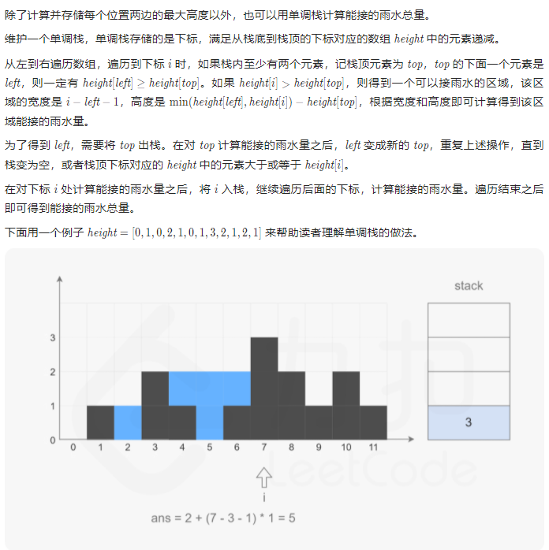
```go
func trap(height []int) int {
    n := len(height)
    if n < 3{
        return 0
    }

    rightMax := make([]int, n)
    rightMax[n-1] = height[n-1]
    for i := n-2; i >= 0; i--{
        rightMax[i] = max(height[i], rightMax[i+1])
    }

    leftMax := make([]int, n)
    leftMax[0] = height[0]
    for i := 1; i < n; i++{
        leftMax[i] = max(height[i], leftMax[i-1])
    }

    ans := 0
    for i, h := range height{
        ans += min(leftMax[i], rightMax[i])-h
    }
    return ans
}

func max(a, b int)int{
    if a < b{
        return b
    }
    return a
}
func min(a, b int)int{
    if a < b{
        return a
    }
    return b
}
```
思路2：栈 \

```go
func trap(height []int) int {
    n := len(height)
    if n < 3{
        return 0
    }
    ans := 0
    stack := []int{}
    ns := 0 // 栈长度
    for i, h := range height{
        for ns > 0 && h > height[stack[ns-1]]{
            top := stack[ns-1]
            stack = stack[:ns-1]
            ns--
            if ns == 0{
                break
            }
            left := stack[ns-1]
            curHeight := min(h, height[left]) - height[top]
            curWidth := i-left-1
            ans += curHeight*curWidth
        }
        stack = append(stack, i)
        ns++
    }
    return ans
}

func min(a, b int)int{
    if a < b{
        return a
    }
    return b
}
```

## [402. 移掉 K 位数字](https://leetcode-cn.com/problems/remove-k-digits/)
给你一个以字符串表示的非负整数 num 和一个整数 k ，移除这个数中的 k 位数字，使得剩下的数字最小。请你以字符串形式返回这个最小的数字。

> 示例 1 ：
> 输入：num = "1432219", k = 3
> 输出："1219"
> 解释：移除掉三个数字 4, 3, 和 2 形成一个新的最小的数字 1219 。
>
> 示例 2 ：
> 输入：num = "10200", k = 1
> 输出："200"
> 解释：移掉首位的 1 剩下的数字为 200. 注意输出不能有任何前导零。
>
> 示例 3 ：
> 输入：num = "10", k = 2
> 输出："0"
> 解释：从原数字移除所有的数字，剩余为空就是 0 。
>
> 示例 4 ：
> 输入：num = "115", k = 1
> 输出："11"

思路：贪心+栈
- 每次填充前，先将所有大于自身的前值删去
- 注意甄别：可能存在一次遍历后，删减位数不够的情况，需要将k删减完
- 注意，保留的值，长度可能为0
```go
func removeKdigits(num string, k int) string {
    stack := make([]byte, 0, len(num))
    n := 0 // stack 长度
    for i,_ := range num{ 
        for n > 0 && num[i] < stack[n-1] && k > 0{ // 形成了小到大的排序
            stack = stack[:n-1]
            n--
            k--
        }
        stack = append(stack, num[i])
        n++
    }
    for k > 0 && n > 0{
        stack = stack[:n-1]
        n--
        k--
    }
    for n > 0 && stack[0] == '0'{
        stack = stack[1:]
        n--
    }
    if n == 0{
        return "0"
    }
    return string(stack)
}
```
## [456. 132 模式](https://leetcode-cn.com/problems/132-pattern/)
给你一个整数数组 nums ，数组中共有 n 个整数。132 模式的子序列 由三个整数 nums[i]、nums[j] 和 nums[k] 组成，并同时满足：i < j < k 和 nums[i] < nums[k] < nums[j] 。 \
如果 nums 中存在 132 模式的子序列 ，返回 true ；否则，返回 false 。

> 示例 1： \
> 输入：nums = [1,2,3,4] \
> 输出：false \
> 解释：序列中不存在 132 模式的子序列。
>
> 示例 2： \
> 输入：nums = [3,1,4,2] \
> 输出：true \
> 解释：序列中有 1 个 132 模式的子序列： [1, 4, 2] 。
>
> 示例 3： \
> 输入：nums = [-1,3,2,0] \
> 输出：true \
> 解释：序列中有 3 个 132 模式的的子序列：[-1, 3, 2]、[-1, 3, 0] 和 [-1, 2, 0] 。

思路：枚举1
- 题目要求满足132模式，132模式的规律是： nums [i, ..., j..., k] i < k < j
- 如果要达到132模式，至少得满足得存在三个数字 分别为 min， max， mid，而且是min， max， mid这个顺序不能调换
- 我们从右向左遍历，用单调栈，具体来说是单调递增栈，每个元素入栈，在入栈之前只要栈顶元素比当前元素小就出栈，这样保证了栈的单调递增性
- 为什么要用单调栈呢，因为我们要找到132模式中的次大者，单调栈中栈顶元素永远是最大值，这时，如果再遇到一个元素比栈顶元素还大，那栈顶元素是不是就是次大者
- 这时，如果再遇到一个比次大者还小的元素，是不是就满足了132模式。而且我们是按照数组从右到左遍历的顺序
```go
func find132pattern(nums []int) bool {
	stack := make([]int, 0, len(nums))
	ns := 0
	maxK := math.MinInt // 存放132模式中的次大值
	for i := len(nums)-1; i >= 0; i--{
		if nums[i] < maxK{
			return true
		}
		// 如果栈中有值，并且栈顶的值还小于当前元素
		// 此时，有了nums[j](nums[i]值) & nums[k](栈顶值)
		// 只要栈顶比当前元素小就出栈，保证了栈内元素是升序的，栈顶是【栈中】最大值
		for ns > 0 && stack[ns-1] < nums[i] {
			// 保存次大值
			maxK = stack[ns-1]
			stack = stack[:ns-1]
			ns--
		}
		stack = append(stack, nums[i])
		ns++
	}
	return false
}
```