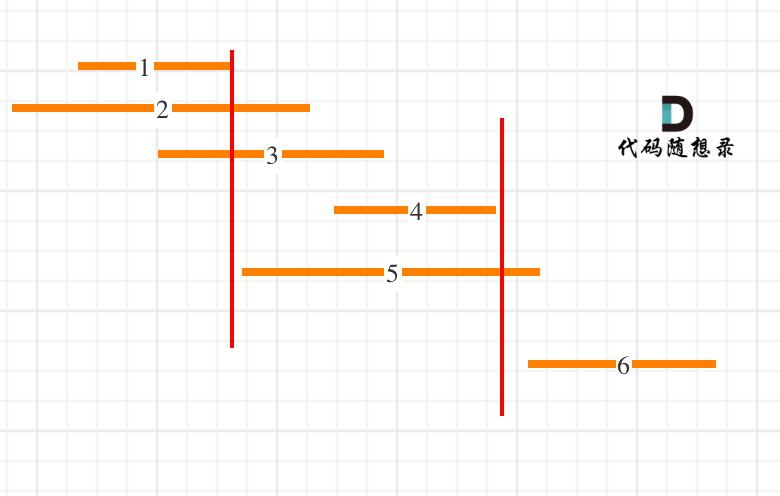

# 基础
## [136. 只出现一次的数字](https://leetcode-cn.com/problems/single-number/)
给定一个非空整数数组，除了某个元素只出现一次以外，其余每个元素均出现两次。找出那个只出现了一次的元素。 \
说明：
- 你的算法应该具有线性时间复杂度。 你可以不使用额外空间来实现吗？

> 输入: [2,2,1]\
> 输出: 1

思路1：先排序，再两两比对
```go
func singleNumber(nums []int) int {
    sort.Ints(nums)
    for i:=0;i<len(nums);i+=2{
        if i==len(nums)-1 || nums[i] != nums[i+1]{
            return nums[i]
        }
    }
    return 0
}
```
思路2： 使用位运算。对于这道题，可使用异或运算⊕。异或运算有以下三个性质。
- 任何数和0做异或运算，结果仍然是原来的数，即 a⊕0=a。
- 任何数和其自身做异或运算，结果是 0，即a⊕a=0。
- 异或运算满足交换律和结合律，即a⊕b⊕a=b⊕a⊕a=b⊕(a⊕a)=b⊕0=b。
```go
func singleNumber(nums []int) int {
    single := 0
    for _,v:=range nums{
        single ^= v
    }
    return single
}
```

## [169. 多数元素](https://leetcode-cn.com/problems/majority-element/)
给定一个大小为 n 的数组，找到其中的多数元素。多数元素是指在数组中出现次数 大于 n/2 的元素。\
你可以假设数组是非空的，并且给定的数组总是存在多数元素。

思路1：hash表，一旦超过半数则返回
```go
func majorityElement(nums []int) int {
    n := len(nums)
    ht := make(map[int]int)
    for _,v:=range(nums){
        ht[v]++
        if ht[v]>n/2{ // 注意，这里不能等于，如：[2,2,1,1,1,2,2]，等于会返回1，因为7/2=3
            return v
        }
    }
    return 0
}
```

思路2：排序，过半
```go
func majorityElement(nums []int) int {
    sort.Ints(nums)
    return nums[len(nums)/2]
}
```
思路3：投票算法证明：
1. 如果候选人不是maj 则 maj,会和其他非候选人一起反对 会反对候选人,所以候选人一定会下台(maj==0时发生换届选举)
2. 如果候选人是maj , 则maj 会支持自己，其他候选人会反对，同样因为maj 票数超过一半，所以maj 一定会成功当选
```go
func majorityElement(nums []int) int {
    count := 0
    candidate := nums[0]
    for _, v :=range nums{
        if count == 0{
            candidate = v
        }
        if candidate == v{
            count++
        } else{
            count--
        }
    }
    return candidate
}
```
## [15. 三数之和](https://leetcode-cn.com/problems/3sum/)
给你一个包含 n 个整数的数组 nums，判断 nums 中是否存在三个元素 a，b，c ，使得 a + b + c = 0 ？请你找出所有和为 0 且不重复的三元组。\
注意：答案中不可以包含重复的三元组。
> 示例 1：
> 输入：nums = [-1,0,1,2,-1,-4] \
> 输出：[[-1,-1,2],[-1,0,1]]
>
> 示例 2： \
> 输入：nums = []\
> 输出：[]
>
> 示例 3：\
> 输入：nums = [0]\
> 输出：[]
1. 特判，对于数组长度 n，如果数组为 null 或者数组长度小于 3，返回[]。
2. 对数组进行排序。
3. 遍历排序后数组：
- 若 `nums[i]>0`：因为已经排序好，所以后面不可能有三个数加和等于 0，直接返回结果。
- 对于重复元素：跳过，避免出现重复解
- 令左指针 `L=i+1`，右指针 `R=n-1`，当 `L<R` 时，执行循环：
   - 当 `nums[i]+nums[L]+nums[R]==0`，执行循环，判断左界和右界是否和下一位置重复，去除重复解。并同时将 L,RL,R 移到下一位置，寻找新的解
   - 若和大于 0，说明 `nums[R]` 太大，R 左移
   - 若和小于 0，说明 `nums[L]` 太小，L 右移
```go
func threeSum(nums []int) [][]int {
    ans := make([][]int, 0)
    n := len(nums)
    sort.Ints(nums) // 排序，让可能相同的值聚合在一起
    for firstI := 0; firstI < n; firstI++{
        if firstI > 0 && nums[firstI] == nums[firstI-1]{ // 跳过相同的首位值
            continue
        }
        thirdI := n-1
        target := -1*nums[firstI]
        if target<0{
            break
        }
        for secondI := firstI+1; secondI < n;secondI++{
            if secondI > firstI+1 && nums[secondI] == nums[secondI-1]{ // 跳过相同的第二位
                continue
            }
            for secondI < thirdI && nums[secondI] + nums[thirdI]>target{ // 跳过第三位大值
            // 这里不需要跳过相同第三位，因为，前面已经保证第一二位组合不会重复，那么第三位也不会重复
                thirdI--
            }
            if secondI == thirdI{ // 说明第二三为组合已经迭代完成
                break
            }
            if nums[secondI]+ nums[thirdI] == target{
                ans = append(ans, []int{nums[firstI], nums[secondI], nums[thirdI]})
            }
        }
    }
    return ans
}
```

## [75. 颜色分类](https://leetcode-cn.com/problems/sort-colors/)
给定一个包含红色、白色和蓝色、共n个元素的数组nums，**原地**对它们进行排序，使得相同颜色的元素相邻，并按照红色、白色、蓝色顺序排列。\
我们使用整数 0、1 和 2 分别表示红色、白色和蓝色。\
必须在**不使用库的sort**函数的情况下解决这个问题。
> 示例 1：\
> 输入：nums = [2,0,2,1,1,0]\
> 输出：[0,0,1,1,2,2]
>
> 示例 2：\
> 输入：nums = [2,0,1]\
> 输出：[0,1,2]

思路1：暴力，通过判断各个值的数目，直接替换
```go
func sortColors(nums []int)  {
    zeroCount := 0
    oneCount := 0
    for _,v := range nums{
        if v == 0{
            zeroCount++
            continue
        }
        if v == 1{
            oneCount++
            continue
        }
    }
    for i,_ := range nums{
        if zeroCount > 0{
            nums[i] = 0
            zeroCount--
            continue
        }
        if oneCount > 0{
            nums[i] = 1
            oneCount--
            continue
        }
        nums[i] = 2
    }
}
```
思路2：单指针 \
我们可以考虑对数组进行两次遍历。
- 在第一次遍历中，我们将数组中所有的 0 交换到数组的头部。
- 在第二次遍历中，我们将数组中所有的 1 交换到头部的 0 之后。
- 此时，所有的 2 都出现在数组的尾部，这样我们就完成了排序。

```go
func sortColors(nums []int)  {
    lastIndex := replace(nums, 0)
    replace(nums[lastIndex:], 1)
}

func replace(nums []int, target int) int{
    lastIndex := 0
    for i, v := range nums{
        if v == target{
            nums[i], nums[lastIndex] = nums[lastIndex], nums[i]
            lastIndex++
        }
    }
    return lastIndex
}
```
思路3：双指针
具体地，我们用指针 p0 来交换 0，p1来交换 1，初始值都为 0。当我们从左向右遍历整个数组时：
- 如果找到了1，那么将其与nums[p1] 进行交换，并将p1向后移动一个位置，这与方法一是相同的；
- 如果找到了0，那么将其与nums[p0]进行交换，并将p0 向后移动一个位置。这样做是正确的吗？
- - 我们可以注意到，因为连续的0之后是连续的1，因此如果我们将0与nums[p0]进行交换，那么我们可能会把一个 1 交换出去。当 p0<p1时，我们已经将一些 11 连续地放在头部，此时一定会把一个 1 交换出去，导致答案错误。
- - 因此，如果 p0<p1 ，那么我们需要再将nums[i] 与 nums[p1] 进行交换，其中 i 是当前遍历到的位置，在进行了第一次交换后，nums[i] 的值为 1，我们需要将这个 1 放到「头部」的末端。在最后，无论是否有p0<p1 ，我们需要将 p0和p1 均向后移动一个位置，而不是仅将p0向后移动一个位置。
```go
func sortColors(nums []int)  {
    zeroI := 0
    oneI := 0
    for i, v := range nums{
        if v == 0{
            nums[i], nums[zeroI] = nums[zeroI], nums[i]
            if zeroI < oneI{
                nums[oneI], nums[i] = nums[i], nums[oneI]
            }
            zeroI++
            oneI++
            continue
        }
        if v == 1{
            nums[i], nums[oneI] = nums[oneI], nums[i]
            oneI++
        }
    }
}
```
思路4：双指针
与思路3类似，我们也可以考虑使用指针 p0 来交换 0，p2来交换2。\
此时，p0 的初始值仍然为0，而 p2 的初始值为 n−1。\
在遍历的过程中，我们需要找出所有的 0 交换至数组的头部，并且找出所有的 2 交换至数组的尾部。\
由于此时其中一个指针 p2 是从右向左移动的，因此当我们在从左向右遍历整个数组时，如果遍历到的位置超过了 p2 ，那么就可以直接停止遍历了。

```go
func sortColors(nums []int)  {
    zeroI := 0
    twoI := len(nums)-1
    for i := 0; i <= twoI; i++{
        for ; i <= twoI && nums[i] == 2;twoI--{
            nums[twoI], nums[i] = nums[i], nums[twoI]
        } 
        if nums[i] == 0{
            nums[zeroI], nums[i] = nums[i], nums[zeroI]
            zeroI++
        }
    }
}
```
## [56. 合并区间](https://leetcode-cn.com/problems/merge-intervals/)
以数组 intervals 表示若干个区间的集合，其中单个区间为 intervals[i] = [starti, endi] 。请你合并所有重叠的区间，并返回 一个不重叠的区间数组，该数组需恰好覆盖输入中的所有区间 。

> 示例 1：\
> 输入：intervals = [[1,3],[2,6],[8,10],[15,18]]\
> 输出：[[1,6],[8,10],[15,18]]\
> 解释：区间 [1,3] 和 [2,6] 重叠, 将它们合并为 [1,6].\
> **注意**，输入可能是[[1,4],[0,0]]
```go
func merge(intervals [][]int) [][]int {
    if len(intervals) < 2{
        return intervals
    }
    // 二维数组排序
    sort.Slice(intervals, func(i, j int) bool {
		return intervals[i][0] < intervals[j][0]//按照每行的第一个元素排序
	})
    ans := [][]int{intervals[0]}
    for _,v := range intervals{
        if ans[len(ans)-1][1] >= v[0]{ // 如果有重叠，则合并
            aLen := len(ans)
            aLast := ans[aLen-1]
            if aLast[1] < v[1]{
                aLast[1] = v[1]
            }
            continue
        }
        ans = append(ans, v) // 没重叠，追加Slice
    }
    return ans
}
```
## [706. 设计哈希映射](https://leetcode-cn.com/problems/design-hashmap/submissions/)
不使用任何内建的哈希表库设计一个哈希映射（HashMap）。

实现 MyHashMap 类：
- MyHashMap() 用空映射初始化对象
- void put(int key, int value) 向 HashMap 插入一个键值对 (key, value) 。如果 key 已经存在于映射中，则更新其对应的值 value 。
- int get(int key) 返回特定的 key 所映射的 value ；如果映射中不包含 key 的映射，返回 -1 。
- void remove(key) 如果映射中存在 key 的映射，则移除 key 和它所对应的 value 。

思路1：简单粗暴
```go
type MyHashMap struct {
	Val [][2]int
}


func Constructor() MyHashMap {
	return MyHashMap{[][2]int{}}
}


func (this *MyHashMap) Put(key int, value int)  {
	if i, ok := this.isExist(key); ok{
		this.Val[i][1] = value
	} else{
		this.Val = append(this.Val,[2]int{key, value})
	}
}


func (this *MyHashMap) isExist(key int) (index int, here bool) {
	here = false
	index = -1
	for i, v := range this.Val{
		if v[0] == key{
			here = true
			index = i
			break
		}
	}
	return
}


func (this *MyHashMap) Get(key int) int {
	for _, v := range this.Val{
		if v[0] == key{
			return v[1]
		}
	}
	return -1
}


func (this *MyHashMap) Remove(key int)  {
	if i, ok := this.isExist(key); ok{
		if len(this.Val)>i+1{
			this.Val = append(this.Val[:i], this.Val[i+1:]...)
		} else{
			this.Val = this.Val[:i]
		}
	}
}
```
思路2：仅hash表
```go
type MyHashMap struct {
    Val map[int]int
}


func Constructor() MyHashMap {
    return MyHashMap{}
}


func (this *MyHashMap) Put(key int, value int)  {
    if this.Val == nil{
        this.Val = make(map[int]int)
    }
    this.Val[key] = value
}


func (this *MyHashMap) Get(key int) int {
    if _, ok := this.Val[key]; ok{
        return this.Val[key]
    }
    return -1
}


func (this *MyHashMap) Remove(key int)  {
    if _, ok := this.Val[key]; !ok{ // 不存在则跳出
        return
    }
    delete(this.Val,key)
}
```

## [119. 杨辉三角 II](https://leetcode-cn.com/problems/pascals-triangle-ii/)
给定一个非负索引 rowIndex，返回「杨辉三角」的第 rowIndex 行。\
在「杨辉三角」中，每个数是它左上方和右上方的数的和。

> 示例 1:\
> 输入: rowIndex = 3\
> 输出: [1,3,3,1]
>
> 示例 2:\
> 输入: rowIndex = 0\
> 输出: [1]

思路1：先生成相应杨辉三角值，再输出对应行
```go
func getRow(rowIndex int) []int {
	ans := make([][]int, rowIndex+1)
	for i := range ans {
		ans[i] = make([]int, i+1)
		ans[i][0], ans[i][i] = 1, 1
		// 利用对称性，对半缩减循环
		for j := 1; j < i/2+1; j++ {
			ans[i][j] = ans[i-1][j-1] + ans[i-1][j]
			ans[i][i-j] = ans[i-1][j-1] + ans[i-1][j]
		}
	}
	return ans[rowIndex]
}
```
思路1优化：注意到对第 i+1 行的计算仅用到了第 i 行的数据，因此可以使用滚动数组的思想优化空间复杂度。
```go
func getRow(rowIndex int) []int {
    var pre, cur []int
    for i := 0; i <= rowIndex; i++ {
        cur = make([]int, i+1)
        cur[0], cur[i] = 1, 1
        for j := 1; j < i; j++ {
            cur[j] = pre[j-1] + pre[j]
        }
        pre = cur
    }
    return pre
}
```
思路2：杨辉三角公式 \

```go
func getRow(rowIndex int) []int {
    row := make([]int, rowIndex+1)
    row[0] = 1
    for i := 1; i <= rowIndex; i++ {
        row[i] = row[i-1] * (rowIndex - i + 1) / i
    }
    return row
}
```

## [48. 旋转图像](https://leetcode-cn.com/problems/rotate-image/)
给定一个 n × n 的二维矩阵 matrix 表示一个图像。请你将图像顺时针旋转 90 度。\
你必须在 原地 旋转图像，这意味着你需要直接修改输入的二维矩阵。请不要 使用另一个矩阵来旋转图像。
> 示例 1：\
>  \
> 输入：matrix = [[1,2,3],[4,5,6],[7,8,9]] \
> 输出：[[7,4,1],[8,5,2],[9,6,3]]
> 
> 示例 2：\
>  \
> 输入：matrix = [[5,1,9,11],[2,4,8,10],[13,3,6,7],[15,14,12,16]] \
> 输出：[[15,13,2,5],[14,3,4,1],[12,6,8,9],[16,7,10,11]]

思路1：借助辅助数组

```go
func rotate(matrix [][]int)  {
    n := len(matrix)
    ans := make([][]int, n)
    for i := range ans{
        ans[i] = make([]int, n)
    }
    for i, row := range matrix{
        for j, v := range row{
            ans[j][n-i-1] = v
        }
    }
    copy(matrix, ans)
}
```
思路2：思路1的公式嵌套推理


```go
func rotate(matrix [][]int)  {
    n := len(matrix)
    for i := 0; i < n/2; i++ {
        for j := 0; j < (n+1)/2; j++ {
            matrix[i][j], matrix[n-j-1][i], matrix[n-i-1][n-j-1], matrix[j][n-i-1] =
                matrix[n-j-1][i], matrix[n-i-1][n-j-1], matrix[j][n-i-1], matrix[i][j]
        }
    }
}
```
思路3：翻转替代 \
 \
 \
如果先对角翻转，再水平翻转，则逆时针旋转90°
```go
func rotate(matrix [][]int)  {
    n := len(matrix)
    // 水平翻转
    for i := 0; i < n / 2; i++{
        matrix[i], matrix[n-i-1] = matrix[n-i-1], matrix[i]
    }
    // 对角翻转
    for i := range matrix{
        for j := 0; j < i; j++{
            matrix[i][j], matrix[j][i] = matrix[j][i], matrix[i][j]
        }
    }
}
```
## [59. 螺旋矩阵 II](https://leetcode-cn.com/problems/spiral-matrix-ii/)
给你一个正整数 n ，生成一个包含 1 到 n2 所有元素，且元素按顺时针顺序螺旋排列的 n x n 正方形矩阵 matrix 。
> 示例 1：\
> 
> 输入：n = 3 \
> 输出：[[1,2,3],[8,9,4],[7,6,5]]

思路1：按层模拟 \
 \
 \
 \
 

```go
func generateMatrix(n int) [][]int {
    matrix := make([][]int, n)
    for i := range matrix{
        matrix[i] = make([]int, n)
    }
    num := 1
    top, right, bottom, left := 0, n-1, n-1, 0
    for top <= bottom && left <= right{
        for col := left; col <= right; col++{
            matrix[top][col] = num
            num++
        }
        for row := top+1; row <= bottom; row++{
            matrix[row][right] = num
            num++
        }
        if top < bottom && left < right{
            for col:= right-1; col >= left; col--{
                matrix[bottom][col] = num
                num++
            }
            for row := bottom-1; row > top; row--{
                matrix[row][left] = num
                num++
            }
        }
        top++
        right--
        bottom--
        left++
    }
    return matrix
}
```

## [240. 搜索二维矩阵 II](https://leetcode-cn.com/problems/search-a-2d-matrix-ii/)
编写一个高效的算法来搜索 m x n 矩阵 matrix 中的一个目标值 target 。该矩阵具有以下特性：
- 每行的元素从左到右升序排列。
- 每列的元素从上到下升序排列。

> 示例 1：\
>  \
> 输入：matrix = [[1,4,7,11,15],[2,5,8,12,19],[3,6,9,16,22],[10,13,14,17,24],[18,21,23,26,30]], target = 5 \
> 输出：true
> 
> 示例 2：\
>  \
> 输入：matrix = [[1,4,7,11,15],[2,5,8,12,19],[3,6,9,16,22],[10,13,14,17,24],[18,21,23,26,30]], target = 20 \
> 输出：false

思路1：倒序
- 凡是行左侧大于target值的均跳过
- 遇到行右侧小于target值的则说明其余行无法匹配
- target在行区间的，用二分法匹配当前行是否有匹配项
```go
func searchMatrix(matrix [][]int, target int) bool {
    if len(matrix) == 0 || len(matrix[0]) == 0{
        return false
    }
    n := len(matrix[0])
    for i := len(matrix)-1; i >=0; i--{
        row := matrix[i]
        if target < row[0]{
            continue
        }
        if target > row[n-1]{
            return false
        }
        if row[0] == target || row[n-1] == target{
            return true
        }
        left, right := 0, n-1
        mid := right/2
        for left <= right{
            if target < row[mid]{
                right = mid-1
                mid = (left+right)/2
                continue
            }
            if target > row[mid]{
                left = mid+1
                mid = (left+right)/2
                continue
            }
            return true
        }
    }
    return false    
}
```
代码优化：使用`sort.SearchInts`方法代替二分法查找值
```go
func searchMatrix(matrix [][]int, target int) bool {
    if len(matrix) == 0 || len(matrix[0]) == 0{
        return false
    }
    n := len(matrix[0])
    for i := len(matrix)-1; i >=0; i--{
        row := matrix[i]
        if target < row[0]{
            continue
        }
        if target > row[n-1]{
            return false
        }
        j := sort.SearchInts(row, target)
        if j < len(row) && row[j] == target{
            return true
        }
    }
    return false    
}
```
## [435. 无重叠区间](https://leetcode-cn.com/problems/non-overlapping-intervals/)
给定一个区间的集合，找到需要移除区间的最小数量，使剩余区间互不重叠。\
注意:
- 可以认为区间的终点总是大于它的起点。
- 区间 [1,2] 和 [2,3] 的边界相互“接触”，但没有相互重叠。
> 示例 1: \
> 输入: [ [1,2], [2,3], [3,4], [1,3] ]\
> 输出: 1 \
> 解释: 移除 [1,3] 后，剩下的区间没有重叠。
> 
> 示例 2: \
> 输入: [ [1,2], [2,3] ] \
> 输出: 0 \
> 解释: 你不需要移除任何区间，因为它们已经是无重叠的了。

思路：贪心算法，[讲解视频](https://www.bilibili.com/video/BV1WK4y1R71x)
- 按照右边界排序，就要从左向右遍历，因为右边界越小越好，只要右边界越小，留给下一个区间的空间就越大，所以从左向右遍历，优先选右边界小的。

```go
func eraseOverlapIntervals(intervals [][]int) int {
	if len(intervals) < 2{
		return 0
	}
	// 以右侧端点排序
	sort.Slice(intervals, func(i, j int) bool{
		return intervals[i][1] < intervals[j][1]
	})
	// 从左往右，贪心算法
	num, end := 1, intervals[0][1]
	for _,v := range intervals[1:]{
		if v[0] >= end{
			num++
			end = v[1]
		}
	}
	return len(intervals)-num
}
```
- 按照左边界排序，就要从右向左遍历，因为左边界数值越大越好（越靠右），这样就给前一个区间的空间就越大，所以可以从右向左遍历。
```go
func eraseOverlapIntervals2(intervals [][]int) int {
	if len(intervals) < 2{
		return 0
	}
	// 以左侧侧端点排序
	sort.Slice(intervals, func(i, j int) bool{
		return intervals[i][0] < intervals[j][0]
	})
	n := len(intervals)
	num := 1
	left := intervals[n-1][0]
	for i := n-2; i >= 0; i--{
		if left >= intervals[i][1]{
			num++
			left = intervals[i][0]
		}
	}
	return n - num
}
```
## [334. 递增的三元子序列](https://leetcode-cn.com/problems/increasing-triplet-subsequence/)
给你一个整数数组 nums ，判断这个数组中是否存在长度为 3 的递增子序列。\
如果存在这样的三元组下标 (i, j, k) 且满足 i < j < k ，使得 nums[i] < nums[j] < nums[k] ，返回 true ；否则，返回 false 。

> 示例 1：\
> 输入：nums = [2,1,5,0,4,6] \
> 输出：true \
> 解释：三元组 (3, 4, 5) 满足题意，因为 nums[3] == 0 < nums[4] == 4 < nums[5] == 6
> 
> 示例 2：\
> 输入：nums = [5,4,3,2,1]\
> 输出：false\
> 解释：不存在满足题意的三元组

思路1：双向遍历
- 作3次遍历
- 前两次遍历分别从左往右、从右往左，双向遍历获取各索引左侧最小、右侧最大值
- 第三次遍历，将当前值与左侧最小、右侧最大值进行对比，符合递增规律的，返回真
```go
func increasingTriplet(nums []int) bool {
    n := len(nums)
    if n < 3{
        return false
    }
    leftMin := make([]int, n) // 记录各个索引值左侧最小值
    rightMax := make([]int, n) // 记录各个索引值右侧最大值
    
    leftMin[0] = nums[0]
    rightMax[n-1] = nums[n-1]

    for i := 1; i < n;i++{
        leftMin[i] = min(leftMin[i-1], nums[i])
    }
    for i := n-2; i >= 0;i--{
        rightMax[i] = max(rightMax[i+1], nums[i])
    }

    for i := 1; i < n-1; i++{
        if nums[i] > leftMin[i] && nums[i] < rightMax[i]{
            return true
        }
    }
    return false
}

func min(a, b int) int{
    if a >= b{
        return b
    }
    return a
}

func max(a, b int) int{
    if a >= b{
        return a
    }
    return b
}
```
思路2：贪心算法\
使用贪心的方法将空间复杂度降到 O(1)。从左到右遍历数组nums，遍历过程中维护两个变量 first 和 second，分别表示递增的三元子序列中的第一个数和第二个数，任何时候都有first<second。\
初始时，first=nums[0]，second=+∞。对于1≤i<n，当遍历到下标 i 时，令 num=nums[i]，进行如下操作：
1. 如果 num>second，则找到了一个递增的三元子序列，返回true；
2. 否则，如果 num>first，则将 second 的值更新为 num；
3. 否则，将 first 的值更新为 num。

如果遍历结束时没有找到递增的三元子序列，返回false。\
上述做法的贪心思想是：为了找到递增的三元子序列，first 和 second 应该尽可能地小，此时找到递增的三元子序列的可能性更大。
```go
func increasingTriplet(nums []int) bool {
    n := len(nums)
    if n < 3{
        return false
    }
    first, second := nums[0], math.MaxInt64
    for i := 1; i < n; i++{
        if nums[i] > second{
            return true
        }
        if nums[i] > first{
            second = nums[i]
        } else{
            first = nums[i]
        }

    }
    return false
}
```
## [238. 除自身以外数组的乘积](https://leetcode-cn.com/problems/product-of-array-except-self/)
给你一个整数数组 nums，返回 数组 answer ，其中 answer[i] 等于 nums 中除 nums[i] 之外其余各元素的乘积 。\
题目数据 保证 数组 nums之中任意元素的全部前缀元素和后缀的乘积都在  32 位 整数范围内。\
请**不要使用除法**，且在 O(n) 时间复杂度内完成此题。
> 其实使用除法还会产生一个问题：数组中存在0值时，先乘后除，需要规避零值

> 示例 1: \
> 输入: nums = [1,2,3,4] \
> 输出: [24,12,8,6]

> 示例 2: \
> 输入: nums = [-1,1,0,-3,3] \
> 输出: [0,0,9,0,0]

思路：双向遍历，左右乘积列表，思路同上一题
- 3次遍历
- 前两次遍历，先后获取当前索引值左侧乘积、右侧乘积
- 最后一次遍历，将当前索引左右乘积相乘，得到目标乘积值
```go
func productExceptSelf(nums []int) []int {
    n := len(nums)
    if n < 2{
        return nums
    }
    leftProd := make([]int, n) // 当前值左侧乘积数组
    rightProd := make([]int, n) // 当前值右侧乘积数组
    leftProd[0] = 1
    rightProd[n-1] = 1
    for i := 1; i < n; i++{
        leftProd[i] = nums[i-1]*leftProd[i-1]
    }
    for i := n-2; i >= 0; i--{
        rightProd[i] = nums[i+1]*rightProd[i+1]
    }

    ans := make([]int, n)
    for i := 0; i < n; i++{
        ans[i] = leftProd[i]*rightProd[i]
    }
    return ans
}
```
优化，在双向遍历中完成左右两侧乘积计算，减少遍历次数和变量
```go
func productExceptSelf(nums []int) []int {
    n := len(nums)
    if n < 2{
        return nums
    }
    ans := make([]int, n)
    ans[0] = 1
    for i := 1; i < n; i++{ // 先获取左侧乘积
        ans[i] = nums[i-1]*ans[i-1]
    }
    r := 1
    for i := n-1; i >= 0; i--{
        ans[i] = ans[i] * r
        r *= nums[i]
    }
    return ans
}
```

## [560. 和为 K 的子数组](https://leetcode-cn.com/problems/subarray-sum-equals-k/)
给你一个整数数组 nums 和一个整数 k ，请你统计并返回该数组中和为 k 的连续子数组的个数。
> 示例 1： \
> 输入：nums = [1,1,1], k = 2 \
> 输出：2
> 
> 示例 2： \
> 输入：nums = [1,2,3], k = 3 \
> 输出：2

思路1：暴力枚举
```go
func subarraySum(nums []int, k int) int {
    count := 0
    for i := 0; i < len(nums); i++{
        sum := 0
        for j := i; j >= 0; j--{
            sum += nums[j]
            if sum == k{
                count++
            }
        }
    }
    return count
}
```
思路2：前项和+hash表法 \

```go
func subarraySum(nums []int, k int) int {
    count := 0
    pre := 0
    mp := map[int]int{} // 记录各个前项和 出现次数
    mp[0] = 1
    for _, v := range nums{
        // 前项和对应公式 mp[pre[j−1]]==mp[pre[i]−k]
        pre += v
        if _, ok := mp[pre-k]; ok{
            count += mp[pre-k]
        }
        mp[pre] += 1
    }
    return count
}
```

## [415. 字符串相加](https://leetcode-cn.com/problems/add-strings/)
给定两个字符串形式的非负整数 num1 和num2 ，计算它们的和并同样以字符串形式返回。\
你不能使用任何內建的用于处理大整数的库（比如 BigInteger）， 也不能直接将输入的字符串转换为整数形式。

> 示例 1： \
> 输入：num1 = "11", num2 = "123" \
> 输出："134"
>
> 示例 2： \
> 输入：num1 = "456", num2 = "77" \
> 输出："533" 
>
> 示例 3： \
> 输入：num1 = "0", num2 = "0" \
> 输出："0"

思路1：通过数组值 & 索引 进行加法运算，代码实现：[stringsAdd](../string/add/test.go) \
优化
- 字符串通过 `len` 获取长度，也可以通过 `下标 i ` 获取对应字符的`byte`值
- 通过字符转换进行加法运算（替代原方法的索引加减运算）
```go
func addStrings2(num1 string, num2 string) string {
	ans := ""
	n1 := len(num1)
	n2 := len(num2)
	if n1 > n2 {
		num2 = fillZero2(n1-n2) + num2
	} else if n1 < n2 {
		num1 = fillZero2(n2-n1) + num1
	}
	n1 = len(num1)
	carry := 0
	for i := n1 - 1; i >= 0; i-- {
		res := carry + int(num1[i]-'0') + int(num2[i]-'0')
		ans = strconv.Itoa(res%10) + ans
		carry = res / 10
	}
	if carry > 0 {
		ans = strconv.Itoa(carry) + ans
	}
	return ans
}

func fillZero2(n int) string {
	zeroStr := ""
	for i := 0; i < n; i++ {
		zeroStr += "0"
	}
	return zeroStr
}
```
终极优化：直接转换为数值进行运算，不补位
```go
func addStrings(num1 string, num2 string) string {
    add := 0
    ans := ""
    for i, j := len(num1)-1, len(num2)-1; i >=0 || j >= 0 || add > 0; i, j = i-1, j-1{
        x, y := 0, 0
        if i >= 0{
            x = int(num1[i]-'0')
        }
        if j >= 0{
            y = int(num2[j]-'0')
        }
        res := add + x + y
        ans = strconv.Itoa(res % 10) + ans
        add = res / 10
    }
    return ans
}
```

## [409. 最长回文串](https://leetcode-cn.com/problems/longest-palindrome/)
给定一个包含大写字母和小写字母的字符串 s ，返回 通过这些字母构造成的 最长的回文串 。\
在构造过程中，请注意 区分大小写 。比如 "Aa" 不能当做一个回文字符串。

> 示例 1: \
> 输入:s = "abccccdd" \
> 输出:7 \
> 解释: 我们可以构造的最长的回文串是"dccaccd", 它的长度是 7。
>
> 示例 2: \
> 输入:s = "a" \
> 输入:1
>
> 示例 3: \
> 输入:s = "bb" \
> 输入: 2

思路1：hash表法
```go
func longestPalindrome(s string) int {
	strMap := make(map[int32]int, 26*2)
	for _, v := range s {
		strMap[v]++
	}
	couldOdd := true
	count := 0
	for _, v := range strMap {
		if couldOdd && v%2 == 1 {
			couldOdd = false
			count++
		}
		if v > 1 {
			count += v / 2 * 2
		}
	}
	return count
}
```
优化：减少奇数变量
```go
func longestPalindrome(s string) int {
	strMap := make(map[int32]int, 26*2)
	for _, v := range s {
		strMap[v]++
	}
	count := 0
	for _, v := range strMap {
		if count%2 == 0 && v%2 == 1 {
			count++
		}
		if v > 1 {
			count += v / 2 * 2
		}
	}
	return count
}
```
## [290. 单词规律](https://leetcode-cn.com/problems/word-pattern/)
给定一种规律 pattern 和一个字符串 str ，判断 str 是否遵循相同的规律。\
这里的 遵循 指完全匹配，例如， pattern 里的每个字母和字符串 str 中的每个非空单词之间存在着双向连接的对应规律。
> 示例1: \
> 输入: pattern = "abba", str = "dog cat cat dog" \
> 输出: true
>
> 示例 2: \
> 输入:pattern = "abba", str = "dog cat cat fish" \
> 输出: false
>
> 示例 3: \
> 输入: pattern = "aaaa", str = "dog cat cat dog" \
> 输出: false
>
> 示例 4: \
> 输入: pattern = "abba", str = "dog dog dog dog" \
> 输出: false
>
> **示例 5:** \
> 输入: pattern = "aba", str = "dog cat cat" \
> 输出: false

思路：hash法
```go
func wordPattern2(pattern string, s string) bool {
	ps, ss := strings.Split(pattern, ""), strings.Split(s, " ")
	np, ns := len(ps), len(ss)
	if np != ns{
		return false
	}
	p2s, s2p := make(map[string]string, np), make(map[string]string, np)
	for i := 0; i < np; i++{
		if _, ok := s2p[ss[i]]; ok && s2p[ss[i]] != ps[i]{
			return false
		}
		if _, ok := p2s[ps[i]]; ok && p2s[ps[i]] != ss[i]{
			return false
		}
		if _, ok := s2p[ss[i]]; !ok{
			s2p[ss[i]] = ps[i]
			p2s[ps[i]] = ss[i]
		}
	}
	return true
}
```
进一步优化，减少变量：不将pattern转换为string数组，直接通过下标取byte值
```go
func wordPattern3(pattern string, s string) bool {
	n := len(pattern)
	words := strings.Split(s, " ") // 生成word值
	pByte2word := make(map[byte]string, n) // pattern单个字节的byte值对应的word值
	word2pByte := make(map[string]byte, n) // s单词string值对应pattern的byte值
	if len(words) != n{
		return false
	}
	for i, v := range words{
		if word2pByte[v] > 0 && word2pByte[v] != pattern[i] || pByte2word[pattern[i]] != "" && pByte2word[pattern[i]] != v{
			return false
		}
		if word2pByte[v] == 0{
			word2pByte[v] = pattern[i]
			pByte2word[pattern[i]] = v
		}
	}
	return true
}
```
## [763. 划分字母区间](https://leetcode-cn.com/problems/partition-labels/)
字符串 S 由小写字母组成。我们要把这个字符串划分为尽可能多的片段，同一字母最多出现在一个片段中。返回一个表示每个字符串片段的长度的列表。

> 示例： \
> 输入：`S = "ababcbacadefegdehijhklij"` \
> 输出：[9,7,8] \
> 解释： 
> - 划分结果为 `"ababcbaca", "defegde", "hijhklij"`。 
> - 每个字母最多出现在一个片段中。 
> - 像 `"ababcbacadefegde", "hijhklij"` 的划分是错误的，因为划分的片段数较少。

思路1：获取每个字符的区间，然后合并重叠区间
```go
func partitionLabels(s string) []int {
	n := len(s)
	s2ares := make(map[byte][]int, n)
	for i := 0; i < n; i++{
		if _, ok := s2ares[s[i]]; ok{
			s2ares[s[i]][1] = i
 		} else {
 			s2ares[s[i]] = []int{i,i}
		}
	}
	ares := [][]int{}
	for _, v := range s2ares{
		ares = append(ares, v)
	}
	if len(ares) > 1{
		ares = merge(ares)
	}

	ans := []int{}
	for _, v := range ares{
		ans = append(ans, v[1]-v[0]+1)
	}
	return ans
}

func merge(intervals [][]int) [][]int {
	// 参考 56. 合并区间
}
```
思路2：贪心算法 \

```go
func partitionLabels(s string) []int {
    lastPos := [26]int{} // 记录各个字母（题目限制小写字母）最后出现的位置
    for i, alp := range s{
        lastPos[alp-'a'] = i
    }
    start, end := 0, 0 // 记录当前区间起始、结束位置
    ans := []int{}
    for i, v := range s{
        // 不断调整当前区间的结束位置：
        // 1. 根据区间首个字母的结束位置判断，如果首个字母只出现1次，则end为当前下标；否则
        // 2. 在被当前字母其实和结束位置区间内，可能会被其他字母区间叠加而扩大范围
        if lastPos[v-'a'] > end{ 
            end = lastPos[v-'a']
        }
        // 表示2种情况：1. 1个字母片段；2.区间结束
        if i == end{
            ans = append(ans, end-start+1)
            start = end+1
        }
    }
    return ans
}
```
## [49. 字母异位词分组](https://leetcode-cn.com/problems/group-anagrams/) 
给你一个字符串数组，请你将 字母异位词 组合在一起。可以按任意顺序返回结果列表。 \
字母异位词 是由重新排列源单词的字母得到的一个新单词，所有源单词中的字母通常恰好只用一次。

> 示例 1: \
> 输入: strs = ["eat", "tea", "tan", "ate", "nat", "bat"] \
> 输出: [["bat"],["nat","tan"],["ate","eat","tea"]]

> `strs[i]` 仅包含小写字母

思路：hash法
- 将每个单词字母进行排序，获得有序字母key，并更新对应结果索引
```go
func groupAnagrams(strs []string) [][]string {
	ans := [][]string{}
	mp := make(map[string]int, len(strs))
	for _, v := range strs{
		a := []byte(v)
		sort.Slice(a, func(i, j int) bool {
			return a[i] < a[j]
		})
		sv := string(a)
		if i, ok := mp[sv]; ok{
			ans[i] = append(ans[i], v)
		} else {
			mp[sv] = len(ans)
			ans = append(ans, []string{v})
		}
	}
	return ans
}
```
优化：将字母表(小写)数组作为key值，用空间换取时间
```go
func groupAnagrams(strs []string) [][]string {
	ans := [][]string{}
	mp := map[[26]int]int{}
	for _, v := range strs{
		cn := [26]int{}
		for _, a := range v{
			cn[a-'a']++
		}
		if i, ok := mp[cn]; ok{
			ans[i] = append(ans[i], v)
		} else {
			mp[cn] = len(ans)
			ans = append(ans, []string{v})
		}
	}
	return ans
}
```

##[43. 字符串相乘](https://leetcode-cn.com/problems/multiply-strings/)
给定两个以字符串形式表示的非负整数 num1 和 num2，返回 num1 和 num2 的乘积，它们的乘积也表示为字符串形式。

注意：不能使用任何内置的 BigInteger 库或直接将输入转换为整数。
> 示例 1: \
> 输入: num1 = "2", num2 = "3" \
> 输出: "6"
> 
> 示例 2: **大数** \
> 输入: num1 = "498828660196", num2 = "840477629533" \
> 输出: "6"

思路：通过数组，记录乘积的每个位值

```go
func multiply(num1 string, num2 string) string {
    if num1 == "0" || num2 == "0"{
        return "0"
    }
    n, m := len(num1), len(num2)
    multiArr := make([]int,m+n)
    for i := n-1; i >= 0; i--{
        x := int(num1[i]-'0')
        for j := m-1; j >= 0; j--{
            y := int(num2[j]-'0')
            multiArr[i+j+1] += x*y
        }
    }
    for i := n+m-1; i>0; i--{
        multiArr[i-1] += multiArr[i]/10
        multiArr[i] %= 10
    }
    ind := 0
    str := ""
    if multiArr[0] == 0{
        ind = 1
    }
    for ; ind < n+m; ind++{
        str += strconv.Itoa(multiArr[ind])
    }
    return str
}
```

[数据结构与算法 ->](icource.md) \
[入门 -> ](getting_started.md) \
[随想录题集 ->](random.md)