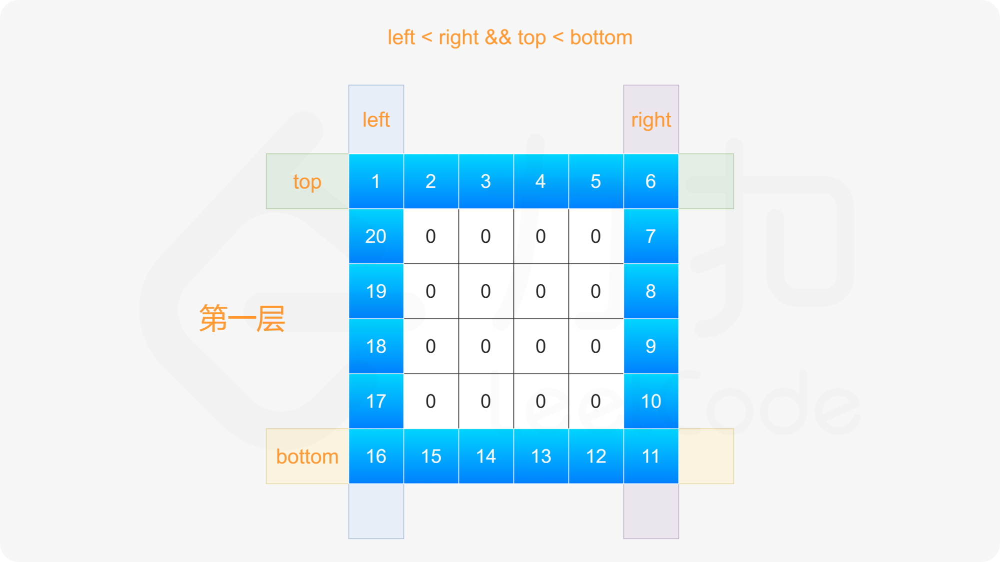
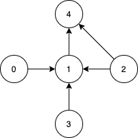

# 基础
## [136. 只出现一次的数字](https://leetcode-cn.com/problems/single-number/)
给定一个非空整数数组，除了某个元素只出现一次以外，其余每个元素均出现两次。找出那个只出现了一次的元素。 \
说明：
- 你的算法应该具有线性时间复杂度。 你可以不使用额外空间来实现吗？

> 输入: [2,2,1]\
> 输出: 1

思路1：先排序，再两两比对
```go
func singleNumber(nums []int) int {
    sort.Ints(nums)
    for i:=0;i<len(nums);i+=2{
        if i==len(nums)-1 || nums[i] != nums[i+1]{
            return nums[i]
        }
    }
    return 0
}
```
思路2： 使用位运算。对于这道题，可使用异或运算⊕。异或运算有以下三个性质。
- 任何数和0做异或运算，结果仍然是原来的数，即 a⊕0=a。
- 任何数和其自身做异或运算，结果是 0，即a⊕a=0。
- 异或运算满足交换律和结合律，即a⊕b⊕a=b⊕a⊕a=b⊕(a⊕a)=b⊕0=b。
```go
func singleNumber(nums []int) int {
    single := 0
    for _,v:=range nums{
        single ^= v
    }
    return single
}
```

## [169. 多数元素](https://leetcode-cn.com/problems/majority-element/)
给定一个大小为 n 的数组，找到其中的多数元素。多数元素是指在数组中出现次数 大于 n/2 的元素。\
你可以假设数组是非空的，并且给定的数组总是存在多数元素。

思路1：hash表，一旦超过半数则返回
```go
func majorityElement(nums []int) int {
    n := len(nums)
    ht := make(map[int]int)
    for _,v:=range(nums){
        ht[v]++
        if ht[v]>n/2{ // 注意，这里不能等于，如：[2,2,1,1,1,2,2]，等于会返回1，因为7/2=3
            return v
        }
    }
    return 0
}
```

思路2：排序，过半
```go
func majorityElement(nums []int) int {
    sort.Ints(nums)
    return nums[len(nums)/2]
}
```
思路3：投票算法证明：
1. 如果候选人不是maj 则 maj,会和其他非候选人一起反对 会反对候选人,所以候选人一定会下台(maj==0时发生换届选举)
2. 如果候选人是maj , 则maj 会支持自己，其他候选人会反对，同样因为maj 票数超过一半，所以maj 一定会成功当选
```go
func majorityElement(nums []int) int {
    count := 0
    candidate := nums[0]
    for _, v :=range nums{
        if count == 0{
            candidate = v
        }
        if candidate == v{
            count++
        } else{
            count--
        }
    }
    return candidate
}
```
## [15. 三数之和](https://leetcode-cn.com/problems/3sum/)
给你一个包含 n 个整数的数组 nums，判断 nums 中是否存在三个元素 a，b，c ，使得 a + b + c = 0 ？请你找出所有和为 0 且不重复的三元组。\
注意：答案中不可以包含重复的三元组。
> 示例 1：
> 输入：nums = [-1,0,1,2,-1,-4] \
> 输出：[[-1,-1,2],[-1,0,1]]
>
> 示例 2： \
> 输入：nums = []\
> 输出：[]
>
> 示例 3：\
> 输入：nums = [0]\
> 输出：[]
1. 特判，对于数组长度 n，如果数组为 null 或者数组长度小于 3，返回[]。
2. 对数组进行排序。
3. 遍历排序后数组：
- 若 `nums[i]>0`：因为已经排序好，所以后面不可能有三个数加和等于 0，直接返回结果。
- 对于重复元素：跳过，避免出现重复解
- 令左指针 `L=i+1`，右指针 `R=n-1`，当 `L<R` 时，执行循环：
   - 当 `nums[i]+nums[L]+nums[R]==0`，执行循环，判断左界和右界是否和下一位置重复，去除重复解。并同时将 L,RL,R 移到下一位置，寻找新的解
   - 若和大于 0，说明 `nums[R]` 太大，R 左移
   - 若和小于 0，说明 `nums[L]` 太小，L 右移
```go
func threeSum(nums []int) [][]int {
    ans := make([][]int, 0)
    n := len(nums)
    sort.Ints(nums) // 排序，让可能相同的值聚合在一起
    for firstI := 0; firstI < n; firstI++{
        if firstI > 0 && nums[firstI] == nums[firstI-1]{ // 跳过相同的首位值
            continue
        }
        thirdI := n-1
        target := -1*nums[firstI]
        if target<0{
            break
        }
        for secondI := firstI+1; secondI < n;secondI++{
            if secondI > firstI+1 && nums[secondI] == nums[secondI-1]{ // 跳过相同的第二位
                continue
            }
            for secondI < thirdI && nums[secondI] + nums[thirdI]>target{ // 跳过第三位大值
            // 这里不需要跳过相同第三位，因为，前面已经保证第一二位组合不会重复，那么第三位也不会重复
                thirdI--
            }
            if secondI == thirdI{ // 说明第二三为组合已经迭代完成
                break
            }
            if nums[secondI]+ nums[thirdI] == target{
                ans = append(ans, []int{nums[firstI], nums[secondI], nums[thirdI]})
            }
        }
    }
    return ans
}
```

## [75. 颜色分类](https://leetcode-cn.com/problems/sort-colors/)
给定一个包含红色、白色和蓝色、共n个元素的数组nums，**原地**对它们进行排序，使得相同颜色的元素相邻，并按照红色、白色、蓝色顺序排列。\
我们使用整数 0、1 和 2 分别表示红色、白色和蓝色。\
必须在**不使用库的sort**函数的情况下解决这个问题。
> 示例 1：\
> 输入：nums = [2,0,2,1,1,0]\
> 输出：[0,0,1,1,2,2]
>
> 示例 2：\
> 输入：nums = [2,0,1]\
> 输出：[0,1,2]

思路1：暴力，通过判断各个值的数目，直接替换
```go
func sortColors(nums []int)  {
    zeroCount := 0
    oneCount := 0
    for _,v := range nums{
        if v == 0{
            zeroCount++
            continue
        }
        if v == 1{
            oneCount++
            continue
        }
    }
    for i,_ := range nums{
        if zeroCount > 0{
            nums[i] = 0
            zeroCount--
            continue
        }
        if oneCount > 0{
            nums[i] = 1
            oneCount--
            continue
        }
        nums[i] = 2
    }
}
```
思路2：单指针 \
我们可以考虑对数组进行两次遍历。
- 在第一次遍历中，我们将数组中所有的 0 交换到数组的头部。
- 在第二次遍历中，我们将数组中所有的 1 交换到头部的 0 之后。
- 此时，所有的 2 都出现在数组的尾部，这样我们就完成了排序。

```go
func sortColors(nums []int)  {
    lastIndex := replace(nums, 0)
    replace(nums[lastIndex:], 1)
}

func replace(nums []int, target int) int{
    lastIndex := 0
    for i, v := range nums{
        if v == target{
            nums[i], nums[lastIndex] = nums[lastIndex], nums[i]
            lastIndex++
        }
    }
    return lastIndex
}
```
思路3：双指针
具体地，我们用指针 p0 来交换 0，p1来交换 1，初始值都为 0。当我们从左向右遍历整个数组时：
- 如果找到了1，那么将其与nums[p1] 进行交换，并将p1向后移动一个位置，这与方法一是相同的；
- 如果找到了0，那么将其与nums[p0]进行交换，并将p0 向后移动一个位置。这样做是正确的吗？
- - 我们可以注意到，因为连续的0之后是连续的1，因此如果我们将0与nums[p0]进行交换，那么我们可能会把一个 1 交换出去。当 p0<p1时，我们已经将一些 11 连续地放在头部，此时一定会把一个 1 交换出去，导致答案错误。
- - 因此，如果 p0<p1 ，那么我们需要再将nums[i] 与 nums[p1] 进行交换，其中 i 是当前遍历到的位置，在进行了第一次交换后，nums[i] 的值为 1，我们需要将这个 1 放到「头部」的末端。在最后，无论是否有p0<p1 ，我们需要将 p0和p1 均向后移动一个位置，而不是仅将p0向后移动一个位置。
```go
func sortColors(nums []int)  {
    zeroI := 0
    oneI := 0
    for i, v := range nums{
        if v == 0{
            nums[i], nums[zeroI] = nums[zeroI], nums[i]
            if zeroI < oneI{
                nums[oneI], nums[i] = nums[i], nums[oneI]
            }
            zeroI++
            oneI++
            continue
        }
        if v == 1{
            nums[i], nums[oneI] = nums[oneI], nums[i]
            oneI++
        }
    }
}
```
思路4：双指针
与思路3类似，我们也可以考虑使用指针 p0 来交换 0，p2来交换2。\
此时，p0 的初始值仍然为0，而 p2 的初始值为 n−1。\
在遍历的过程中，我们需要找出所有的 0 交换至数组的头部，并且找出所有的 2 交换至数组的尾部。\
由于此时其中一个指针 p2 是从右向左移动的，因此当我们在从左向右遍历整个数组时，如果遍历到的位置超过了 p2 ，那么就可以直接停止遍历了。

```go
func sortColors(nums []int)  {
    zeroI := 0
    twoI := len(nums)-1
    for i := 0; i <= twoI; i++{
        for ; i <= twoI && nums[i] == 2;twoI--{
            nums[twoI], nums[i] = nums[i], nums[twoI]
        } 
        if nums[i] == 0{
            nums[zeroI], nums[i] = nums[i], nums[zeroI]
            zeroI++
        }
    }
}
```
## [56. 合并区间](https://leetcode-cn.com/problems/merge-intervals/)
以数组 intervals 表示若干个区间的集合，其中单个区间为 intervals[i] = [starti, endi] 。请你合并所有重叠的区间，并返回 一个不重叠的区间数组，该数组需恰好覆盖输入中的所有区间 。

> 示例 1：\
> 输入：intervals = [[1,3],[2,6],[8,10],[15,18]]\
> 输出：[[1,6],[8,10],[15,18]]\
> 解释：区间 [1,3] 和 [2,6] 重叠, 将它们合并为 [1,6].\
> **注意**，输入可能是[[1,4],[0,0]]
```go
func merge(intervals [][]int) [][]int {
    if len(intervals) < 2{
        return intervals
    }
    // 二维数组排序
    sort.Slice(intervals, func(i, j int) bool {
		return intervals[i][0] < intervals[j][0]//按照每行的第一个元素排序
	})
    ans := [][]int{intervals[0]}
    for _,v := range intervals{
        if ans[len(ans)-1][1] >= v[0]{ // 如果有重叠，则合并
            aLen := len(ans)
            aLast := ans[aLen-1]
            if aLast[1] < v[1]{
                aLast[1] = v[1]
            }
            continue
        }
        ans = append(ans, v) // 没重叠，追加Slice
    }
    return ans
}
```
## [706. 设计哈希映射](https://leetcode-cn.com/problems/design-hashmap/submissions/)
不使用任何内建的哈希表库设计一个哈希映射（HashMap）。

实现 MyHashMap 类：
- MyHashMap() 用空映射初始化对象
- void put(int key, int value) 向 HashMap 插入一个键值对 (key, value) 。如果 key 已经存在于映射中，则更新其对应的值 value 。
- int get(int key) 返回特定的 key 所映射的 value ；如果映射中不包含 key 的映射，返回 -1 。
- void remove(key) 如果映射中存在 key 的映射，则移除 key 和它所对应的 value 。

思路1：简单粗暴
```go
type MyHashMap struct {
	Val [][2]int
}


func Constructor() MyHashMap {
	return MyHashMap{[][2]int{}}
}


func (this *MyHashMap) Put(key int, value int)  {
	if i, ok := this.isExist(key); ok{
		this.Val[i][1] = value
	} else{
		this.Val = append(this.Val,[2]int{key, value})
	}
}


func (this *MyHashMap) isExist(key int) (index int, here bool) {
	here = false
	index = -1
	for i, v := range this.Val{
		if v[0] == key{
			here = true
			index = i
			break
		}
	}
	return
}


func (this *MyHashMap) Get(key int) int {
	for _, v := range this.Val{
		if v[0] == key{
			return v[1]
		}
	}
	return -1
}


func (this *MyHashMap) Remove(key int)  {
	if i, ok := this.isExist(key); ok{
		if len(this.Val)>i+1{
			this.Val = append(this.Val[:i], this.Val[i+1:]...)
		} else{
			this.Val = this.Val[:i]
		}
	}
}
```
思路2：仅hash表
```go
type MyHashMap struct {
    Val map[int]int
}


func Constructor() MyHashMap {
    return MyHashMap{}
}


func (this *MyHashMap) Put(key int, value int)  {
    if this.Val == nil{
        this.Val = make(map[int]int)
    }
    this.Val[key] = value
}


func (this *MyHashMap) Get(key int) int {
    if _, ok := this.Val[key]; ok{
        return this.Val[key]
    }
    return -1
}


func (this *MyHashMap) Remove(key int)  {
    if _, ok := this.Val[key]; !ok{ // 不存在则跳出
        return
    }
    delete(this.Val,key)
}
```

## [119. 杨辉三角 II](https://leetcode-cn.com/problems/pascals-triangle-ii/)
给定一个非负索引 rowIndex，返回「杨辉三角」的第 rowIndex 行。\
在「杨辉三角」中，每个数是它左上方和右上方的数的和。

> 示例 1:\
> 输入: rowIndex = 3\
> 输出: [1,3,3,1]
>
> 示例 2:\
> 输入: rowIndex = 0\
> 输出: [1]

思路1：先生成相应杨辉三角值，再输出对应行
```go
func getRow(rowIndex int) []int {
	ans := make([][]int, rowIndex+1)
	for i := range ans {
		ans[i] = make([]int, i+1)
		ans[i][0], ans[i][i] = 1, 1
		// 利用对称性，对半缩减循环
		for j := 1; j < i/2+1; j++ {
			ans[i][j] = ans[i-1][j-1] + ans[i-1][j]
			ans[i][i-j] = ans[i-1][j-1] + ans[i-1][j]
		}
	}
	return ans[rowIndex]
}
```
思路1优化：注意到对第 i+1 行的计算仅用到了第 i 行的数据，因此可以使用滚动数组的思想优化空间复杂度。
```go
func getRow(rowIndex int) []int {
    var pre, cur []int
    for i := 0; i <= rowIndex; i++ {
        cur = make([]int, i+1)
        cur[0], cur[i] = 1, 1
        for j := 1; j < i; j++ {
            cur[j] = pre[j-1] + pre[j]
        }
        pre = cur
    }
    return pre
}
```
思路2：杨辉三角公式 \

```go
func getRow(rowIndex int) []int {
    row := make([]int, rowIndex+1)
    row[0] = 1
    for i := 1; i <= rowIndex; i++ {
        row[i] = row[i-1] * (rowIndex - i + 1) / i
    }
    return row
}
```

## [48. 旋转图像](https://leetcode-cn.com/problems/rotate-image/)
给定一个 n × n 的二维矩阵 matrix 表示一个图像。请你将图像顺时针旋转 90 度。\
你必须在 原地 旋转图像，这意味着你需要直接修改输入的二维矩阵。请不要 使用另一个矩阵来旋转图像。
> 示例 1：\
>  \
> 输入：matrix = [[1,2,3],[4,5,6],[7,8,9]] \
> 输出：[[7,4,1],[8,5,2],[9,6,3]]
> 
> 示例 2：\
>  \
> 输入：matrix = [[5,1,9,11],[2,4,8,10],[13,3,6,7],[15,14,12,16]] \
> 输出：[[15,13,2,5],[14,3,4,1],[12,6,8,9],[16,7,10,11]]

思路1：借助辅助数组

```go
func rotate(matrix [][]int)  {
    n := len(matrix)
    ans := make([][]int, n)
    for i := range ans{
        ans[i] = make([]int, n)
    }
    for i, row := range matrix{
        for j, v := range row{
            ans[j][n-i-1] = v
        }
    }
    copy(matrix, ans)
}
```
思路2：思路1的公式嵌套推理


```go
func rotate(matrix [][]int)  {
    n := len(matrix)
    for i := 0; i < n/2; i++ {
        for j := 0; j < (n+1)/2; j++ {
            matrix[i][j], matrix[n-j-1][i], matrix[n-i-1][n-j-1], matrix[j][n-i-1] =
                matrix[n-j-1][i], matrix[n-i-1][n-j-1], matrix[j][n-i-1], matrix[i][j]
        }
    }
}
```
思路3：翻转替代 \
 \
 \
如果先对角翻转，再水平翻转，则逆时针旋转90°
```go
func rotate(matrix [][]int)  {
    n := len(matrix)
    // 水平翻转
    for i := 0; i < n / 2; i++{
        matrix[i], matrix[n-i-1] = matrix[n-i-1], matrix[i]
    }
    // 对角翻转
    for i := range matrix{
        for j := 0; j < i; j++{
            matrix[i][j], matrix[j][i] = matrix[j][i], matrix[i][j]
        }
    }
}
```
## [59. 螺旋矩阵 II](https://leetcode-cn.com/problems/spiral-matrix-ii/)
给你一个正整数 n ，生成一个包含 1 到 n2 所有元素，且元素按顺时针顺序螺旋排列的 n x n 正方形矩阵 matrix 。
> 示例 1：\
> 
> 输入：n = 3 \
> 输出：[[1,2,3],[8,9,4],[7,6,5]]

思路1：按层模拟 \
 \
 \
 \
 

```go
func generateMatrix(n int) [][]int {
    matrix := make([][]int, n)
    for i := range matrix{
        matrix[i] = make([]int, n)
    }
    num := 1
    top, right, bottom, left := 0, n-1, n-1, 0
    for top <= bottom && left <= right{
        for col := left; col <= right; col++{
            matrix[top][col] = num
            num++
        }
        for row := top+1; row <= bottom; row++{
            matrix[row][right] = num
            num++
        }
        if top < bottom && left < right{
            for col:= right-1; col >= left; col--{
                matrix[bottom][col] = num
                num++
            }
            for row := bottom-1; row > top; row--{
                matrix[row][left] = num
                num++
            }
        }
        top++
        right--
        bottom--
        left++
    }
    return matrix
}
```

## [240. 搜索二维矩阵 II](https://leetcode-cn.com/problems/search-a-2d-matrix-ii/)
编写一个高效的算法来搜索 m x n 矩阵 matrix 中的一个目标值 target 。该矩阵具有以下特性：
- 每行的元素从左到右升序排列。
- 每列的元素从上到下升序排列。

> 示例 1：\
>  \
> 输入：matrix = [[1,4,7,11,15],[2,5,8,12,19],[3,6,9,16,22],[10,13,14,17,24],[18,21,23,26,30]], target = 5 \
> 输出：true
> 
> 示例 2：\
>  \
> 输入：matrix = [[1,4,7,11,15],[2,5,8,12,19],[3,6,9,16,22],[10,13,14,17,24],[18,21,23,26,30]], target = 20 \
> 输出：false

思路1：倒序
- 凡是行左侧大于target值的均跳过
- 遇到行右侧小于target值的则说明其余行无法匹配
- target在行区间的，用二分法匹配当前行是否有匹配项
```go
func searchMatrix(matrix [][]int, target int) bool {
    if len(matrix) == 0 || len(matrix[0]) == 0{
        return false
    }
    n := len(matrix[0])
    for i := len(matrix)-1; i >=0; i--{
        row := matrix[i]
        if target < row[0]{
            continue
        }
        if target > row[n-1]{
            return false
        }
        if row[0] == target || row[n-1] == target{
            return true
        }
        left, right := 0, n-1
        mid := right/2
        for left <= right{
            if target < row[mid]{
                right = mid-1
                mid = (left+right)/2
                continue
            }
            if target > row[mid]{
                left = mid+1
                mid = (left+right)/2
                continue
            }
            return true
        }
    }
    return false    
}
```
代码优化：使用`sort.SearchInts`方法代替二分法查找值
```go
func searchMatrix(matrix [][]int, target int) bool {
    if len(matrix) == 0 || len(matrix[0]) == 0{
        return false
    }
    n := len(matrix[0])
    for i := len(matrix)-1; i >=0; i--{
        row := matrix[i]
        if target < row[0]{
            continue
        }
        if target > row[n-1]{
            return false
        }
        j := sort.SearchInts(row, target)
        if j < len(row) && row[j] == target{
            return true
        }
    }
    return false    
}
```
## [435. 无重叠区间](https://leetcode-cn.com/problems/non-overlapping-intervals/)
给定一个区间的集合，找到需要移除区间的最小数量，使剩余区间互不重叠。\
注意:
- 可以认为区间的终点总是大于它的起点。
- 区间 [1,2] 和 [2,3] 的边界相互“接触”，但没有相互重叠。
> 示例 1: \
> 输入: [ [1,2], [2,3], [3,4], [1,3] ]\
> 输出: 1 \
> 解释: 移除 [1,3] 后，剩下的区间没有重叠。
> 
> 示例 2: \
> 输入: [ [1,2], [2,3] ] \
> 输出: 0 \
> 解释: 你不需要移除任何区间，因为它们已经是无重叠的了。

思路：贪心算法，[讲解视频](https://www.bilibili.com/video/BV1WK4y1R71x)
- 按照右边界排序，就要从左向右遍历，因为右边界越小越好，只要右边界越小，留给下一个区间的空间就越大，所以从左向右遍历，优先选右边界小的。

```go
func eraseOverlapIntervals(intervals [][]int) int {
	if len(intervals) < 2{
		return 0
	}
	// 以右侧端点排序
	sort.Slice(intervals, func(i, j int) bool{
		return intervals[i][1] < intervals[j][1]
	})
	// 从左往右，贪心算法
	num, end := 1, intervals[0][1]
	for _,v := range intervals[1:]{
		if v[0] >= end{
			num++
			end = v[1]
		}
	}
	return len(intervals)-num
}
```
- 按照左边界排序，就要从右向左遍历，因为左边界数值越大越好（越靠右），这样就给前一个区间的空间就越大，所以可以从右向左遍历。
```go
func eraseOverlapIntervals2(intervals [][]int) int {
	if len(intervals) < 2{
		return 0
	}
	// 以左侧侧端点排序
	sort.Slice(intervals, func(i, j int) bool{
		return intervals[i][0] < intervals[j][0]
	})
	n := len(intervals)
	num := 1
	left := intervals[n-1][0]
	for i := n-2; i >= 0; i--{
		if left >= intervals[i][1]{
			num++
			left = intervals[i][0]
		}
	}
	return n - num
}
```
## [334. 递增的三元子序列](https://leetcode-cn.com/problems/increasing-triplet-subsequence/)
给你一个整数数组 nums ，判断这个数组中是否存在长度为 3 的递增子序列。\
如果存在这样的三元组下标 (i, j, k) 且满足 i < j < k ，使得 nums[i] < nums[j] < nums[k] ，返回 true ；否则，返回 false 。

> 示例 1：\
> 输入：nums = [2,1,5,0,4,6] \
> 输出：true \
> 解释：三元组 (3, 4, 5) 满足题意，因为 nums[3] == 0 < nums[4] == 4 < nums[5] == 6
> 
> 示例 2：\
> 输入：nums = [5,4,3,2,1]\
> 输出：false\
> 解释：不存在满足题意的三元组

思路1：双向遍历
- 作3次遍历
- 前两次遍历分别从左往右、从右往左，双向遍历获取各索引左侧最小、右侧最大值
- 第三次遍历，将当前值与左侧最小、右侧最大值进行对比，符合递增规律的，返回真
```go
func increasingTriplet(nums []int) bool {
    n := len(nums)
    if n < 3{
        return false
    }
    leftMin := make([]int, n) // 记录各个索引值左侧最小值
    rightMax := make([]int, n) // 记录各个索引值右侧最大值
    
    leftMin[0] = nums[0]
    rightMax[n-1] = nums[n-1]

    for i := 1; i < n;i++{
        leftMin[i] = min(leftMin[i-1], nums[i])
    }
    for i := n-2; i >= 0;i--{
        rightMax[i] = max(rightMax[i+1], nums[i])
    }

    for i := 1; i < n-1; i++{
        if nums[i] > leftMin[i] && nums[i] < rightMax[i]{
            return true
        }
    }
    return false
}

func min(a, b int) int{
    if a >= b{
        return b
    }
    return a
}

func max(a, b int) int{
    if a >= b{
        return a
    }
    return b
}
```
思路2：贪心算法\
使用贪心的方法将空间复杂度降到 O(1)。从左到右遍历数组nums，遍历过程中维护两个变量 first 和 second，分别表示递增的三元子序列中的第一个数和第二个数，任何时候都有first<second。\
初始时，first=nums[0]，second=+∞。对于1≤i<n，当遍历到下标 i 时，令 num=nums[i]，进行如下操作：
1. 如果 num>second，则找到了一个递增的三元子序列，返回true；
2. 否则，如果 num>first，则将 second 的值更新为 num；
3. 否则，将 first 的值更新为 num。

如果遍历结束时没有找到递增的三元子序列，返回false。\
上述做法的贪心思想是：为了找到递增的三元子序列，first 和 second 应该尽可能地小，此时找到递增的三元子序列的可能性更大。
```go
func increasingTriplet(nums []int) bool {
    n := len(nums)
    if n < 3{
        return false
    }
    first, second := nums[0], math.MaxInt64
    for i := 1; i < n; i++{
        if nums[i] > second{
            return true
        }
        if nums[i] > first{
            second = nums[i]
        } else{
            first = nums[i]
        }

    }
    return false
}
```
## [238. 除自身以外数组的乘积](https://leetcode-cn.com/problems/product-of-array-except-self/)
给你一个整数数组 nums，返回 数组 answer ，其中 answer[i] 等于 nums 中除 nums[i] 之外其余各元素的乘积 。\
题目数据 保证 数组 nums之中任意元素的全部前缀元素和后缀的乘积都在  32 位 整数范围内。\
请**不要使用除法**，且在 O(n) 时间复杂度内完成此题。
> 其实使用除法还会产生一个问题：数组中存在0值时，先乘后除，需要规避零值

> 示例 1: \
> 输入: nums = [1,2,3,4] \
> 输出: [24,12,8,6]

> 示例 2: \
> 输入: nums = [-1,1,0,-3,3] \
> 输出: [0,0,9,0,0]

思路：双向遍历，左右乘积列表，思路同上一题
- 3次遍历
- 前两次遍历，先后获取当前索引值左侧乘积、右侧乘积
- 最后一次遍历，将当前索引左右乘积相乘，得到目标乘积值
```go
func productExceptSelf(nums []int) []int {
    n := len(nums)
    if n < 2{
        return nums
    }
    leftProd := make([]int, n) // 当前值左侧乘积数组
    rightProd := make([]int, n) // 当前值右侧乘积数组
    leftProd[0] = 1
    rightProd[n-1] = 1
    for i := 1; i < n; i++{
        leftProd[i] = nums[i-1]*leftProd[i-1]
    }
    for i := n-2; i >= 0; i--{
        rightProd[i] = nums[i+1]*rightProd[i+1]
    }

    ans := make([]int, n)
    for i := 0; i < n; i++{
        ans[i] = leftProd[i]*rightProd[i]
    }
    return ans
}
```
优化，在双向遍历中完成左右两侧乘积计算，减少遍历次数和变量
```go
func productExceptSelf(nums []int) []int {
    n := len(nums)
    if n < 2{
        return nums
    }
    ans := make([]int, n)
    ans[0] = 1
    for i := 1; i < n; i++{ // 先获取左侧乘积
        ans[i] = nums[i-1]*ans[i-1]
    }
    r := 1
    for i := n-1; i >= 0; i--{
        ans[i] = ans[i] * r
        r *= nums[i]
    }
    return ans
}
```

## [560. 和为 K 的子数组](https://leetcode-cn.com/problems/subarray-sum-equals-k/)
给你一个整数数组 nums 和一个整数 k ，请你统计并返回该数组中和为 k 的连续子数组的个数。
> 示例 1： \
> 输入：nums = [1,1,1], k = 2 \
> 输出：2
> 
> 示例 2： \
> 输入：nums = [1,2,3], k = 3 \
> 输出：2

思路1：暴力枚举
```go
func subarraySum(nums []int, k int) int {
    count := 0
    for i := 0; i < len(nums); i++{
        sum := 0
        for j := i; j >= 0; j--{
            sum += nums[j]
            if sum == k{
                count++
            }
        }
    }
    return count
}
```
思路2：前项和+hash表法 \

```go
func subarraySum(nums []int, k int) int {
    count := 0
    pre := 0
    mp := map[int]int{} // 记录各个前项和 出现次数
    mp[0] = 1
    for _, v := range nums{
        // 前项和对应公式 mp[pre[j−1]]==mp[pre[i]−k]
        pre += v
        if _, ok := mp[pre-k]; ok{
            count += mp[pre-k]
        }
        mp[pre] += 1
    }
    return count
}
```

## [415. 字符串相加](https://leetcode-cn.com/problems/add-strings/)
给定两个字符串形式的非负整数 num1 和num2 ，计算它们的和并同样以字符串形式返回。\
你不能使用任何內建的用于处理大整数的库（比如 BigInteger）， 也不能直接将输入的字符串转换为整数形式。

> 示例 1： \
> 输入：num1 = "11", num2 = "123" \
> 输出："134"
>
> 示例 2： \
> 输入：num1 = "456", num2 = "77" \
> 输出："533" 
>
> 示例 3： \
> 输入：num1 = "0", num2 = "0" \
> 输出："0"

思路1：通过数组值 & 索引 进行加法运算，代码实现：[stringsAdd](../string/add/test.go) \
优化
- 字符串通过 `len` 获取长度，也可以通过 `下标 i ` 获取对应字符的`byte`值
- 通过字符转换进行加法运算（替代原方法的索引加减运算）
```go
func addStrings2(num1 string, num2 string) string {
	ans := ""
	n1 := len(num1)
	n2 := len(num2)
	if n1 > n2 {
		num2 = fillZero2(n1-n2) + num2
	} else if n1 < n2 {
		num1 = fillZero2(n2-n1) + num1
	}
	n1 = len(num1)
	carry := 0
	for i := n1 - 1; i >= 0; i-- {
		res := carry + int(num1[i]-'0') + int(num2[i]-'0')
		ans = strconv.Itoa(res%10) + ans
		carry = res / 10
	}
	if carry > 0 {
		ans = strconv.Itoa(carry) + ans
	}
	return ans
}

func fillZero2(n int) string {
	zeroStr := ""
	for i := 0; i < n; i++ {
		zeroStr += "0"
	}
	return zeroStr
}
```
终极优化：直接转换为数值进行运算，不补位
```go
func addStrings(num1 string, num2 string) string {
    add := 0
    ans := ""
    for i, j := len(num1)-1, len(num2)-1; i >=0 || j >= 0 || add > 0; i, j = i-1, j-1{
        x, y := 0, 0
        if i >= 0{
            x = int(num1[i]-'0')
        }
        if j >= 0{
            y = int(num2[j]-'0')
        }
        res := add + x + y
        ans = strconv.Itoa(res % 10) + ans
        add = res / 10
    }
    return ans
}
```

## [409. 最长回文串](https://leetcode-cn.com/problems/longest-palindrome/)
给定一个包含大写字母和小写字母的字符串 s ，返回 通过这些字母构造成的 最长的回文串 。\
在构造过程中，请注意 区分大小写 。比如 "Aa" 不能当做一个回文字符串。

> 示例 1: \
> 输入:s = "abccccdd" \
> 输出:7 \
> 解释: 我们可以构造的最长的回文串是"dccaccd", 它的长度是 7。
>
> 示例 2: \
> 输入:s = "a" \
> 输入:1
>
> 示例 3: \
> 输入:s = "bb" \
> 输入: 2

思路1：hash表法
```go
func longestPalindrome(s string) int {
	strMap := make(map[int32]int, 26*2)
	for _, v := range s {
		strMap[v]++
	}
	couldOdd := true
	count := 0
	for _, v := range strMap {
		if couldOdd && v%2 == 1 {
			couldOdd = false
			count++
		}
		if v > 1 {
			count += v / 2 * 2
		}
	}
	return count
}
```
优化：减少奇数变量
```go
func longestPalindrome(s string) int {
	strMap := make(map[int32]int, 26*2)
	for _, v := range s {
		strMap[v]++
	}
	count := 0
	for _, v := range strMap {
		if count%2 == 0 && v%2 == 1 {
			count++
		}
		if v > 1 {
			count += v / 2 * 2
		}
	}
	return count
}
```
## [290. 单词规律](https://leetcode-cn.com/problems/word-pattern/)
给定一种规律 pattern 和一个字符串 str ，判断 str 是否遵循相同的规律。\
这里的 遵循 指完全匹配，例如， pattern 里的每个字母和字符串 str 中的每个非空单词之间存在着双向连接的对应规律。
> 示例1: \
> 输入: pattern = "abba", str = "dog cat cat dog" \
> 输出: true
>
> 示例 2: \
> 输入:pattern = "abba", str = "dog cat cat fish" \
> 输出: false
>
> 示例 3: \
> 输入: pattern = "aaaa", str = "dog cat cat dog" \
> 输出: false
>
> 示例 4: \
> 输入: pattern = "abba", str = "dog dog dog dog" \
> 输出: false
>
> **示例 5:** \
> 输入: pattern = "aba", str = "dog cat cat" \
> 输出: false

思路：hash法
```go
func wordPattern2(pattern string, s string) bool {
	ps, ss := strings.Split(pattern, ""), strings.Split(s, " ")
	np, ns := len(ps), len(ss)
	if np != ns{
		return false
	}
	p2s, s2p := make(map[string]string, np), make(map[string]string, np)
	for i := 0; i < np; i++{
		if _, ok := s2p[ss[i]]; ok && s2p[ss[i]] != ps[i]{
			return false
		}
		if _, ok := p2s[ps[i]]; ok && p2s[ps[i]] != ss[i]{
			return false
		}
		if _, ok := s2p[ss[i]]; !ok{
			s2p[ss[i]] = ps[i]
			p2s[ps[i]] = ss[i]
		}
	}
	return true
}
```
进一步优化，减少变量：不将pattern转换为string数组，直接通过下标取byte值
```go
func wordPattern3(pattern string, s string) bool {
	n := len(pattern)
	words := strings.Split(s, " ") // 生成word值
	pByte2word := make(map[byte]string, n) // pattern单个字节的byte值对应的word值
	word2pByte := make(map[string]byte, n) // s单词string值对应pattern的byte值
	if len(words) != n{
		return false
	}
	for i, v := range words{
		if word2pByte[v] > 0 && word2pByte[v] != pattern[i] || pByte2word[pattern[i]] != "" && pByte2word[pattern[i]] != v{
			return false
		}
		if word2pByte[v] == 0{
			word2pByte[v] = pattern[i]
			pByte2word[pattern[i]] = v
		}
	}
	return true
}
```
## [763. 划分字母区间](https://leetcode-cn.com/problems/partition-labels/)
字符串 S 由小写字母组成。我们要把这个字符串划分为尽可能多的片段，同一字母最多出现在一个片段中。返回一个表示每个字符串片段的长度的列表。

> 示例： \
> 输入：`S = "ababcbacadefegdehijhklij"` \
> 输出：[9,7,8] \
> 解释： 
> - 划分结果为 `"ababcbaca", "defegde", "hijhklij"`。 
> - 每个字母最多出现在一个片段中。 
> - 像 `"ababcbacadefegde", "hijhklij"` 的划分是错误的，因为划分的片段数较少。

思路1：获取每个字符的区间，然后合并重叠区间
```go
func partitionLabels(s string) []int {
	n := len(s)
	s2ares := make(map[byte][]int, n)
	for i := 0; i < n; i++{
		if _, ok := s2ares[s[i]]; ok{
			s2ares[s[i]][1] = i
 		} else {
 			s2ares[s[i]] = []int{i,i}
		}
	}
	ares := [][]int{}
	for _, v := range s2ares{
		ares = append(ares, v)
	}
	if len(ares) > 1{
		ares = merge(ares)
	}

	ans := []int{}
	for _, v := range ares{
		ans = append(ans, v[1]-v[0]+1)
	}
	return ans
}

func merge(intervals [][]int) [][]int {
	// 参考 56. 合并区间
}
```
思路2：贪心算法 \

```go
func partitionLabels(s string) []int {
    lastPos := [26]int{} // 记录各个字母（题目限制小写字母）最后出现的位置
    for i, alp := range s{
        lastPos[alp-'a'] = i
    }
    start, end := 0, 0 // 记录当前区间起始、结束位置
    ans := []int{}
    for i, v := range s{
        // 不断调整当前区间的结束位置：
        // 1. 根据区间首个字母的结束位置判断，如果首个字母只出现1次，则end为当前下标；否则
        // 2. 在被当前字母其实和结束位置区间内，可能会被其他字母区间叠加而扩大范围
        if lastPos[v-'a'] > end{ 
            end = lastPos[v-'a']
        }
        // 表示2种情况：1. 1个字母片段；2.区间结束
        if i == end{
            ans = append(ans, end-start+1)
            start = end+1
        }
    }
    return ans
}
```
## [49. 字母异位词分组](https://leetcode-cn.com/problems/group-anagrams/) 
给你一个字符串数组，请你将 字母异位词 组合在一起。可以按任意顺序返回结果列表。 \
字母异位词 是由重新排列源单词的字母得到的一个新单词，所有源单词中的字母通常恰好只用一次。

> 示例 1: \
> 输入: strs = ["eat", "tea", "tan", "ate", "nat", "bat"] \
> 输出: [["bat"],["nat","tan"],["ate","eat","tea"]]

> `strs[i]` 仅包含小写字母

思路：hash法
- 将每个单词字母进行排序，获得有序字母key，并更新对应结果索引
```go
func groupAnagrams(strs []string) [][]string {
	ans := [][]string{}
	mp := make(map[string]int, len(strs))
	for _, v := range strs{
		a := []byte(v)
		sort.Slice(a, func(i, j int) bool {
			return a[i] < a[j]
		})
		sv := string(a)
		if i, ok := mp[sv]; ok{
			ans[i] = append(ans[i], v)
		} else {
			mp[sv] = len(ans)
			ans = append(ans, []string{v})
		}
	}
	return ans
}
```
优化：将字母表(小写)数组作为key值，用空间换取时间
```go
func groupAnagrams(strs []string) [][]string {
	ans := [][]string{}
	mp := map[[26]int]int{}
	for _, v := range strs{
		cn := [26]int{}
		for _, a := range v{
			cn[a-'a']++
		}
		if i, ok := mp[cn]; ok{
			ans[i] = append(ans[i], v)
		} else {
			mp[cn] = len(ans)
			ans = append(ans, []string{v})
		}
	}
	return ans
}
```

##[43. 字符串相乘](https://leetcode-cn.com/problems/multiply-strings/)
给定两个以字符串形式表示的非负整数 num1 和 num2，返回 num1 和 num2 的乘积，它们的乘积也表示为字符串形式。

注意：不能使用任何内置的 BigInteger 库或直接将输入转换为整数。
> 示例 1: \
> 输入: num1 = "2", num2 = "3" \
> 输出: "6"
> 
> 示例 2: **大数** \
> 输入: num1 = "498828660196", num2 = "840477629533" \
> 输出: "6"

思路：通过数组，记录乘积的每个位值

```go
func multiply(num1 string, num2 string) string {
    if num1 == "0" || num2 == "0"{
        return "0"
    }
    n, m := len(num1), len(num2)
    multiArr := make([]int,m+n)
    for i := n-1; i >= 0; i--{
        x := int(num1[i]-'0')
        for j := m-1; j >= 0; j--{
            y := int(num2[j]-'0')
            multiArr[i+j+1] += x*y
        }
    }
    for i := n+m-1; i>0; i--{
        multiArr[i-1] += multiArr[i]/10
        multiArr[i] %= 10
    }
    ind := 0
    str := ""
    if multiArr[0] == 0{
        ind = 1
    }
    for ; ind < n+m; ind++{
        str += strconv.Itoa(multiArr[ind])
    }
    return str
}
```

## [187. 重复的DNA序列](https://leetcode-cn.com/problems/repeated-dna-sequences/)
DNA序列 由一系列核苷酸组成，缩写为 'A', 'C', 'G' 和 'T'.。
- 例如，"ACGAATTCCG" 是一个 DNA序列 。

在研究 DNA 时，识别 DNA 中的重复序列非常有用。 \
给定一个表示 DNA序列 的字符串 s ，返回所有在 DNA 分子中出现不止一次的 长度为 10 的序列(子字符串)。你可以按 任意顺序 返回答案。

> 示例 1： \
> 输入：s = "AAAAACCCCCAAAAACCCCCCAAAAAGGGTTT" \
> 输出：["AAAAACCCCC","CCCCCAAAAA"]
>
> 示例 2： \
> 输入：s = "AAAAAAAAAAAAA" \
> 输出：["AAAAAAAAAA"]

思路：hash法
```go
func findRepeatedDnaSequences(s string) []string {
	ans := []string{}
	ansMap := make(map[string]int)
	for i:=0; i < len(s)-9; i++{
		rep := s[i:i+10]
		ansMap[rep]++
		if ansMap[rep] == 2{
			ans = append(ans, rep)
		}
	}
	return ans
}
```
## [5. 最长回文子串](https://leetcode-cn.com/problems/longest-palindromic-substring/)
给你一个字符串 s，找到 s 中最长的回文子串。

> 示例 1： \
> 输入：s = "babad" \
> 输出："bab" \
> 解释："aba" 同样是符合题意的答案。
>
> 示例 2： \
> 输入：s = "cbbd" \
> 输出："bb"

思路1：动态规划
```go
func longestPalindrome(s string) string {
	n := len(s)
	str := s[0:1]
	for i := 0; i < n;i++{
		ns := len(str)
		for j := i+ns+1; j <= n; j++{  // 每次只对比 大于目前最大回文长度 的字符串
			if isPali(s[i:j]){
				str = s[i:j]
			}
		}
	}
	return str
}

func isPali(s string) bool{
	for i := 0; i < len(s)/2; i++{
		if s[i] != s[len(s)-1-i]{
			return false
		}
	}
	return true
}
```
思路2：中心拓展
- 回文可能是奇数、偶数的数目
- 拓展需要比较是否符合回文性质
```go
func longestPalindrome2(s string) string {
	if s == ""{
		return ""
	}
	start, end := 0,0
	for i := 0; i < len(s); i++{
		// 中心拓展
		start1, end1 := expandPali(s, i, i) // 回文数目为奇数
		start2, end2 := expandPali(s, i, i+1) // 回文数目为偶数
		if end1-start1 > end-start{
			start, end = start1, end1
		}
		if end2-start2 > end-start{
			start, end = start2, end2
		}
	}
	return s[start:end+1]
}
func expandPali(s string,start, end int) (int, int){
	// 由中心往两边同步拓展
	// 左侧-1，右侧+1，拓展后左右两侧相等构成回文则继续拓展
	// 否则返回缩窄左右两侧指针
	for ; start >= 0 && end < len(s) && s[start] == s[end]; start, end = start-1, end+1{}
	return start+1, end-1
}
```

## [2. 两数相加](https://leetcode-cn.com/problems/add-two-numbers/)
给你两个 非空 的链表，表示两个非负的整数。它们每位数字都是按照 逆序 的方式存储的，并且每个节点只能存储 一位 数字。
请你将两个数相加，并以相同形式返回一个表示和的链表。
你可以假设除了数字 0 之外，这两个数都不会以 0 开头。

> 示例 1： \
>  \
> 输入：l1 = [2,4,3], l2 = [5,6,4] \
> 输出：[7,0,8] \
> 解释：342 + 465 = 807.
> 
> 示例 2： \
> 输入：l1 = [0], l2 = [0] \
> 输出：[0]
>
> 示例 3： \
> 输入：l1 = [9,9,9,9,9,9,9], l2 = [9,9,9,9] \
> 输出：[8,9,9,9,0,0,0,1]

思路：加法进位
```go
func addTwoNumbers(l1 *ListNode, l2 *ListNode) *ListNode {
    result := new(ListNode)
    prev := result
    coin := 0 // 低进位
    for l1 != nil && l2 != nil{
        prev.Next = new(ListNode)
        prev = prev.Next
        sum := coin+l1.Val+l2.Val
        prev.Val, coin = sum%10, sum/10
        l1, l2 = l1.Next, l2.Next
    }
    if l2 == nil{
        l2 = l1
    }
    for l2 != nil{
        prev.Next = new(ListNode)
        prev = prev.Next
        sum := coin+l2.Val
        prev.Val, coin = sum%10, sum/10
        l2 = l2.Next
    }
    if coin > 0{
        prev.Next = new(ListNode)
        prev = prev.Next
        prev.Val = coin
    } 
    return result.Next
}
```
思路更加清晰的写法，但是判断的次数更多了
```go
func addTwoNumbers(l1 *ListNode, l2 *ListNode) *ListNode {
    result := new(ListNode)
    prev := result
    carry := 0 // 低进位
    for l1 != nil || l2 != nil{
        a, b := 0, 0
        if l1 != nil{
            a = l1.Val
        }
        if l2 != nil{
            b = l2.Val
        }
        a += b+carry
        prev.Next = new(ListNode)
        prev = prev.Next
        prev.Val, carry = a%10, a/10

        if l1 != nil{
            l1 = l1.Next
        }
        if l2 != nil{
            l2 = l2.Next
        }
    }

    if carry > 0{
        prev.Next = new(ListNode)
        prev = prev.Next
        prev.Val = carry
    }
    return result.Next
}
```

##[82. 删除排序链表中的重复元素 II](https://leetcode-cn.com/problems/remove-duplicates-from-sorted-list-ii/)
给定一个已排序的链表的头 head ， 删除原始链表中所有重复数字的节点，只留下不同的数字 。返回 已排序的链表 。

> 示例 1： \
>  \
> 输入：head = [1,2,3,3,4,4,5] \
> 输出：[1,2,5]

> 示例 2： \
>  \
> 输入：head = [1,1,1,2,3] \
> 输出：[2,3]

思路1：逐个对比，且对每一个都比到不再重复为止
```go
func deleteDuplicates(head *ListNode) *ListNode {
    result := &ListNode{Val: math.MinInt64, Next: head} // 为了能够排除头部的重复，所以需要再加一个头，值为最小值
    prev := result
    for prev != nil && prev.Next != nil{
        next := prev.Next
        nextNext := next.Next
        for nextNext != nil && nextNext.Val == next.Val{
            nextNext = nextNext.Next
        }
        if nextNext == next.Next{
            prev = next
        } else{
            prev.Next = nextNext
        }
    }
    return result.Next
}
```
思路2：hash法
```go
func deleteDuplicates(head *ListNode) *ListNode {
    result := &ListNode{Val: math.MinInt64, Next: head}
    prev := result
    mp := make(map[int]int)
    for prev != nil{
        mp[prev.Val]++
        prev = prev.Next
    }
    prev = result
    for prev != nil{
        for prev.Next != nil && mp[prev.Next.Val] > 1{
            prev.Next = prev.Next.Next
        }
        prev = prev.Next
    }
    return result.Next
}
```

## [707. 设计链表](https://leetcode-cn.com/problems/design-linked-list/)

```go
type MyLinkedList struct {
	Val int
	Next *MyLinkedList
}

func Constructor() MyLinkedList {
	return MyLinkedList{Val: math.MinInt64, Next: nil}
}

func (this *MyLinkedList) Get(index int) int {
	nodes := this.GetSlice()
	if index < 0 || index >= len(nodes){
		return -1
	}
	return nodes[index].Val
}


func (this *MyLinkedList) AddAtHead(val int)  {
	if this.Val == math.MinInt64{
		this.Val = val
		return
	}
	this.Next = &MyLinkedList{Val: this.Val, Next: this.Next}
	this.Val = val
}


func (this *MyLinkedList) AddAtTail(val int)  {
	nodes := this.GetSlice()
	n := len(nodes)
	if n == 0{
		this.Val = val
		return
	}
	nodes[len(nodes)-1].Next = &MyLinkedList{Val: val}
}


func (this *MyLinkedList) AddAtIndex(index int, val int)  {
	if index <= 0{
		this.AddAtHead(val)
		return
	}
	nodes := this.GetSlice()
	n := len(nodes)
	if index > n{
		return
	}
	if index == n{
		this.AddAtTail(val)
		return
	}
	node := nodes[index-1]
	node.Next = &MyLinkedList{Val: val, Next: node.Next}
}


func (this *MyLinkedList) DeleteAtIndex(index int)  {
	nodes := this.GetSlice()
	n := len(nodes)
	if index == 0{
		if n > 1{
			this.Val = this.Next.Val
			this.Next = this.Next.Next
		} else if n == 1{
			this.Val = math.MinInt64
		}
		return
	}
	if index < n && index > 0{
		node := nodes[index-1]
		node.Next = node.Next.Next
	}
}

func (this *MyLinkedList) GetSlice() (ans []*MyLinkedList ){
	prev := this
	for prev != nil{
		if prev.Val == math.MinInt64{
			break
		}
		ans = append(ans, prev)
		prev = prev.Next
	}
	return
}
```

## [25. K 个一组翻转链表](https://leetcode-cn.com/problems/reverse-nodes-in-k-group/)
给你一个链表，每 k 个节点一组进行翻转，请你返回翻转后的链表。\
k 是一个正整数，它的值小于或等于链表的长度。 \
如果节点总数不是 k 的整数倍，那么请将最后剩余的节点保持原有顺序。 \
进阶：
- 你可以设计一个**只使用常数额外空间**的算法来解决此问题吗？
- 你不能只是单纯的改变节点内部的值，而是需要实际进行节点交换。

> 示例 1： \
>  \
> 输入：head = [1,2,3,4,5], k = 2 \
> 输出：[2,1,4,3,5] 
>
> 示例 2： \
>  \
> 输入：head = [1,2,3,4,5], k = 3 \
> 输出：[3,2,1,4,5]
>
> 示例 3： \
> 输入：head = [1,2,3,4,5], k = 1 \
> 输出：[1,2,3,4,5]
>
> 示例 4： \
> 输入：head = [1], k = 1 \
> 输出：[1]

思路1：借助数组进行翻转
```go
func reverseKGroup(head *ListNode, k int) *ListNode {
	nodes := []*ListNode{}
	prev := head
	for prev != nil{
		nodes = append(nodes, prev)
		prev = prev.Next
	}
	n := len(nodes)
	if n < k || n == 1 || k == 1{
		return head
	}
	node := &ListNode{}
	prev = node
	i := 0
	for ;i < n && i < (n/k)*k;i+=k{
		next, tail := slice2Node(nodes[i:i+k])
		prev.Next = next
		prev = tail
	}
	for ; i < n; i++{
		prev.Next = nodes[i]
		prev = prev.Next
	}
	prev.Next = nil
	return node.Next
}

func slice2Node(nodes []*ListNode) (*ListNode, *ListNode){
	node := &ListNode{Next:nil}
	prev := node
	n := len(nodes)
	for n > 0{
		prev.Next = nodes[n-1]
		prev = prev.Next
		nodes = nodes[:n-1]
		n = len(nodes)
	}
	return node.Next, prev
}
```
思路2：动态规划
- 以k个节点为一组，分头尾，取余后，尾下标为0，头下标为k-1，上一组的尾接下一组的头
```go
func reverseKGroup2(head *ListNode, k int) *ListNode {
	prev := head
	n := 0
	for prev != nil{
		prev = prev.Next
		n++
	}
	if n < k || n == 1 || k == 1{
		return head
	}

	var leftTail, rightTail, firstHead, nilHead, node1, node2 *ListNode
	node1 = head
	i := 0
	// 整体思路是：以k个节点为一组，分头尾，取余后，尾下标为0，头下标为k-1，上一组的尾接下一组的头
	for ;i < n && i < (n/k)*k;i++ {
		if i%k == 0{
			nilHead = nil
		}
		node2 = node1.Next
		node1.Next = nilHead
		nilHead = node1
		node1 = node2
		if i % k == 0{
			rightTail = nilHead // 获取当前组的尾
			continue
		}
		if i%k != k-1{ // 如果当前节点不是新的头节点，则进入下一个循环
			continue
		}
		if i == k-1{
			firstHead = nilHead
		} else {
			leftTail.Next = nilHead
		}
		leftTail = rightTail // 记录当前组的尾，因为下一个组的尾会覆盖rightTail值
	}

	if i < n{
		leftTail.Next = node1
	}
	return firstHead
}
```

## [143. 重排链表](https://leetcode-cn.com/problems/reorder-list/)

思路1：队列
- 先将所有节点填入队列，然后逐个填入head节点
```go
func reorderList(head *ListNode)  {
    nodes := []*ListNode{}
    prev := head.Next
    for prev != nil{
        nodes = append(nodes, prev)
        prev = prev.Next
    }
    n := len(nodes)
    if n == 1{
        return 
    }
    prev = head
    for n > 0{
        prev.Next = nodes[n-1]
        prev = prev.Next
        nodes = nodes[:n-1]
        n--
        if n > 0{
            prev.Next = nodes[0]
            prev = prev.Next
            if n > 1{
                nodes = nodes[1:]
            }
            n--
        }
    }
    prev.Next = nil
}
```
优化，直接在队列中调整节点前后顺序
```go
func reorderList(head *ListNode)  {
    if head == nil{
        return
    }
    nodes := []*ListNode{}
    
    for head != nil{
        nodes = append(nodes, head)
        head = head.Next
    }
    i, j := 0, len(nodes)-1
    for i<j{
        nodes[i].Next = nodes[j]
        i++
        if i==j{
            break
        }
        nodes[j].Next = nodes[i]
        j--
    }
    nodes[i].Next = nil
}
```
思路2：寻找链表中点 + 链表逆序 + 合并链表
- 类似双指针思路
```go
func reorderList(head *ListNode) {
    if head == nil {
        return
    }
    mid := getMid(head)
    l1 := head
    l2 := mid.Next // 获取后半段（可能会比前半段少1个）
    mid.Next = nil // 让head即l1只保留前半段
    l2 = reverseList(l2) // 反转后半段 
    mergeList(l1,l2) // 类似双指针法
}

func getMid(head *ListNode) *ListNode{
    fast, slow := head, head
    for fast.Next != nil && fast.Next.Next != nil{
        fast = fast.Next.Next
        slow = slow.Next
    }
    return slow
}
func reverseList(head *ListNode) *ListNode {
	var nilHead *ListNode
	node1 := head
	for node1 != nil {
		node2 := node1.Next
		node1.Next = nilHead // 倒叙排列
		nilHead = node1
		node1 = node2
	}
	return nilHead
}
func mergeList(l1, l2 *ListNode){
    for l1 != nil && l2 != nil{
        t1 := l1.Next
        t2 := l2.Next

        l1.Next = l2
        l1 = t1

        l2.Next = l1
        l2 = t2
    }
}
```
## [155. 最小栈](https://leetcode-cn.com/problems/min-stack/)
设计一个支持 push ，pop ，top 操作，并能在常数时间内检索到最小元素的栈。 \
实现 MinStack 类:
- MinStack() 初始化堆栈对象。
- void push(int val) 将元素val推入堆栈。
- void pop() 删除堆栈顶部的元素。
- int top() 获取堆栈顶部的元素。
- int getMin() 获取堆栈中的最小元素。


> 示例 1: \
> 输入：
> - ["MinStack","push","push","push","getMin","pop","top","getMin"]
> - [[],[-2],[0],[-3],[],[],[],[]] 
>
> 输出：[null,null,null,null,-3,null,0,-2] \
> 解释：
> - MinStack minStack = new MinStack();
> - minStack.push(-2);
> - minStack.push(0);
> - minStack.push(-3);
> - minStack.getMin();   --> 返回 -3.
> - minStack.pop();
> - minStack.top();      --> 返回 0.
> - minStack.getMin();   --> 返回 -2.


思路：通过值记录常用值
```go
type MinStack struct {
	stack []int
	len int
	min int
}

func Constructor() MinStack {
	return MinStack{min: math.MaxInt64}
}


func (this *MinStack) Push(val int)  {
	this.stack = append(this.stack, val)
	this.len++
	if this.min > val{
		this.min = val
	}
}


func (this *MinStack) Pop()  {
	if this.len > 0{
		oldTop := this.stack[this.len-1]
		this.stack = this.stack[:this.len-1]
		this.len--
		if this.min == oldTop{
			this.resetMin()
		}
	}
}


func (this *MinStack) Top() int {
	return this.stack[this.len-1]
}


func (this *MinStack) GetMin() int {
	return this.min
}


func (this *MinStack) resetMin() {
	this.min = math.MaxInt64
	for i := 0; i < this.len; i++{
		if this.min > this.stack[i]{
			this.min = this.stack[i]
		}
	}
}
```

## [1249. 移除无效的括号](https://leetcode-cn.com/problems/minimum-remove-to-make-valid-parentheses/)
给你一个由 '('、')' 和小写字母组成的字符串 s。\
你需要从字符串中删除最少数目的 '(' 或者 ')' （可以删除任意位置的括号)，使得剩下的「括号字符串」有效。 \
请返回任意一个合法字符串。

有效「括号字符串」应当符合以下 任意一条 要求：
- 空字符串或只包含小写字母的字符串
- 可以被写作 AB（A 连接 B）的字符串，其中 A 和 B 都是有效「括号字符串」
- 可以被写作 (A) 的字符串，其中 A 是一个有效的「括号字符串」


> 示例 1： \
> 输入：s = "lee(t(c)o)de)" \
> 输出："lee(t(c)o)de" \
> 解释："lee(t(co)de)" , "lee(t(c)ode)" 也是一个可行答案。
>
> 示例 2： \
> 输入：s = "a)b(c)d" \
> 输出："ab(c)d"
>
> 示例 3： \
> 输入：s = "))((" \
> 输出："" \
> 解释：空字符串也是有效的


思路1：栈，用栈存放 "(" 位置，判断遇到的 ")"是否合法
- leftBs 存放 "(" 位置
- 遇到 ")"，如果leftBs为空，则非法，需移除，如果非空则Pop"("栈
```go
func minRemoveToMakeValid(s string) string {
	leftBs := []int{}
	ln := 0
	sn := len(s)
	for i := 0; i < sn; i++{
		if s[i] == '('{
			leftBs = append(leftBs, i)
			ln++
		}
		if s[i] == ')'{
			if ln == 0{
				s = removeIndex(s, sn, i)
				sn = len(s)
				i--
				continue
			}
			leftBs = leftBs[:ln-1]
			ln--
		}
	}
	for i := ln-1; i >= 0; i--{
		s = removeIndex(s, sn, leftBs[i])
		sn = len(s)
	}
	return s
}

func removeIndex (s string, n, index int) string{
	if index == n-1{
		return s[:n-1]
	}
	return s[:index]+s[index+1:]
}
```

思路1：使用队列，暴力模拟
- 注意，当前计数过程中，不要重复从头数，即，要将被删数，**队列左侧**移到尾部
- 关键代码：`nums = append(nums[i+1:], nums[:i]...)`
```go
func findTheWinner(n int, k int) int {
	nums := make([]int, n)
	for i := range nums {
		nums[i] = i + 1
	}
	for ; n > 1; n-- {
		if n == k || k%n == 0 {
			nums = nums[:n-1]
			continue
		}
		i := k%n - 1
		if i == 0 {
			nums = nums[1:]
		} else {
			nums = append(nums[i+1:], nums[:i]...)
		}
	}
	return nums[0]
}
```
思路2：动态规划
- 对于n其淘汰一位后势必变成n-1继续比赛，而n-1继续比赛的结果是x的话，那么这个结果映射回f(n,k)就是x+k即f(n-1,k) + k; 所以我们能够得知，n与n-1的状态转移f(n, k) = f(n-1, k) + k;
- 特别的当一个人参赛时，最终结果就是他自己， 即f(1, k) = 1;

用递归实现
```go
func findTheWinner(n int, k int) int {
    if n == 1{
        return n
    }
    return (findTheWinner(n-1, k) + k -1) % n + 1
}
```
迭代实现
```go
func findTheWinner(n int, k int) int {
	nums := make([]int, n+1)
    nums[1] = 1
    for i := 2; i <= n; i++{
        nums[i] = ((nums[i-1]+k-1)%i) + 1
    }
	return nums[n]
}
```
代码优化
```go
func findTheWinner(n int, k int) int {
    lucky := 1
    for i := 2; i <= n; i++{
        lucky = ((lucky+k-1)%i) + 1
    }
	return lucky
}
```

## [108. 将有序数组转换为二叉搜索树](https://leetcode-cn.com/problems/convert-sorted-array-to-binary-search-tree/)
给你一个整数数组 nums ，其中元素已经按 升序 排列，请你将其转换为一棵 高度平衡 二叉搜索树。\
高度平衡 二叉树是一棵满足「每个节点的左右两个子树的高度差的绝对值不超过 1 」的二叉树。


> 示例 1： \
>  \
> 输入：nums = [-10,-3,0,5,9] \
> 输出：[0,-3,9,-10,null,5] \
> 解释：[0,-10,5,null,-3,null,9] 也将被视为正确答案：\
>  
>
> 示例 2： \
>  \
> 输入：nums = [1,3] \
> 输出：[3,1] \
> 解释：[1,3] 和 [3,1] 都是高度平衡二叉搜索树。

// 思路1：中分，中位为根节点，左右分别产生左右节点
简单粗暴
```go
func sortedArrayToBST(nums []int) *TreeNode {
    return getMidNode(nums, 0, len(nums)-1)
}

func getMidNode(nums []int, left, right int) *TreeNode{
    if left > right{
        return nil
    }
    mid := (left+right+1) / 2
    root := &TreeNode{Val: nums[mid]}
    root.Left = getMidNode(nums, left, mid-1)
    root.Right = getMidNode(nums, mid+1, right)
    return root
}
```
思路2：传统添加
```go
func sortedArrayToBST(nums []int) *TreeNode {
	var node *TreeNode
	for _,v:=range nums{
		node = add(node, v)
	}
	return node
}

// 计算层高
func  getHeight(node *TreeNode) int {
	if node == nil {
		return 0
	}
	return max(getHeight(node.Right), getHeight(node.Left)) + 1 // 每层选最大的长度+1
}
func max(a, b int) int {
	if a > b {
		return a
	}
	return b
}

// 计算平衡因子
func  getBalanceFactor(node *TreeNode) int {
	if node == nil {
		return 0
	}
	return getHeight(node.Left) - getHeight(node.Right)
}

///////////////////////////////////////////////////
// LL T1<Z<T2< X <T3<Y<T4                        //
//        y                             x       //
//       / \                           /   \     //
//      x   T4 向右旋转 (y)      z     y    //
//     / \      - - - - - - - ->    / \    / \   //
//    z   T3                    T1 T2 T3 T4  //
//   / \                                         //
// T1   T2                                       //
///////////////////////////////////////////////////
// 右旋
func  rightRotate(y *TreeNode) *TreeNode {
	x := y.Left
	T3 := x.Right

	x.Right = y
	y.Left = T3
	return x
}

////////////////////////////////////////////////
// RR T1<Y<T2< X <T3<Z<T4                     //
//    y                             x         //
//  /  \                          /   \       //
// T1 x 向左旋转 (y)       y     z      //
//     / \  - - - - - - - ->  / \    / \     //
//   T2  z                T1 T2 T3 T4    //
//       / \                                  //
//      T3 T4                                 //
////////////////////////////////////////////////
// 左旋
func  leftRotate(y *TreeNode) *TreeNode {
	x := y.Right
	T2 := x.Left

	x.Left = y
	y.Right = T2
	return x
}

// 添加
func  add(node *TreeNode, value int) *TreeNode {
	if node == nil {
		return &TreeNode{Val: value}
	}
	if value < node.Val {
		node.Left = add(node.Left, value)
	} else if value > node.Val {
		node.Right = add(node.Right, value)
	}

	balanceFactor := getBalanceFactor(node)
	if balanceFactor > 1 && getBalanceFactor(node.Left) >= 0 {
		return rightRotate(node)
	}
	if balanceFactor > 1 && getBalanceFactor(node.Left) < 0 {
		node.Left = leftRotate(node.Left)
		return rightRotate(node)
	}
	if balanceFactor < -1 && getBalanceFactor(node.Right) <= 0{
		return leftRotate(node)
	}
	if balanceFactor < -1 && getBalanceFactor(node.Right) >0{
		node.Right = rightRotate(node.Right)
		return leftRotate(node)
	}
	return node
}
```
## [105. 从前序与中序遍历序列构造二叉树](https://leetcode-cn.com/problems/construct-binary-tree-from-preorder-and-inorder-traversal/)
给定两个整数数组 preorder 和 inorder ，其中 preorder 是二叉树的先序遍历， inorder 是同一棵树的中序遍历，请构造二叉树并返回其根节点。\


> 示例 1: \
>  \
> 输入: preorder = [3,9,20,15,7], inorder = [9,3,15,20,7] \
> 输出: [3,9,20,null,null,15,7]
>
> 示例 2: \
> 输入: preorder = [-1], inorder = [-1] \
> 输出: [-1]

思路：找根，分左右，递归
```go
func buildTree(preorder []int, inorder []int) *TreeNode {
    n := len(preorder)
    if n == 0{
        return nil
    }
    if n == 1{
        return &TreeNode{Val: preorder[0]}
    }
    root := &TreeNode{Val: preorder[0]}
    inorderRoot := getIndex(inorder, preorder[0])
    if inorderRoot > 0{
        root.Left = buildTree(preorder[1:1+inorderRoot], inorder[:inorderRoot])
    }
    if n-1 > inorderRoot{
        root.Right = buildTree(preorder[1+inorderRoot:], inorder[inorderRoot+1:])
    }
    return root
}

func getIndex(inorder []int, rootNum int) int{
    for i, v := range inorder{
        if v == rootNum{
            return i
        }
    }
    return -1
}
```

## [103. 二叉树的锯齿形层序遍历](https://leetcode-cn.com/problems/binary-tree-zigzag-level-order-traversal/)
给你二叉树的根节点 root ，返回其节点值的 锯齿形层序遍历 。（即先从左往右，再从右往左进行下一层遍历，以此类推，层与层之间交替进行）。

> 示例 1： \
>  \
> 输入：root = [3,9,20,null,null,15,7] \
> 输出：[[3],[20,9],[15,7]] 
>
> 示例 2： \
> 输入：root = [1] \
> 输出：[[1]]
>
> 示例 3： \
> 输入：root = [] \
> 输出：[]

思路：层序遍历+左右取值标签
```go
func zigzagLevelOrder(root *TreeNode) [][]int {
    ans := [][]int{}
    if root == nil{
        return ans
    }
    tag := true // 真为左往右
    stack := []*TreeNode{root}
    for i := 0; len(stack) > 0; i++{
        n := len(stack)
        temp := []*TreeNode{}
        ans = append(ans, []int{})
        for j := 0; j < n; j++{
            node := stack[j]
            if tag{
                ans[i] = append(ans[i], node.Val)
            } else{
                ans[i] = append(ans[i], stack[n-1-j].Val)
            }
            if node.Left != nil{
                temp = append(temp, node.Left)
            }
            if node.Right != nil{
                temp = append(temp, node.Right)
            }
        }
        stack = temp
        tag = !tag
    }
    return ans
}
```

## [199. 二叉树的右视图](https://leetcode-cn.com/problems/binary-tree-right-side-view/)
给定一个二叉树的 根节点 root，想象自己站在它的右侧，按照从顶部到底部的顺序，返回从右侧所能看到的节点值。\

>这里的右侧，是指所有元素中最右侧的节点，并不单纯的指节点的右侧

> 示例 1: \
> 输入: [1,2,3,null,5,null,4] \
> 输出: [1,3,4]
>
> 示例 2: \
> 输入: [1,null,3] \
> 输出: [1,3]
>
> 示例 3: \
> 输入: [] \
> 输出: []

思路：广度优先的搜索
```go
func rightSideView(root *TreeNode) []int {
    ans := []int{}
    if root == nil{
        return ans
    }
    nodes := []*TreeNode{root}
    n := len(nodes)
    for i := 0; n > 0; i++{
        tem := []*TreeNode{}
        for j := 0; j < n; j++{
            node := nodes[j]
            if node.Left != nil{
                tem = append(tem, node.Left)
            }
            if node.Right != nil{
                tem = append(tem, node.Right)
            }
        }
        ans = append(ans, nodes[n-1].Val)
        nodes = tem
        n = len(nodes)
    }
    return ans
}
```

思路1：广度优先
> 注意，这里有个切片相关的[知识点](slice_note.md)
> - go的slice切片，append会在原地址操作
> - 如果 tRight 直接 = append(path, node.Right.Val, ps+node.Right.Val)
> - 则 上方的 tLeft 值会被 tRight 值覆盖 
> - 因为 tLeft 值与 tRight 值都是在path切片原地址上进行的操作，
```go
func pathSum(root *TreeNode, targetSum int) [][]int {
	ans := [][]int{}
	if root == nil {
		return ans
	}
	nodes := []*TreeNode{root}
	valSum := [][]int{} // 记录每个节点路径，最后一位是当前路径和
	valSum = append(valSum, []int{root.Val, root.Val})
	n := len(nodes) // 当前层节点数目
	level := 1      // 当前节点为第几层，root为第1层
	for n > 0 {
		temN := []*TreeNode{}
		temV := make([][]int, 0)
		for j := 0; j < n; j++ {
			node := nodes[j]
			ps := valSum[j][level]    // 路径和
			path := valSum[j][:level] // 路径
			if node.Left == nil && node.Right == nil && ps == targetSum {
				ans = append(ans, path)
			}
			if node.Left != nil {
				temN = append(temN, node.Left)
				tLeft := append(path, node.Left.Val, ps+node.Left.Val)
				temV = append(temV, tLeft)
			}
			if node.Right != nil {
				temN = append(temN, node.Right)
				// 注意，go的slice切片，会在原地址操作
				// 如果 tRight 直接 = append(path, node.Right.Val, ps+node.Right.Val)
				// 则 上方的 tLeft 值会被 tRight 值覆盖
				// 因为 tLeft 值与 tRight 值都是在path切片原地址上进行的操作，
				tRight := make([]int, level)
				copy(tRight, path)
				tRight = append(tRight, node.Right.Val, ps+node.Right.Val)
				temV = append(temV, tRight)
			}
		}
		level++
		nodes = temN
		valSum = temV
		n = len(nodes)
	}
	return ans
}
```
深度优先
```go
func pathSum(root *TreeNode, targetSum int) (ans [][]int) {
    path := []int{}
    var dfs func(*TreeNode, int)
    dfs = func(node *TreeNode, left int) {
        if node == nil {
            return
        }
        left -= node.Val
        path = append(path, node.Val)
        defer func() { path = path[:len(path)-1] }()
        if node.Left == nil && node.Right == nil && left == 0 {
            ans = append(ans, append([]int(nil), path...))
            return
        }
        dfs(node.Left, left)
        dfs(node.Right, left)
    }
    dfs(root, targetSum)
    return
}
```

## [450. 删除二叉搜索树中的节点](https://leetcode-cn.com/problems/delete-node-in-a-bst/)
给定一个二叉搜索树的根节点 root 和一个值 key，删除二叉搜索树中的 key 对应的节点，并保证二叉搜索树的性质不变。返回二叉搜索树（有可能被更新）的根节点的引用。\
一般来说，删除节点可分为两个步骤：
- 首先找到需要删除的节点；
- 如果找到了，删除它。

> 示例 1: \
>  \
> 输入：root = [5,3,6,2,4,null,7], key = 3 \
> 输出：[5,4,6,2,null,null,7] \
> 解释：给定需要删除的节点值是 3，所以我们首先找到 3 这个节点，然后删除它。 \
> 一个正确的答案是 [5,4,6,2,null,null,7], 如下图所示。 \
>  \
> 另一个正确答案是 [5,2,6,null,4,null,7]。
>
> 示例 2: \
> 输入: root = [5,3,6,2,4,null,7], key = 0 \
> 输出: [5,3,6,2,4,null,7] \
> 解释: 二叉树不包含值为 0 的节点
>
> 示例 3: \
> 输入: root = [], key = 0 \
> 输出: []

思路：二叉搜索树+右侧最小值
- 左右均不为空
- 找右侧最小值（第一个左侧为nil的节点）
```go
func deleteNode(root *TreeNode, key int) *TreeNode {
    if root == nil{
        return root
    }
    if root.Val > key{
        root.Left = deleteNode(root.Left, key)
        return root
    }
    if root.Val < key{
        root.Right = deleteNode(root.Right, key)
        return root
    }
    // 值相等，删除当前节点
    if root.Left == nil{
        return root.Right
    }
    if root.Right == nil{
        return root.Left
    }

    // 左右均不为空
    // 找右侧最小值
    minR := root.Right
    for minR.Left != nil{
        minR = minR.Left
    }
    minR.Right = deleteNode(root.Right, minR.Val)
    minR.Left = root.Left
    return minR
}
```

## [230. 二叉搜索树中第K小的元素](https://leetcode-cn.com/problems/kth-smallest-element-in-a-bst/)
给定一个二叉搜索树的根节点 root ，和一个整数 k ，请你设计一个算法查找其中第 k 个最小元素（从 1 开始计数）。

> 示例 1： \
>  \
> 输入：root = [3,1,4,null,2], k = 1 \
> 输出：1
>
> 示例 2： \
>  \
> 输入：root = [5,3,6,2,4,null,null,1], k = 3 \
> 输出：3

思路：中序遍历，再取值
```go
func kthSmallest(root *TreeNode, k int) int {
    vals := []int{}
    nodes := []*TreeNode{}
    node := root
    for node != nil || len(nodes) > 0{
        for node != nil{
            nodes = append(nodes, node)
            node = node.Left
        }
        node = nodes[len(nodes)-1]
        nodes = nodes[:len(nodes)-1]
        vals = append(vals, node.Val)
        node = node.Right
    }
    return vals[k-1]
}
```

## [173. 二叉搜索树迭代器](https://leetcode-cn.com/problems/binary-search-tree-iterator/)
实现一个二叉搜索树迭代器类BSTIterator ，表示一个按中序遍历二叉搜索树（BST）的迭代器：
- BSTIterator(TreeNode root) 初始化 BSTIterator 类的一个对象。BST 的根节点 root 会作为构造函数的一部分给出。指针应初始化为一个不存在于 BST 中的数字，且该数字小于 BST 中的任何元素。
- boolean hasNext() 如果向指针右侧遍历存在数字，则返回 true ；否则返回 false 。
- int next()将指针向右移动，然后返回指针处的数字。

注意，指针初始化为一个不存在于 BST 中的数字，所以对 next() 的首次调用将返回 BST 中的最小元素。 \
你可以假设 next() 调用总是有效的，也就是说，当调用 next() 时，BST 的中序遍历中至少存在一个下一个数字。

> 示例： \
>  \
> 输入 \
> ["BSTIterator", "next", "next", "hasNext", "next", "hasNext", "next", "hasNext", "next", "hasNext"] \
> [[[7, 3, 15, null, null, 9, 20]], [], [], [], [], [], [], [], [], []] \
> 输出 \
> [null, 3, 7, true, 9, true, 15, true, 20, false] \
> 解释 \
> BSTIterator bSTIterator = new BSTIterator([7, 3, 15, null, null, 9, 20]); \
> bSTIterator.next();    // 返回 3 \
> bSTIterator.next();    // 返回 7 \
> bSTIterator.hasNext(); // 返回 True \
> bSTIterator.next();    // 返回 9 \
> bSTIterator.hasNext(); // 返回 True \
> bSTIterator.next();    // 返回 15 \
> bSTIterator.hasNext(); // 返回 True \
> bSTIterator.next();    // 返回 20 \
> bSTIterator.hasNext(); // 返回 False 

```go
type BSTIterator struct {
    root *TreeNode
    vals []int
    pos int
    length int
}


func Constructor(root *TreeNode) BSTIterator {
    vals := inorderTraversal(root)
    return BSTIterator{root: root, vals: vals, pos: -1, length: len(vals)}
}
func inorderTraversal(root *TreeNode) []int {
    vals :=[]int{}
    stack := []*TreeNode{}
    node := root
    for node != nil || len(stack)>0{
        for node != nil{
            stack = append(stack, node)
            node = node.Left
        }
        node = stack[len(stack)-1]
        stack = stack[:len(stack)-1]
        vals = append(vals, node.Val)
        node = node.Right
    }

    return vals
}


func (this *BSTIterator) Next() int {
    this.pos++
    return this.vals[this.pos]
}


func (this *BSTIterator) HasNext() bool {
    return this.pos < this.length-1
}
```

## [236. 二叉树的最近公共祖先](https://leetcode-cn.com/problems/lowest-common-ancestor-of-a-binary-tree/) 
给定一个二叉树, 找到该树中两个指定节点的最近公共祖先。 \
百度百科中最近公共祖先的定义为：“对于有根树 T 的两个节点 p、q，最近公共祖先表示为一个节点 x，满足 x 是 p、q 的祖先且 x 的深度尽可能大（一个节点也可以是它自己的祖先）。”

> 示例 1： \
>  \
> 输入：root = [3,5,1,6,2,0,8,null,null,7,4], p = 5, q = 1 \
> 输出：3 \
> 解释：节点 5 和节点 1 的最近公共祖先是节点 3 。
>
> 示例 2： \
>  \
> 输入：root = [3,5,1,6,2,0,8,null,null,7,4], p = 5, q = 4 \
> 输出：5 \
> 解释：节点 5 和节点 4 的最近公共祖先是节点 5 。因为根据定义最近公共祖先节点可以为节点本身。
>
> 示例 3： \
> 输入：root = [1,2], p = 1, q = 2 \
> 输出：1

思路：递归
```go
func lowestCommonAncestor(root, p, q *TreeNode) *TreeNode {
  if root == p || root == q{
      return root
  }
  isLeftP := isContain(root.Left, p)
  isLeftQ := isContain(root.Left, q)
  if isLeftP && isLeftQ{
      return lowestCommonAncestor(root.Left, p, q)
  }
  if (isLeftP && !isLeftQ) || (!isLeftP && isLeftQ){
      return root
  }
  return lowestCommonAncestor(root.Right, p, q)
}

func isContain(root, p *TreeNode)bool{
    stack := []*TreeNode{root}
    node := stack[len(stack)-1]
    for len(stack) > 0{
        for node != nil{
            if node == p{
                return true
            }
            stack = append(stack, node.Right)
            node = node.Left
        }
        node = stack[len(stack)-1]
        stack = stack[:len(stack)-1]
    }
    return false
}
```
优化，通过递归自身返回的值来判断p、q存在的情况
- 深读优先
```go
 func lowestCommonAncestor(root, p, q *TreeNode) *TreeNode {
  if root == nil{
      return root
  }
  if root == p || root == q{ // 这里，只要碰到其中之一就返回当前节点，作为节点存在的判断依据，不为nil
      return root
  }
  left := lowestCommonAncestor(root.Left, p, q)
  right := lowestCommonAncestor(root.Right, p, q)
  if left != nil && right != nil{ // 两边都不为空，说明存在于两侧
      return root
  }
  if right == nil{
      return left
  }
  return right
}
```

思路2：hash法，获取所有节点的父节点
- 叶子节点，通过父节点往上推，首个共同父节点即最深共同节点
```go
 func lowestCommonAncestor(root, p, q *TreeNode) *TreeNode {
     // 通过父节点路径，从底层往上不断寻找父节点，最先被找到的，共同访问的父节点即最底层的
     parents := map[int]*TreeNode{} // 所有 Node.val 互不相同
     isVisited := map[int]bool{}

     var deepFindP func(*TreeNode)
     // 递归获取所有节点的父节点
     deepFindP = func(node *TreeNode){
         if node == nil{
             return
         }
         if node.Right != nil{
             parents[node.Right.Val] = node
             deepFindP(node.Right)
         }
         if node.Left != nil{
             parents[node.Left.Val] = node
             deepFindP(node.Left)
         }
     }
     deepFindP(root)
     for p != nil{
         isVisited[p.Val] = true
         p = parents[p.Val]
     }
     for q != nil{
         if isVisited[q.Val]{ // 首个共同父节点
             return q
         }
         q = parents[q.Val]
     }
     return nil
}
```

## [297. 二叉树的序列化与反序列化](https://leetcode-cn.com/problems/serialize-and-deserialize-binary-tree/)
序列化是将一个数据结构或者对象转换为连续的比特位的操作，进而可以将转换后的数据存储在一个文件或者内存中，同时也可以通过网络传输到另一个计算机环境，采取相反方式重构得到原数据。\
请设计一个算法来实现二叉树的序列化与反序列化。这里不限定你的序列 / 反序列化算法执行逻辑，你只需要保证一个二叉树可以被序列化为一个字符串并且将这个字符串反序列化为原始的树结构。\
提示: 输入输出格式与 LeetCode 目前使用的方式一致，详情请参阅 LeetCode 序列化二叉树的格式。你并非必须采取这种方式，你也可以采用其他的方法解决这个问题。

> 示例 1： \
> 
> 输入：root = [1,2,3,null,null,4,5] \
> 输出：[1,2,3,null,null,4,5]
>
> 示例 2： \
> 输入：root = [] \
> 输出：[]
>
> 示例 3： \
> 输入：root = [1] \
> 输出：[1]
>
> 示例 4： \
> 输入：root = [1,2] \
> 输出：[1,2]

思路1：转换为前序 & 中序遍历数组，再转换为字符串，反序列时根据前中序数组形成二叉搜索树
- 存在重复元素，会出错，如树[3,2,4,3]

思路2：按前序遍历编码
- 如[1,2,3,4,5]，序列化为：1,2,3,nil,nil,4,nil,nil,5,nil,nil, \

```go
type Codec struct {
    
}

func Constructor() (_ Codec) {
    return
}

// Serializes a tree to a single string.
func (this *Codec) serialize(root *TreeNode) string {
    sBuild := &strings.Builder{}
    var deepFind func(*TreeNode)
    deepFind = func(node *TreeNode){
        if node == nil{
            sBuild.WriteString("nil,")
            return
        }
        sBuild.WriteString(strconv.Itoa(node.Val))
        sBuild.WriteByte(',')
        deepFind(node.Left)
        deepFind(node.Right)
    }
    deepFind(root)
    return sBuild.String()
}

// Deserializes your encoded data to tree.
func (this *Codec) deserialize(data string) *TreeNode {
    sSpilt := strings.Split(data, ",")
    var build func()*TreeNode
    build = func()*TreeNode {
        if sSpilt[0] == "nil"{
            sSpilt = sSpilt[1:]
            return nil
        }
        val,_ := strconv.Atoi(sSpilt[0])
        sSpilt = sSpilt[1:]
        return &TreeNode{Val: val, Left: build(), Right: build()}
    }
    return build()
}
```

思路3：括号表示编码 + 递归下降解码
```go
type Codec struct {
    
}

func Constructor() (_ Codec) {
    return
}

// Serializes a tree to a single string.
func (this *Codec) serialize(root *TreeNode) string {
    if root == nil{
        return "N"
    }
    left := "(" + this.serialize(root.Left) + ")"
    right := "(" + this.serialize(root.Right) + ")"
    return left + strconv.Itoa(root.Val) + right
}

// Deserializes your encoded data to tree.
func (this *Codec) deserialize(data string) *TreeNode {
    var parse func()*TreeNode
    parse = func()*TreeNode{
        if data[0] == 'N'{
            data = data[1:]
            return nil
        }
        node := &TreeNode{}
        data = data[1:] // 跳过左括号
        node.Left = parse() // 获取左侧节点
        data = data[1:] // 跳过右括号
        i := 0
        // 序列化保证了 节点不为空时，数值右侧还有字符
        for ; data[i] == '-' || ('0'<=data[i] && data[i]<='9'); i++{}
        node.Val,_ = strconv.Atoi(data[:i])
        data = data[i:]
        data = data[1:] // 跳过左括号
        node.Right = parse() // 获取左侧节点
        data = data[1:] // 跳过右括号
        return node
    }
    return parse()
}
```

## [997. 找到小镇的法官](https://leetcode-cn.com/problems/find-the-town-judge/)
小镇里有 n 个人，按从 1 到 n 的顺序编号。传言称，这些人中有一个暗地里是小镇法官。 \
如果小镇法官真的存在，那么：
- 小镇法官不会信任任何人。
- 每个人（除了小镇法官）都信任这位小镇法官。
- 只有一个人同时满足属性 1 和属性 2 。
- trust 中的所有trust[i] = [ai, bi] 互不相同

给你一个数组 trust ，其中 trust[i] = [ai, bi] 表示编号为 ai 的人信任编号为 bi 的人。 \
如果小镇法官存在并且可以确定他的身份，请返回该法官的编号；否则，返回 -1 。

> 示例 1： \
> 输入：n = 2, trust = [[1,2]] \
> 输出：2
>
> 示例 2： \
> 输入：n = 3, trust = [[1,3],[2,3]] \
> 输出：3
>
> 示例 3： \
> 输入：n = 3, trust = [[1,3],[2,3],[3,1]] \
> 输出：-1

思路1：计算出度、入度
```go
func findJudge(n int, trust [][]int) int {
    inDe := make([]int, n+1)
    outDe := make([]int, n+1)
    for _, t := range trust{
        inDe[t[1]]++
        outDe[t[0]]++
    }
    for i := 1; i <= n; i++{
        if inDe[i] == n-1 && outDe[i] == 0{
            return i
        }
    }
    return -1
}
```

思路2：hash法
```go
func findJudge(n int, trust [][]int) int {
    beTrust := make(map[int]int, n)
    for i := 1; i <= n; i++{
        beTrust[i] = 0
    }
    for _, t := range trust{
        // 如果有信任其他人（包括自己），则直接降级到-1
    	// 使得投过票的人无法成为法官
        beTrust[t[0]] = -1 
        beTrust[t[1]]++
    }
    for k, v := range beTrust{
        if v == n-1{ // 所有人都信任自己，且自己不信任自己
            return k
        }
    }
    return -1
}
```

## [1557. 可以到达所有点的最少点数目](https://leetcode-cn.com/problems/minimum-number-of-vertices-to-reach-all-nodes/)
给你一个 有向无环图 ， n 个节点编号为 0 到 n-1 ，以及一个边数组 edges ，其中 edges[i] = [fromi, toi] 表示一条从点  fromi 到点 toi 的有向边。 \
找到最小的点集使得从这些点出发能到达图中所有点。题目保证解存在且唯一。 \
你可以以任意顺序返回这些节点编号。 \
所有点对 (fromi, toi) 互不相同。

> 示例 1： \
>  \
> 输入：n = 6, edges = [[0,1],[0,2],[2,5],[3,4],[4,2]] \
> 输出：[0,3] \
> 解释：从单个节点出发无法到达所有节点。从 0 出发我们可以到达 [0,1,2,5] 。从 3 出发我们可以到达 [3,4,2,5] 。所以我们输出 [0,3] 。
>
> 示例 2： \
>  \
> 输入：n = 5, edges = [[0,1],[2,1],[3,1],[1,4],[2,4]] \
> 输出：[0,2,3] \
> 解释：注意到节点 0，3 和 2 无法从其他节点到达，所以我们必须将它们包含在结果点集中，这些点都能到达节点 1 和 4 。

思路1：获取所有to节点
```go
func findSmallestSetOfVertices(n int, edges [][]int) []int {
    heads := make([]int, n)
    for _, e := range edges{
        if heads[e[1]] == 0{
            heads[e[1]] = -1 // to节点标记
        }
    }
    ans := []int{}
    for i, h := range heads{
        if h == 0{ // 收集所有不能到达的节点
            ans = append(ans, i)
        }
    }
    return ans
}
```

## [841. 钥匙和房间](https://leetcode-cn.com/problems/keys-and-rooms/)
有 n 个房间，房间按从 0 到 n - 1 编号。最初，除 0 号房间外的其余所有房间都被锁住。你的目标是进入所有的房间。然而，你不能在没有获得钥匙的时候进入锁住的房间。\
当你进入一个房间，你可能会在里面找到一套不同的钥匙，每把钥匙上都有对应的房间号，即表示钥匙可以打开的房间。你可以拿上所有钥匙去解锁其他房间。\
给你一个数组 rooms 其中 rooms[i] 是你进入 i 号房间可以获得的钥匙集合。如果能进入 所有 房间返回 true，否则返回 false。

> 示例 1： \
> 输入：rooms = [[1],[2],[3],[]] \
> 输出：true \
> 解释：
> - 我们从 0 号房间开始，拿到钥匙 1。
> - 之后我们去 1 号房间，拿到钥匙 2。
> - 然后我们去 2 号房间，拿到钥匙 3。
> - 最后我们去了 3 号房间。
> - 由于我们能够进入每个房间，我们返回 true。
>
> 示例 2： \
> 输入：rooms = [[1,3],[3,0,1],[2],[0]] \
> 输出：false \
> 解释：我们不能进入 2 号房间。

```go
func canVisitAllRooms(rooms [][]int) bool {
    keys := rooms[0]
    opened := make([]int, len(rooms))
    opened[0] = 1
    for len(keys) > 0{
        key := keys[0]
        keys = keys[1:]
        if opened[key] == 1{
            continue
        }
        opened[key] = 1
        keys = append(keys, rooms[key]...)
    }
    for _, o := range opened{
        if o == 0{
            return false
        }
    }
    return true
}
```
## [347. 前 K 个高频元素](https://leetcode-cn.com/problems/top-k-frequent-elements/)
给你一个整数数组 nums 和一个整数 k ，请你返回其中出现频率前 k 高的元素。你可以按 任意顺序 返回答案。

> 示例 1: \
> 输入: nums = [1,1,1,2,2,3], k = 2 \
> 输出: [1,2]
> 
> 示例 2: \
> 输入: nums = [1], k = 1 \
> 输出: [1]


思路：统计次数，排序，获取目标数组
```go
func topKFrequent(nums []int, k int) []int {
    n := len(nums)
    if n == 1{
        return nums
    }
    counts := make(map[int]int, n)
    for _,v := range nums{
        counts[v]++
    }
    nns := [][]int{}
    for k,v := range counts{
        nns = append(nns, []int{k,v})
    }
    sort.Slice(nns, func(i,j int)bool{
        return nns[i][1] > nns[j][1] // 按出现次数从大到小排列
    })
    ans := make([]int, k)
    for i := 0; i < k; i++{
        ans[i] = nns[i][0]
    }
    return ans
}
```

优化，用堆排序
```go
func topKFrequent(nums []int, k int) []int {
	occurrences := map[int]int{}
	for _, num := range nums {
		occurrences[num]++
	}
	h := &IHeap{}
	heap.Init(h)
	for key, value := range occurrences {
		heap.Push(h, [2]int{key, value}) // 每次push都会进行排序（按 IHeap 中实现的Less方法）
		if h.Len() > k {
			heap.Pop(h) // 出栈的总是最小值
		}
	}
	ret := make([]int, k)
	for i := 0; i < k; i++ {
		ret[k - i - 1] = heap.Pop(h).([2]int)[0]
	}
	return ret
}

type IHeap [][2]int

func (h IHeap) Len() int           { return len(h) }
func (h IHeap) Less(i, j int) bool { return h[i][1] < h[j][1] } // 当前是从小到大排序，如果要从大到小，则 h[i][1] > h[j][1]
func (h IHeap) Swap(i, j int)      { h[i], h[j] = h[j], h[i] }

func (h *IHeap) Push(x interface{}) {
	*h = append(*h, x.([2]int))
}

func (h *IHeap) Pop() interface{} {
	old := *h
	n := len(old)
	x := old[n-1]
	*h = old[0 : n-1]
	return x
}
```

## [451. 根据字符出现频率排序](https://leetcode-cn.com/problems/sort-characters-by-frequency/)
给定一个字符串，请将字符串里的字符按照出现的频率降序排列。

> 示例 1:
> 输入:"tree"
> 输出:"eert"
> 解释:
> 'e'出现两次，'r'和't'都只出现一次。
> 因此'e'必须出现在'r'和't'之前。此外，"eetr"也是一个有效的答案。
>
> 示例 2:
> 输入:"cccaaa"
> 输出:"cccaaa"
> 解释:
> 'c'和'a'都出现三次。此外，"aaaccc"也是有效的答案。
> 注意"cacaca"是不正确的，因为相同的字母必须放在一起。
>
> 示例 3:
> 输入:"Aabb"
> 输出:"bbAa"
> 解释:
> 此外，"bbaA"也是一个有效的答案，但"Aabb"是不正确的。
> 注意'A'和'a'被认为是两种不同的字符。


思路1：最小堆
```go
func frequencySort(s string) string {
	n := len(s)
	ac := make(map[int32]int, n)
	for _,v := range s{
		ac[v]++
	}

	ah := &alphaH{}
	heap.Init(ah) // 初始化堆
	for k,v := range ac{
		heap.Push(ah, alphaC{k,v})
	}

	ans := ""
	for ah.Len() > 0{
		tem := heap.Pop(ah).(alphaC) // 使用堆时注意转换 pop 出来的格式
		for i := 0; i < tem.c;i++{
			ans += string(tem.i)
		}
	}

	return ans
}

type alphaC struct {
	i int32 // 字符串 int32 码
	c int  // 字符串出现次数
}

type alphaH []alphaC

func (a alphaH) Len() int { return len(a) }
func (a alphaH) Less(i, j int) bool { return a[i].c > a[j].c } // 当前是从小到大排序，如果要从大到小，则 a[i].c < a[j].c
func (a alphaH) Swap(i, j int)      { a[i], a[j] = a[j], a[i] }
func (a *alphaH) Push(x interface{}) {
	*a = append(*a, x.(alphaC))
}

func (a *alphaH) Pop() interface{} {
	old := *a
	n := len(old)
	x := old[n-1]
	*a = old[0 : n-1]
	return x
}
```
> 注意，字符串也包含数字···

思路2：hash法+排序 \
`ans = append(ans,bytes.Repeat([]byte{v.b}, v.c)...) // 关键代码`
```go
func frequencySort(s string) string {
	cnt := make(map[byte]int)
	for i := range s{
		cnt[s[i]]++
	}

	type ac struct {
		b byte // 字符 byte
		c int // 出现次数
	}
	cts := []ac{}
	for k,v := range cnt{
		cts = append(cts, ac{k,v})
	}

	sort.Slice(cts, func(i, j int) bool {
		return cts[i].c > cts[j].c
	})
	ans := make([]byte, 0, len(s))
	for _,v := range cts{
		ans = append(ans,bytes.Repeat([]byte{v.b}, v.c)...) // 关键代码
	}
	return string(ans)
}
```

思路3：桶排序 \
由于每个字符在字符串中出现的频率存在上限，因此可以使用桶排序的思想，根据出现次数生成排序后的字符串。具体做法如下：
- 遍历字符串，统计每个字符出现的频率，同时记录最高频率 maxFreq；
- 创建桶，存储从 1 到 maxFreq 的每个出现频率的字符；
- 按照出现频率从大到小的顺序遍历桶，对于每个出现频率，获得对应的字符，然后将每个字符按照出现频率拼接到排序后的字符串。

```go
func frequencySort(s string) string {
	cnt := make(map[byte]int)
	maxFre := 0 // 最高出现频率
	for i := range s{
		cnt[s[i]]++
		if cnt[s[i]] > maxFre{
			maxFre = cnt[s[i]]
		}
	}

	buckets := make([][]byte, maxFre+1) // 记录各个频率出现的字母byte值
	for k,v := range cnt{
		buckets[v] = append(buckets[v], k)
	}

	ans := make([]byte, 0, len(s))
	for i := maxFre; i > 0; i--{
		for n := 0; n < len(buckets[i]); n++{
			ans = append(ans,bytes.Repeat([]byte{buckets[i][n]}, i)...)
		}
	}
	return string(ans)
}
```

思路：hash法
```go
func kClosest(points [][]int, k int) [][]int {
    n := len(points)
    ip := make([][2]int, 0, n) // 数组0位记录下标，1位记录平方和
    for i,v := range points{
        ip = append(ip, [2]int{i, v[0]*v[0]+v[1]*v[1]})
    }
    sort.Slice(ip, func(i,j int)bool{
        return ip[i][1] < ip[j][1] 
    })
    ans := [][]int{}
    ans = append(ans, points[ip[k-1][0]])
    path := ip[k-1][1]
    for l, r := k-2,k; l >= 0 || r < n; l, r = l-1, r+1{
        if l >= 0{ // 获取k之前的所有记录
            ans = append(ans, points[ip[l][0]])
        }
        if r < n && ip[r][1] == path{ // 考虑可能存在相等距离
            ans = append(ans, points[ip[r][0]])
        }
    }
    return ans
}
```

思路2：原位排序
```go
func kClosest(points [][]int, k int) [][]int {
    sort.Slice(points, func(i,j int)bool{
        pi, pj := points[i], points[j]
        return pi[0]*pi[0]+pi[1]*pi[1] <pj[0]*pj[0]+pj[1]*pj[1]
    })
    return points[:k]
}
```

[数据结构与算法 ->](icource.md) \
[入门 -> ](getting_started.md) \
[随想录题集 ->](random.md)