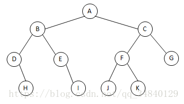

* [入门](#入门)
    * [217-存在重复元素](#217-存在重复元素)
    * [53-最大子数组和](#53-最大子数组和)
    * [1-两数之和](#1-两数之和)
    * [88-合并两个有序数组](#88-合并两个有序数组)
    * [350-两个数组的交集-ii](#350-两个数组的交集-ii)
    * [121-买卖股票的最佳时机](#121-买卖股票的最佳时机)
    * [566-重塑矩阵](#566-重塑矩阵)
    * [118-杨辉三角](#118-杨辉三角)
    * [36-有效的数独](#36-有效的数独)
    * [73-矩阵置零](#73-矩阵置零)
    * [387-字符串中的第一个唯一字符](#387-字符串中的第一个唯一字符)
    * [383-赎金信](#383-赎金信)
    * [242-有效的字母异位词](#242-有效的字母异位词)
    * [141-环形链表](#141-环形链表)
    * [21-合并两个有序链表](#21-合并两个有序链表)
    * [203-移除链表元素](#203-移除链表元素)
    * [206-反转链表](#206-反转链表)
    * [83-删除排序链表中的重复元素](#83-删除排序链表中的重复元素)
    * [20-有效的括号](#20-有效的括号)
    * [232-用栈实现队列](#232-用栈实现队列)
    * [144-二叉树的前序遍历](#144-二叉树的前序遍历)
    * [94-二叉树的中序遍历](#94-二叉树的中序遍历)
    * [145-二叉树的后序遍历](#145-二叉树的后序遍历)
    * [102-二叉树的层序遍历](#102-二叉树的层序遍历)
    * [104-二叉树的最大深度](#104-二叉树的最大深度)
    * [101-对称二叉树](#101-对称二叉树)
    * [226-翻转二叉树](#226-翻转二叉树)
    * [112-路径总和](#112-路径总和)
    * [700-二叉搜索树中的搜索](#700-二叉搜索树中的搜索)
    * [701-二叉搜索树中的插入操作](#701-二叉搜索树中的插入操作)
    * [98-验证二叉搜索树](#98-验证二叉搜索树)
    * [653-两数之和-iv---输入-bst](#653-两数之和-iv---输入-bst)
    * [235-二叉搜索树的最近公共祖先](#235-二叉搜索树的最近公共祖先)
    
# 入门

## [217. 存在重复元素](https://leetcode-cn.com/problems/contains-duplicate/solution/cun-zai-zhong-fu-yuan-su-by-leetcode-sol-iedd/)
给你一个整数数组 nums 。如果任一值在数组中出现 至少两次 ，返回 true ；如果数组中每个元素互不相同，返回 false 。
>示例1\
>输入：nums = [1,2,3,1]\
>输出：true

思路1：先用sort.Int排序，然后比较相邻元素是否相同\
```if nums[i] == nums[i-1]```\
思路2：hash表，判断hash表中是否存在该值，存在返回真，不存在则添加\
实现：[arr_repeat](../code/array/arr_repeat)

## [53. 最大子数组和](https://leetcode-cn.com/problems/maximum-subarray/)
给你一个整数数组 nums ，请你找出一个具有最大和的连续子数组（子数组最少包含一个元素），返回其最大和。\
子数组 是数组中的一个连续部分。
>示例1\
>输入：nums = [-2,1,-3,4,-1,2,1,-5,4]\
>输出：6\
>解释：连续子数组 [4,-1,2,1] 的和最大，为 6 。

思路：贪心算法，将前值累加，如果大于0则继续累计，同时求最大值
```go
func maxSubArray(nums []int) int {
    max := nums[0]
    for i :=1; i<len(nums);i++{
        if nums[i-1] > 0{
            nums[i] = nums[i] + nums[i-1]
        }
        if nums[i] > max{
            max = nums[i]
        }
    }
    return max
}
```
实现：[max_sub_array](../code/array/max_sub_array)

## [1. 两数之和](https://leetcode-cn.com/problems/two-sum/solution/liang-shu-zhi-he-by-leetcode-solution/)
给定一个整数数组 nums和一个整数目标值 target，请你在该数组中找出 和为目标值 target的那两个整数，并返回它们的数组下标。\
你可以假设每种输入只会对应一个答案。但是，数组中同一个元素在答案里不能重复出现。\
你可以按任意顺序返回答案。
>输入：nums = [2,7,11,15], target = 9\
>输出：[0,1]\
>解释：因为 nums[0] + nums[1] == 9 ，返回 [0, 1] 。

思路1：暴力枚举，通过两层迭代求解
```go
func twoSum(nums []int, target int) []int {
    for left:=0;left < len(nums)-1;left++{
        for right :=left+1;right<len(nums);right++{
            if nums[left]+nums[right]==target{
                return []int{left,right}
            }
        }
    }
    return []int{-1,-1}
}
```
思路2 ：hash表法，迭代期间，先求解hash表中是否存在目标值，不存在则将当前值加入hash表

```go
func twoSum(nums []int, target int) []int {
    hashTable := map[int]int{}
    for i, x := range nums {
        if p, ok := hashTable[target-x]; ok {
            return []int{p, i}
        }
        hashTable[x] = i
    }
    return nil
}
```
实现：[two_sum](../code/array/two_sum)

## [88. 合并两个有序数组](https://leetcode-cn.com/problems/merge-sorted-array/)
给你两个按 非递减顺序 排列的整数数组nums1 和 nums2，另有两个整数 m 和 n ，分别表示 nums1 和 nums2 中的元素数目。\
请你 合并 nums2 到 nums1 中，使合并后的数组同样按 非递减顺序 排列。\
注意：最终，合并后数组不应由函数返回，而是存储在数组 nums1 中。为了应对这种情况，nums1 的初始长度为 m + n，其中前 m 个元素表示应合并的元素，后 n 个元素为 0 ，应忽略。nums2 的长度为 n 。
>输入：nums1 = [1,2,3,0,0,0], m = 3, nums2 = [2,5,6], n = 3\
>输出：[1,2,2,3,5,6]\
>解释：需要合并 [1,2,3] 和 [2,5,6] 。\
>合并结果是 [1,2,2,3,5,6] ，其中斜体加粗标注的为 nums1 中的元素。

思路1：暴力排序，合并两个数组后，调用系统排序方法\
思路2：双指针法，题干的数组是有序数组（无序数组可以在排序后使用该方法，但效率可能不如第一个思路），直接用双指针进行排序
```go
func merge(nums1 []int, m int, nums2 []int, n int)  {
	sorted := make([]int, 0, m+n)
	i1, i2 := 0,0 // 双指针
	for{
		if i1 == m{ // num1 数组已遍历完
			sorted = append(sorted, nums2[i2:]...)
			break
		}
		if i2 == n{ // num2 数组已遍历完
			sorted = append(sorted, nums1[i1:]...)
			break
		}
		if nums1[i1] < nums2[i2]{
			sorted = append(sorted, nums1[i1])
			i1++
		} else{
			sorted = append(sorted, nums2[i2])
			i2++
		}
	}
	copy(nums1,sorted)
}
```
思路3：逆向双指针法
```go
for p1, p2, tail := m-1, n-1, m+n-1; p1 >= 0 || p2 >= 0; tail-- {
        var cur int
        if p1 == -1 {
            cur = nums2[p2]
            p2--
        } else if p2 == -1 {
            cur = nums1[p1]
            p1--
        } else if nums1[p1] > nums2[p2] {
            cur = nums1[p1]
            p1--
        } else {
            cur = nums2[p2]
            p2--
        }
        nums1[tail] = cur
    }
```
实现：[merge_increase_array](../code/array/merge_increase_array)

##  [350. 两个数组的交集 II](https://leetcode-cn.com/problems/intersection-of-two-arrays-ii/)
给你两个整数数组nums1 和 nums2 ，请你以数组形式返回两数组的交集。返回结果中每个元素出现的次数，应与元素在两个数组中都出现的次数一致（如果出现次数不一致，则考虑取较小值）。可以不考虑输出结果的顺序。
>输入：nums1 = [1,2,2,1], nums2 = [2,2]\
>输出：[2,2]

思路1：hash法，短hash表，长数组校验，各循环一次
```go
func intersectHash(nums1 []int, nums2 []int) []int {
	if len(nums1) > len(nums2) { // 用更短的数组作nums1，实现对更短数组记录hash表
		return intersectHash(nums2, nums1)
	}
	m := make(map[int]int) // m := map[int]int{}
	for _, num := range nums1 {
		m[num]++
	}
	intersection := []int{}
	for _, num := range nums2 {
		if m[num] > 0 {
			intersection = append(intersection, num)
			m[num]--
		}
	}
	return intersection
}
```
思路2：先排序，再加以双指针法
```go
func intersectDoubleIndex(nums1 []int, nums2 []int) []int {
	sort.Ints(nums1)
	sort.Ints(nums2)
	len1, len2 := len(nums1), len(nums2)
	index1, index2 := 0, 0
	intersetion := []int{}
	for index1 < len1 && index2 < len2 {
		if nums1[index1] < nums2[index2] {
			index1++
		} else if nums1[index1] > nums2[index2] {
			index2++
		} else { // 只有相等的值才会push到目标数组中
			intersetion = append(intersetion, nums1[index1])
			index1++
			index2++
		}
	}
	return intersetion
}
```
实现：[two_array_intersect](../code/array/two_array_intersect)

## [121. 买卖股票的最佳时机](https://leetcode-cn.com/problems/best-time-to-buy-and-sell-stock/)
给定一个数组 prices ，它的第i 个元素prices[i]表示一支给定股票第 i 天的价格。\
你只能选择 某一天 买入这只股票，并选择在 未来的某一个不同的日子 卖出该股票。设计一个算法来计算你所能获取的最大利润。\
返回你可以从这笔交易中获取的最大利润。如果你不能获取任何利润，返回 0 。
>输入：[7,1,5,3,6,4]\
>输出：5\
>解释：在第 2 天（股票价格 = 1）的时候买入，在第 5 天（股票价格 = 6）的时候卖出，最大利润 = 6-1 = 5 。\
>注意利润不能是 7-1 = 6, 因为卖出价格需要大于买入价格；同时，你不能在买入前卖出股票。

思路1：暴力法，两次迭代（数组长度大时，耗时）\
思路2：历史最低值，历史最大差值
```go
func maxProfit(prices []int) int {
	minPrice := prices[0] + 1
	maxProfit :=0
	for _, v := range prices{
		if v<minPrice{
			minPrice = v
		} else if maxProfit < v-minPrice{
			maxProfit = v-minPrice
		}
	}
	return maxProfit
}
```
实现：[stock_max_profit](../code/array/stock_max_profit)

## [566. 重塑矩阵](https://leetcode-cn.com/problems/reshape-the-matrix/)
在 MATLAB 中，有一个非常有用的函数 reshape ，它可以将一个m x n 矩阵重塑为另一个大小不同（r x c）的新矩阵，但保留其原始数据。\
给你一个由二维数组 mat 表示的m x n 矩阵，以及两个正整数 r 和 c ，分别表示想要的重构的矩阵的行数和列数。\
重构后的矩阵需要将原始矩阵的所有元素以相同的 行迭代顺序 填充。\
如果具有给定参数的 reshape 操作是可行且合理的，则输出新的重塑矩阵；否则，输出原始矩阵。

> 
>输入：mat = [[1,2],[3,4]], r = 1, c = 4\
>输出：[[1,2,3,4]]
>
> \
> 输入：mat = [[1,2],[3,4]], r = 2, c = 4\
>输出：[[1,2],[3,4]]

思路：二维数组的一维表示 \

```go
func matrixReshape(mat [][]int, r int, c int) [][]int {
	m, n := len(mat), len(mat[0])
	if m*n != r*c {
		return mat
	}
	newMat := make([][]int, r)
	for i := range newMat {
		newMat[i] = make([]int, c)
	}
	for i := 0; i < m*n; i++ {
		newMat[i/c][i%c] = mat[i/n][i%n]
	}
	return newMat
}
```
思路2：暴力解法
```go
func matrixReshape2(mat [][]int, r int, c int) [][]int {
	m, n := len(mat), len(mat[0])
	if m*n/r != c {
		return mat
	}
	var nums []int
	for _, v := range mat {
		nums = append(nums, v...)
	}
	newMat := make([][]int, r)
	for i, j := 0, 0; i < m*n; i = i + c {
		newMat[j] = nums[i : i+c]
		j++
	}
	return newMat
}
```
实现：[matrix_reshape](../code/array/matrix_reshape)

## [118. 杨辉三角](https://leetcode-cn.com/problems/pascals-triangle/)
给定一个非负整数 numRows，生成「杨辉三角」的前 numRows 行。\
在「杨辉三角」中，每个数是它左上方和右上方的数的和。 \

>输入: numRows = 5\
>输出: [[1],[1,1],[1,2,1],[1,3,3,1],[1,4,6,4,1]]
>
>输入: numRows = 1\
>输出: [[1]]

思路：数学，利用对称性\
特征：第n行有n个数，头尾数值为1，中间数值为前一行按序两两相加，且对称

```go
func generate2(numRows int) [][]int {
	ans := make([][]int, numRows)
	for i := range ans {
		ans[i] = make([]int, i+1)
		ans[i][0], ans[i][i] = 1, 1
		for j := 1; j < i; j++ {
			ans[i][j] = ans[i-1][j-1] + ans[i-1][j]
		}
	}
	return ans
}
```
最终思路
```go
// 合并循环，利用对称性
func generate3(numRows int) [][]int {
	ans := make([][]int, numRows)
	for i := range ans {
		ans[i] = make([]int, i+1)
		ans[i][0], ans[i][i] = 1, 1
		// 利用对称性，对半缩减循环
		for j := 1; j < i/2+1; j++ {
			ans[i][j] = ans[i-1][j-1] + ans[i-1][j]
			ans[i][i-j] = ans[i-1][j-1] + ans[i-1][j]
		}
	}
	return ans
}
```
实现：[yang_hui_triangle](../code/yang_hui_triangle)

## [36. 有效的数独](https://leetcode-cn.com/problems/valid-sudoku/)

请你判断一个9 x 9 的数独是否有效。只需要 根据以下规则 ，验证已经填入的数字是否有效即可。\
数字1-9在每一行只能出现一次。\
数字1-9在每一列只能出现一次。\
数字1-9在每一个以粗实线分隔的3x3宫内只能出现一次。（请参考示例图）\
\

**注意：**\
一个有效的数独（部分已被填充）**不一定是可解**的。\
只需要根据以上规则，验证已经填入的数字是否有效即可。\
**空白格** 用 **'.'** 表示。
>输入：board =
>[["5","3",".",".","7",".",".",".","."]
>,["6",".",".","1","9","5",".",".","."]
>,[".","9","8",".",".",".",".","6","."]
>,["8",".",".",".","6",".",".",".","3"]
>,["4",".",".","8",".","3",".",".","1"]
>,["7",".",".",".","2",".",".",".","6"]
>,[".","6",".",".",".",".","2","8","."]
>,[".",".",".","4","1","9",".",".","5"]
>,[".",".",".",".","8",".",".","7","9"]]
>输出：true

思路1：将二维数组展开为一维数组，再用hash表查重，写完代码发现其实复杂度更高了。
实现见[code](../code/array/sudoku_is_valid/test.go)

思路2：直接二维展开，通过3个hash表分别查重\
巧妙 `index := v - '1'`，取相对值，1-9的所有值相对1的位值作索引
```go
func isValidSudoku(board [][]byte) bool {
	var rows, cols [9][9]int
	var ceils [3][3][9]int // 小方块的查重
	for i, r := range board {
		for j, v := range r {
			if v == '.' {
				continue
			}
			index := v - '1'
			rows[i][index]++ // 查行
			cols[j][index]++ // 查列
			ceils[i/3][j/3][index]++ // 查小方块
			if rows[i][index] > 1 || cols[j][index] > 1 || ceils[i/3][j/3][index] > 1 {
				return false
			}
		}
	}
	return true
}
```
实现：[sudoku_is_valid](../code/array/sudoku_is_valid)

## [73. 矩阵置零](https://leetcode-cn.com/problems/set-matrix-zeroes/)
给定一个 m x n 的矩阵，如果一个元素为 0 ，则将其所在行和列的所有元素都设为 0 。请使用 [原地](https://baike.baidu.com/item/%E5%8E%9F%E5%9C%B0%E7%AE%97%E6%B3%95) 算法。\

> 示例1\
> 输入：matrix = [[1,1,1],[1,0,1],[1,1,1]]\
> 输出：[[1,0,1],[0,0,0],[1,0,1]]\
> 
>
> 示例2\
> 输入：matrix = [[0,1,2,0],[3,4,5,2],[1,3,1,5]]\
> 输出：[[0,0,0,0],[0,4,5,0],[0,3,1,0]]\
> 

> 函数输入```func setZeroes(matrix [][]int) ```

思路1：变量记录需要变更的行列索引数据```row, col := map[int]bool{}, map[int]bool{}```
> 两次迭代，第一次获取索引数据，第二次变更
```go
func setZeroes(matrix [][]int) {
	row, col := map[int]bool{}, map[int]bool{}
	for i, r := range matrix {
		for j, v := range r {
			if v == 0 {
				row[i] = true
				col[j] = true
			}
		}
	}
	for i, r := range matrix {
		for j, _ := range r {
			if row[i] || col[j] {
				matrix[i][j] = 0
			}
		}
	}
}
```

思路2：用矩阵的第一行和第一列代替方法一中的两个标记数组，以达到 O(1) 的额外空间。但这样会导致原数组的第一行和第一列被修改，无法记录它们是否原本包含 00。因此我们需要额外使用两个标记变量分别记录第一行和第一列是否原本包含 0。
```go
    n, m := len(matrix), len(matrix[0])
    row0, col0 := false, false
    for _, v := range matrix[0] {
        if v == 0 {
            row0 = true
            break
        }
    }
    for _, r := range matrix {
        if r[0] == 0 {
            col0 = true
            break
        }
    }
    for i := 1; i < n; i++ {
        for j := 1; j < m; j++ {
            if matrix[i][j] == 0 {
                matrix[i][0] = 0
                matrix[0][j] = 0
            }
        }
    }
    for i := 1; i < n; i++ {
        for j := 1; j < m; j++ {
            if matrix[i][0] == 0 || matrix[0][j] == 0 {
                matrix[i][j] = 0
            }
        }
    }
    if row0 {
        for j := 0; j < m; j++ {
            matrix[0][j] = 0
        }
    }
    if col0 {
        for _, r := range matrix {
            r[0] = 0
        }
    }
```
实现：[matrix_set_zeros](../code/array/matrix_set_zeros)

## [387. 字符串中的第一个唯一字符](https://leetcode-cn.com/problems/first-unique-character-in-a-string/)
给定一个字符串，找到它的第一个不重复的字符，并返回它的索引。如果不存在，则返回 -1。

> 输入：s = "leetcode"\
> 输出：返回 0
>
> 输入：s = "loveleetcode"\
> 输出：返回 2

**提示**：你可以假定该字符串只包含小写字母。

思路1：hash表记录出现次数，两次迭代获取首个出现一次的索引\
注意，range字符串返回的是int32的值
```go
func firstUniqChar2(s string)int  {
	a := make(map[int32]int)
	for _, v:=range s{
		a[v]++
	}
	for i,v:=range s{
		if a[v] == 1{
			return i
		}
	}
	return -1
}
```
思路2：hash表法，利用先进先出的数组，嵌套迭代\
关键思路，对首个非唯一的字符串进行排除
```go
	for len(que) > 0 && hashTable[que[0].ch] >1{
		que = que[1:] // 先进先出
	}
```
先进先出关键代码```que = que[1:]```
代码：
```go
type loc struct {
    ch  int32 // 字符串被range之后的值
    pos int
}

func firstUniqChar5(s string) int {
	var que []loc
	hashTable := make(map[int32]int)
	for i,v:=range s{
		hashTable[v]++
		if hashTable[v] == 1{
			que = append(que, loc{v, i})
		}
	}
	for len(que) > 0 && hashTable[que[0].ch] >1{
		que = que[1:] // 先进先出
	}
	if len(que)>0{
		return que[0].pos
	}
	return -1
}
```
实现：[char_first_unique](../code/string/char_first_unique)\
**_注意_**：力扣官方解法，仅限定小写字母，所以可以声明```[26]int{}```

## [383. 赎金信](https://leetcode-cn.com/problems/ransom-note/)
给你两个字符串：ransomNote 和 magazine ，判断 ransomNote 能不能由 magazine 里面的字符构成。\
如果可以，返回 true ；否则返回 false 。\
magazine 中的每个字符只能在 ransomNote 中使用一次。

> 示例 1：\
> 输入：ransomNote = "a", magazine = "b"\
> 输出：false
>
> 示例 2：\
> 输入：ransomNote = "aa", magazine = "ab"\
> 输出：false
>
> 示例 3：\
> 输入：ransomNote = **"aa"**, magazine = **"aba"**\
> 输出：true

关键点，```ransomNote```中同一字符出现的次数要小于等于```magazine```中字符

思路：hash表法，先统计```magazine```中字符出现次数，迭代```ransomNote```，如果```ransomNote```出现其他字符或者字符多于```magazine```则返回false
```go
func canConstruc2(ransomNote string, magazine string) bool{
	mHash:=make(map[int32]int)
	for _,v:=range magazine{
		mHash[v]++
	}
	for _,v:=range ransomNote{
		mHash[v]--
		if mHash[v] < 0{
			return false
		}
	}
	return true
}
```
实现：[char_can_construct](../code/string/char_can_construct)

## [242. 有效的字母异位词](https://leetcode-cn.com/problems/valid-anagram/)
给定两个字符串 s 和 t ，编写一个函数来判断 t 是否是 s 的字母异位词。\
**注意**：若s 和 t中每个字符出现的次数都相同，则称s 和 t互为字母异位词。
> 示例1:\
> 输入: s = "anagram", t = "nagaram"\
> 输出: true
>
> 示例 2:\
> 输入: s = "rat", t = "car"\
> 输出: false

思路1：hash表法，同383. 赎金信
```go
func isAnagram2(s string, t string) bool {
	if len(s) != len(t){
		return false
	}
	sHash := make(map[rune]int)
	for _,v:=range s{
		sHash[v]++
	}
	for _,v:=range t{
		sHash[v]--
		if sHash[v] < 0{
			return false
		}
	}
	return true
}
```
思路2：对两个字符串进行排序后比较
```go
func isAnagram3(s string, t string) bool {
	ls1,ls2 := []byte(s),[]byte(t)
	sort.Slice(ls1, func(i, j int) bool {
		return ls1[i]<ls1[j]
	})
	sort.Slice(ls2, func(i, j int) bool {
		return ls2[i]<ls2[j]
	})
	return string(ls1) == string(ls2)
}
```
实现：[char_is_anagram](../code/string/char_is_anagram)

## [141. 环形链表](https://leetcode-cn.com/problems/linked-list-cycle/)
给你一个链表的头节点 head ，判断链表中是否有环。\
如果链表中有某个节点，可以通过连续跟踪 next 指针再次到达，则链表中存在环。 为了表示给定链表中的环，评测系统内部使用整数 pos 来表示链表尾连接到链表中的位置（索引从 0 开始）。注意：pos 不作为参数进行传递。仅仅是为了标识链表的实际情况。\
如果链表中存在环，则返回 true 。 否则，返回 false 。

```go
/**
 * Definition for singly-linked list.
 * type ListNode struct {
 *     Val int
 *     Next *ListNode
 * }
 */
```
>  \
> 输入：head = [3,2,0,-4], pos = 1\
> 输出：true\
> 解释：链表中有一个环，其尾部连接到第二个节点。
>
>  \
> 输入：head = [1,2], pos = 0\
> 输出：true\
> 解释：链表中有一个环，其尾部连接到第一个节点。
>
>  \
> 输入：head = [1], pos = -1\
> 输出：false\
> 解释：链表中没有环。

思路1：快慢指针，如果快指针先到达nil值，则没有循环，如果快指针和慢指针相等则说明有循环
```go
func hasCycle(head *ListNode) bool {
    fast, slow:= head, head
    for{
        if fast == nil || fast.Next == nil{
            return false
        }
        fast = fast.Next.Next
        slow = slow.Next
        if fast == slow{
            break
        }
    }
    return true
}
```
思路2：hash表法
```go
func hasCycle(head *ListNode) bool {
    seen := map[*ListNode]bool{}
    for head != nil {
        if seen[head] {
            return true
        }
        seen[head] = true
        head = head.Next
    }
    return false
}
```

## [21. 合并两个有序链表](https://leetcode-cn.com/problems/merge-two-sorted-lists/)
将两个升序链表合并为一个新的 升序 链表并返回。新链表是通过拼接给定的两个链表的所有节点组成的。

 \
> 输入：l1 = [1,2,4], l2 = [1,3,4]\
> 输出：[1,1,2,3,4,4]

思路1：递归调用
```go
func mergeTwoLists(list1 *ListNode, list2 *ListNode) *ListNode {
    if list1 == nil{
        return list2
    }
    if list2 == nil{
        return list1
    }
    if list1.Val < list2.Val{
        list1.Next = mergeTwoLists(list1.Next, list2)
        return list1
    }
    list2.Next = mergeTwoLists(list2.Next, list1)
    return list2
}
```
[思路2](https://leetcode-cn.com/problems/merge-two-sorted-lists/solution/he-bing-liang-ge-you-xu-lian-biao-by-leetcode-solu/) ：双指针、哨兵 & 游标法

```go
func mergeTwoLists(list1 *ListNode, list2 *ListNode) *ListNode {
    var ls *ListNode = new (ListNode)
    var p = ls // ls作为哨兵，p作为游标，游标不断Next前进，直到最后迭代完
    for list1 != nil && list2 != nil{
        if list1.Val < list2.Val{
            p.Next = list1
            list1 = list1.Next
        } else{
            p.Next = list2
            list2 = list2.Next
        }
        p = p.Next

    }
    if list1 == nil{
        p.Next = list2
    } else{
        p.Next = list1
    }
    return ls.Next
}
```

## [203. 移除链表元素](https://leetcode-cn.com/problems/remove-linked-list-elements/)
给你一个链表的头节点 head 和一个整数 val ，请你删除链表中所有满足 Node.val == val 的节点，并返回 新的头节点 。

>  \
> 输入：head = [1,2,6,3,4,5,6], val = 6\
> 输出：[1,2,3,4,5]

思路1：迭代法，通过配置游标的方式
code1：
```go
func removeElements(head *ListNode, val int) *ListNode {
    for head != nil && head.Val == val{ // 去除头部可能相同值的节点
        head = head.Next
    }
    if head == nil{
        return head
    }
    prev := head // 配置游标
    for prev.Next != nil{
        if prev.Next.Val == val{
            prev.Next = prev.Next.Next // 删除相同值节点
        } else{
            prev = prev.Next // 游往下一个节点
        }
    }
    return head
}
```
code2：
```go
func removeElements(head *ListNode, val int) *ListNode {
    var preHead *ListNode = &ListNode{Next: head}
    for temp := preHead; temp.Next != nil;{ // 游标
        if temp.Next.Val == val{
            temp.Next = temp.Next.Next
        } else{
            temp = temp.Next
        }
    }
    return preHead.Next
}
```

思路2：递归
```go
func removeElements(head *ListNode, val int) *ListNode {
    if head == nil{
        return head
    }
    head.Next = removeElements(head.Next, val)
    if head.Val == val{
        return head.Next
    }
    return head
}
```

## [206. 反转链表](https://leetcode-cn.com/problems/reverse-linked-list/)
给你单链表的头节点 head ，请你反转链表，并返回反转后的链表。

>  \
> 输入：head = [1,2,3,4,5]\
> 输出：[5,4,3,2,1]
>
> 输入：head = []
> 输出：[]

思路1：迭代，通过栈辅助
```go
func reverseList(head *ListNode) *ListNode {
	if head == nil{
		return head
	}
	nodeList := []*ListNode{}
	for head != nil{
		nodeList = append(nodeList, head)
		head = head.Next
	}
	preHead := new(ListNode)
	prev := preHead
	for i:=len(nodeList)-1;i>=0;i--{
		prev.Next = nodeList[i]
		prev = prev.Next
	}
	prev.Next = nil
	return preHead.Next
}
```

思路2：迭代，倒叙迭代 \

```go
func reverseList(head *ListNode) *ListNode {
	var nilHead *ListNode
	node1 := head
	for node1 != nil {
		node2 := node1.Next
		node1.Next = nilHead // 倒叙排列
		nilHead = node1
		node1 = node2
	}
	return nilHead
}
```


思路3：[递归](https://leetcode-cn.com/problems/reverse-linked-list/solution/dong-hua-yan-shi-206-fan-zhuan-lian-biao-by-user74/) 
```go
func reverseList3(head *ListNode) *ListNode {
	if head == nil || head.Next == nil{
		return head
	}
	cur := reverseList3(head.Next) //  一直递归到head.Next = 5，cur为5
	head.Next.Next = head // head为游标，将cur为5的next指向当前head（4）
	head.Next = nil
	return cur
}
```
实现：[reverse.go](../code/list_node/reverse/reverse.go)

## [83. 删除排序链表中的重复元素](https://leetcode-cn.com/problems/remove-duplicates-from-sorted-list/)
给定一个已排序的链表的头 head ， 删除所有重复的元素，使每个元素只出现一次 。返回 已排序的链表 。

>  \
> 输入：head = [1,1,2]\
> 输出：[1,2]

思路：迭代
```go
func deleteDuplicates2(head *ListNode) *ListNode {
	if head == nil {
		return nil
	}
	prev := head
	for prev.Next != nil {
		if prev.Val == prev.Next.Val {
			prev.Next = prev.Next.Next
		} else {
			prev = prev.Next
		}
	}
	return head
}
```
实现：[delete.go](../code/list_node/duplicates/delete.go)

## [20. 有效的括号](https://leetcode-cn.com/problems/valid-parentheses/)
给定一个只包括 '('，')'，'{'，'}'，'['，']'的字符串 s ，判断字符串是否有效。\
有效字符串需满足：
1. 左括号必须用相同类型的右括号闭合。
2. 左括号必须以正确的顺序闭合。

>示例 1：\
> 输入：s = "()"\
> 输出：true
>
> 示例2：\
> 输入：s = "()[]{}"\
> 输出：true

> 示例3：\
> 输入：s = "(]"\
> 输出：false

> 示例4：\
> 输入：s = "([)]"\
> 输出：false

> 示例5：\
> 输入：s = "{[]}"\
> 输出：true

思路：栈
实现1：
```go
func isValid(s string) bool {
	if len(s)%2 != 0 {
		return false
	}
	ss := strings.Split(s, "")
	isStart := map[string]bool{
		"{": true,
		"[": true,
		"(": true,
	}
	rightEnd := map[string]string{
		"{": "}",
		"[": "]",
		"(": ")",
	}
	starts := []string{}
	for _,v:=range ss{
		if isStart[v]{
			starts = append(starts,v)
			continue
		}
		if len(starts) == 0 || rightEnd[starts[len(starts) - 1]] != v{
			return false
		}
		starts = starts[0:len(starts)-1]
	}
	if len(starts) > 0{
		return false
	}
	return true
}
```
实现2：
```go
func isValid2(s string) bool {
	if len(s)%2 != 0 {
		return false
	}
	rl := map[byte]byte{
		'[':']',
		'{':'}',
		'(':')',
	}
	stack := []byte{}
	for i := range s{
		if rl[s[i]]>0{
			stack = append(stack, s[i])
			continue
		}
		if len(stack) == 0 || rl[stack[len(stack)-1]] != s[i]{
			return false
		}
		stack = stack[:len(stack)-1]
	}
	return len(stack) == 0
}
```
实现：[is_valid.go](../code/string/brackets/is_valid.go)


## [232. 用栈实现队列](https://leetcode-cn.com/problems/implement-queue-using-stacks/)
请你仅使用两个栈实现先入先出队列。队列应当支持一般队列支持的所有操作（push、pop、peek、empty）：

实现 MyQueue 类：
1. void push(int x) 将元素 x 推到队列的末尾
2. int pop() 从队列的开头移除并返回元素
3. int peek() 返回队列开头的元素
4. boolean empty() 如果队列为空，返回 true ；否则，返回 false

说明：
1. 你只能使用标准的栈操作 —— 也就是只有 push to top, peek/pop from top, size, 和 is empty 操作是合法的。
2. 你所使用的语言也许不支持栈。你可以使用 list 或者 deque（双端队列）来模拟一个栈，只要是标准的栈操作即可。
```go
type MyQueue struct {
    inStack, outStack []int
}

func Constructor() MyQueue {
    return MyQueue{}
}

func (q *MyQueue) Push(x int) {
    q.inStack = append(q.inStack, x)
}

func (q *MyQueue) in2out() {
    for len(q.inStack) > 0 {
        q.outStack = append(q.outStack, q.inStack[len(q.inStack)-1])
        q.inStack = q.inStack[:len(q.inStack)-1]
    }
}

func (q *MyQueue) Pop() int {
    if len(q.outStack) == 0 {
        q.in2out()
    }
    x := q.outStack[len(q.outStack)-1]
    q.outStack = q.outStack[:len(q.outStack)-1]
    return x
}

func (q *MyQueue) Peek() int {
    if len(q.outStack) == 0 {
        q.in2out()
    }
    return q.outStack[len(q.outStack)-1]
}

func (q *MyQueue) Empty() bool {
    return len(q.inStack) == 0 && len(q.outStack) == 0
}
```

## [144. 二叉树的前序遍历](https://leetcode-cn.com/problems/binary-tree-preorder-traversal/)

> 二叉树结构
>
> 
>
> 先序遍历：先(根)序遍历（根左右）\
> 中序遍历：中(根)序遍历（左根右）\
> 后序遍历：后(根)序遍历（左右根）
>

给你二叉树的根节点 root，返回它节点值的 前序 遍历。

实现1：
```go
func preorderTraversal(root *TreeNode) []int {
    vals :=[]int{}
    stack := []*TreeNode{}
    node := root
    for node != nil || len(stack)>0{
        for node != nil{
            vals = append(vals, node.Val)
            stack = append(stack, node.Right)
            node = node.Left
        }
        node = stack[len(stack)-1]
        stack = stack[:len(stack)-1]
    }

    return vals
}
```

实现2：是实现一的递归
```go
func preorderTraversal(root *TreeNode) []int {
    vals := []int{}
    var preorder func(*TreeNode)
    preorder =func (node *TreeNode){
        if node == nil{
            return
        }
        vals = append(vals, node.Val)
        preorder(node.Left)
        preorder(node.Right)
    }
    preorder(root)
    return vals
}
```

## [94. 二叉树的中序遍历](https://leetcode-cn.com/problems/binary-tree-inorder-traversal/)
中序遍历，参考上题
> 中序遍历：中(根)序遍历（左根右）


```go
func inorderTraversal(root *TreeNode) []int {
    vals :=[]int{}
    stack := []*TreeNode{}
    node := root
    for node != nil || len(stack)>0{
        for node != nil{
            stack = append(stack, node)
            node = node.Left
        }
        node = stack[len(stack)-1]
        stack = stack[:len(stack)-1]
        vals = append(vals, node.Val)
        node = node.Right
    }

    return vals
}
```
实现2：
```go
func inorderTraversal(root *TreeNode) []int {
    vals := []int{}
    var preorder func(*TreeNode)
    preorder =func (node *TreeNode){
        if node == nil{
            return
        }
        preorder(node.Left)
        vals = append(vals, node.Val)
        preorder(node.Right)
    }
    preorder(root)
    return vals
}
```

## [145. 二叉树的后序遍历](https://leetcode-cn.com/problems/binary-tree-postorder-traversal/)
同144题
> 后序遍历：后(根)序遍历（左右根）
>
实现1：
```go
func postorderTraversal(root *TreeNode) []int {
    vals := []int{}
    var preorder func(*TreeNode)
    preorder =func (node *TreeNode){
        if node == nil{
            return
        }
        preorder(node.Left)
        preorder(node.Right)
        vals = append(vals, node.Val)
    }
    preorder(root)
    return vals
}
```
实现2：\

1. 先迭代所有左侧的节点，填入节点栈
2. 将最深处的左侧节点值填入结果栈
3. 对最深处节点右侧节点填入节点栈
4. 迭代 2
```go
func postorderTraversal(root *TreeNode) []int {
    vals :=[]int{}
    stack := []*TreeNode{}
    var prev *TreeNode
    for root != nil || len(stack) > 0{
        for root != nil{
            stack = append(stack, root)
            root = root.Left
        }
        root = stack[len(stack)-1]
        stack = stack[:len(stack)-1]
        if root.Right == nil || root.Right == prev{
            vals = append(vals, root.Val)
            prev = root
            root = nil
        } else{
            stack = append(stack, root)
            root = root.Right
        }
    }

    return vals
}
```

## [102. 二叉树的层序遍历](https://leetcode-cn.com/problems/binary-tree-level-order-traversal/)
给你二叉树的根节点 root ，返回其节点值的 层序遍历 。 （即逐层地，从左到右访问所有节点）。

> 
> 输入：root = [3,9,20,null,null,15,7] \
> 输出：[[3],[9,20],[15,7]]

思路1：迭代读取逐层节点，并逐层填入结果栈
```go
func levelOrder(root *TreeNode) [][]int {
    vals := [][]int{}
    var levels []*TreeNode
    for root != nil || len(levels) > 0{
        tempVals := []int{}
        if root != nil{
            tempVals = append(tempVals, root.Val)
            vals = append(vals, tempVals)
            levels = []*TreeNode{}
            levels = pushNode(root.Left, levels)
            levels = pushNode(root.Right, levels)
            root = nil
            continue
        }
        tempNodes := []*TreeNode{}
        for _, node := range levels{
            tempVals = append(tempVals, node.Val)
            tempNodes = pushNode(node.Left, tempNodes)
            tempNodes = pushNode(node.Right, tempNodes)
        }
        vals = append(vals, tempVals)
        levels = tempNodes
    }
    return vals
}

// 填入非空节点
func pushNode(node *TreeNode, ns []*TreeNode) []*TreeNode{
    if node != nil{
        ns = append(ns, node)
    }
    return ns
}
```
简易实现
```go
func levelOrder(root *TreeNode) [][]int {
    ret := [][]int{}
    if root == nil {
        return ret
    }
    q := []*TreeNode{root}
    for i := 0; len(q) > 0; i++ {
        ret = append(ret, []int{})
        p := []*TreeNode{}
        for j := 0; j < len(q); j++ {
            node := q[j]
            ret[i] = append(ret[i], node.Val)
            if node.Left != nil {
                p = append(p, node.Left)
            }
            if node.Right != nil {
                p = append(p, node.Right)
            }
        }
        q = p
    }
    return ret
}
```

## [104. 二叉树的最大深度](https://leetcode-cn.com/problems/maximum-depth-of-binary-tree/)

给定一个二叉树，找出其最大深度。\
二叉树的深度为根节点到最远叶子节点的最长路径上的节点数。\
说明: 叶子节点是指没有子节点的节点。
如下，返回3
```tree
    3
   / \
  9  20
    /  \
   15   7
```
思路：类似102
```go
func maxDepth(root *TreeNode) int {
    if root == nil {
        return 0
    }
    level := 0
    q := []*TreeNode{root}
    for i := 0; len(q) > 0; i++ {
        p := []*TreeNode{}
        for _, node := range(q){
            if node.Left != nil {
                p = append(p, node.Left)
            }
            if node.Right != nil {
                p = append(p, node.Right)
            }
        }
        q = p
        level++
    }
    return level
}
```
思路2，利用递归
```go
func maxDepth(root *TreeNode) int {
    if root == nil{
        return 0
    }
    return max(maxDepth(root.Right), maxDepth(root.Left)) + 1 // 每层选最大的长度+1
}

func max(a,b int) int{
    if a > b{
        return a
    }
    return b
}
```

## [101. 对称二叉树](https://leetcode-cn.com/problems/symmetric-tree/)
下列思路存在问题：如果元素为空，那么不会纳入到节点栈，那么就可以会进入到错位对比，会出错：\
`[1,2,2,null,3,null,3]`\
在第三层，`null,3,null,3` -》变为`3,3`
```go
func isSymmetric(root *TreeNode) bool {
    if root == nil{
        return true
    }
    nodes := []*TreeNode{root}
    for i := 0; len(nodes) > 0; i++ {
        if i > 0 && len(nodes) % 2 != 0{
            return false
        }
        temps := []*TreeNode{}
        for j, node := range(nodes){
            if i > 0 && j < len(nodes) / 2 && node.Val != nodes[len(nodes)-j-1].Val{
                return false
            }
            if node.Left == nil {
                temps = append(temps, node.Left)
            } else
            if node.Right != nil {
                temps = append(temps, node.Right)
            }
        }
        nodes = temps
    }
    return true
}
```
思路1：利用递归
```go
func isSymmetric(root *TreeNode) bool {
    return check(root, root)
}

func check(left, right *TreeNode) bool{
    if left == nil && right == nil{
        return true
    }
    if left == nil || right == nil{
        return false
    }
    return left.Val == right.Val && check(left.Left, right.Right) && check(left.Right, right.Left)
}
```
思路2：迭代：将需要对比的两个节点，两两前后填入节点栈，每次对比两个
```go
func isSymmetric(root *TreeNode) bool {
    var left, right *TreeNode
    que :=[]*TreeNode{root, root}
    for len(que)>0 {
        left, right = que[0], que[1]
        que = que[2:]
        if left == nil && right == nil{
            continue
        }
        if left == nil || right == nil{
            return false
        }
        if left.Val != right.Val{
            return false
        }

        que = append(que, left.Left)
        que = append(que, right.Right)
        
        que = append(que, left.Right)
        que = append(que, right.Left)
    }
    return true
}
```

## [226. 翻转二叉树](https://leetcode-cn.com/problems/invert-binary-tree/)
给你一棵二叉树的根节点 root ，翻转这棵二叉树，并返回其根节点。

>  \
> 输入：root = [4,2,7,1,3,6,9]\
> 输出：[4,7,2,9,6,3,1]

思路1：递归
```go
func invertTree(root *TreeNode) *TreeNode {
    if root == nil{
        return root
    }
    root.Left, root.Right = invertTree(root.Right), invertTree(root.Left)
    return root
}
```
思路2：迭代、遍历
```go
func invertTree(root *TreeNode) *TreeNode {
    if root == nil{
        return root
    }
    nodes := []*TreeNode{root}
    for len(nodes) > 0{
        node := nodes[0]
        nodes = nodes[1:]
        node.Left, node.Right = node.Right, node.Left
        if node.Left != nil{
            nodes = append(nodes, node.Left)
        }
        if node.Right != nil{
            nodes = append(nodes, node.Right)
        }
    }
    return root
}
```

## [112. 路径总和](https://leetcode-cn.com/problems/path-sum/)
给你二叉树的根节点root 和一个表示目标和的整数targetSum 。判断该树中是否存在 根节点到叶子节点 的路径，这条路径上所有节点值相加等于目标和 targetSum 。如果存在，返回 true ；否则，返回 false 。\
叶子节点 是指没有子节点的节点。

> 
> 输入：root = [5,4,8,11,null,13,4,7,2,null,null,null,1], targetSum = 22\
> 输出：true \
> 解释：等于目标和的根节点到叶节点路径如上图所示。

思路1：迭代
```go
func hasPathSum(root *TreeNode, targetSum int) bool {
    if root == nil{
        return false
    }
    nodes := []*TreeNode{root}
    for len(nodes)>0{
        node := nodes[0]
        nodes = nodes[1:]
        if node.Right == nil && node.Left == nil{
            if node.Val == targetSum{
                return true
            }
            continue
        }
        if node.Left != nil{
            node.Left.Val += node.Val
            nodes = append(nodes, node.Left)
        }
        if node.Right != nil{
            node.Right.Val += node.Val
            nodes = append(nodes, node.Right)
        }
    }
    return false
}
```
思路2：递归
```go
func hasPathSum(root *TreeNode, targetSum int) bool {
    if root == nil{
        return false
    }
    if root.Left == nil && root.Right == nil{
        return root.Val == targetSum
    }
    if root.Left != nil{
        root.Left.Val += root.Val
    }
    if root.Right != nil{
        root.Right.Val += root.Val
    }
    return hasPathSum(root.Left, targetSum) || hasPathSum(root.Right, targetSum)
}
```
优化思路2：
```go
func hasPathSum(root *TreeNode, targetSum int) bool {
    if root == nil{
        return false
    }
    if root.Left == nil && root.Right == nil{
        return root.Val == targetSum
    }
    return hasPathSum(root.Left, targetSum - root.Val) || hasPathSum(root.Right, targetSum - root.Val)
}
```

## [700. 二叉搜索树中的搜索](https://leetcode-cn.com/problems/search-in-a-binary-search-tree/)
给定二叉搜索树（BST）的根节点root和一个整数值val。\
你需要在 BST 中找到节点值等于val的节点。 返回以该节点为根的子树。 如果节点不存在，则返回 null 。

> 二叉搜索树满足如下性质：
> - 左子树所有节点的元素值均小于根的元素值；
> - 右子树所有节点的元素值均大于根的元素值。

>  \
> 输入：root = [4,2,7,1,3], val = 2 \
> 输出：[2,1,3]
>
>  \
> 输入：root = [4,2,7,1,3], val = 5 \
> 输出：[]

思路1：迭代
```go
func searchBST(root *TreeNode, val int) *TreeNode {
    if root == nil{
        return root
    }
    nodes := []*TreeNode{root}
    for len(nodes) > 0{
        node := nodes[0]
        if node.Val == val{
            return node
        }
        nodes = nodes[1:]
        if node.Left != nil{
            nodes = append(nodes, node.Left)
        }
        if node.Right != nil{
            nodes = append(nodes, node.Right)
        }
    }
    return nil
}
```
优化
```go
func searchBST(root *TreeNode, val int) *TreeNode {
    if root == nil{
        return root
    }
    for root != nil{
        if root.Val == val{
            return root
        }
        if val < root.Val{
            root = root.Left
        } else {
            root = root.Right
        }
    }
    return root
}
```
思路2：递归
```go
func searchBST(root *TreeNode, val int) *TreeNode {
    if root == nil{
        return root
    }
    if root.Val == val{
        return root
    }
    if val < root.Val{
        return searchBST(root.Left, val)
    }
    return searchBST(root.Right, val)
}
```

## [701. 二叉搜索树中的插入操作](https://leetcode-cn.com/problems/insert-into-a-binary-search-tree/)
给定二叉搜索树（BST）的根节点root和要插入树中的值value，将值插入二叉搜索树。 返回插入后二叉搜索树的根节点。 输入数据 保证 ，新值和原始二叉搜索树中的任意节点值都不同。\
注意，可能**存在多种有效**的插入方式，只要树在插入后仍保持为二叉搜索树即可。 你**可以返回任意有效**的结果 。

>  \
> 输入：root = [4,2,7,1,3], val = 5 \
> 输出：[4,2,7,1,3,5] \
> 解释：另一个满足题目要求可以通过的树是： \
> 

思路1：迭代
```go
func insertIntoBST(root *TreeNode, val int) *TreeNode {
    node := new(TreeNode)
    node.Val = val
    if root == nil{
        return node
    }
    prev := root
    for true{
        if val < prev.Val{
            if prev.Left == nil{
                prev.Left = node
                return root
            }
            prev = prev.Left
            continue
        }
        if prev.Right == nil{
            prev.Right = node
            return root
        }
        prev = prev.Right
    }
    return root
}
```
优化：新节点作为一个结果并**在需要的时候初始化**，减少变量`&TreeNode{Val: val}`
```go
func insertIntoBST(root *TreeNode, val int) *TreeNode {
    if root == nil{
        return &TreeNode{Val: val}
    }
    prev := root
    for true{
        if val < prev.Val{
            if prev.Left == nil{
                prev.Left = &TreeNode{Val: val}
                return root
            }
            prev = prev.Left
            continue
        }
        if prev.Right == nil{
            prev.Right = &TreeNode{Val: val}
            return root
        }
        prev = prev.Right
    }
    return root
}
```
思路2：递归
```go
func insertIntoBST(root *TreeNode, val int) *TreeNode {
    if root == nil{
        return &TreeNode{Val: val}
    }
    if val < root.Val{
        root.Left = insertIntoBST(root.Left, val)
    } else{
        root.Right = insertIntoBST(root.Right, val)
    }
    return root
}
```
## [98. 验证二叉搜索树](https://leetcode-cn.com/problems/validate-binary-search-tree/)
给你一个二叉树的根节点 root ，判断其是否是一个有效的二叉搜索树。\
> 有效 二叉搜索树定义如下：
> - 节点的左子树只包含 小于 当前节点的数。
> - 节点的右子树只包含 大于 当前节点的数。
> - 所有左子树和右子树自身必须也是二叉搜索树。\
    > 大白话讲就是右边的**都比顶点大**

思路1：递归
```go
func isValidBST(root *TreeNode) bool {
    return checkBST(root, math.MinInt64, math.MaxInt64)
}
func checkBST(node *TreeNode, min, max int) bool{
    if node == nil{
        return true
    }
    if node.Val <= min || node.Val >= max{
        return false
    }
    return checkBST(node.Left, min, node.Val) && checkBST(node.Right, node.Val, max)
}
```
思路2：中序遍历，作比较
- 中序遍历：中(根)序遍历（左根右）
- 二叉搜索树，左侧<根<右侧节点值
```go
func isValidBST(root *TreeNode) bool {
    min := math.MinInt64
    que :=[]*TreeNode{}
    for root != nil || len(que) > 0{
        for root != nil{
            que = append(que,root)
            root = root.Left
        }
        root = que[len(que)-1]
        que = que[:len(que)-1]
        if min >= root.Val{
            return false
        }
        min = root.Val
        root = root.Right
    }
    return true
}
```

## [653. 两数之和 IV - 输入 BST](https://leetcode-cn.com/problems/two-sum-iv-input-is-a-bst/)
给定一个二叉搜索树 root 和一个目标结果 k，如果 BST 中存在两个元素且它们的和等于给定的目标结果，则返回 true。
>  \
> 输入: root = [5,3,6,2,4,null,7], k = 9\
> 输出: true
>
>  \
> 输入: root = [5,3,6,2,4,null,7], k = 28 \
> 输出: false

思路：迭代
```go
func findTarget(root *TreeNode, k int) bool {
    if root == nil{
        return false
    }
    ans := make(map[int]bool)
    nodes := []*TreeNode{root}
    for len(nodes)>0{
        node := nodes[0]
        if _,ok := ans[k-node.Val];ok{
            return true
        }
        ans[node.Val] = true
        nodes = nodes[1:]
        if node.Left != nil{
            nodes = append(nodes, node.Left)
        }
        if node.Right != nil{
            nodes = append(nodes, node.Right)
        }
    }
    return false
}
```
## [235. 二叉搜索树的最近公共祖先](https://leetcode-cn.com/problems/lowest-common-ancestor-of-a-binary-search-tree/)

给定一个二叉搜索树, 找到该树中两个指定节点的最近公共祖先。\
最近公共祖先的**定义**为：“对于有根树 T 的两个结点 p、q，最近公共祖先表示为一个结点 x，满足 x 是 p、q 的祖先且 x 的深度尽可能大（一个节点也可以是它自己的祖先）。”\
例如，给定如下二叉搜索树: root =[6,2,8,0,4,7,9,null,null,3,5]\
\
> 输入: root = [6,2,8,0,4,7,9,null,null,3,5], p = 2, q = 8\
> 输出: 6\
> 解释: 节点 2 和节点 8 的最近公共祖先是 6。
>
> 输入: root = [6,2,8,0,4,7,9,null,null,3,5], p = 2, q = 4\
> 输出: 2\
> 解释: 节点 2 和节点 4 的最近公共祖先是 2, 因为根据定义最近公共祖先节点可以为节点本身。

思路：迭代，利用二叉搜索树定义，比较两个节点与当前节点大小关系
```go
func lowestCommonAncestor(root, p, q *TreeNode) *TreeNode {
	for root != nil{
        if (root.Val < p.Val && root.Val > q.Val) || (root.Val > p.Val && root.Val < q.Val){ // 在两边
            return root
        }
        if root.Val == p.Val || root.Val == q.Val{ // 已经定位到其中一个节点
            return root
        }
        if root.Val < p.Val && root.Val < q.Val{
            root = root.Right
        }
        if root.Val > p.Val && root.Val > q.Val{
            root = root.Left
        }
    }
    return root
}
```

[数据结构与算法 ->](icource.md) \
[基础 ->](base.md)\
[随想录题集 ->](random.md)