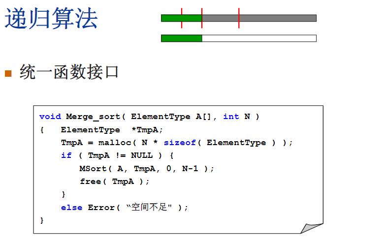
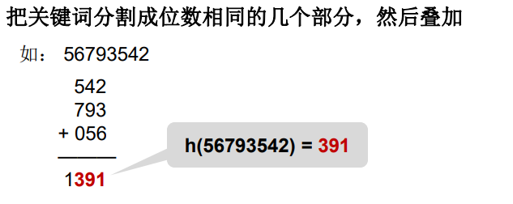
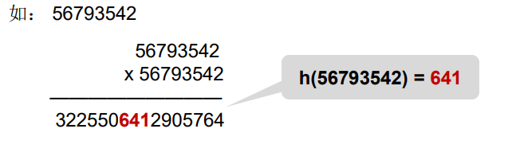

* [数据结构与算法笔记](#数据结构与算法笔记)
   * [注意事项](#注意事项)
   * [知识点](#知识点)
      * [树](#树)
      * [图](#图)
      * [排序](#排序)
      * [查找](#查找)
   
# [数据结构与算法笔记](https://www.icourse163.org/learn/ZJU-93001?tid=1459700443#/learn/content?type=detail&id=1235254043&sm=1)

## 注意事项
1. 递归应关注可能出现**内存溢出**；

## 知识点

### 树
1. 特殊树


2. 二叉搜索树(`BST`)满足如下性质：
- 左子树所有节点的元素值均小于根的元素值；
- 右子树所有节点的元素值均大于根的元素值。\

2. 1. 二叉搜索树的良好形态：平衡二叉树
    > 

平衡二叉树的再平衡代码：[java](https://www.cnblogs.com/hello-shf/p/11352071.html)
```java
   /**
     * 向以node为根的二分搜索树中插入元素(key, value)，递归算法
     * 时间复杂度 O(log n)
     * @param node
     * @param key
     * @param value
     * @return 返回插入新节点后二分搜索树的根
     */
    private Node add(Node node, K key, V value){

        if(node == null){
            size ++;
            return new Node(key, value);
        }

        if(key.compareTo(node.key) < 0)
            node.left = add(node.left, key, value);
        else if(key.compareTo(node.key) > 0)
            node.right = add(node.right, key, value);
        else // key.compareTo(node.key) == 0
            node.value = value;

        // 更新height
        node.height = 1 + Math.max(getHeight(node.left), getHeight(node.right));

        // 计算平衡因子
        int balanceFactor = getBalanceFactor(node);

        // 平衡维护
        //////////////////////////////////////////////////////
        // LL  T1<Z<T2< X <T3<Y<T4                          //
        //        y                              x          //
        //       / \                           /   \        //
        //      x   T4     向右旋转 (y)        z     y       //
        //     / \       - - - - - - - ->    / \   / \      //
        //    z   T3                        T1 T2 T3 T4     //
        //   / \                                            //
        // T1   T2                                          //
        //////////////////////////////////////////////////////
        if (balanceFactor > 1 && getBalanceFactor(node.left) >= 0)
            return rightRotate(node);
        //////////////////////////////////////////////////////////////////////////////////////////
        //  LR  T1<X<T2< Z <T3<Y<T4                                                             //
        //         y                                y                              z            //
        //        / \                              / \                           /   \          //
        //       x  t4    向左旋转(x)             z   T4      向右旋转(y)        x     y         //
        //      / \     --------------->         / \        --------------->   / \   / \        //
        //     T1  z                            x   T3                        T1  T2 T3 T4      //
        //        / \                          / \                                              //
        //       T2  T3                      T1   T2                                            //
        //////////////////////////////////////////////////////////////////////////////////////////
        if (balanceFactor > 1 && getBalanceFactor(node.left) < 0) {
            node.left = leftRotate(node.left);
            return rightRotate(node);
        }
        //////////////////////////////////////////////////
        // RR: T1<Y<T2< X <T3<Z<T4                      //
        //    y                              x          //
        //  /  \                           /   \        //
        // T1   x      向左旋转 (y)        y     z       //
        //     / \   - - - - - - - ->    / \   / \      //
        //   T2   z                     T1 T2 T3 T4     //
        //       / \                                    //
        //      T3 T4                                   //
        //////////////////////////////////////////////////
        if (balanceFactor < -1 && getBalanceFactor(node.right) <= 0)
            return leftRotate(node);

        //////////////////////////////////////////////////////////////////////////////////////////
        // RL: T1<Y<T2< Z <T3<X<T4                                                              //
        //      y                           y                                       z           //
        //     / \                         / \                                    /   \         //
        //    T1  x       向右旋转(x)      T1  z         向左旋转(y)              y     x        //
        //       / \    - - - - - - ->       / \      - - - - - - - - ->        / \   / \       //
        //      z  T4                       T2  x                              T1 T2 T3 T4      //
        //     / \                             / \                                              //
        //    T2  T3                          T3  T4                                            //
        //////////////////////////////////////////////////////////////////////////////////////////
        if (balanceFactor < -1 && getBalanceFactor(node.right) > 0) {
            node.right = rightRotate(node.right);
            return leftRotate(node);
        }

        return node;
    }
    /**
     * 对节点y进行向右旋转操作，返回旋转后新的根节点x
     * @param y
     * @return
     */
    ///////////////////////////////////////////////////
    // LL T1<Z<T2< X <T3<Y<T4                        //
    //        y                              x       //
    //       / \                           /   \     //
    //      x   T4     向右旋转 (y)        z     y    //
    //     / \       - - - - - - - ->    / \   / \   //
    //    z   T3                        T1 T2 T3 T4  //
    //   / \                                         //
    // T1   T2                                       //
    ///////////////////////////////////////////////////
    private Node rightRotate(Node y) {
        Node x = y.left;
        Node T3 = x.right;

        // 向右旋转过程
        x.right = y;
        y.left = T3;

        // 更新height
        y.height = Math.max(getHeight(y.left), getHeight(y.right)) + 1;
        x.height = Math.max(getHeight(x.left), getHeight(x.right)) + 1;

        return x;
    }

    /**
     * 对节点y进行向左旋转操作，返回旋转后新的根节点x
     * @param y
     * @return
     */
    ////////////////////////////////////////////////
    // RR T1<Y<T2< X <T3<Z<T4                     //
    //    y                             x         //
    //  /  \                          /   \       //
    // T1   x      向左旋转 (y)       y     z      //
    //     / \   - - - - - - - ->   / \   / \     //
    //    T2  z                    T1 T2 T3 T4    //
    //       / \                                  //
    //      T3 T4                                 //
    ////////////////////////////////////////////////
    private Node leftRotate(Node y) {
        Node x = y.right;
        Node T2 = x.left;

        // 向左旋转过程
        x.left = y;
        y.right = T2;

        // 更新height
        y.height = Math.max(getHeight(y.left), getHeight(y.right)) + 1;
        x.height = Math.max(getHeight(x.left), getHeight(x.right)) + 1;

        return x;
    }
    /**
     * 获得节点node的高度
     * @param node
     * @return
     */
    private int getHeight(Node node){
      if(node == null){
        return 0;
      }
      int i = getHeight(node.left);
      int j = getHeight(node.right);
      return (i<j)? j+1:i+1;
    }

    /**
     * 获得节点node的平衡因子
     * @param node
     * @return
     */
    private int getBalanceFactor(Node node){
        if(node == null)
            return 0;
        return getHeight(node.left) - getHeight(node.right);
    }
```

3. [堆](https://blog.csdn.net/qq_37044026/article/details/86714130) ：是计算机科学中一类特殊的数据结构的统称。\
   堆通常是一个可以被看做一棵树的**数组对象**。\
   堆总是满足下列性质：
   - 任意节点小于（或大于）它的所有后裔，最小元（或最大元）在堆的根上（堆序性）。
   - 堆总是一棵**完全树**。即除了最底层，其他层的节点都被元素填满，且最底层尽可能地从左到右填入。
   - 数组0索引值为允许的最大或最小值，起边界作用，同时也起占位作用

4. 哈夫曼树：\
 \
   
   哈夫曼树的构建思路为 
   1. 从小到大对给定的数据进行排序；
   2. 取出权值最小的两个数据构成二叉树，两数之和为这两个数据的父节点；
   3. 再将两数之和放入数据中再排序，不断重复1-2-3步骤，直到数据中，所有数据都被处理，就得到了哈夫曼树。

5. 集合 \
路径压缩：
   
   
### 图

1. 图的抽象定义


2. 最短路径问题
 \
    \
   如上图，算法过程如下：
   - 从顶点v1开始遍历，对v1收录变更为真
   - 遍历v1邻接节点有v2、v4，因v2、v4未被收录，且初始dist均为正无穷，所以他们的距离分别设置为2，1（如果v1到v2、v4有中间路径，则相应权重应叠加），path设置为v1
   - 遍历完v1邻接节点，重新开始新循环，从未收录的最小dist中（第二次遍历，分别是`v1->v4`、`v1->v2`，其中`v1->v4`最小，所以从顶点v4开始新的遍历）
   - 遍历v4的邻接节点，以此类推，其中顶点v6会被多次更新，如下图
 \
     顶点v6，第一次作为v4邻接节点，dist为9，然后作为v3邻接节点，dist为8，最后作为v7邻接节点，dist为6
 
3. 最小生成树（**不能形成回路**）：有2种算法
   > 只能用图里既有的边构建 \
   > 只能正好用掉`顶点v-1`条边 \
   > **不能有回路**

    \
   构建一颗树，附加任意顶点，以v1为例 \
   - 邻接顶点权重最小v4，纳入树
   - 新树邻接顶点权重最小为2，v3、v2纳入树 \
   依次类推
     
   
   将每个顶点看作单独的树，每次寻找最小的权重，以上图为例
   - 第一次查找，最小权重为1，构建2棵树，`v1-v4` & `v6-v7`
   - 第二次查找，最小权重为2，纳入`v3-v4-v1-v2` \
   依次类推

4. 拓扑序(AOV)：如果图中从V到W有一条有向路径，则V一定排在W之前。满足此条件的顶点序列称为一个拓扑序

### 排序
排序比较 \

1. 冒泡排序 \
 

2. 插入排序 \


3. 希尔排序 \
 \
 \
 

4. 选择排序
 \
   主要耗时在查找`A[i]`到`A[N-1]`中最小值

5. 堆排序   
   \
   将数组生成最小堆，然后逐步放出最小值
 
6. 归并排序——分治
 \
    \
    \
   java实现
```java
/**
 * 归并排序算法
 * @param A 乱序数组A
 * @param n 数组A的元素个数
 */
void merge_sort(int A[], int n) {
    int i,s;
    int t = 1; // 每趟合并后序列的长度
    while (t < n) {        // 外层循环：合并的大趟数
        s = t;
        t *=2;
        i = 0;
        while (i + t < n) {        // 内层循环：每趟需要合并的次数
            merge(A, i, i+s-1, i+s*2-1, t);
            i = i + t;
        }
        if (i + s < n) {  // 判断还有剩下的元素待处理。
            merge(A, i, i+s-1, n-1, n-i);
        }
    }
}
/**
 * 合并两个有序的子数组( A[p]~A[q]及A[q+l]~A[r]已按递增顺序排序 )
 * @param A 整数数组
 * @param p 第一个子数组的起始下标
 * @param q 第一个子数组的末尾下标
 * @param r 第二个字数组的末尾下标
 * @param n A数组的元素个数
 */
void merge(int A[], int p, int q, int r, int n) {
    int *B = new int[n];        // 建立缓冲区
    int k = 0;                  // 指向B的游标，主要用于插入数据进B中
    int i = p, j = q + 1;
    while (i <= q && j <= r) {                  // while循环的跳出条件是：i和j只要有一个超过各种数组的界限
        if (A[i] >= A[j]) {
            B[k++] = A[j++];
        } else {
            B[k++] = A[i++];
        }
    }
    if (i == q+1) {    // 说明是前半段先遍历完，把后半段的拼到数组后面
        while (j <= r) {
            B[k++] = A[j++];
        }
    } else {
        while (i <= q) {
            B[k++] = A[i++];
        }
    }
    // 将选定的部分替换为B的数组
    k = 0;
    for (i = p; i <= r; i++) {
        A[i] = B[k++];
    }
    delete[] B;
}
```   

7. 快速排序 \
缺点：使用了递归，小规模排序不如插入排序快
分治 \
    \
    \ 
    \ 
    \

8. 表排序 \
间接排序
   

9. 基数排序——桶排序
    \
    \
    \

### 查找
 \
散列查找法的两项基本工作：
- 计算位置：构造散列函数确定关键词存储位置；
- 解决冲突：应用某种策略解决多个关键词位置相同的问题

1. 数字关键词的散列函数构造
   - 直接定址法 \
     
   - 除留余数法 \
     
   - 数字分析法 \
     
   - 折叠法 \
     
   - 平方取中法 \
     

2. 字符关键词的散列函数构造 \
   

处理冲突的方法：
- 换个位置: 开放地址法
  - 一旦产生了冲突（该地址已有其它元素），就按某 种规则去寻找另一空地址 \
   
- 同一位置的冲突对象组织在一起: 链地址法
   - 将相应位置上冲突的所有关键词存储在同一个单链表中

再散列（Rehashing）
- 当散列表元素太多（即装填因子 α太大）时，查找效率会下降；
  - 实用最大装填因子一般取 0.5 <= α<= 0.85
- 当装填因子过大时，解决的方法是加倍扩大散列表，这个过程叫做“再散列（Rehashing）”

[入门 -> ](getting_started.md) \
[基础 ->](base.md)\
[随想录题集 ->](random.md)