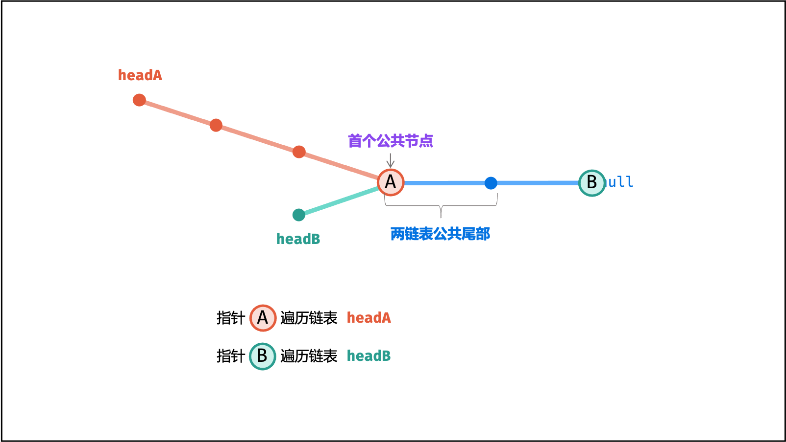
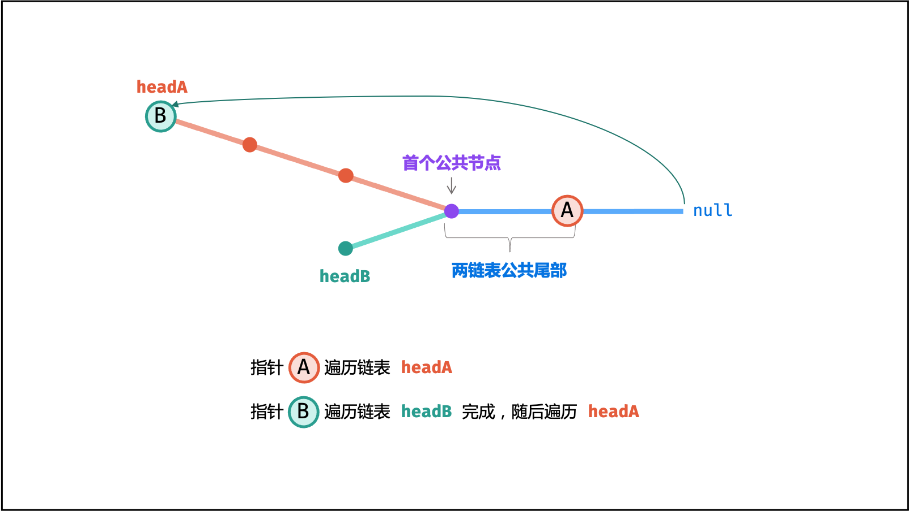
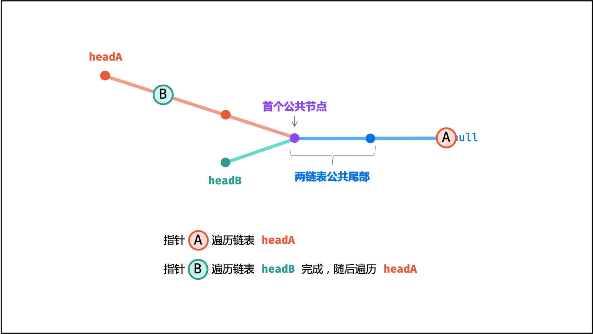
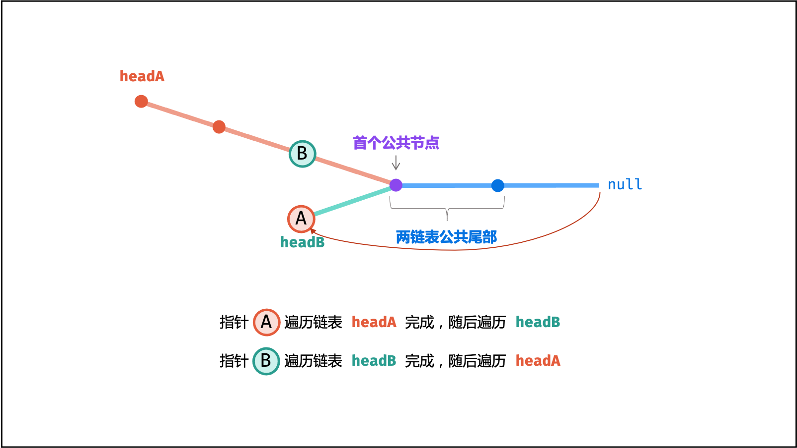
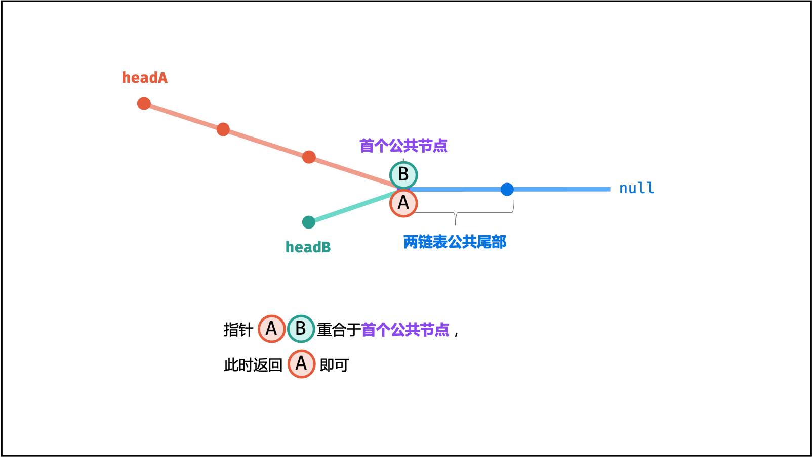
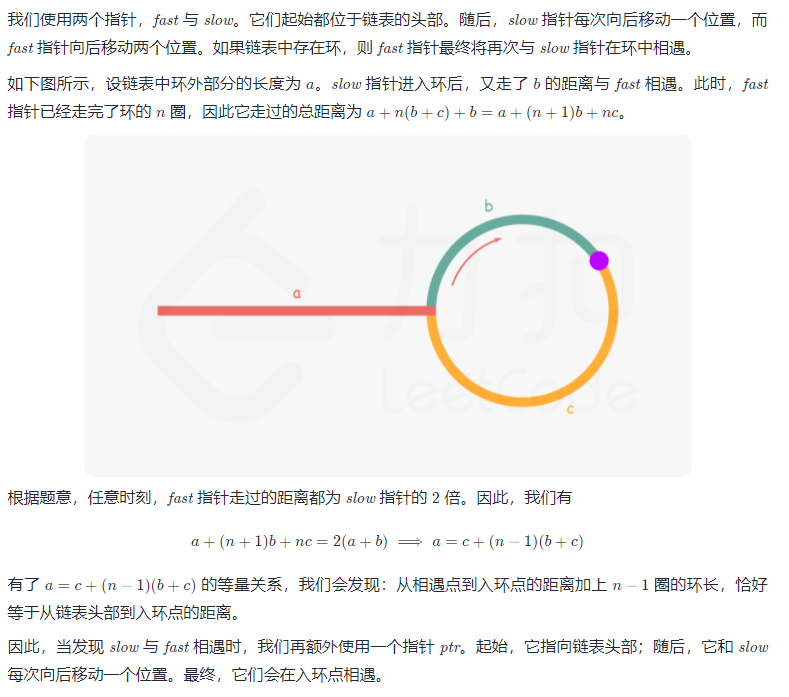
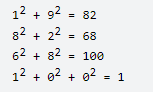
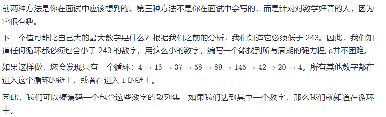

题集来源：[代码随想录](https://programmercarl.com/)

# 数组
## [27. 移除元素](https://leetcode-cn.com/problems/remove-element/)
给你一个数组 nums 和一个值 val，你需要 原地 移除所有数值等于 val 的元素，并返回移除后数组的新长度。]
不要使用额外的数组空间，你必须仅使用 O(1) 额外空间并 原地 修改输入数组。\
元素的顺序可以改变。你不需要考虑数组中超出新长度后面的元素。
> 示例 1： \
> 输入：nums = [3,2,2,3], val = 3 \
> 输出：2, nums = [2,2] \
> 解释：函数应该返回新的长度 2, 并且 nums 中的前两个元素均为 2。
> 你不需要考虑数组中超出新长度后面的元素。
> 例如，函数返回的新长度为 2 ，而 nums = [2,2,2,3] 或 nums = [2,2,0,0]，也会被视作正确答案。

思路1：遍历重组
```go
func removeElement(nums []int, val int) int {
    for i := 0; i < len(nums);{
        if nums[i] == val{
            nums = append(nums[:i], nums[i+1:]...)
            continue
        }
        i++
    }
    return len(nums)
}
```
思路2：双指针
```go
func removeElement2(nums []int, val int) int {
	left := 0
	for _, v := range nums { // v 即 nums[right]
		if v != val {
			nums[left] = v // 覆盖
			left++
		}
	}
	return left
}
```
**注意**：在调用方法`removeElement`后的 `nums`值长度仍为原长度，在 `removeElement`中被删除的元素被移到尾部，需要通过截取切片来获得结果，举例：
```go
func main()  {
	nums := []int{0,1,2,2,3,0,4,2}
	n := 2
	n = removeElement(nums, n)
	// 此时 nums 为 [0 1 3 0 4 2 2 2]
	nums = nums[:n] // 此时 nums 为 [0 1 3 0 4]
}
```

## [977. 有序数组的平方](https://leetcode-cn.com/problems/squares-of-a-sorted-array/)
给你一个按 **非递减顺序** 排序的整数数组 nums，返回 每个数字的平方 组成的新数组，要求也按 非递减顺序 排序。
> 示例 1： \
> 输入：nums = [-4,-1,0,3,10] \
> 输出：[0,1,9,16,100] \
> 解释：平方后，数组变为 [16,1,0,9,100] \
> 排序后，数组变为 [0,1,9,16,100]
> 
> 示例 2： \
> 输入：nums = [-7,-3,2,3,11] \
> 输出：[4,9,9,49,121]

思路：双指针(更优)
```go
func sortedSquares(nums []int) []int {
	n := len(nums)
	ans := make([]int, n)
	for l, r, i := 0, n-1, n-1; r >= l; i--{
		left, right := nums[l]*nums[l], nums[r]*nums[r]
		if left > right{
			ans[i] = left
			l++
		} else {
			ans[i] = right
			r--
		}
	}
	return ans
}
```
思路2：直接计算再排序(耗时较大)
```go
func sortedSquares2(nums []int) []int {
	n := len(nums)
	ans := make([]int, n)
	for i, v := range nums{
		ans[i] = v*v
	}
	sort.Ints(ans)
	return ans
}
```

## [209. 长度最小的子数组](https://leetcode-cn.com/problems/minimum-size-subarray-sum/)
给定一个含有 n 个正整数的数组和一个正整数 target 。\
找出该数组中满足其和 ≥ target 的长度最小的 连续子数组 [numsl, numsl+1, ..., numsr-1, numsr] ，并返回其长度。如果不存在符合条件的子数组，返回 0 。

> 示例 1： \
> 输入：target = 7, nums = [2,3,1,2,4,3] \
> 输出：2 \
> 解释：子数组 [4,3] 是该条件下的长度最小的子数组。

> 示例 2： \
> 输入：target = 4, nums = [1,4,4] \
> 输出：1 

> 示例 3： \
> 输入：target = 11, nums = [1,1,1,1,1,1,1,1] \
> 输出：0

思路1：暴力穷举
```go
func minSubArrayLen2(target int, nums []int) int {
	n := len(nums)
	result := n+1
	for i, v := range nums{
		if v >= target{
			return 1
		}
		sum := v
		for j := i+1; j < n; j++{
			sum += nums[j]
			if sum >= target{
				if j-i+1 < result{
					result = j-i+1
				}
			}
		}
	}
	if result == n+1{
		return 0
	}
	return result
}
```

思路2：双指针(滑动窗口)：最优
```go
func minSubArrayLen(target int, nums []int) int {
	result := len(nums) + 1
	left := 0
	sum := 0
	for right, v := range nums{ // 不断将 right 指针往右边递增
		sum += v
		for sum >= target{ // 不断将 left 指针往右边压缩
			if right-left+1 < result{
				result = right-left+1
			}
			sum -= nums[left]
			left++
		}
	}
	if result == len(nums)+1{ // 没有匹配项
		return 0
	}
	return result
}
```
# 链表
## [24. 两两交换链表中的节点](https://leetcode-cn.com/problems/swap-nodes-in-pairs/)
给你一个链表，两两交换其中相邻的节点，并返回交换后链表的头节点。你必须在不修改节点内部的值的情况下完成本题（即，只能进行节点交换）。

> 示例 1： \
> 输入：head = [1,2,3,4] \
> 输出：[2,1,4,3]
> 
> 示例 2： \
> 输入：head = [] \
> 输出：[]
> 
> 示例 3： \
> 输入：head = [1] \
> 输出：[1]

思路1：迭代替换
```go
func swapPairs(head *ListNode) *ListNode {
    nodes := &ListNode{0,head}
    prev := nodes // prev 作游标，按2个节点移动
    for prev.Next != nil && prev.Next.Next != nil{
        node1 := prev.Next // 保存节点
        node2 := prev.Next.Next

        prev.Next = node2 // node2覆盖原node1节点
        node1.Next = node2.Next // 交换节点前保存下一个待交换节点node3
        node2.Next = node1 // node1覆盖原node3节点
        prev = node1 // 移动指针到node1节点位置
    }
    return nodes.Next
}
```
思路2：递归
```go
func swapPairs(head *ListNode) *ListNode {
    if head == nil || head.Next == nil {
        return head
    }
    newHead := head.Next // newHead头节点为2
    head.Next = swapPairs(newHead.Next) // head.Next为3
    newHead.Next = head // newHead.Next为1，再.Next为3
    return newHead
}
```

## [19. 删除链表的倒数第 N 个结点](https://leetcode-cn.com/problems/remove-nth-node-from-end-of-list/)
给你一个链表，删除链表的倒数第 n 个结点，并且返回链表的头结点。

> 示例 1： \
>  \
> 输入：head = [1,2,3,4,5], n = 2 \
> 输出：[1,2,3,5]
>
> 示例 2： \
> 输入：head = [1], n = 1 \
> 输出：[]
>
> 示例 3： \
> 输入：head = [1,2], n = 1 \
> 输出：[1]

思路1：2次迭代，第一次获取链的长度，第二次在相应位置进行节点删除
```go
func removeNthFromEnd(head *ListNode, n int) *ListNode {
    l := 0
    prev := head
    for prev != nil{
        l++
        prev = prev.Next
    }
    if l == 1{
        return nil
    }
    
    n = l-n // 变更为从头部开始计数的值
    if n == 0{
        return head.Next
    }
    l = 0 // 重新计数
    
    prev = head // 重新获取游标头部位置
    for prev != nil{
        l++
        if l == n{ // 定位到前一位
            prev.Next = prev.Next.Next
            break
        }
        prev = prev.Next
    }
    return head
}
```
思路2：栈（更耗空间，时间差不多）
```go
func removeNthFromEnd(head *ListNode, n int) *ListNode {
    result := &ListNode{0, head} // 为了能够在删除节点时，可以获取head的头部节点的头一个节点
    nodes :=[]*ListNode{} // 栈变量
    for node := result; node != nil; node = node.Next{
        nodes = append(nodes, node)
    }
    prev := nodes[len(nodes)-1-n] // 获取需要被删除的节点的头一个节点
    prev.Next = prev.Next.Next
    return result.Next // 注意，这里返回从下一个节点开始
}
```
## [面试题 02.07. 链表相交](https://leetcode-cn.com/problems/intersection-of-two-linked-lists-lcci/)
给你两个单链表的头节点 headA 和 headB ，请你找出并返回两个单链表相交的起始节点。如果两个链表没有交点，返回 null 。\
图示两个链表在节点 c1 开始相交：\
 \
题目数据 **保证** 整个链式结构中不存在环。 \
注意，函数返回结果后，链表必须 **保持其原始结构** 。
> 示例 1：\
> 
> 输入：intersectVal = 8, listA = [4,1,8,4,5], listB = [5,0,1,8,4,5], skipA = 2, skipB = 3\
> 输出：Intersected at '8'\
> 解释：相交节点的值为 8 （注意，如果两个链表相交则不能为 0）。\
> 从各自的表头开始算起，链表 A 为 [4,1,8,4,5]，链表 B 为 [5,0,1,8,4,5]。\
> 在 A 中，相交节点前有 2 个节点；在 B 中，相交节点前有 3 个节点。
> 
> 示例 2：\
> \
> 输入：intersectVal = 2, listA = [0,9,1,2,4], listB = [3,2,4], skipA = 3, skipB = 1\
> 输出：Intersected at '2'\
> 解释：相交节点的值为 2 （注意，如果两个链表相交则不能为 0）。\
> 从各自的表头开始算起，链表 A 为 [0,9,1,2,4]，链表 B 为 [3,2,4]。\
> 在 A 中，相交节点前有 3 个节点；在 B 中，相交节点前有 1 个节点。
> 
> 示例 3：\
> \
> 输入：intersectVal = 0, listA = [2,6,4], listB = [1,5], skipA = 3, skipB = 2\
> 输出：null\
> 解释：从各自的表头开始算起，链表 A 为 [2,6,4]，链表 B 为 [1,5]。\
> 由于这两个链表不相交，所以 intersectVal 必须为 0，而 skipA 和 skipB 可以是任意值。\
> 这两个链表不相交，因此返回 null 。

节点之间**可以等号直接比较**：`nodesA[a] == nodesB[b]`

思路1：暴力，迭代获取两个节点数组，然后从尾部向前逐级找相同点
```go
func getIntersectionNode(headA, headB *ListNode) *ListNode {
    if headA == nil || headB == nil{
        return nil
    }
    nodesA := []*ListNode{}
    nodesB := []*ListNode{}
    for headA != nil{
        nodesA = append(nodesA, headA)
        headA = headA.Next
    }
    for headB != nil{
        nodesB = append(nodesB, headB)
        headB = headB.Next
    }
    
    a, b := len(nodesA)-1, len(nodesB)-1
    for a >= 0 && b >= 0 && nodesA[a] == nodesB[b]{ // 这里可能会出现，其中一个头部节点已经遍历完的情况
        a--
        b--
    }
    if a == len(nodesA)-1 && nodesA[a].Val != nodesB[b].Val{
        return nil
    }

    return nodesA[a+1]
}
```
思路2：[双指针](https://leetcode-cn.com/problems/intersection-of-two-linked-lists-lcci/solution/mian-shi-ti-0207-lian-biao-xiang-jiao-sh-b8hn/) \
\
\
\
\

```go
func getIntersectionNode(headA, headB *ListNode) *ListNode {
    prevA, prevB := headA, headB
    for prevA != prevB{ // <nil>  ==  <nil>，即 如果A、B链表长度相等且无交集，则在最后都指向*ListNode 的声明值
        if prevA == nil{
            prevA = headB
        } else{
            prevA = prevA.Next
        }
        if prevB == nil{
            prevB = headA
        } else{
            prevB = prevB.Next
        }
    }
    return prevA
}
```
未初始化的同类型值相等
```go
	na := new(ListNode)
	nb := new(ListNode)
	if na.Next == nb.Next{
		fmt.Println("相等") // 相等 
	}

	var naa ListNode
	var nbb ListNode
	if naa == nbb{
		fmt.Println(naa,"相等",nbb) // 相等 {0 <nil>} 相等 {0 <nil>}
	}

    var naaa, nbbb struct{}
    if naaa == nbbb{
        fmt.Println(naaa,"相等",nbbb)
    }
```

## [142. 环形链表 II](https://leetcode-cn.com/problems/linked-list-cycle-ii/)
给定一个链表的头节点  head ，返回链表开始入环的第一个节点。 如果链表无环，则返回 null。\
如果链表中有某个节点，可以通过连续跟踪 next 指针再次到达，则链表中存在环。 为了表示给定链表中的环，评测系统内部使用整数 pos 来表示链表尾连接到链表中的位置（索引从 0 开始）。如果 pos 是 -1，则在该链表中没有环。注意：pos 不作为参数进行传递，仅仅是为了标识链表的实际情况。\
不允许修改 链表。

> 示例 1：\
>  \
> 输入：head = [3,2,0,-4], pos = 1\
> 输出：返回索引为 1 的链表节点\
> 解释：链表中有一个环，其尾部连接到第二个节点。
> 
> 示例 2： \
>  \
> 输入：head = [1,2], pos = 0 \
> 输出：返回索引为 0 的链表节点 \
> 解释：链表中有一个环，其尾部连接到第一个节点。
> 
> 示例 3： \
>  \
> 输入：head = [1], pos = -1 \
> 输出：返回 null \
> 解释：链表中没有环。

思路1：hash法
```go
func detectCycle(head *ListNode) *ListNode {
    mp := make(map[*ListNode]int)
    for head != nil{
        if mp[head] > 0{
            break
        }
        mp[head]++
        head = head.Next
    }
    return head
}
```
用结构体代替int速度会加快很多，空间也有改善
```go
func detectCycle(head *ListNode) *ListNode {
    mp := make(map[*ListNode]struct{})
    for head != nil{
        if _,ok := mp[head]; ok{
            break
        }
        mp[head] = struct{}{}
        head = head.Next
    }
    return head
}
```
思路2：快慢指针 \

```go
func detectCycle(head *ListNode) *ListNode {
    fast, slow := head, head
    for fast != nil{
        if fast.Next == nil{
            return nil
        }
        slow = slow.Next
        fast = fast.Next.Next
        if fast == slow{
            fn := head
            for fn != slow{
                fn = fn.Next
                slow = slow.Next
            }
            return fn
        }
    }
    return nil
}
```

# hash表
注意：hash表中的键值对，其中值如果没有特别要求，可以设置为struct类型，占用空间较少，同时通过`v,ok := map[v]`会更快。

## [349. 两个数组的交集](https://leetcode-cn.com/problems/intersection-of-two-arrays/)
给定两个数组 nums1 和 nums2 ，返回 它们的交集 。输出结果中的每个元素一定是 唯一 的。我们可以 不考虑输出结果的顺序 。
> 示例 1： \
> 输入：nums1 = [1,2,2,1], nums2 = [2,2] \
> 输出：[2]
> 
> 示例 2： \
> 输入：nums1 = [4,9,5], nums2 = [9,4,9,8,4] \
> 输出：[9,4] \
> 解释：[4,9] 也是可通过的

思路1：hash法，构建较短数组的hash表，比较是否共有
```go
func intersection(nums1 []int, nums2 []int) []int {
    n1, n2 := len(nums1), len(nums2)
    if n1 > n2{ // 确保nums1 更少
        n1, n2 = n2, n1
        nums1, nums2 = nums2, nums1
    }
    mp1 := make(map[int]struct{})
    // 获取短数组的hash表
    for _,v := range nums1{
        if _,ok := mp1[v]; !ok{
            mp1[v] = struct{}{}
        }
    }
    ans := []int{}
    // 对比是否存在交集值
    for _,v := range nums2{
        if _,ok := mp1[v]; ok{
            ans = append(ans, v)
            delete(mp1, v) // 填入后删除hash表对应值，避免重复填入
        }
    }
    return ans
}
```
思路2：双指针
```go
func intersection(nums1 []int, nums2 []int) []int {
    sort.Ints(nums1)
    sort.Ints(nums2)
    res := []int{}
    for i, j := 0, 0; i < len(nums1) && j < len(nums2);{
        x, y := nums1[i], nums2[j]
        if x == y{
            if len(res) == 0 || res[len(res)-1] < x{
                res = append(res, x)
            }
            i++
            j++
            continue
        }
        if x < y{
            i++
            continue
        }
        j++
    }
    return res
}
```
精妙的代码`len(res) == 0 || res[len(res)-1] < x`

## [202. 快乐数](https://leetcode-cn.com/problems/happy-number/)
编写一个算法来判断一个数 n 是不是快乐数。

「快乐数」 定义为：
- 对于一个正整数，每一次将该数替换为它每个位置上的数字的平方和。
- 然后重复这个过程直到这个数变为 1，也可能是 无限循环 但始终变不到 1。
- 如果这个过程 结果为 1，那么这个数就是快乐数。
- 如果 n 是 快乐数 就返回 true ；不是，则返回 false 。

> 示例 1： \
> 输入：n = 19 \
> 输出：true \
> 解释： \
> 
>
> 示例 2： \
> 输入：n = 2 \
> 输出：false

思路：hash法，将数值转换为字符串，然后逐个求平方并累加，将结果填入hash表，如果出现重复则说明有循环无法得到1的结果
```go
func isHappy(n int) bool {
	if n == 1{
		return true
	}
	s := strconv.Itoa(n)
	intMap := make(map[int]struct{})
	intMap[n] = struct{}{}
	for {
		n = 0
		for _,v := range s{
			n += int(v-'0')*int(v-'0')
		}
		if n == 1{
			return true
		}
		if _, ok := intMap[n]; ok{
			return false
		}
		intMap[n] = struct{}{}
		s = strconv.Itoa(n)
	}
}
```
优化：
- 各位的平方求和方法，不需要转换，通过step方法
- 直接for循环不计算
```go
func isHappy(n int) bool {
	if n == 1{
		return true
	}
	intMap := make(map[int]bool)
	for ; n != 1 && !intMap[n];n, intMap[n] = step(n), true{}
	return n == 1
}

```
求各个位数的平方和
```go
func step(n int) int {
	sum := 0
	for n > 0{
		sum += (n%10) * (n%10)
		n = n/10
	}
	return sum
}
```
思路2：快慢指针，需要判断循环的，hash算法可以转换位快慢指针
```go
func isHappy(n int) bool {
	if n == 1{
		return true
	}
    slow, fast := n, step(n)
    for fast != 1 && fast != slow {
        slow, fast = step(slow), step(step(fast))
    }
	return fast == 1
}

func step(n int) int {
	sum := 0
	for n > 0{
		sum += (n%10) * (n%10)
		n = n/10
	}
	return sum
}
```
思路3：数学法 \

```go
func isHappy(n int) bool {
    cycle := map[int]bool{4: true, 6: true, 37: true, 58: true, 89: true, 145: true, 42: true, 20: true}
    for n != 1 && !cycle[n] {
        n = step(n)
    }
    return n == 1
}
```

##[383. 赎金信](https://leetcode-cn.com/problems/ransom-note/)
给你两个字符串：ransomNote 和 magazine ，判断 ransomNote 能不能由 magazine 里面的字符构成。\
如果可以，返回 true ；否则返回 false 。\
magazine 中的每个字符只能在 ransomNote 中使用一次。
> ransomNote 和 magazine **由小写英文字母组成**

> 示例 1：\
> 输入：ransomNote = "a", magazine = "b"\
> 输出：false
>
> 示例 2：\
> 输入：ransomNote = "aa", magazine = "ab"\
> 输出：false
>
> 示例 3：\
> 输入：ransomNote = "aa", magazine = "aab"\
> 输出：true

思路：hash法 \
实现1：用map方式，效率会更低，数组方式更快
```go
func canConstruct(ransomNote string, magazine string) bool {
    mp := make(map[rune]int)
    for _,v:= range magazine{
        mp[v]++
    }
    for _,v:=range ransomNote{
        mp[v]--
        if mp[v]<0{
            return false
        }
    }
    return true
}
```
实现2：将hash表，转换为数组，其中key值转换为下标
```go
func canConstruct(ransomNote string, magazine string) bool {
    mp := make([]int, 26)
    for _,v:= range magazine{
        mp[v-'a']++
    }
    for _,v:=range ransomNote{
        mp[v-'a']--
        if mp[v-'a']<0{
            return false
        }
    }
    return true
}
```

## [15. 三数之和](https://leetcode-cn.com/problems/3sum/)
给你一个包含 n 个整数的数组 nums，判断 nums 中是否存在三个元素 a，b，c ，使得 a + b + c = 0 ？请你找出所有和为 0 且不重复的三元组。\
注意：答案中不可以包含重复的三元组。
> 示例 1：
> 输入：nums = [-1,0,1,2,-1,-4] \
> 输出：[[-1,-1,2],[-1,0,1]]
>
> 示例 2： \
> 输入：nums = []\
> 输出：[]
>
> 示例 3：\
> 输入：nums = [0]\
> 输出：[]
1. 特判，对于数组长度 n，如果数组为 null 或者数组长度小于 3，返回[]。
2. 对数组进行排序。
3. 遍历排序后数组：
- 若 `nums[i]>0`：因为已经排序好，所以后面不可能有三个数加和等于 0，直接返回结果。
- 对于重复元素：跳过，避免出现重复解
- 令左指针 `L=i+1`，右指针 `R=n-1`，当 `L<R` 时，执行循环：
    - 当 `nums[i]+nums[L]+nums[R]==0`，执行循环，判断左界和右界是否和下一位置重复，去除重复解。并同时将 L,RL,R 移到下一位置，寻找新的解
    - 若和大于 0，说明 `nums[R]` 太大，R 左移
    - 若和小于 0，说明 `nums[L]` 太小，L 右移
```go
func threeSum(nums []int) [][]int {
    ans := make([][]int, 0)
    n := len(nums)
    sort.Ints(nums) // 排序，让可能相同的值聚合在一起
    for firstI := 0; firstI < n; firstI++{
        if firstI > 0 && nums[firstI] == nums[firstI-1]{ // 跳过相同的首位值
            continue
        }
        thirdI := n-1
        target := -1*nums[firstI]
        if target<0{
            break
        }
        for secondI := firstI+1; secondI < n;secondI++{
            if secondI > firstI+1 && nums[secondI] == nums[secondI-1]{ // 跳过相同的第二位
                continue
            }
            for secondI < thirdI && nums[secondI] + nums[thirdI]>target{ // 跳过第三位大值
            // 这里不需要跳过相同第三位，因为，前面已经保证第一二位组合不会重复，那么第三位也不会重复
                thirdI--
            }
            if secondI == thirdI{ // 说明第二三为组合已经迭代完成
                break
            }
            if nums[secondI]+ nums[thirdI] == target{
                ans = append(ans, []int{nums[firstI], nums[secondI], nums[thirdI]})
            }
        }
    }
    return ans
}
```

## [18. 四数之和](https://leetcode-cn.com/problems/4sum/)
给你一个由 n 个整数组成的数组 nums ，和一个目标值 target 。请你找出并返回满足下述全部条件且不重复的四元组 [nums[a], nums[b], nums[c], nums[d]] （若两个四元组元素一一对应，则认为两个四元组重复）：
- 0 <= a, b, c, d < n
- a、b、c 和 d 互不相同
- nums[a] + nums[b] + nums[c] + nums[d] == target

你可以按 **任意顺序** 返回答案 。

> 示例 1： \
> 输入：nums = [1,0,-1,0,-2,2], target = 0 \
> 输出：[[-2,-1,1,2],[-2,0,0,2],[-1,0,0,1]]
>
> 示例 2： \
> 输入：nums = [2,2,2,2,2], target = 8 \
> 输出：[[2,2,2,2]]

思路1：同三数求和
```go
func fourSum(nums []int, target int) [][]int {
    sort.Ints(nums)
    n := len(nums)
    ans := [][]int{}
    for first := 0; first < n; first++{
        if first > 0 && nums[first] == nums[first-1]{
            continue
        }
        for second := first+1; second < n; second++{
            if second > first+1 && nums[second] == nums[second-1]{
                continue
            }
            for third := second+1; third < n; third++{
                if third > second+1 && nums[third] == nums[third-1]{
                    continue
                }
                fVal := target-nums[first]-nums[second]-nums[third]
                fourth := n-1
                for ;fourth > third && nums[fourth] > fVal; fourth--{}
                if fourth == third{
                    break
                }
                if nums[fourth] == fVal{
                    ans = append(ans,[]int{nums[first], nums[second], nums[third], nums[fourth]})
                }
            }
        }
    }
    return ans
}
```
代码优化：排序+左右指针
```go
func fourSum(nums []int, target int) [][]int {
    sort.Ints(nums)
    n := len(nums)
    ans := [][]int{}
    // 增加了过滤条件：当最小和已经大于目标和时，不再循环
    for first := 0; first < n-3 && nums[first]+nums[first+1]+nums[first+2]+nums[first+3]<=target; first++{
        if first > 0 && nums[first] == nums[first-1]{
            continue
        }
        // 增加了过滤条件：当最小和已经大于目标和时，不再循环
        for second := first+1; second < n-2 && nums[first]+nums[second]+nums[second+1]+nums[second+2]<=target; second++{
            if second > first+1 && nums[second] == nums[second-1]{
                continue
            }
            for left, right := second+1, n-1; left < right;{
                if sum := nums[first]+nums[second]+nums[left]+nums[right]; sum == target{
                    ans = append(ans,[]int{nums[first], nums[second], nums[left], nums[right]})
                    // 用for循环剔除相同的值（如果不剔除，则会构成重复的结果
                    for left++; left < right && nums[left] == nums[left-1];left++{}
                    for right--; left < right && nums[right] == nums[right+1];right--{}
                } else if sum < target{
                	// 同样的去重，不再对已排除且无效的值进行循环
                    for left++; left < right && nums[left] == nums[left-1];left++{}
                } else{
                    // 同样的去重，不再对已排除且无效的值进行循环
                    for right--; left < right && nums[right] == nums[right+1];right--{}
                }
            }
        }
    }
    return ans
}
```

## [454. 四数相加 II](https://leetcode-cn.com/problems/4sum-ii/)

思路：hash法 \
两两搭配，关键的代码 \
`mp[v1+v2]++` & `count+=mp[-v3-v4] // 这里可以写 count+=mp[0-v3-v4]`
```go
func fourSumCount(nums1 []int, nums2 []int, nums3 []int, nums4 []int) int {
    mp := make(map[int]int)
    for _, v1 := range nums1{
        for _, v2 := range nums2{
            mp[v1+v2]++
        }
    }
    count := 0
    for _,v3 := range nums3{
        for _,v4 := range nums4{
            count+=mp[-v3-v4] // 这里可以写 mp[0-v3-v4]
        }
    }
    return count
}
```

# 字符串

##[344. 反转字符串](https://leetcode-cn.com/problems/reverse-string/)
编写一个函数，其作用是将输入的字符串反转过来。输入字符串以字符数组 s 的形式给出。\
不要给另外的数组分配额外的空间，你必须原地修改输入数组、使用 O(1) 的额外空间解决这一问题。

> 示例 1： \
> 输入：s = ["h","e","l","l","o"] \
> 输出：["o","l","l","e","h"]
>
> 示例 2： \
> 输入：s = ["H","a","n","n","a","h"] \
> 输出：["h","a","n","n","a","H"]

思路：双指针法
```go
func reverseString(s []byte)  {
    n := len(s)
    for i := 0; i < n/2; i++{
        s[i], s[n-1-i] = s[n-1-i], s[i]
    }
}
```
优化：更加直观的代码
```go
func reverseString(s []byte)  {
    for left, right := 0, len(s)-1; left<right;left,right = left+1, right-1{
        s[left], s[right] = s[right], s[left]
    }
}
```

## [541. 反转字符串 II](https://leetcode-cn.com/problems/reverse-string-ii/)
给定一个字符串 s 和一个整数 k，从字符串开头算起，每计数至 2k 个字符，就反转这 2k 字符中的前 k 个字符。
- 如果剩余字符少于 k 个，则将剩余字符全部反转。
- 如果剩余字符小于 2k 但大于或等于 k 个，则反转前 k 个字符，其余字符保持原样。

> 示例 1： \
> 输入：s = "abcdefg", k = 2 \
> 输出："bacdfeg"
>
> 示例 2： \
> 输入：s = "abcd", k = 2 \
> 输出："bacd"

思路：结合反转字符串方法，暴力迭代
```go
func reverseStr(s string, k int) string {
	str := ""
	n := len(s)
	for i := 0; i < n; i += 2*k {
		end := i + k
		if end >= n {
			str = str + reverseString([]byte(s[i:]))
		} else {
			if end+k >= n{
				str = str + reverseString([]byte(s[i:end])) + s[end:]
			} else {
				str = str + reverseString([]byte(s[i:end])) + s[end:end+k]
			}
		}
	}
	return str
}

func reverseString(s []byte) string {
	for left, right := 0, len(s)-1; left < right; left, right = left+1, right-1 {
		s[left], s[right] = s[right], s[left]
	}
	return string(s)
}
```
优化
```go
func reverseStr(s string, k int) string {
    tem := []byte(s) // 一次转换，在数组中操作
    for i := 0; i < len(s); i+=2*k{
        sub := tem[i:min(len(s), i+k)] // 取最小值，确保不越界
        for j, n := 0, len(sub); j < n/2;j++{
            sub[j], sub[n-1-j] = sub[n-1-j], sub[j]
        } 
    }
    return string(tem)
}

func min(a,b int)int{
    if a>b{
        return b
    }
    return a
}
```

[数据结构与算法 ->](icource.md) \
[入门 -> ](getting_started.md) \
[基础 ->](base.md)