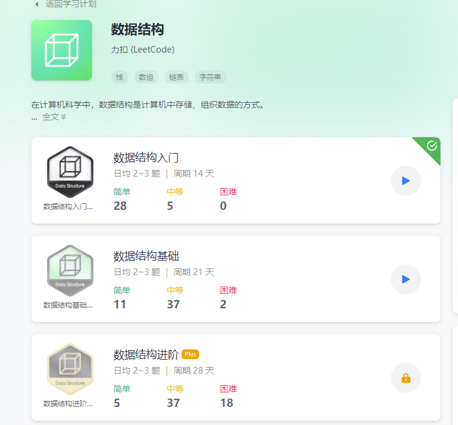

# 说明
本项目是基于golang刷leetcode题目，[题库](https://leetcode-cn.com/problemset/all/) \
初步刷题计划：[数据结构](https://leetcode-cn.com/study-plan/data-structures/?progress=v04mu2t) \
学习笔记：[数据结构与算法课](notes/icource.md)

目录:
- [排序算法](notes/sort.md)
- [入门](notes/getting_started.md)
- [基础](notes/base.md)
- [进阶](notes/advance.md)
- [精选200](notes/chosen.md)
- [随想录题集](notes/random.md)
- [知识点](notes/knowledge.md)

 \

