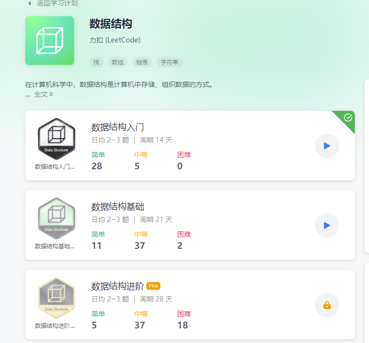

# 说明
本项目是基于golang刷leetcode题目，[题库](https://leetcode-cn.com/problemset/all/) \
初步刷题计划：[数据结构](https://leetcode-cn.com/study-plan/data-structures/?progress=v04mu2t) \
 \
目录:
- [入门](notes/getting_started.md)
- [基础](notes/base.md)

